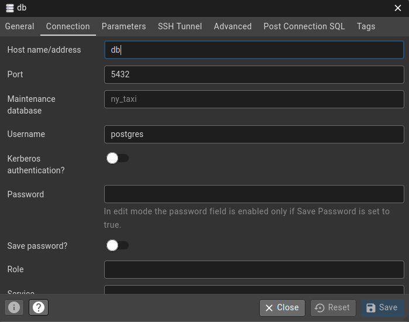

# Module 1 Homework: Docker & SQL

## Question 1. Understanding Docker images

> Run docker with the `python:3.13` image. Use an entrypoint `bash` to interact with the container. What's the version of `pip` in the image?

We can check the pip version with the command:

```bash
echo "pip --version" | docker run --rm -i --entrypoint=/bin/bash python:3.13
```

Which outputs:

> pip 25.3 from /usr/local/lib/python3.13/site-packages/pip (python 3.13)

Therefore the answer is **25.3**.

## Question 2. Understanding Docker networking and docker-compose

> Given the following `docker-compose.yaml`, what is the `hostname` and `port` that pgadmin should use to connect to the postgres database?

```yaml
services:
  db:
    container_name: postgres
    image: postgres:17-alpine
    environment:
      POSTGRES_USER: 'postgres'
      POSTGRES_PASSWORD: 'postgres'
      POSTGRES_DB: 'ny_taxi'
    ports:
      - '5433:5432'
    volumes:
      - vol-pgdata:/var/lib/postgresql/data

  pgadmin:
    container_name: pgadmin
    image: dpage/pgadmin4:latest
    environment:
      PGADMIN_DEFAULT_EMAIL: "pgadmin@pgadmin.com"
      PGADMIN_DEFAULT_PASSWORD: "pgadmin"
    ports:
      - "8080:80"
    volumes:
      - vol-pgadmin_data:/var/lib/pgadmin

volumes:
  vol-pgdata:
    name: vol-pgdata
  vol-pgadmin_data:
    name: vol-pgadmin_data
```

The host will be accessible via its service name, `db` and the opened port will be the internal one, `5432`, what means that the answer is **db:5432**.

This can be tested by logging into **pgadmin** and typing the corresponding credentials.



## Prepare the Data

Download the green taxi trips data for November 2025, including the dataset with zones:

```python
from urllib.request import urlretrieve

tripdata_url = "https://d37ci6vzurychx.cloudfront.net/trip-data/green_tripdata_2025-11.parquet"
zones_url = "https://github.com/DataTalksClub/nyc-tlc-data/releases/download/misc/taxi_zone_lookup.csv"

urlretrieve(tripdata_url, "tripdata.parquet")
urlretrieve(zones_url, "zones.csv")
```

## Question 3. Counting short trips

> For the trips in November 2025 (lpep_pickup_datetime between '2025-11-01' and '2025-12-01', exclusive of the upper bound), how many trips had a `trip_distance` of less than or equal to 1 mile?

Once the files have been downloaded, we can read them with:

```python
import pandas as pd

trips = pd.read_parquet('tripdata.parquet')
```

Then we can perform the proposed query with:

```python
trips[
  (trips.lpep_pickup_datetime >= '2025-11-01') &
  (trips.lpep_pickup_datetime < '2025-12-01') &
  (trips.trip_distance <= 1)
].shape[0]
```

> **8,007**

## Question 4. Longest trip for each day

> Which was the pick up day with the longest trip distance? Only consider trips with `trip_distance` less than 100 miles (to exclude data errors).

```python
(
  trips
    [trips.trip_distance < 100]
    [['lpep_pickup_datetime', 'trip_distance']]
    .sort_values(by=['trip_distance'], ascending=False)
    .head(1)
)
```

> **2025-11-14**

## Question 5. Biggest pickup zone

> Which was the pickup zone with the largest `total_amount` (sum of all trips) on November 18th, 2025?

```python
(
  trips
    [(trips.lpep_pickup_datetime >= '2025-11-18') & (trips.lpep_pickup_datetime < '2025-11-19')]
    [['PULocationID', 'total_amount']]
    .groupby(by='PULocationID')
    .sum()
    .sort_values(by='total_amount', ascending=False)
)
```

> **East Harlem North**

## Question 6. Largest tip

> For the passengers picked up in the zone named "East Harlem North" in November 2025, which was the drop off zone that had the largest tip?

```python
pickup_zone_id = zones[zones.Zone == 'East Harlem North'].index[0]

best_tips_by_drop_off_zone = (
    trips
        [(trips.PULocationID == pickup_zone_id) & (trips.lpep_pickup_datetime >= '2025-11-01') & (trips.lpep_pickup_datetime < '2025-12-01')]
        [['DOLocationID', 'tip_amount']]
        .sort_values(by='tip_amount', ascending=False)
)

drop_off_zone_id = best_tips_by_drop_off_zone.iloc[0].DOLocationID
drop_off_zone = zones[zones.LocationID == drop_off_zone_id]
```

> **Yorkville West**

## Question 7. Terraform Workflow

Which of the following sequences, respectively, describes the workflow for:
1. Downloading the provider plugins and setting up backend,
2. Generating proposed changes and auto-executing the plan
3. Remove all resources managed by terraform`

> **terraform init, terraform apply -auto-approve, terraform destroy**
