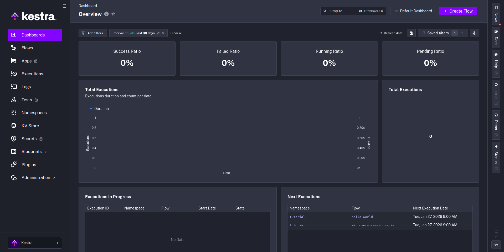

# Orquestación de flujos de datos

## Primeros pasos con Kestra

* Vídeo original (en inglés): [Installing Kestra](https://www.youtube.com/watch?v=wgPxC4UjoLM&list=PLEK3H8YwZn1p-pCYj46rRhA0HcdXXxzzP&index=3&pp=iAQB0gcJCXwKAYcqIYzv)

### Instalación de Kestra

En este capítulo vamos a instalar Kestra con el objetivo de transformar el script de carga de datos que creamos durante el módulo de [infraestructura y prerrequisitos](../01-infraestructura-y-prerrequisitos/pipeline/) en un flujo de datos observable.

Para instalar Kestra usaremos la imagen oficial y levantaremos un PostgreSQL adicional especialmente dedicado a Kestra. Para ello, prepararemos un `docker-compose.yml` con los dos nuevos servicios:

```yaml
services:
  kestra:
    image: kestra/kestra:latest

  kestra_postgres:
    image: postgres:18
```

Puedes ver una [versión completa del Docker Compose sugerido oficialmente por Kestra](https://github.com/kestra-io/kestra/blob/develop/docker-compose.yml) en su repositorio Github. Una cosa que quizá te llame la atención al verlo es este comentario:

```yml
    # Note that this setup with a root user is intended for development purpose.
    # Our base image runs without root, but the Docker Compose implementation needs root to access the Docker socket
    user: "root"
```

Así como el hecho de que levanten este volumen:

```yml
    volumes:
      - /var/run/docker.sock:/var/run/docker.sock
```

Esto es así porque Kestra lanza muchas de las tareas de nuestros flujos de trabajo en contenedores Docker dedicados. Gracias a esto puede soportar un montón de lenguajes de programación diferentes.

### Iniciar Kestra

Una vez completamos la creación de nuestro fichero Docker Compose (consulta [pipeline/docker-compose.yml](pipeline/docker-compose.yml)), podemos iniciar Kestra con el habitual:

```bash
docker compose up -d
```

Si hemos instalado Kestra con los valores por defecto, en http://localhost:8080 deberíamos de ver una pantalla de inicio de sesión. Los datos de inicio de sesión por defecto son:

* Usuario: **admin@kestra.io** 
* Contraseña: **Admin1234!**

Una vez introducidos, deberías de ver un dashboard limpio de Kestra.


