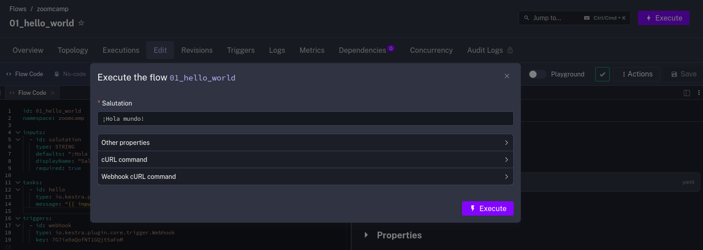
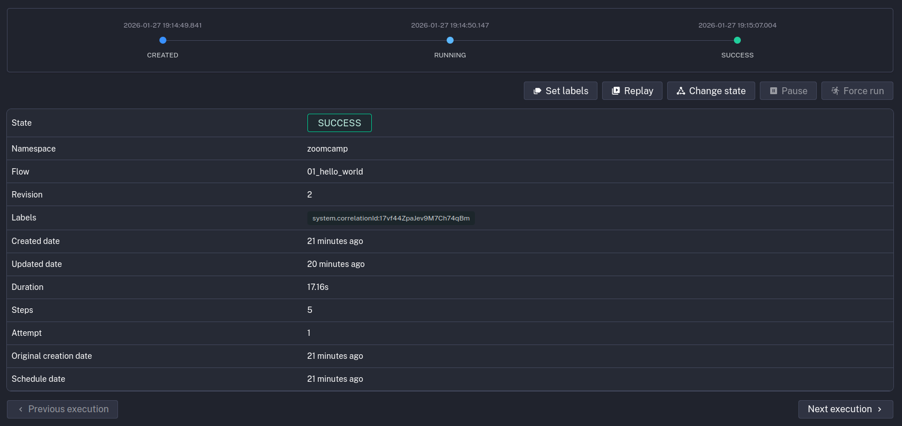

# Orquestación de flujos de datos

## Conceptos básicos de Kestra

* Vídeo original (en inglés): [Learn the Kestra Concepts](https://www.youtube.com/watch?v=MNOKVx8780E&list=PLEK3H8YwZn1p-pCYj46rRhA0HcdXXxzzP&index=4&pp=iAQB)

Kestra se organiza en torno a varios conceptos clave:

* **[Flujos](https://go.kestra.io/de-zoomcamp/flow)**: Los flujos son la unidad básica de orquestación. Cada flujo define una serie de tareas, así como su orden de ejecución, las entradas y salidas de cada una de ellas y su lógica de orquestación.

* **[Tareas](https://go.kestra.io/de-zoomcamp/tasks)**: Las acciones representan acciones concretas que se inician con una cierta entrada de datos y producen una salida para que sea consumida por las tareas posteriores.

* **[Entradas](https://go.kestra.io/de-zoomcamp/inputs)**: Las entradas son valores dinámicos que son pasados en tiempo de ejecución.

* **[Salidas](https://go.kestra.io/de-zoomcamp/outputs)**: Las salidas son los valores producidos por las tareas.

* **[Disparadores](https://go.kestra.io/de-zoomcamp/triggers)**: Los disparadores son mecanismos que inician automáticamente la ejecución de un flujo de datos.

* **[Ejecución](https://go.kestra.io/de-zoomcamp/execution)**: Las ejecuciones representan cada una de las veces que se ejecuta un flujo, con un correspondiente estado.

* **[Variables](https://go.kestra.io/de-zoomcamp/variables)**: Las variables son pares de clave y valor (o, dicho de otra manera, valores un nombre único asignado) que permiten reutilizar valores en diferentes tareas.

* **[Valores por defecto de plugins](https://go.kestra.io/de-zoomcamp/plugin-defaults)**: Los valores por defecto son valores que se aplican para todas las tareas de un cierto tipo a lo largo de uno o más flujos de datos.

* **[Concurrencia](https://go.kestra.io/de-zoomcamp/concurrency)**: La concurrencia controla cuántas instancias de un mismo flujo de datos se pueden ejecutar simultáneamente.

### Flujos

Los flujos se definen en Kestra mediante ficheros YAML.

```yaml
id: simple_hello_world
namespace: zoomcamp

tasks:
  - id: hello_message
    type: io.kestra.plugin.core.log.Log
    message: "¡Hola mundo!"
```

Cuando creas un flujo, debes establecer su identificador `id` y espacio de nombres `namespace` y no podrás cambiar estos dos valores. Si quisieses cambiarlos, tendrías que crear un nuevo trabajo copiando el YAML con el nuevo identificador y espacio de nombres y borrar el flujo que tenía los valores que querías cambiar.

### Tareas

Las tareas son la parte más básica de Kestra. Es en las tareas donde ocurren las acciones y transformaciones de datos. Para cada tarea necesitas al menos un identificador `id` y un tipo de tarea `type`.

> [!NOTE]
> En el caso de las tareas, sí podrás cambiar su identificador una vez creada. El tipo de la tarea es un nombre completo de clase Java que determina qué hace la tarea.

```yaml
tasks:
  - id: sleep
    type: io.kestra.plugin.core.flow.Sleep
    duration: PT15S

  - id: hello_message
    type: io.kestra.plugin.core.log.Log
    message: "¡Hola mundo!"
```

Además de esto, cada tipo de tarea puede tener argumentos adicionales. En el ejemplo, la tarea _sleep_ require una duración y la tarea _log_ requiere un mensaje.

Gracias a la documentación integrada puedes ver los argumentos de entrada y la especificación de la salida de datos sin salir del editor.

### Entradas

Las entradas son valores que serán establecidos cada vez que se inicie la ejecución de un trabajo. Esto permite que un mismo trabajo sea iniciado varias veces con entradas diferentes.

```yaml
inputs:
  - id: salutation
    type: STRING
    defaults: "¡Hola mundo!"
    displayName: "Salutation"
    required: true
```

Al ejecutar manualmente en Kestra un flujo que tiene entrada de datos, aparece una interfaz que permite introducir los datos de entrada.



Kestra soporta múltiples tipos de datos para las variables de entrada. Entre los más básicos, están:

* **STRING**: Cualquier cadena de texto. Los valores se pasan sin ser parseados; para cualquier validación adicional, debes usar un validador por expresión regular.

* **INT**: Debe ser un valor entero válido (es decir, sin decimales).

* **FLOAT**: Debe ser un valor decimal válido (es decir, con decimales).

* **SELECT**: Debe ser un valor de tipo cadena válido dentro de una lista predefinida de valores. Puedes proporcionar esos valores directamente usando la propiedad `values` o usar la propiedad `expression` para obtenerlos dinámicamente desde un almacén.

* **BOOLEAN**: Debe ser true o false, pasados como cadenas de texto.

* **DATETIME**: Debe ser una fecha y hora completas válidas en formato [ISO 8601](https://es.wikipedia.org/wiki/ISO_8601) con la zona horaria expresada en formato UTC; el valor de entrada de tipo DATETIME debe pasarse como una cadena siguiendo el patrón **2042-04-02T04:20:42.000Z**.
una cadena de texto como **10:15:30**.

* **URI**: Debe ser una URI válida y se mantendrá como una cadena.

> [!NOTE]
> Puedes consultar la [documentación oficial](https://kestra.io/docs/workflow-components/inputs#input-types) para ver la lista completa.

Puedes usar las entradas al definir tus tareas usando la sintaxis:

```yaml
tasks:
  - id: hello_message
    type: io.kestra.plugin.core.log.Log
    message: "{{ input.salutation }}"
```

Fíjate en el uso de las dobles llaves {{ }}, que indican que lo que hay dentro de ellas será reemplazado por el valor que representan. Y en cómo referencian a una propiedad, **salutation**, que es parte del objeto **input**.

### Salidas

Al definir tareas, también puedes hacer referencia a las salidas de tareas previas:

```yaml
  - id: generate_output
    type: io.kestra.plugin.core.debug.Return
    format: Fui generado por la tarea `generate_output`

  - id: log_output
    type: io.kestra.plugin.core.log.Log
    message: "{{ outputs.generate_output.value }}"
```

En este caso, hacemos referencia a la propiedad **generate_output**, que es el identificador de la tarea previa a la que nos referimos, a través del objeto **outputs**.

### Disparadores

Kestra soporta varios tipos de diparadores:

* **Triggers programados**: Permiten ejecutar flujos con periodicidades prefijadas (ej. diariamente a una determinada hora)

* **Triggers de flujos**: Permiten ejecutar un flujo cuando otros flujo termina.

* **Triggers de webhooks**: Permiten disparar flujos basados en una petición HTTP.

* **Triggers por sondeo**: Permiten comprobar un servicio externo y lanzar un flujo si se encuentran en él datos pendientes de procesar.

* **Trigger en tiempo real**: Permiten ejecutar un flujo en cuanto ocurre un cierto evento con una latencia del orden de milisegundos.

```yaml
triggers:
  - id: schedule
    type: io.kestra.plugin.core.trigger.Schedule
    cron: "@hourly"
    allowConcurrent: false
```

#### Webhooks

Una utilidad interesante es la facilidad con la que puedes disparar la ejecución de flujos de trabajo en Kestra desde otras herramientas usando su API. Solo tenemos que añadir un trigger de tipo webhook (que requiere una clave `key` secreta):

```yaml
triggers:
  - id: webhook
    type: io.kestra.plugin.core.trigger.Webhook
    key: 7G7ia9aQofNT1GQjt5aFoM
```

Y esto nos permitirá lanzar el flujo con una simple llamada HTTP:

```bash
curl -X POST http://localhost:8080/api/v1/main/executions/webhook/zoomcamp/01_hello_world/7G7ia9aQofNT1GQjt5aFoM
```

### Ejecuciones

Una de las ventajas principales de usar una herramienta de orquestación de flujos de datos es que organiza su observabilidad. En Kestra, cada vez que un flujo es iniciado, completado, o detenido porque ocurrió un error, se genera un registro con información sobre su ejecución.

Los registros nos dan información sobre cuánto tardó el flujo, así como cada una de sus tareas, qué salidas generó cada una de ellas. Además, si alguna tarea falló y fue reintentada, también tendremos un registro que nos permitirá detectar la incidencia.



### Variables

Las variables facilitan compartir valores entre diferentes tareas. Su rol es similar al de las variables de entrada, con la diferencia principal de que no están vinculadas a una entrada que puede ser sobreescrita por el usuario en el momento de la ejecución.

```yaml
variables:
  salutation: "Hola"

tasks:
  - id: hello
    type: io.kestra.plugin.core.log.Log
    message: {{ vars.salutation }}
```

Resulta también útil que las variables pueden contener expresiones que pueden ser "renderizadas" cuando sea necesario.

```yaml
variables:
  time: "{{ now() }}"

tasks:
  - id: hello
    type: io.kestra.plugin.core.log.Log
    message: "Son las: {{ render(vars.time) }}"
```

### Valores por defecto de plugins

Los valores por defecto de plugins permiten establecer configuraciones que serán usadas por todas las tareas de un cierto tipo en el flujo en el que son definidos.

```yaml
pluginDefaults:
  - type: io.kestra.plugin.scripts.python.Script
    values:
      docker:
        image: python:3.11-slim

tasks:
  - id: hola_desde_python
    type: io.kestra.plugin.scripts.python.Script
    script: |
      print("Hola desde Python 3.11")

  - id: adios_desde_python
    type: io.kestra.plugin.scripts.python.Script
    script: |
      print("Adiós desde Python 3.11")
```

En el ejemplo, las dos tareas Python se ejecutan usando la imagen de Docker `python:3.11-slim`.

### Concurrencia

Definir cuántas veces puede ejecutarse simultáneamente un flujo de trabajo es tan sencillo como añadir una clave de concurrencia `concurrency`.

```yaml
concurrency:
  limit: 2
```

Además, podemos especificar cómo queremos que se comporte Kestra si se intentase ejecutar una instancia más de las que hemos declarado admisibles con `behavior`.

```yaml
concurrency:
  limit: 2
  behavior: FAIL
```

Los valores posibles son QUEUE, CANCEL y FAIL.
