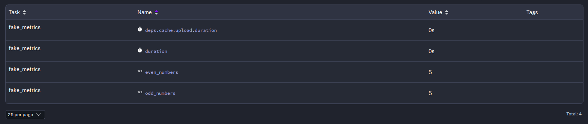

# # Orquestación de flujos de datos

## Orquestar código Python

* Vídeo original (en inglés): [Orquestrate Python Code](https://www.youtube.com/watch?v=VAHm0R_XjqI)

Al orquestar flujos de datos es frecuente que queramos lanzar ciertos scripts de Python. Con Kestra tenemos varias formas de hacerlo.

### Script

Una de las formas más sencillas es usar una tarea de tipo **Script** y seleccionar como ejecutor un contenedor Docker con una imagen de Python. Lo que hace que tareas de este tipo sean tan sencillas es que puedes escribir el código Python directamente en el YAML de la tarea.

```yaml
tasks:
  - id: collect_stats
    type: io.kestra.plugin.scripts.python.Script
    taskRunner:
      type: io.kestra.plugin.scripts.runner.docker.Docker
    containerImage: python:slim
    dependencies:
      - requests
      - kestra
    script: |
      from kestra import Kestra
      import requests
      def get_docker_image_downloads(image_name: str = "kestra/kestra"):
          """Queries the Docker Hub API to get the number of downloads for a specific Docker image."""
          url = f"https://hub.docker.com/v2/repositories/{image_name}/"
          response = requests.get(url)
          data = response.json()
          downloads = data.get('pull_count', 'Not available')
          return downloads
      downloads = get_docker_image_downloads()
      outputs = {
          'downloads': downloads
      }
      Kestra.outputs(outputs)
```

### Comando

En ocasiones, sobre todo cuando se trate de programas largos, preferiremos crear un fichero y definir una tarea que lo ejecute. Para esto, podemos usar la tarea **Command**.

```yaml
tasks:
  - id: etl_script
    type: io.kestra.plugin.scripts.python.Commands
    namespaceFiles:
      enabled: true
      folderPerNamespace: true
      include:
        - etl_script.py
    taskRunner:
      type: io.kestra.plugin.core.runner.Process
    beforeCommands:
      - uv venv --python 3.13
      - uv pip install requests
    commands:
      - python etl_script.py
```

En este caso, tendrás que añadir el archivo con el código Pytonh a Kestra usando el editor, o la [sincronización desde un repositorio Git](https://kestra.io/docs/version-control-cicd/git).

### Devolver valores

Si desde dentro de uno de tus scripts quieres devolver un valor de forma que pueda ser utilizado por las tareas posteriores, debes asegurarte (como hicimos en el primer ejemplo) de añadir `kestra` a tu lista de dependencias y luego usar pasar la salida de tu script a **Kestra.outputs**:

```python
from kestra import Kestra
from random import randint

Kestra.outputs({
    'numero_aleatorio': randint(0, 1000)
})
```

Más adelante podrás acceder al valor retornado a través del objeto **outputs**.

```yaml
  - id: log_downloads
    type: io.kestra.plugin.core.log.Log
    message: "Number of downloads: {{ outputs.mi_tarea.vars.numero_aleatorio }}"
```

### Generar ficheros

Si en lugar de de volver un dato tu proceso genera un fichero, puedes usar **outputFiles** para hacer llegar los ficheros a las tareas posteriores.

```yaml
tasks:
  - id: outputs_metrics
    type: io.kestra.plugin.scripts.python.Script
    taskRunner:
      type: io.kestra.plugin.scripts.runner.docker.Docker
    containerImage: python:slim
    dependencies:
      - requests
    outputFiles:
      - downloads.txt
    script: |
      import requests

      def get_docker_image_downloads(image_name: str = "kestra/kestra"):
          """Queries the Docker Hub API to get the number of downloads for a specific Docker image."""
          url = f"https://hub.docker.com/v2/repositories/{image_name}/"
          response = requests.get(url)
          data = response.json()

          downloads = data.get('pull_count', 'Not available')
          return downloads

      downloads = get_docker_image_downloads()

      # Generate a file with the output
      f = open("downloads.txt", "a")
      f.write(str(downloads))
      f.close()
```

En este caso, puedes hacer referencia al diccionario de ficheros generados por la tarea _output_metrics_ con:

```
{{ outputs.output_metrics.outputFiles['downloads.txt'] }}
```

### Generar un log

Si quieres que tu código Python genere mensajes legibles desde el monitor de logs de Kestra, puedes usar **Kestra.logger**.

```python
from random import randint
from kestra import Kestra

logger = Kestra.logger()

logger.debug("Con `debug` podemos loguear información sobre cómo va la ejecución")
logger.info("Con `info` podemos loguear datos relevantes")
logger.warning("Con `warning` podemos loguear advertencias o mensajes que requieran revisión")
logger.error("Con `error` podemos loguear cosas que han ido mal")
logger.critical("Con `critical` podemos loguear errores graves")
```

Una vez termine la ejecución de tu tarea, desde la vista de logs del flujo de trabajo verás algo así:


### Registrar métricas

Además de generar mensajes, puede que quieras que tu código Python genere métricas para informar de la duración de algunas de sus tareas, o de números de registros procesados. Para esto, dispones de **Kestra.metrics**.

```python
import time
from random import randint
from kestra import Kestra

start = time.perf_counter()

even_numbers = []
odd_numbers = []

for _ in range(0, 10):
    generated = randint(0, 99)
    if generated % 2 == 0:
        even_numbers.append(generated)
    else:
        odd_numbers.append(generated)

end = time.perf_counter()

Kestra.timer('duration', end - start)
Kestra.counter('odd_numbers', len(odd_numbers))
Kestra.counter('even_numbers', len(even_numbers))
```

Una vez termine la ejecución de la tarea, desde la vista de métricas del flujo de trabajo verás una tabla con los datos de cada métrica generada:


