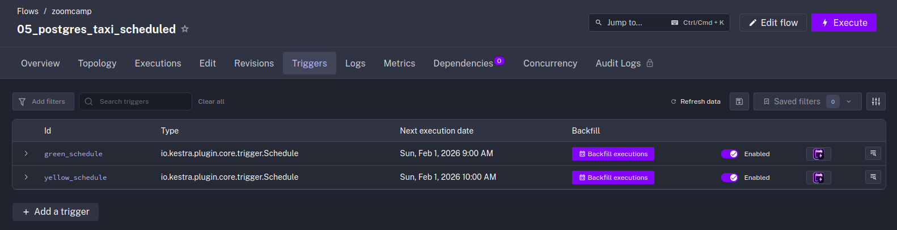
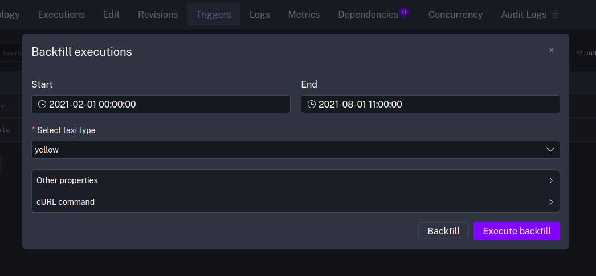

# Orquestación de flujos de datos

## Caso práctico: Programaciones y relleno de históricos

* Ver el vídeo original (en inglés): [Scheduling and Backfills](https://www.youtube.com/watch?v=1pu_C_oOAMA)

En nuestra última sesión, creamos un [flujo de datos en Kestra](06-datos-del-dataset-de-taxis-de-nueva-york.md) que descargaba ficheros CSV del dataset de taxis de Nueva York y los importaba en una tabla en un servidor PostgreSQL local. En esta sesión, vamos a continuar trabajando con ese mismo flujo de datos para:

1. Programarlo como tarea para que se ejecute automáticamente cada mes.
2. Lanzar rellenos de datos históricos para actualizar nuestra base de datos con datos antiguos.

## Entradas y variables

Para empezar, vamos a hacer un pequeño cambio en la entrada de nuestro flujo de datos. Si en la versión anterior pedíamos tanto el _dataset_ (datos de taxis amarillos, o de taxis verdes) como el _año_ y _mes_, en esta ocasión vamos a hacer que el año y mes se tomen directamente a partir de la fecha "actual" (es decir, de la fecha en la que el flujo ha sido ejecutado).

Además, modificaremos nuestras definiciones de variables para eliminar las referencias a la entrada de año y mes y reemplazarlas por referencias al mes y año de la ejecución.

```yaml
inputs:
  - id: taxi
    type: SELECT
    displayName: Select taxi type
    values: [yellow, green]
    defaults: yellow

variables:
  file: "{{ inputs.taxi }}_tripdata_{{ trigger.date | dateAdd(-1, 'MONTHS') | date('yyyy-MM') }}.csv"
  staging_table: "public.{{ inputs.taxi }}_tripdata_staging"
  table: "public.{{ inputs.taxi }}_tripdata"
  data: "{{ outputs.extract.outputFiles[inputs.taxi ~ '_tripdata_' ~ (trigger.date | dateAdd(-1, 'MONTHS') | date('yyyy-MM')) ~ '.csv'] }}"
```

> [!NOTE]
> En este caso estamos haciendo referencia al dato del mes anterior porque en el siguiente apartado vamos a programar una tarea para que se ejecute el primer día de cada mes. Y queremos simular un entorno real, en el que los datos de un mes se publican el mes siguiente.

## Programación

Para conseguir que nuestro flujo se ejecute una vez al mes para cada fichero, añadimos una sección con el correspondiente **cron**:

```yaml
triggers:
  - id: green_schedule
    type: io.kestra.plugin.core.trigger.Schedule
    cron: "0 9 1 * *"
    inputs:
      taxi: green

  - id: yellow_schedule
    type: io.kestra.plugin.core.trigger.Schedule
    cron: "0 10 1 * *"
    inputs:
      taxi: yellow
```

## Concurrencia

Para acabar, no es mala idea que añadamos un límite de concurrencia, dado que las tablas de "staging" se borran cada vez que se ejecuta el flujo, no haciéndolo útil para ejecuciones en paralelo.

```yaml
concurrency:
  limit: 1
```

## Relleno de datos históricos

Si ahora nos propusiésemos, como se nos pide en la tarea del Zoomcamp para esta semana, rellenar nuestra base de datos con los datos disponibles de 2021, podremos usar la opción de "backfills" (rellenos de datos históricos) de Kestra.

Para hacerlo, vamos a la pestaña de disparadores del flujo que queremos disparar y hacemos click en el botón "backfills" de la tarea programada correspondiente:



Esto abrirá un cuadro de diálogo que combinará un rango de fechas con las entradas de nuestro flujo. Aquí la clave es que tengamos en cuenta que las fechas que debemos introducir deben comprender las fechas en las que se habría disparado el flujo según la configuración de cron que introducimos.

Por ejemplo, como en nuestra configuración para el _dataset_ de taxis amarillos el cron está programado para cada primer día de mes a las 10:00 de la mañana, si quisiésemos descargarnos los datos de enero a julio de 2021:

* la fecha de inicio tendría que ser alguna fecha de febrero de 2021 posterior a las 10 de la mañana del día 1,
* la fecha de fin tendría que ser alguna fecha de agosto de 2021 también posterior a las 10 de la mañana del día 1.



¡Listo! Esto generará automáticamente y una a una todas las ejecuciones faltantes en el rango de fechas indicado.

## Resultado final

Una vez terminado, nuestro flujo de datos tendrá un aspecto similar al del fichero [05-schedules-and-backfills.yaml](resources/flows/05-schedules-and-backfills.yaml).
