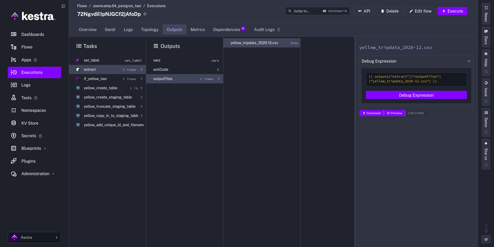
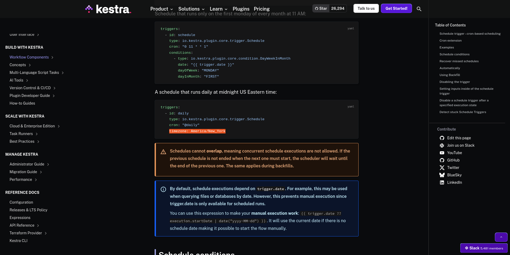

## Module 2 Homework

> [!WARNING]
> At the end of the submission form, you will be required to include a link to your GitHub repository or other public code-hosting site. This repository should contain your code for solving the homework. If your solution includes code that is not in file format, please include these directly in the README file of your repository.

> [!NOTE]
> In case you don't get one option exactly, select the closest one 

### Quiz Questions

Complete the quiz shown below. It's a set of 6 multiple-choice questions to test your understanding of workflow orchestration, Kestra, and ETL pipelines.

> 1) Within the execution for `Yellow` Taxi data for the year `2020` and month `12`: what is the uncompressed file size (i.e. the output file `yellow_tripdata_2020-12.csv` of the `extract` task)?

- **128.3 MiB**

> 2) What is the rendered value of the variable `file` when the inputs `taxi` is set to `green`, `year` is set to `2020`, and `month` is set to `04` during execution?

- **`green_tripdata_2020-04.csv`**

> 3) How many rows are there for the `Yellow` Taxi data for all CSV files in the year 2020?

- **24,648,499**

> 4) How many rows are there for the `Green` Taxi data for all CSV files in the year 2020?

- **1,734,051**

> 5) How many rows are there for the `Yellow` Taxi data for the March 2021 CSV file?

- **1,925,152**

6) How would you configure the timezone to New York in a Schedule trigger?

- **Add a `timezone` property set to `America/New_York` in the `Schedule` trigger configuration**
