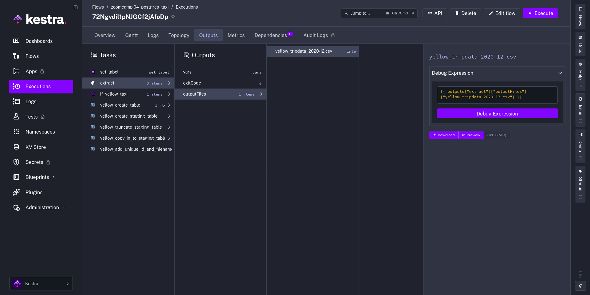
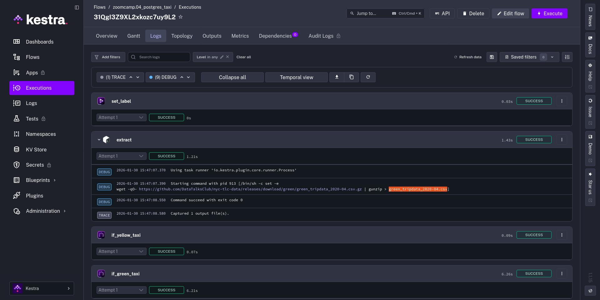
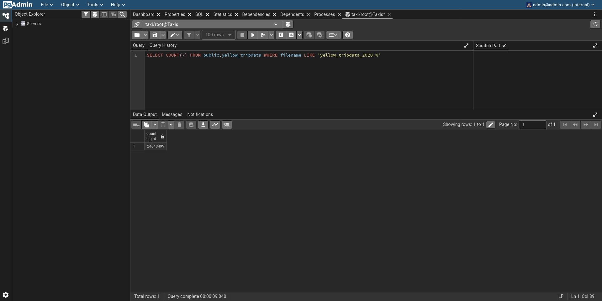
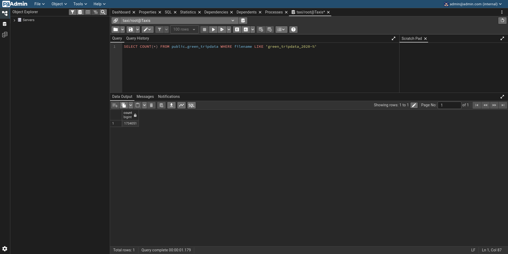
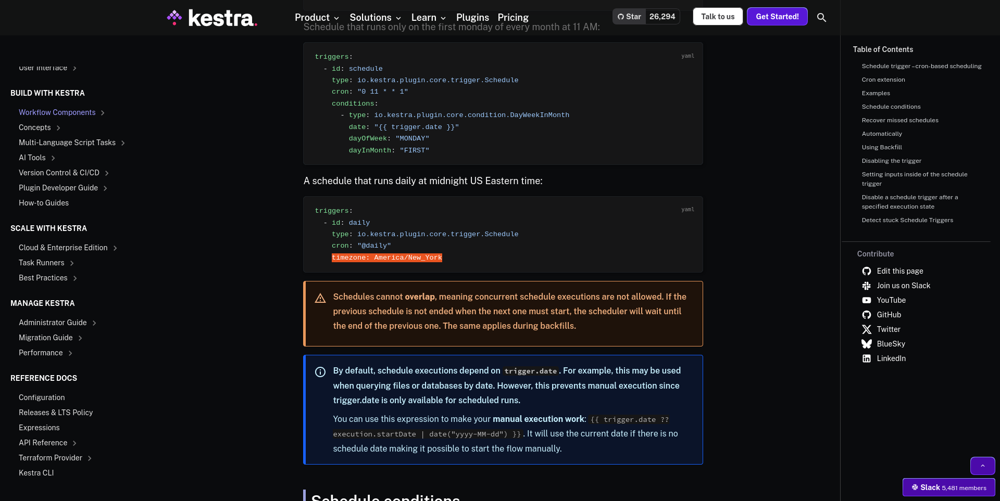

## Tarea del Módulo 2: Orquestación de flujos de datos

> [!WARNING]
> Al final del formulario de entrega, deberás incluir un enlace a tu repositorio de GitHub u otro sitio público de alojamiento de código. Este repositorio debe contener tu código para resolver la tarea. Si tu solución incluye código que no está en formato de archivo, inclúyelo directamente en el archivo README de tu repositorio.

> [!NOTE]
> En caso de que no encuentres una opción exacta, selecciona la más cercana.

### Preguntas del cuestionario

Completa el cuestionario que se muestra a continuación. Es un conjunto de 6 preguntas de opción múltiple para evaluar tu comprensión de la orquestación de flujos de trabajo, Kestra y los pipelines ETL.

> 1) Dentro de la ejecución para los datos de taxis `Yellow` del año `2020` y mes `12`: ¿cuál es el tamaño del archivo sin comprimir (es decir, el archivo de salida `yellow_tripdata_2020-12.csv` de la tarea `extract`)?

- **128,3 MiB**

> 2) ¿Cuál es el valor renderizado de la variable `file` cuando la entrada `taxi` se establece en `green`, `year` en `2020` y `month` en `04` durante la ejecución?

- **`green_tripdata_2020-04.csv`**

> 3) ¿Cuántas filas hay para los datos de taxis `Yellow` en todos los archivos CSV del año 2020?

- **24.648.499**

> 4) ¿Cuántas filas hay para los datos de taxis `Green` en todos los archivos CSV del año 2020?

- **1.734.051**

> 5) ¿Cuántas filas hay para los datos de taxis `Yellow` en el archivo CSV de marzo de 2021?

- **1.925.152**

> 6) ¿Cómo configurarías la zona horaria a Nueva York en un disparador de tipo Schedule?

- **Añadir una propiedad `timezone` con el valor `America/New_York` en la configuración del disparador `Schedule`**