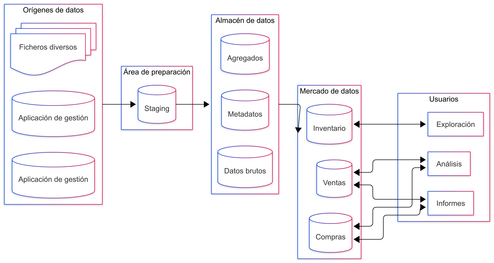
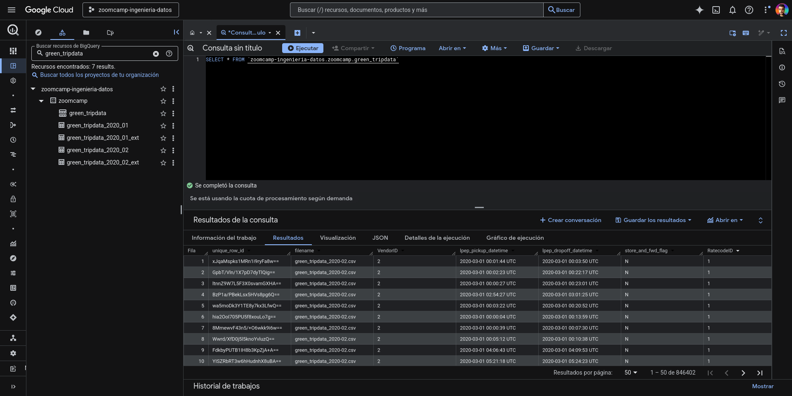

# Almacenes de datos

## Almacenes de datos y BigQuery

* Vídeo original (en inglés): [Data Warehouse and BigQuery](https://www.youtube.com/watch?v=jrHljAoD6nM&list=PL3MmuxUbc_hJed7dXYoJw8DoCuVHhGEQb&index=24&pp=iAQB)

En nuestro trabajo con bases de datos nos encontraremos con dos paradigmas bastante enfrentados que sirven a propósitos diferentes.

### Procesamiento de transacciones en línea (OLTP)

El procesamiento de transacciones en línea es el tipo de almacén que nos encontraremos cuando examinemos el funcionamiento de aplicaciones de bases de datos. Estos almacenes de datos se caracterizan porque:

* su propósito es controlar operaciones de negocio en tiempo real,
* ejecutan actualizaciones cortas y rápidas desencadenadas por acciones del usuario,
* normalizan bases de datos para hacer eficientes tareas que combinan creaciones, modificaciones, eliminaciones y consultas de registros,
* pueden contar con archivos de registros históricos y papeleras de reciclaje para mantener registros fuera de la base de datos y así reducir espacio,
* requieren procesos de copias de seguridad dado que sus datos son críticos para el funcionamiento del negocio,
* maximizan la productividad de los usuarios operativos,
* almacenan transacciones del día a día.

### Procesamiento analítico en línea (OLAP)

El procesamiento analítico en línea es el tipo de almacén de datos que nos encontraremos cuando examinemos el funcionamiento de paneles de informes y otras herramientas analíticas. Estos almacenes de datos se caracterizan porque:

* su propósito es facilitar los análisis de grandes volúmenes de datos para informar decisiones o encontrar patrones ocultos en los datos,
* ejecutan actualizaciones de forma periódica o con procesos por lotes,
* denormalizan bases de datos para hacer eficientes ciertas consultas, sacrificando las capacidades de la base de datos para gestionar actualizaciones de datos,
* tienden a crecer en espacio, por un lado por tratarse en muchos casos de agregados de otras bases de datos y por otro debido a que las denormalizaciones suelen crear, a propósito, ciertas duplicidades de información,
* no suelen requerir copias de seguridad dado que sus datos se refrescan de forma periódica a partir de otras bases de datos,
* maximizan la productividad de los usuarios ejecutivos,
* almacenan agregados multidimensionales de los datos corporativos.

### Almacén de datos

Un almacén de datos es una solución de procesamiento analítico (OLAP). Normalmente agregan información siguiendo un flujo de varios pasos:

* **orígenes de datos**: ficheros de diversos tipos junto a las aplicaciones de gestión sirven para mantener datos sobre las operaciones del día a día,

* **área de preparación**: un área de preparación reúne información de las bases de datos relacionales,

* **almacén de datos**: un almacén de datos unifica la información del área de preparación, organizándola en metadatos, datos brutos y datos agregados,

* **mercado de datos**: los datos del almacén de datos son organizados en funcion de las áreas de negocio que se querrán analizar,

* **usuarios**: por fin, los usuarios podrán interactuar con el mercado de datos a través de paneles de consulta y otras herramientas analíticas.



### BigQuery

BigQuery es una solución de Google de almacén de datos, tipo OLAP, que se caracteriza por ser _serverless_. Es decir, ofrece una solución que escala bien sin necesidad de gestionar recursos como la RAM, las CPUs, o incluso el espacio de almacenamiento.

#### Interfaz

En cuanto a la interfaz principal de BigQuery, lo primero que nos encontramos al explorar un _dataset_ son sus tablas. La consulta de datos de una tabla es la de una consola SQL estándar.



#### Tablas externas

Las tablas externas de BigQuery nos permiten crear tabla a partir de recursos externos, como un CSV guardado en un _bucket_ de Google.

Podemos crear las tablas externas permitiendo que BigQuery infiera el esquema de la tabla a partir de las columnas del CSV:

```sql
CREATE OR REPLACE EXTERNAL TABLE `zoomcamp.nytaxi.yellow_tripdata_ext`
OPTIONS (
  format = 'CSV',
  uris = ['gs://newyork-taxi/yellow_tripdata_*.csv']
);
```

O, como hicimos en el [módulo anterior](../02-orquestacion-de-flujos-de-datos/06-datos-del-dataset-de-taxis-de-nueva-york.md), especificar la estructura de la tabla explícitamente:

```sql
CREATE OR REPLACE EXTERNAL TABLE `zoomcamp.yellow_tripdata_ext`
(
    VendorID STRING,
    tpep_pickup_datetime TIMESTAMP,
    tpep_dropoff_datetime TIMESTAMP,
    passenger_count INTEGER,
    trip_distance NUMERIC,
    RatecodeID STRING,
    store_and_fwd_flag STRING,
    PULocationID STRING,
    DOLocationID STRING,
    payment_type INTEGER,
    fare_amount NUMERIC,
    extra NUMERIC,
    mta_tax NUMERIC,
    tip_amount NUMERIC,
    tolls_amount NUMERIC,
    improvement_surcharge NUMERIC,
    total_amount NUMERIC,
    congestion_surcharge NUMERIC
)
OPTIONS (
    format = 'CSV',
    uris = ['gs://newyork-taxi/yellow_tripdata_*.csv'],
    skip_leading_rows = 1,
    ignore_unknown_values = TRUE
);
```

Un problema inherente a las tablas externas es que BigQuery no sabe decirnos cuántos registros tiene la tabla (a menos que lancemos una consulta sobre ella).

#### Tablas particionadas

Si sabemos que vamos a consultar una de nuestras tablas por una columna en particular, podemos crearla como particionada. Al hacer esto, varias instancias de la tabla serán creadas por separado indexadas por esa columna.

```sql
CREATE OR REPLACE TABLE zoomcamp.yellow_tripdata_partitioned
PARTITION BY
    DATE(tpep_pickup_datetime) AS
SELECT * FROM zoomcamp.yellow_tripdata_ext;
```

Esto permitirá que cuando obtengamos datos de un rango determinado de fechas, BigQuery solo tenga que procesar los registros que estén en las particiones correspondientes, reduciendo así el coste de la consulta.


> Fuente de la imagen: [Google Cloud](https://cloud.google.com/blog/topics/developers-practitioners/bigquery-explained-storage-overview)

Si en algún momento queremos echar un vistazo a las particiones que se han creado para una tabla, podemos hacerlo consultando `INFORMATION_SCHEMA.PARTITIONS`:

```sql
SELECT table_name, partition_id, total_rows
FROM `zoomcamp.INFORMATION_SCHEMA.PARTITIONS`
WHERE table_name = 'yellow_tripdata_partitioned'
ORDER BY total_rows DESC;
```

#### Clustering

Otra forma de optimizar nuestras tablas en BigQuery es el clustering, que es una forma de mantener agrupados ciertos registros de una tabla, ya esa una tabla estándar o particionada.

```sql
CREATE OR REPLACE TABLE zoomcamp.yellow_tripdata_partitioned_clustered
PARTITION BY DATE(tpep_pickup_datetime)
CLUSTER BY VendorID AS
SELECT * FROM zoomcamp.yellow_tripdata_ext;
```


> Fuente de la imagen: [Google Cloud](https://cloud.google.com/blog/topics/developers-practitioners/bigquery-explained-storage-overview)
