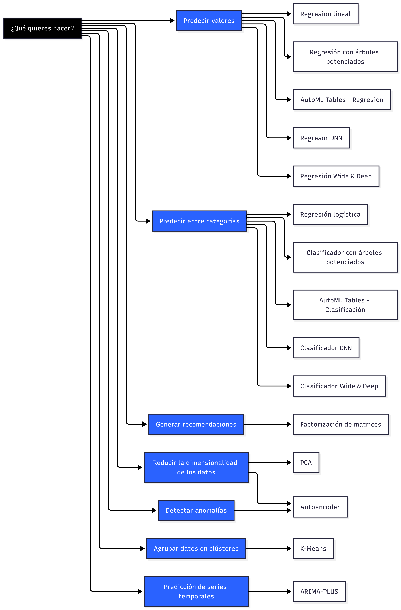
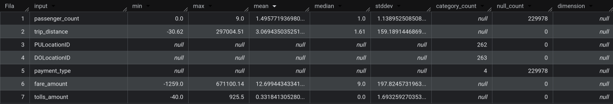
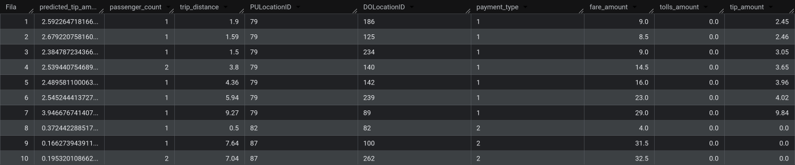
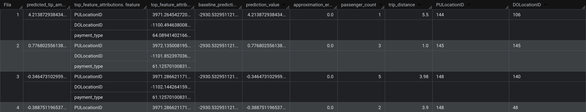

# Almacenes de datos

## Aprendizaje automático en BigQuery

* Vídeo original (en inglés): [BigQuery Machine Learning](https://www.youtube.com/watch?v=B-WtpB0PuG4&list=PL3MmuxUbc_hJed7dXYoJw8DoCuVHhGEQb&index=35)

Las herramientas que ofrece BigQuery también nos pueden ayudar cuando queramos crear modelos de aprendizaje automático basados en grandes volúmenes de datos. Siguiendo con el ejemplo de datos de taxis de Nueva York, en esta sesión vamos a dar repaso rápido sobre las técnicas que podemos usar sin dejar de usar GoogleSQL para crear un modelo sobre nuestro conjunto de datos.

### Selección de datos

El primer paso es seleccionar y materializar los datos que vamos a querer usar para entrenar nuestro modelo. En nuestro caso, continuaremos usando la tabla `yellow_tripdata_partitioned` que creamos durante nuestra sesión de [almacenes de datos y BigQuery](01-almacenes-de-datos-y-bigquery.md).

```sql
SELECT
    passenger_count,
    trip_distance,
    PULocationID,
    DOLocationID,
    payment_type,
    fare_amount,
    tolls_amount,
    tip_amount
FROM zoomcamp.yellow_tripdata_partitioned
WHERE fare_amount != 0
```

Aquí hemos usado dos técnicas de filtrado. En primer lugar, hemos escogido únicamente las columnas que nos interesaban. Y en segundo lugar, hemos filtrado los registros que nos interesaban, en este caso dejando fuera los registros con `fare_amount` vacío.

### Materialización

Una vez sabemos qué datos querremos analizar con nuestro modelo, es buena práctica materializarlos en una tabla persistida.

```sql
CREATE OR REPLACE TABLE zoomcamp.yellow_tripdata_dataset (
    passenger_count INTEGER,
    trip_distance FLOAT64,
    PULocationID STRING,
    DOLocationID STRING,
    payment_type STRING,
    fare_amount FLOAT64,
    tolls_amount FLOAT64,
    tip_amount FLOAT64
) AS (
    SELECT
        passenger_count,
        trip_distance,
        CAST(PULocationID AS STRING),
        CAST(DOLocationID AS STRING),
        CAST(payment_type AS STRING),
        fare_amount,
        tolls_amount,
        tip_amount
    FROM zoomcamp.yellow_tripdata_partitioned
    WHERE fare_amount != 0
)
```

Al materializar datos para aprendizaje automático en BigQuery, es conveniente tener el cuenta qué transformaciones de datos aplicará BigQuery en función del tipo de dato de cada columna.

> **Estandarización de columnas numéricas**
>
> "En la mayoría de los modelos, BigQuery ML estandariza y centra las columnas numéricas en cero antes de usarlas en el entrenamiento."
>
> **Codificación `one-hot`**
>
> "En el caso de todas las columnas no numéricas y no de matriz que no sean TIMESTAMP, BigQuery ML realiza una transformación de codificación one-hot para todos los modelos, excepto los de árbol de refuerzo y de bosque aleatorio."
>
> **Codificación `multi-hot`**
>
> "En todas las columnas ARRAY no numéricas, BigQuery ML realiza una transformación de codificación multi-hot. Esta transformación genera una función independiente para cada elemento único del ARRAY."
>
> **Transformación de marcas de tiempo**
>
> "Cuando un modelo de regresión lineal o logística se encuentra con una columna TIMESTAMP, extrae un conjunto de componentes de la TIMESTAMP y realiza una combinación de estandarización y codificación one-hot en los componentes extraídos."
>
> **Expansión de los `struct`**
>
> "Cuando BigQuery ML encuentra una columna STRUCT, expande los campos de su interior para crear una sola columna. [...] Los nombres de las columnas después de la expansión tienen el formato {struct_name}_{field_name}."
>
> Fuente: [Preprocesamiento automático de funciones · BigQuery](https://docs.cloud.google.com/bigquery/docs/auto-preprocessing?hl=es#feature-transform).

### Selección de un modelo

El siguiente paso es seleccionar y crear el modelo que queremos entrenar.



BigQuery también soporta la creación de modelos sin abandonar GoogleSQL.

```sql
CREATE OR REPLACE MODEL zoomcamp.tip_model
OPTIONS (
    model_type='linear_reg',
    input_label_cols=['tip_amount'],
    data_split_method='AUTO_SPLIT'
) AS
SELECT *
FROM zoomcamp.yellow_tripdata_dataset
WHERE tip_amount IS NOT NULL
```

### Consulta de características

Aunque este no es un paso necesario, sí que puede resultar conveniente examinar las características del modelo que acabamos de crear. Para esto, disponemos de la función `ML.FEATURE_INFO` que requiere como argumento el nombre del modelo a analizar.

```sql
SELECT * FROM ML.FEATURE_INFO(MODEL zoomcamp.tip_model)
```

Esta consulta devuelve un resumen de las características del modelo, indicando los valores mínimo y máximo, estadísticas como la media, la mediana o la desviación estadística y la cuenta de categorías en los casos de columnas de valores codificados.



### Evaluación del modelo

A la hora de evaluar nuestro modelo, podemos hacer uso de la función [`ML.EVALUATE`](https://docs.cloud.google.com/bigquery/docs/reference/standard-sql/bigqueryml-syntax-evaluate) que requiere el modelo a evaluar y el conjunto de datos a usar para la evaluación.

```sql
SELECT *
FROM ML.EVALUATE(
    MODEL zoomcamp.tip_model,
    (
        SELECT *
        FROM zoomcamp.yellow_tripdata_dataset
        WHERE tip_amount IS NOT NULL
    )
)
```

En nuestro caso, la consulta devuelve un conjunto de métricas estándar de evaluación:

```json
{
  "mean_absolute_error": "1.057",
  "mean_squared_error": "3.945",
  "mean_squared_log_error": "0.290",
  "median_absolute_error": "0.608",
  "r2_score": "0.459",
  "explained_variance": "0.459"
}
```

### Usar el modelo para hacer predicciones

Para usar nuestro modelo para hacer predicciones, también disponemos de una función específica, en este caso [`ML.PREDICT`](https://docs.cloud.google.com/bigquery/docs/reference/standard-sql/bigqueryml-syntax-predict), que recibe los mismos parámetros requeridos para la evaluación del modelo.

```sql
SELECT *
FROM ML.PREDICT(
    MODEL zoomcamp.tip_model,
    (
        SELECT *
        FROM zoomcamp.yellow_tripdata_dataset
        WHERE tip_amount IS NOT NULL
    )
)
```

En este caso, obtendremos nuestro conjunto de datos con una columna adicional, `predicted_tip_amount`:



### Interpretar los resultados

Además de la función que nos permite usar el modelo para realizar predicciones, disponemos de [`ML.EXPLAIN_PREDICT`](https://docs.cloud.google.com/bigquery/docs/reference/standard-sql/bigqueryml-syntax-explain-predict), que además de generar predicciones, nos informa de cuánto peso tuvo cada característica en la predicción.

```sql
SELECT *
FROM ML.EXPLAIN_PREDICT(
    MODEL zoomcamp.tip_model,
    (
        SELECT *
        FROM zoomcamp.yellow_tripdata_dataset
        WHERE tip_amount IS NOT NULL
    ),
    STRUCT(3 AS top_k_features)
)
```

En el ejemplo, pedimos a BigQuery que nos informase de cuáles son las 3 características que más peso tienen a la hora de realizar predicciones, y obtuvimos:



### Optimizar hiperparámetros

Antes de finalizar, conviene mencionar que al crear modelos también podemos especificar parámetros específicos para nuestro modelo o, incluso, rangos de valores para dejar que sea BigQuery quien decida cuál es la mejor opción.

```sql
CREATE OR REPLACE MODEL zoomcamp.tip_hyperparam_model
OPTIONS (
    model_type='linear_reg',
    input_label_cols=['tip_amount'],
    data_split_method='AUTO_SPLIT',
    num_trials=5,
    max_parallel_trials=2,
    l1_reg=hparam_range(0, 20),
    l2_reg=hparam_candidates([0, 0.1, 1, 10])
) AS
SELECT *
FROM zoomcamp.yellow_tripdata_dataset
WHERE tip_amount IS NOT NULL
```

El proceso tardará algo más que la creación con parámetros explícitos pero nos dará, probablemente, un modelo mejor optimizado.
