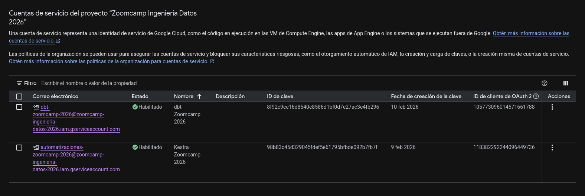
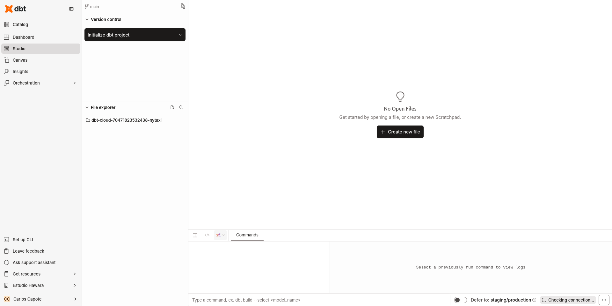
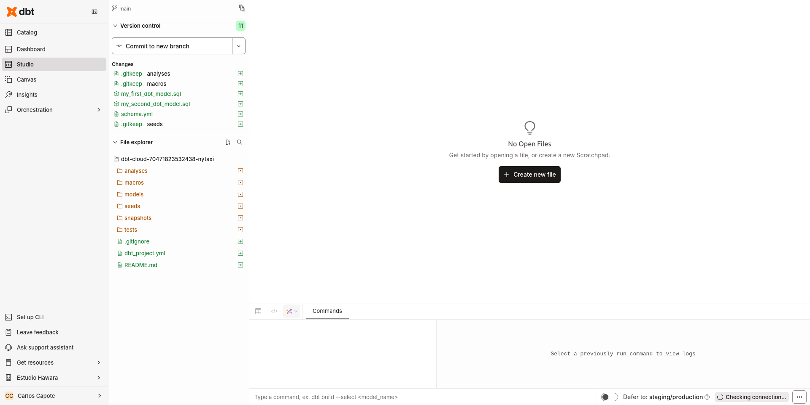
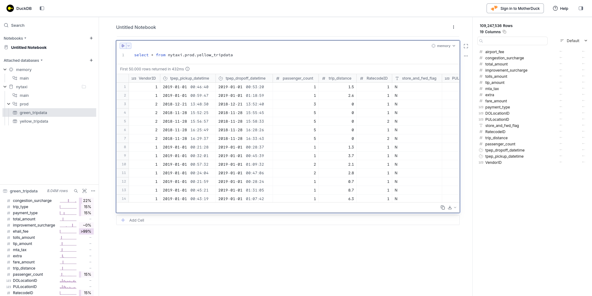

# Análisis de datos

## Conceptos básicos

* Vídeo original (en inglés): [Analytics Engineering Basics](https://www.youtube.com/watch?v=uF76d5EmdtU&list=PL3MmuxUbc_hJed7dXYoJw8DoCuVHhGEQb&index=41)

Antes de hablar sobre qué es la analítica de datos, conviene hacer un repaso de qué ha ocurrido recientemente en el ecosistema de dato:

- En los últimos años, la aparición de cloud data warehouses como [BigQuery](https://cloud.google.com/bigquery), [Snowflake](https://www.snowflake.com/es/) o [Redshift](https://aws.amazon.com/es/pm/redshift/) ha reducido drásticamente el coste del almacenamiento y la computación.

- Al mismo tiempo, herramientas de carga de datos como [Fivetran](https://www.fivetran.com) o [Stitch](https://www.stitchdata.com) han simplificado el proceso de ingestión.

- Mientras, herramientas SQL-first como [Looker](https://docs.cloud.google.com/looker/docs?hl=es) han incorporado control de versiones y facilitado, junto a herramientas de inteligencia de negocios como [Mode](https://mode.com) que sean las personas de negocio las que pueden explorar, analizar y obtener conclusiones a partir de los datos por sí mismas.

Junto con avances en gobernanza de datos, todo esto ha transformado tanto la forma de trabajar de los equipos de datos como la manera en que los usuarios de negocio consumen la información.

### Roles en un equipo de datos

La evolución de las herramientas y plataformas de datos ha ido desdibujando los límites tradicionales entre los roles clásicos de un equipo de datos. Históricamente, el ingeniero de datos se encargaba de construir y mantener la infraestructura y los flujos de datos, mientras que el analista de datos (y el científico de datos) consumía esos datos para responder preguntas de negocio.

Con la llegada de los almacenes de datos en la nube, las herramientas de ingestión gestionadas y las plataformas de inteligencia de negocio más potentes, muchos analistas y científicos de datos han empezado a escribir cada vez más código y a trabajar directamente con SQL, transformaciones y modelos, aunque no hayan sido formados como ingenieros de software.

Al mismo tiempo, los ingenieros de datos, aunque dominan la ingeniería y las buenas prácticas de desarrollo, no siempre tienen una visión profunda de cómo se usan los datos en el día a día del negocio ni de qué modelos facilitan mejor el análisis.

Esta convergencia ha creado un hueco entre ambos perfiles, que es donde surge el rol de analista de datos: una figura híbrida que aplica prácticas de ingeniería de software al trabajo analítico y se centra en modelar y preparar los datos para que sean fáciles de usar, consistentes y accesibles.

### ETL vs ELT

- En **ETL**, los datos se transforman antes de cargarse en el almacén, lo que suele ser más lento de implementar pero da lugar a datos más estables y controlados.

- En **ELT**, los datos se cargan primero y se transforman después dentro del propio almacén de datos, lo que resulta más rápido y flexible, y aprovecha el abaratamiento del almacenamiento y la computación en la nube.

Este enfoque permite cargar grandes volúmenes de datos sin transformar y decidir más tarde cómo modelarlos.

### Modelado dimensional de Kimball

Gran parte del trabajo del analista de datos gira alrededor del modelado dimensional de Kimball, cuyo objetivo es ofrecer datos fáciles de entender para los usuarios de negocio y con buen rendimiento en consultas. A diferencia de modelos altamente normalizados, aquí no se prioriza evitar la redundancia, sino la claridad y la eficiencia.

A estos modelos de datos denormalizados y optimizados para informes, se les suele aplicar lo que se conoce como un **esquema en estrella**, donde se introducen los dos tipos de tablas fundamentales: 

- las **tablas de hechos**, que representan procesos de negocio y métricas (como ventas u órdenes), 
- las **tablas de dimensiones**, que aportan contexto a esos hechos (como clientes o productos).

A modo de simplificación, puede verse la tabla de hechos como los _verbos_ que representan los eventos de negocio y la tabla de dimensiones como los _sustantivos_ correspondientes.

Para entender mejor estas capas, podemos comparar los procesos de análisis de datos con una _cocina_:

1. Los datos en bruto corresponden a la zona de almacenamiento inicial, no pensada para el consumo directo.

2. La transformación ocurre en una _cocina_, donde personas especializadas aplican estándares y buenas prácticas para preparar los datos.

3. Finalmente, la capa de presentación sería el _comedor_, donde los datos ya están listos para ser consumidos por usuarios de negocio.

## ¿Qué es [**dbt**](https://www.getdbt.com)?

> **dbt** es un flujo de trabajo que permite a cualquiera con conocimientos de SQL desplegar aplicaciones analíticas siguiendo buenas prácticas como modularidad, portabilidad, integración contínua y documentación.

* Vídeo original (en inglés): [What is dbt?](https://www.youtube.com/watch?v=gsKuETFJr54&list=PL3MmuxUbc_hJed7dXYoJw8DoCuVHhGEQb&index=31)

El cometido de **dbt** es encargarse de la fase de transformación dentro de un proceso ELT. Los datos llegan primero en bruto al almacén y **dbt** los transforma allí aplicando técnicas de modelado como las vistas en sesiones anteriores (por ejemplo, modelado dimensional).

### ¿Cómo funciona **dbt**?

Estas transformaciones se escriben principalmente en SQL (y también pueden ser en Python), pero dbt abstrae la complejidad de dónde y cómo se crean las tablas o vistas en cada entorno. Cuando se ejecuta un `dbt run`, dbt compila el código y genera automáticamente el DDL y DML necesarios para transformar los datos y persistirlos como nuevos activos dentro del data warehouse.

### **dbt Core** vs **dbt Cloud**

**dbt Core** es la parte abierta y gratuita que puedes instalar localmente y permite ejecutar todos los comandos desde la terminal. **dbt Cloud**, en cambio, es un servicio que incluye un entorno de desarrollo web, orquestación, gestión de entornos, documentación alojada, APIs, control de accesos y una capa semántica, entre otras funcionalidades.

> [!NOTE]
> En el contexto del curso, se proponen dos caminos:
> - usar **BigQuery** junto con **dbt Cloud** (sin necesidad de instalar nada localmente)
> - o trabajar con **PostgreSQL** y **dbt Core** en local, gestionando de forma separada la orquestación.

#### Similitudes y diferencias

* Vídeo original (en inglés): [dbt Core vs dbt Cloud](https://www.youtube.com/watch?v=auzcdLRyEIk)

La mejor fuente para entender las similitudes y diferencias entre **dbt Core** y **dbt Cloud** es un artículo del blog de **dbtLabs**:

> - **dbt Core** es el _framework_ de código abierto que es esencial para el trabajo que realizamos y para nuestra misión de permitir que las personas que trabajan con datos creen y difundan conocimiento dentro de las organizaciones.
> - **dbt Cloud** es un producto comercial que amplía, operacionaliza y simplifica el uso de dbt a escala para miles de empresas. Es consciente del estado (state-aware) y rico en metadatos, lo que permite ofrecer experiencias diferenciadas a través de una interfaz de usuario accesible, una CLI extensible y APIs de nivel empresarial.
>
> Fuente: [Cómo pensamos sobre dbt Core y dbt Cloud](https://www.getdbt.com/blog/how-we-think-about-dbt-core-and-dbt-cloud).

## Creación del proyecto

### Opción 1: **BigQuery** y **dbt Cloud**

* Vídeo original (en inglés): [Cloud dbt Setup](https://www.youtube.com/watch?v=GFbwlrt6f54)
* Notas originales (en inglés): [Cloud dbt Setup](https://github.com/DataTalksClub/data-engineering-zoomcamp/blob/main/04-analytics-engineering/setup/cloud_setup.md)

> [!NOTE]
> Para seguir esta guía debes primero haber completado las prácticas del [módulo 3, sobre almacenes de datos](../03-almacenes-de-datos/README.md).
>
> En particular, necesitas:
>
> - un proyecto de Google Cloud con la API de BigQuery activa,
> - una cuenta de servicio con permisos de BigQuery y
> - tener cargados los datos de taxis verdes y amarillos de Nueva York (2019 y 2020).

En cuanto a los permisos de la cuenta de servicios, puedes optar por la manera fácil y otorgarle el permiso **BigQuery Admin**, o tratar de restringir la cuenta asignándole únicamente los permisos que necesitará, que son **BigQuery Data Editor**, **BigQuery Job User** y **BigQuery User**.



En este momento, deberíamos de tener dos cuentas de servicio, la de Kestra y la de dbt. No olvides generar una clave en formato JSON para tu cuenta.

#### Configuración

Ahora que Google Cloud y BigQuery están listos, tenemos que empezar a configurar nuestra instancia de **dbt Cloud**. Lo primero es ir a [getdbt.com](https://www.getdbt.com) y crear una cuenta. Y una vez tengamos la cuenta, crear un proyecto y añadirle una conexión a BigQuery. En este momento, debes tener a mano el JSON con la clave de tu cuenta de Google Cloud. Por fin, podrás acceder al **Studio**:



Si has llegado a este punto, haz click en el botón que te permite inicializar tu proyecto. En ese momento, se creará la estructura básica de carpetas.



#### Ingestión de datos

Dispones de dos flujos de Kestra para importar los datos:

- [10-gcp-taxi-parquet.yml](resources/flows/10-gcp-taxi-parquet.yml): importa los ficheros Parquet oficiales,
- [08-gcp-taxi.yaml](../02-orquestacion-de-flujos-de-datos/resources/flows/08-gcp-taxi.yaml): importa los CSV de DataTalks.

> [!NOTE]
> Si quieres que tus datos cuadren con las respuestas sugeridas de las tareas, debes optar por el dataset específico de DataTalks.

### Opción 2: **PostgreSQL** y **dbt Core**

* Vídeo original (en inglés): [Local dbt Setup](https://www.youtube.com/watch?v=GoFAbJYfvlw)
* Notas originales (en inglés): [Local dbt Setup](https://github.com/DataTalksClub/data-engineering-zoomcamp/blob/main/04-analytics-engineering/setup/local_setup.md)

#### Instalación de dependencias

Para iniciar el proyecto en local, el primer paso es instalar **duckDB**:

```bash
uv init
uv add duckdb
uv add dbt-duckdb
uv add dbt-bigquery
```

Puedes comprobar que la instalación ha ido bien con el comando `uv run dbt --version`:

```
Core:
  - installed: 1.11.4
  - latest:    1.11.4 - Up to date!

Plugins:
  - duckdb: 1.10.0 - Up to date!
```

#### Inicialización

Ahora podemos inicializar nuestro proyecto lanzando:

```bash
uv run dbt init nytaxi
```

Este comando creará la estructura básica de nuestro proyecto:

```
.
├── logs
│   └── dbt.log
├── nytaxi
│   ├── analyses
│   ├── dbt_project.yml
│   ├── macros
│   ├── models
│   │   └── example
│   │       ├── my_first_dbt_model.sql
│   │       ├── my_second_dbt_model.sql
│   │       └── schema.yml
│   ├── README.md
│   ├── seeds
│   ├── snapshots
│   └── tests
├── pyproject.toml
├── README.md
└── uv.lock
```

#### Proyecto local

Hay una versión lista para funcionar del proyecto en la carpeta [pipeline/](pipeline/):

```bash
git clone https://github.com/elcapo/data-engineering-zoomcamp
cd data-engineering-zoomcamp/04-analisis-de-datos/pipeline
uv sync
```

#### Configuración

Algo que también debe haber ocurrido cuando inicializamos nuestro proyecto es que se debería de haber creado una entrada en nuestro `~/.dbt/profiles.yml`. En lugar de mantener la configuración por defecto, usaremos una alternativa:

```yaml
# Fuente: https://github.com/DataTalksClub/data-engineering-zoomcamp/blob/main/04-analytics-engineering/setup/local_setup.md#create-or-update-dbtprofilesyml

nytaxi:
  target: dev
  outputs:
    dev:
      type: duckdb
      path: nytaxi.duckdb
      schema: dev
      threads: 1
      extensions:
        - parquet
      settings:
        memory_limit: '2GB'
        preserve_insertion_order: false
    prod:
      type: duckdb
      path: nytaxi.duckdb
      schema: prod
      threads: 1
      extensions:
        - parquet
      settings:
        memory_limit: '2GB'
        preserve_insertion_order: false

# Resolución de problemas:
# - Si tienes menos de 4GB RAM, intenta establecer memory_limit a '1GB'
# - Si tienes 16GB+ RAM, puedes incrementarlo a '4GB' para mejorar el rendimiento
# - El tiempo esperado de compilación es de entre: 5-10 minutos en la mayoría de sistemas
```

#### Ingestión de datos

Para descargar los datos, el repositorio local cuenta con dos scripts:

- [official_ingest.py](./pipeline/nytaxi/official_ingest.py): importa los ficheros Parquet oficiales,
- [datatalks_ingest.py](./pipeline/nytaxi/datatalks_ingest.py): importa los CSV de DataTalks.

```bash
cd nytaxi

# Elige entre los datos oficiales
uv run official_ingest.py

# o los específicos para el curso
uv run datatalks_ingest.py
```

> [!NOTE]
> Si quieres que tus datos cuadren con las respuestas sugeridas de las tareas, debes optar por el dataset específico de DataTalks.

Después de unos minutos, deberíamos de tener los datos disponibles en nuestra base de datos local. Para comprobarlo, podemos abrir la interfaz gráfica de DuckDB:

```bash
duckdb -ui
```

Ya en la interfaz:

1. Creamos una conexión a nuestro recién creado **nytaxi.duckdb**.
2. Creamos un cuaderno y lanzamos una consulta para ver todos los registros de la tabla `yellow_tripdata`.



> [!NOTE]
>
> - Si optaste por usar los datos oficiales deberías de obtener un recuento de 109.247.536 registros.
> - Si optaste por usar los datos del Zoomcamp deberías de tener un recuento de 109.047.518 registros.

#### Comprobación final

Para acabar, podemos hacer una comprobación final, también desde nuestro directorio `nytaxi`:

```bash
uv run dbt debug
```

Si todo ha ido bien, debería de devolvernos un mensaje sin errores.

```
20:45:24  Running with dbt=1.11.4
20:45:24  dbt version: 1.11.4
20:45:24  python version: 3.13.7
20:45:24  python path: /home/carlos/Programming/Courses/data-engineering-zoomcamp/04-analisis-de-datos/pipeline/.venv/bin/python3
20:45:24  os info: Linux-6.17.0-12-generic-x86_64-with-glibc2.42
20:45:25  Using profiles dir at /home/carlos/.dbt
20:45:25  Using profiles.yml file at /home/carlos/.dbt/profiles.yml
20:45:25  Using dbt_project.yml file at /home/carlos/Programming/Courses/data-engineering-zoomcamp/04-analisis-de-datos/pipeline/nytaxi/dbt_project.yml
20:45:25  adapter type: duckdb
20:45:25  adapter version: 1.10.0
20:45:25  Configuration:
20:45:25    profiles.yml file [OK found and valid]
20:45:25    dbt_project.yml file [OK found and valid]
20:45:25  Required dependencies:
20:45:25   - git [OK found]

20:45:25  Connection:
20:45:25    database: nytaxi
20:45:25    schema: dev
20:45:25    path: nytaxi.duckdb
20:45:25    config_options: None
20:45:25    extensions: ['parquet']
20:45:25    settings: {'memory_limit': '4GB', 'preserve_insertion_order': False}
20:45:25    external_root: .
20:45:25    use_credential_provider: None
20:45:25    attach: None
20:45:25    filesystems: None
20:45:25    remote: None
20:45:25    plugins: None
20:45:25    disable_transactions: False
20:45:25  Registered adapter: duckdb=1.10.0
20:45:25    Connection test: [OK connection ok]

20:45:25  All checks passed!
```
