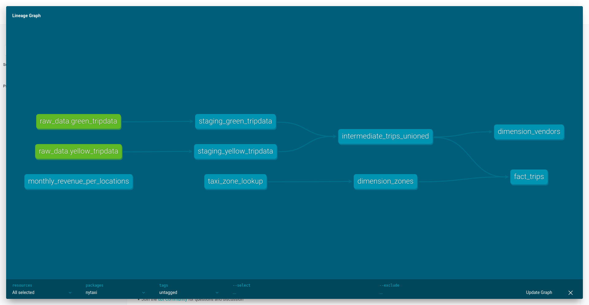

# Análisis de datos

## Documentación en **dbt**

* Vídeo original (en inglés): [Documentation](https://www.youtube.com/watch?v=UqoWyMjcqrA)

Hasta ahora, al crear nuestros modelos, nos hemos limitado a hacerlos funcionales. Sin embargo, en un proyecto real es más que recomendable documentar cada modelo en detalle.

### Documentación en archivos YAML

La primera manera de enriquecer nuestros modelos con documentación es hacer uso de la propiedad `description`, que ya usamos al crear nuestras fuentes aunque solo lo hicimos para darle una descripción general al conjunto de datos. Si usamos esta técnica, nuestro fichero [models/staging/sources.yml](pipeline/nytaxi/models/staging/sources.yml) pasará de nuestra versión mínima pero funcional:

```yaml
version: 2

sources:
  - name: raw_data
    description: "Registros sin procesar de los taxis de Nueva York"
    database: nytaxi # Nombre de la base de datos DuckDB
    schema: prod
    tables:
      - name: yellow_tripdata
      - name: green_tripdata
```

... a una versión más robusta y mucho mejor documentada.

```yaml
version: 2

sources:
  - name: raw_data
    description: "Registros sin procesar de los taxis de Nueva York"
    database: nytaxi # Nombre de la base de datos DuckDB
    schema: prod
    tables:
      - name: yellow_tripdata
        description: Registros brutos de viajes en taxi amarillo
        columns:
          - name: vendorid
            description: "Proveedor de tecnología de taxi (1: Creative Mobile Technologies, 2: VeriFone Inc.) - Nota: Los datos brutos pueden contener nulls, filtrados en staging"
          - name: tpep_pickup_datetime
            description: Fecha y hora en que el taxímetro fue activado
          - name: tpep_dropoff_datetime
            description: Fecha y hora en que el taxímetro fue desactivado
          - name: passenger_count
            description: Número de pasajeros en el vehículo
          - name: trip_distance
            description: Distancia del viaje en millas
          - name: pulocationid
            description: Zona TLC Taxi donde el taxímetro fue activado
          - name: dolocationid
            description: Zona TLC Taxi donde el taxímetro fue desactivado
          - name: ratecodeid
            description: "Código de tarifa (1: Standard, 2: JFK, 3: Newark, 4: Nassau/Westchester, 5: Negotiated, 6: Group)"
          - name: store_and_fwd_flag
            description: Registro del viaje almacenado en la memoria del vehículo (Y/N)
          - name: payment_type
            description: "Método de pago (1: Credit card, 2: Cash, 3: No charge, 4: Dispute, 5: Unknown, 6: Voided)"
          - name: fare_amount
            description: Tarifa por tiempo y distancia
          - name: extra
            description: Extras y recargos misceláneos
          - name: mta_tax
            description: Impuesto MTA
          - name: tip_amount
            description: Importe de la propina (solo tarjeta de crédito)
          - name: tolls_amount
            description: Total de peajes pagados
          - name: improvement_surcharge
            description: Recargo de mejora
          - name: total_amount
            description: Importe total cobrado
      - name: green_tripdata
        description: Registros brutos de viajes en taxi verde
        columns:
          - name: vendorid
            description: "Proveedor de tecnología de taxi (1: Creative Mobile Technologies, 2: VeriFone Inc.) - Nota: Los datos brutos pueden contener valores nulos que serán filtrados en `staging`"
          - name: lpep_pickup_datetime
            description: Fecha y hora en que el taxímetro fue activado
          - name: lpep_dropoff_datetime
            description: Fecha y hora en que el taxímetro fue desactivado
          - name: passenger_count
            description: Número de pasajeros en el vehículo
          - name: trip_distance
            description: Distancia del viaje en millas
          - name: pulocationid
            description: Zona TLC Taxi donde el taxímetro fue activado
          - name: dolocationid
            description: Zona TLC Taxi donde el taxímetro fue desactivado
          - name: ratecodeid
            description: "Código de tarifa (1: Standard, 2: JFK, 3: Newark, 4: Nassau/Westchester, 5: Negotiated, 6=Group)"
          - name: store_and_fwd_flag
            description: Registro del viaje almacenado en la memoria del vehículo (Y/N)
          - name: payment_type
            description: "Método de pago (1: Credit card, 2: Cash, 3: No charge, 4: Dispute, 5: Unknown, 6: Voided)"
          - name: fare_amount
            description: Tarifa por tiempo y distancia
          - name: extra
            description: Extras y recargos misceláneos
          - name: mta_tax
            description: Impuesto MTA
          - name: tip_amount
            description: Importe de la propina (solo tarjeta de crédito)
          - name: tolls_amount
            description: Total de peajes pagados
          - name: improvement_surcharge
            description: Recargo de mejora
          - name: total_amount
            description: Importe total cobrado
          - name: trip_type
            description: "Tipo de viaje (1: Street-hail, 2: Dispatch)"
          - name: ehail_fee
            description: Tarifa de E-hail
```

De forma similar, podemos documentar el resto de modelos:

- [models/staging/schema.yml](pipeline/nytaxi/models/staging/schema.yml)
- [models/intermediate/schema.yml](pipeline/nytaxi/models/intermediate/schema.yml)
- [models/marts/schema.yml](pipeline/nytaxi/models/marts/schema.yml)

### Generación de la documentación

**dbt** ofrece un comando que compila la documentación en un único fichero JSON que, en un paso posterior, puede ser utilizado para servir nuestra documentación en un formato web amigable con el usuario.

```bash
uv run dbt docs generate
```

```
10:24:31  Running with dbt=1.11.4
10:24:32  Registered adapter: duckdb=1.10.0
10:24:36  Found 7 models, 1 seed, 17 data tests, 2 sources, 473 macros
10:24:36  
10:24:36  Concurrency: 1 threads (target='dev')
10:24:36  
10:24:37  Building catalog
10:24:37  Catalog written to /home/carlos/Programming/Courses/data-engineering-zoomcamp/04-analisis-de-datos/pipeline/nytaxi/target/catalog.json
```

### Publicación en formato web

Una vez generado el JSON con la documentación, podemos servirla en formato web con:

```bash
uv run dbt docs serve

# También podemos especificar un puerto alternativo, si 8080 está en uso
uv run dbt docs serve --port 8081
```


