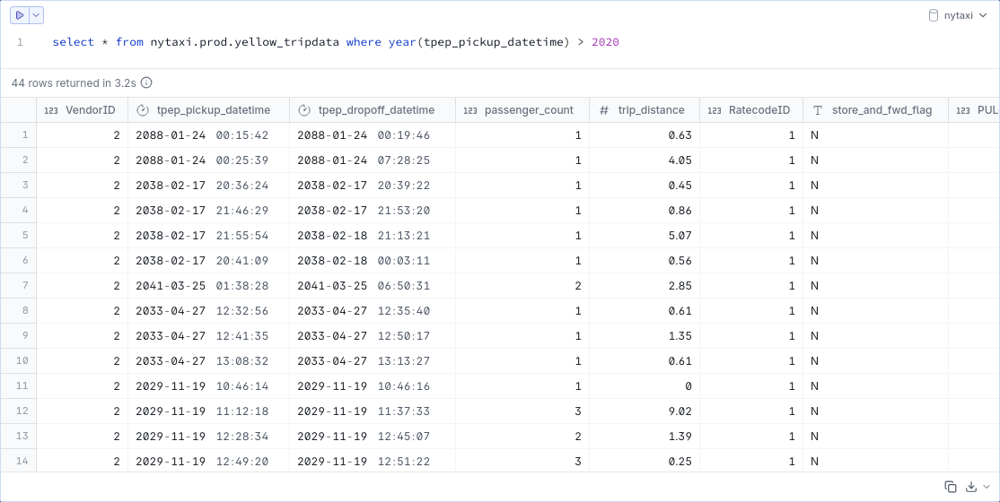

# Análisis de datos

## Comandos **dbt**

* Vídeo original (en inglés): [dbt Commands](https://www.youtube.com/watch?v=t4OeWHW3SsA)

Desde la primera sesión del módulo de análisis de datos con **dbt**, hemos ido viendo varios comandos diferentes. En este capítulo, vamos a tratar de dar un repaso a los más importantes y a profundizar un poco en ellos.

### `dbt init`

El comando `dbt init` sirve para inicializar un proyecto **dbt** y solo necesitas usarlo una vez por proyecto. El comando se encarga de crear por nosotros la estructura básica de carpetas y archivos.

```bash
uv run dbt init
```

### `dbt debug`

El comando `dbt debug` comprueba que el proyecto está correctamente inicializado y chequea las conexiones a las bases de datos configuradas.

```bash
uv run dbt debug
```

```bash
12:44:19  Running with dbt=1.11.4
12:44:19  dbt version: 1.11.4
12:44:19  python version: 3.13.7
12:44:19  python path: /pipeline/.venv/bin/python3
12:44:19  os info: Linux-6.17.0-14-generic-x86_64-with-glibc2.42
12:44:20  Using profiles dir at ~/.dbt
12:44:20  Using profiles.yml file at ~/.dbt/profiles.yml
12:44:20  Using dbt_project.yml file at /pipeline/nytaxi/dbt_project.yml
12:44:20  adapter type: duckdb
12:44:20  adapter version: 1.10.0
12:44:20  Configuration:
12:44:20    profiles.yml file [OK found and valid]
12:44:20    dbt_project.yml file [OK found and valid]
12:44:20  Required dependencies:
12:44:20   - git [OK found]

12:44:20  Connection:
12:44:20    database: nytaxi
12:44:20    schema: dev
12:44:20    path: nytaxi.duckdb
12:44:20    config_options: None
12:44:20    extensions: ['parquet']
12:44:20    settings: {'memory_limit': '4GB', 'preserve_insertion_order': False}
12:44:20    external_root: .
12:44:20    use_credential_provider: None
12:44:20    attach: None
12:44:20    filesystems: None
12:44:20    remote: None
12:44:20    plugins: None
12:44:20    disable_transactions: False
12:44:20  Registered adapter: duckdb=1.10.0
12:44:21    Connection test: [OK connection ok]

12:44:21  All checks passed!
```

### `dbt seed`

El comando `dbt seed` inserta la información de los datos de nuestra carpeta [seeds](pipeline/nytaxi/seeds/) en la base de datos. En nuestro caso, el fichero CSV de zonas.

```bash
uv run dbt seed
```

```bash
12:48:18  Running with dbt=1.11.4
12:48:20  Registered adapter: duckdb=1.10.0
12:48:21  Found 7 models, 1 seed, 17 data tests, 2 sources, 616 macros
12:48:21  
12:48:21  Concurrency: 1 threads (target='dev')
12:48:21  
12:48:22  1 of 1 START seed file dev.taxi_zone_lookup .................................... [RUN]
12:48:22  1 of 1 OK loaded seed file dev.taxi_zone_lookup ................................ [INSERT 265 in 0.28s]
12:48:22  
12:48:22  Finished running 1 seed in 0 hours 0 minutes and 0.87 seconds (0.87s).
12:48:22  
12:48:22  Completed successfully
12:48:22  
12:48:22  Done. PASS=1 WARN=0 ERROR=0 SKIP=0 NO-OP=0 TOTAL=1
```

### `dbt snapshot`

El comando `dbt snapshot` sirve para capturar y conservar el histórico de cambios de una tabla o más tablas a lo largo del tiempo, incluso cuando el sistema fuente sobrescribe los datos en lugar de mantener versiones.

En nuestro proyecto no hemos configurado nuestros modelos para que soporten snapshots, por lo que lanzar el comando no tendrá ningún efecto.

```bash
uv run dbt snapshot
```

```bash
12:52:38  Running with dbt=1.11.4
12:52:39  Registered adapter: duckdb=1.10.0
12:52:41  Found 7 models, 1 seed, 17 data tests, 2 sources, 616 macros
12:52:41  Nothing to do. Try checking your model configs and model specification args
```

### `dbt source freshness`

El comando `dbt source freshness` lanza las comprobaciones de frescura de datos de nuestras fuentes.

```bash
uv run dbt source freshness
```

```bash
12:56:21  Running with dbt=1.11.4
12:56:22  Registered adapter: duckdb=1.10.0
12:56:26  Found 7 models, 1 seed, 17 data tests, 2 sources, 616 macros
12:56:26  
12:56:26  Concurrency: 1 threads (target='dev')
12:56:26  
12:56:27  1 of 2 START freshness of raw_data.green_tripdata .............................. [RUN]
12:56:27  1 of 2 PASS freshness of raw_data.green_tripdata ............................... [PASS in 0.13s]
12:56:27  2 of 2 START freshness of raw_data.yellow_tripdata ............................. [RUN]
12:56:28  2 of 2 PASS freshness of raw_data.yellow_tripdata .............................. [PASS in 0.87s]
12:56:28  
12:56:28  Finished running 2 sources in 0 hours 0 minutes and 1.35 seconds (1.35s).
12:56:28  Done.
```

> [!NOTE]
> Aquí hay que hacer una pequeña puntualización. Los modelos de los que estamos auditando frescura son de las fuentes de datos sin modificar. Y la configuración que estamos exigiendo es que tengan trayectos de las últimas 48 horas por lo que deberían de fallar. Después de todo, solo hemos importado datos de los años 2019 y 2020. La explicación a esto está en que los datos contienen registros mal etiquetados con fechas futuras, como muestra la captura de pantalla.



### `dbt docs generate`

El comando `dbt docs generate` compila la documentación de nuestro proyecto en un fichero JSON.

```bash
uv run dbt docs generate
```

```bash
13:12:12  Running with dbt=1.11.4
13:12:13  Registered adapter: duckdb=1.10.0
13:12:14  Found 7 models, 1 seed, 17 data tests, 2 sources, 616 macros
13:12:14  
13:12:14  Concurrency: 1 threads (target='dev')
13:12:14  
13:12:16  Building catalog
13:12:16  Catalog written to /pipeline/nytaxi/target/catalog.json
```

### `dbt docs serve`

El comando `dbt docs serve` sirve en formato HTML la documentación generada.

```bash
uv run dbt docs serve [--port 8081]
```

### `dbt clean`

El comando `dbt clean` vacía los directorios que tengamos configurados como **clean-targets** en nuestro [dbt_project.yml](pipeline/nytaxi/dbt_project.yml).

```yaml
clean-targets:         # directories to be removed by `dbt clean`
  - "target"
  - "dbt_packages"
```

```bash
uv run dbt clean
```

```bash
13:15:35  Running with dbt=1.11.4
13:15:35  Checking /pipeline/nytaxi/dbt_packages/*
13:15:35  Cleaned /pipeline/nytaxi/dbt_packages/*
13:15:35  Checking /pipeline/nytaxi/target/*
13:15:35  Cleaned /pipeline/nytaxi/target/*
13:15:35  Finished cleaning all paths.
```

### `dbt deps`

El comando `dbt deps` instala los paquetes configurados en [packages.yml](pipeline/nytaxi/packages.yml).

```bash
uv run dbt deps
```

```bash
13:18:29  Running with dbt=1.11.4
13:18:30  Installing dbt-labs/dbt_utils
13:18:31  Installed from version 1.3.3
13:18:31  Up to date!
13:18:31  Installing dbt-labs/codegen
13:18:31  Installed from version 0.14.0
13:18:31  Up to date
```

### `dbt compile`

El comando `dbt compile` genera una versión de nuestras consultas en el directorio **target/compiled** que contiene la versión final de nuestras consultas tal y como es usada contra las bases de datos y en la que las plantilas Jinja han sido ya aplicadas.

```sql
/* Plantilla sin compilar */
SELECT *
FROM {{ source('raw_data', 'yellow_tripdata') }}

/* Plantilla compilada */
SELECT *
FROM "nytaxi"."prod"."yellow_tripdata"
```

```bash
uv run dbt compile
```

```bash
13:19:19  Running with dbt=1.11.4
13:19:21  Registered adapter: duckdb=1.10.0
13:19:21  Unable to do partial parsing because saved manifest not found. Starting full parse.
13:19:29  Found 7 models, 1 seed, 17 data tests, 2 sources, 616 macros
13:19:29  
13:19:29  Concurrency: 1 threads (target='dev')
13:19:29 
```

### `dbt run`

El comando `dbt run` procesa y materializa cada uno de los modelos de nuestro proyecto.

```bash
uv run dbt run
```

```bash
13:41:15  Running with dbt=1.11.4
13:41:16  Registered adapter: duckdb=1.10.0
13:41:20  Found 7 models, 2 seeds, 15 data tests, 2 sources, 617 macros
13:41:20  
13:41:20  Concurrency: 1 threads (target='dev')
13:41:20  
13:41:20  1 of 6 START sql view model dev.dimension_zones ................................ [RUN]
13:41:21  1 of 6 OK created sql view model dev.dimension_zones ........................... [OK in 0.30s]
13:41:21  2 of 6 START sql view model dev.staging_green_tripdata ......................... [RUN]
13:41:21  2 of 6 OK created sql view model dev.staging_green_tripdata .................... [OK in 0.11s]
13:41:21  3 of 6 START sql view model dev.staging_yellow_tripdata ........................ [RUN]
13:41:21  3 of 6 OK created sql view model dev.staging_yellow_tripdata ................... [OK in 0.11s]
13:41:21  4 of 6 START sql view model dev.intermediate_trips_unioned ..................... [RUN]
13:41:21  4 of 6 OK created sql view model dev.intermediate_trips_unioned ................ [OK in 0.11s]
13:41:21  5 of 6 START sql view model dev.dimension_vendors .............................. [RUN]
13:41:21  5 of 6 OK created sql view model dev.dimension_vendors ......................... [OK in 0.11s]
13:41:21  6 of 6 START sql view model dev.fact_trips ..................................... [RUN]
13:41:21  6 of 6 OK created sql view model dev.fact_trips ................................ [OK in 0.30s]
13:41:22  
13:41:22  Finished running 6 view models in 0 hours 0 minutes and 1.54 seconds (1.54s).
13:41:22  
13:41:22  Completed successfully
13:41:22  
13:41:22  Done. PASS=6 WARN=0 ERROR=0 SKIP=0 NO-OP=0 TOTAL=6
```

### `dbt test`

El comando `dbt test` comprueba todos los tests de nuestro proyecto, ya sean unitarios, genéricos, singulares, etc.

```bash
uv run dbt test
```

```bash
13:42:54  Running with dbt=1.11.4
13:42:55  Registered adapter: duckdb=1.10.0
13:42:57  Found 7 models, 2 seeds, 15 data tests, 2 sources, 617 macros
13:42:57  
13:42:57  Concurrency: 1 threads (target='dev')
13:42:57  
13:42:58  1 of 15 START test accepted_values_fact_trips_service_type__Green__Yellow ...... [RUN]
13:42:58  1 of 15 PASS accepted_values_fact_trips_service_type__Green__Yellow ............ [PASS in 0.23s]
13:42:58  2 of 15 START test not_null_dimension_vendors_vendor_id ........................ [RUN]
13:42:59  2 of 15 PASS not_null_dimension_vendors_vendor_id .............................. [PASS in 1.16s]
13:42:59  3 of 15 START test not_null_dimension_zones_location_id ........................ [RUN]
13:42:59  3 of 15 PASS not_null_dimension_zones_location_id .............................. [PASS in 0.06s]
13:42:59  4 of 15 START test not_null_fact_trips_pickup_datetime ......................... [RUN]
13:42:59  4 of 15 PASS not_null_fact_trips_pickup_datetime ............................... [PASS in 0.07s]
13:42:59  5 of 15 START test not_null_fact_trips_service_type ............................ [RUN]
13:42:59  5 of 15 PASS not_null_fact_trips_service_type .................................. [PASS in 0.06s]
13:42:59  6 of 15 START test not_null_fact_trips_total_amount ............................ [RUN]
13:42:59  6 of 15 PASS not_null_fact_trips_total_amount .................................. [PASS in 0.08s]
13:42:59  7 of 15 START test not_null_fact_trips_vendor_id ............................... [RUN]
13:43:01  7 of 15 PASS not_null_fact_trips_vendor_id ..................................... [PASS in 1.40s]
13:43:01  8 of 15 START test not_null_staging_green_tripdata_pickup_datetime ............. [RUN]
13:43:01  8 of 15 PASS not_null_staging_green_tripdata_pickup_datetime ................... [PASS in 0.06s]
13:43:01  9 of 15 START test not_null_staging_green_tripdata_vendor_id ................... [RUN]
13:43:01  9 of 15 PASS not_null_staging_green_tripdata_vendor_id ......................... [PASS in 0.10s]
13:43:01  10 of 15 START test not_null_staging_yellow_tripdata_pickup_datetime ........... [RUN]
13:43:01  10 of 15 PASS not_null_staging_yellow_tripdata_pickup_datetime ................. [PASS in 0.06s]
13:43:01  11 of 15 START test not_null_staging_yellow_tripdata_vendor_id ................. [RUN]
13:43:02  11 of 15 PASS not_null_staging_yellow_tripdata_vendor_id ....................... [PASS in 0.46s]
13:43:02  12 of 15 START test relationships_fact_trips_dropoff_location_id__location_id__ref_dimension_zones_  [RUN]
13:43:06  12 of 15 PASS relationships_fact_trips_dropoff_location_id__location_id__ref_dimension_zones_  [PASS in 4.22s]
13:43:06  13 of 15 START test relationships_fact_trips_pickup_location_id__location_id__ref_dimension_zones_  [RUN]
13:43:10  13 of 15 PASS relationships_fact_trips_pickup_location_id__location_id__ref_dimension_zones_  [PASS in 4.10s]
13:43:10  14 of 15 START test unique_dimension_vendors_vendor_id ......................... [RUN]
13:43:13  14 of 15 PASS unique_dimension_vendors_vendor_id ............................... [PASS in 3.28s]
13:43:13  15 of 15 START test unique_dimension_zones_location_id ......................... [RUN]
13:43:13  15 of 15 PASS unique_dimension_zones_location_id ............................... [PASS in 0.06s]
13:43:13  
13:43:13  Finished running 15 data tests in 0 hours 0 minutes and 15.89 seconds (15.89s).
13:43:14  
13:43:14  Completed successfully
13:43:14  
13:43:14  Done. PASS=15 WARN=0 ERROR=0 SKIP=0 NO-OP=0 TOTAL=15
```

### `dbt build`

El comando `dbt build` es una combinación de `run`, `test`, `seed`, `snapshot` que además compila las funciones de usuario (UDFs).

```bash
uv run dbt build
```

```bash
13:44:22  Running with dbt=1.11.4
13:44:24  Registered adapter: duckdb=1.10.0
13:44:25  Found 7 models, 2 seeds, 15 data tests, 2 sources, 617 macros
13:44:25  
13:44:25  Concurrency: 1 threads (target='dev')
13:44:25  
13:44:26  1 of 23 START sql view model dev.staging_green_tripdata ........................ [RUN]
13:44:26  1 of 23 OK created sql view model dev.staging_green_tripdata ................... [OK in 0.30s]
13:44:26  2 of 23 START sql view model dev.staging_yellow_tripdata ....................... [RUN]
13:44:26  2 of 23 OK created sql view model dev.staging_yellow_tripdata .................. [OK in 0.13s]
13:44:26  3 of 23 START seed file dev.payment_type_lookup ................................ [RUN]
13:44:26  3 of 23 OK loaded seed file dev.payment_type_lookup ............................ [INSERT 7 in 0.21s]
13:44:26  4 of 23 START seed file dev.taxi_zone_lookup ................................... [RUN]
13:44:27  4 of 23 OK loaded seed file dev.taxi_zone_lookup ............................... [INSERT 265 in 0.10s]
13:44:27  5 of 23 START test not_null_staging_green_tripdata_pickup_datetime ............. [RUN]
13:44:27  5 of 23 PASS not_null_staging_green_tripdata_pickup_datetime ................... [PASS in 0.16s]
13:44:27  6 of 23 START test not_null_staging_green_tripdata_vendor_id ................... [RUN]
13:44:27  6 of 23 PASS not_null_staging_green_tripdata_vendor_id ......................... [PASS in 0.11s]
13:44:27  7 of 23 START test not_null_staging_yellow_tripdata_pickup_datetime ............ [RUN]
13:44:27  7 of 23 PASS not_null_staging_yellow_tripdata_pickup_datetime .................. [PASS in 0.06s]
13:44:27  8 of 23 START test not_null_staging_yellow_tripdata_vendor_id .................. [RUN]
13:44:28  8 of 23 PASS not_null_staging_yellow_tripdata_vendor_id ........................ [PASS in 1.03s]
13:44:28  9 of 23 START sql view model dev.dimension_zones ............................... [RUN]
13:44:28  9 of 23 OK created sql view model dev.dimension_zones .......................... [OK in 0.12s]
13:44:28  10 of 23 START sql view model dev.intermediate_trips_unioned ................... [RUN]
13:44:28  10 of 23 OK created sql view model dev.intermediate_trips_unioned .............. [OK in 0.12s]
13:44:28  11 of 23 START test not_null_dimension_zones_location_id ....................... [RUN]
13:44:28  11 of 23 PASS not_null_dimension_zones_location_id ............................. [PASS in 0.07s]
13:44:28  12 of 23 START test unique_dimension_zones_location_id ......................... [RUN]
13:44:28  12 of 23 PASS unique_dimension_zones_location_id ............................... [PASS in 0.07s]
13:44:28  13 of 23 START sql view model dev.dimension_vendors ............................ [RUN]
13:44:29  13 of 23 OK created sql view model dev.dimension_vendors ....................... [OK in 0.12s]
13:44:29  14 of 23 START sql view model dev.fact_trips ................................... [RUN]
13:44:29  14 of 23 OK created sql view model dev.fact_trips .............................. [OK in 0.32s]
13:44:29  15 of 23 START test not_null_dimension_vendors_vendor_id ....................... [RUN]
13:44:30  15 of 23 PASS not_null_dimension_vendors_vendor_id ............................. [PASS in 0.82s]
13:44:30  16 of 23 START test unique_dimension_vendors_vendor_id ......................... [RUN]
13:44:33  16 of 23 PASS unique_dimension_vendors_vendor_id ............................... [PASS in 3.42s]
13:44:33  17 of 23 START test accepted_values_fact_trips_service_type__Green__Yellow ..... [RUN]
13:44:33  17 of 23 PASS accepted_values_fact_trips_service_type__Green__Yellow ........... [PASS in 0.09s]
13:44:33  18 of 23 START test not_null_fact_trips_pickup_datetime ........................ [RUN]
13:44:33  18 of 23 PASS not_null_fact_trips_pickup_datetime .............................. [PASS in 0.07s]
13:44:33  19 of 23 START test not_null_fact_trips_service_type ........................... [RUN]
13:44:33  19 of 23 PASS not_null_fact_trips_service_type ................................. [PASS in 0.08s]
13:44:33  20 of 23 START test not_null_fact_trips_total_amount ........................... [RUN]
13:44:33  20 of 23 PASS not_null_fact_trips_total_amount ................................. [PASS in 0.07s]
13:44:33  21 of 23 START test not_null_fact_trips_vendor_id .............................. [RUN]
13:44:35  21 of 23 PASS not_null_fact_trips_vendor_id .................................... [PASS in 1.23s]
13:44:35  22 of 23 START test relationships_fact_trips_dropoff_location_id__location_id__ref_dimension_zones_  [RUN]
13:44:40  22 of 23 PASS relationships_fact_trips_dropoff_location_id__location_id__ref_dimension_zones_  [PASS in 5.42s]
13:44:40  23 of 23 START test relationships_fact_trips_pickup_location_id__location_id__ref_dimension_zones_  [RUN]
13:44:46  23 of 23 PASS relationships_fact_trips_pickup_location_id__location_id__ref_dimension_zones_  [PASS in 5.38s]
13:44:46  
13:44:46  Finished running 2 seeds, 15 data tests, 6 view models in 0 hours 0 minutes and 20.17 seconds (20.17s).
13:44:46  
13:44:46  Completed successfully
13:44:46  
13:44:46  Done. PASS=23 WARN=0 ERROR=0 SKIP=0 NO-OP=0 TOTAL=23
```

### `dbt retry`

El comando `dbt retry` continúa una ejecución fallida de `dbt build` a partir del momento en que falló. En nuestro caso, como la ejecución se completó con éxito, nos dirá que no hay nada que hacer.

```bash
uv run dbt retry
```

```bash
13:49:11  Running with dbt=1.11.4
13:49:13  Registered adapter: duckdb=1.10.0
13:49:14  Found 7 models, 2 seeds, 15 data tests, 2 sources, 617 macros
13:49:14  Nothing to do. Try checking your model configs and model specification args
```

## Argumentos

Además de esta visión general de los comandos más importantes de **dbt**, conviene conocer algunos de los argumentos que soportan.

### `dbt --help`

Con el argumento `--help`, el comando `dbt` muestra la lista completa de comandos soportados.

```bash
uv run dbt --help
```

```bash
Usage: dbt [OPTIONS] COMMAND [ARGS]...

  An ELT tool for managing your SQL transformations and data models. For more
  documentation on these commands, visit: docs.getdbt.com

# ...

Commands:
  build          Run all seeds, models, snapshots, and tests in DAG order
  clean          Delete all folders in the clean-targets list (usually...
  clone          Create clones of selected nodes based on their location...
  compile        Generates executable SQL from source, model, test, and...
  debug          Show information on the current dbt environment and...
  deps           Install dbt packages specified.
  docs           Generate or serve the documentation website for your...
  init           Initialize a new dbt project.
  list           List the resources in your project
  parse          Parses the project and provides information on performance
  retry          Retry the nodes that failed in the previous run.
  run            Compile SQL and execute against the current target...
  run-operation  Run the named macro with any supplied arguments.
  seed           Load data from csv files into your data warehouse.
  show           Generates executable SQL for a named resource or inline...
  snapshot       Execute snapshots defined in your project
  source         Manage your project's sources
  test           Runs tests on data in deployed models.

  Specify one of these sub-commands and you can find more help from there.
```

### `dbt --version`

Con el argumento `--version`, el comando `dbt` muestra la versión de **dbt** que se está usando en el proyecto. Además de avisarnos de si hay actualizaciones disponibles.

```bash
uv run dbt --version
```

```bash
Core:
  - installed: 1.11.4
  - latest:    1.11.5 - Update available!

  Your version of dbt-core is out of date!
  You can find instructions for upgrading here:
  https://docs.getdbt.com/docs/installation

Plugins:
  - duckdb: 1.10.0 - Up to date!
```

### `dbt run --full-refresh`

Con el argumento `--full-refresh` el comando `dbt run` elimina los modelos incrementales y los materializa desde cero, en lugar de limitarse a añadir registros nuevos.

```bash
uv run dbt run --full-refresh
```

```bash
13:56:41  Running with dbt=1.11.4
13:56:42  Registered adapter: duckdb=1.10.0
13:56:44  Found 7 models, 2 seeds, 15 data tests, 2 sources, 617 macros
13:56:44  
13:56:44  Concurrency: 1 threads (target='dev')
13:56:44  
13:56:45  1 of 6 START sql view model dev.dimension_zones ................................ [RUN]
13:56:45  1 of 6 OK created sql view model dev.dimension_zones ........................... [OK in 0.30s]
13:56:45  2 of 6 START sql view model dev.staging_green_tripdata ......................... [RUN]
13:56:45  2 of 6 OK created sql view model dev.staging_green_tripdata .................... [OK in 0.11s]
13:56:45  3 of 6 START sql view model dev.staging_yellow_tripdata ........................ [RUN]
13:56:45  3 of 6 OK created sql view model dev.staging_yellow_tripdata ................... [OK in 0.11s]
13:56:45  4 of 6 START sql view model dev.intermediate_trips_unioned ..................... [RUN]
13:56:45  4 of 6 OK created sql view model dev.intermediate_trips_unioned ................ [OK in 0.12s]
13:56:45  5 of 6 START sql view model dev.dimension_vendors .............................. [RUN]
13:56:45  5 of 6 OK created sql view model dev.dimension_vendors ......................... [OK in 0.11s]
13:56:45  6 of 6 START sql view model dev.fact_trips ..................................... [RUN]
13:56:46  6 of 6 OK created sql view model dev.fact_trips ................................ [OK in 0.31s]
13:56:46  
13:56:46  Finished running 6 view models in 0 hours 0 minutes and 1.60 seconds (1.60s).
13:56:46  
13:56:46  Completed successfully
13:56:46  
13:56:46  Done. PASS=6 WARN=0 ERROR=0 SKIP=0 NO-OP=0 TOTAL=6
```

### `dbt run --fail-fast`

Con el argumento `--fail-fast` el comando `dbt run` se detiene en cuanto encuentra alguna incidencia. Además, se ejeecuta en un modo más estricto, considerando las advertencias como errores.

```bash
uv run dbt run --fail-fast
```

```bash
13:58:52  Running with dbt=1.11.4
13:58:53  Registered adapter: duckdb=1.10.0
13:58:55  Found 7 models, 2 seeds, 15 data tests, 2 sources, 617 macros
13:58:55  
13:58:55  Concurrency: 1 threads (target='dev')
13:58:55  
13:58:55  1 of 6 START sql view model dev.dimension_zones ................................ [RUN]
13:58:55  1 of 6 OK created sql view model dev.dimension_zones ........................... [OK in 0.31s]
13:58:55  2 of 6 START sql view model dev.staging_green_tripdata ......................... [RUN]
13:58:56  2 of 6 OK created sql view model dev.staging_green_tripdata .................... [OK in 0.11s]
13:58:56  3 of 6 START sql view model dev.staging_yellow_tripdata ........................ [RUN]
13:58:56  3 of 6 OK created sql view model dev.staging_yellow_tripdata ................... [OK in 0.11s]
13:58:56  4 of 6 START sql view model dev.intermediate_trips_unioned ..................... [RUN]
13:58:56  4 of 6 OK created sql view model dev.intermediate_trips_unioned ................ [OK in 0.13s]
13:58:56  5 of 6 START sql view model dev.dimension_vendors .............................. [RUN]
13:58:56  5 of 6 OK created sql view model dev.dimension_vendors ......................... [OK in 0.12s]
13:58:56  6 of 6 START sql view model dev.fact_trips ..................................... [RUN]
13:58:56  6 of 6 OK created sql view model dev.fact_trips ................................ [OK in 0.32s]
13:58:56  
13:58:56  Finished running 6 view models in 0 hours 0 minutes and 1.64 seconds (1.64s).
13:58:56  
13:58:56  Completed successfully
13:58:56  
13:58:56  Done. PASS=6 WARN=0 ERROR=0 SKIP=0 NO-OP=0 TOTAL=6
```

### `dbt run --target TARGET`

Con el argumento `--target` el comando `dbt run` se ejecuta con un objetivo diferente al comando por defecto.

```bash
uv run dbt seed --target prod
uv run dbt run --target prod
```

```bash
14:03:01  Running with dbt=1.11.4
14:03:03  Registered adapter: duckdb=1.10.0
14:03:04  Found 7 models, 2 seeds, 15 data tests, 2 sources, 617 macros
14:03:04  
14:03:04  Concurrency: 1 threads (target='prod')
14:03:04  
14:03:05  1 of 2 START seed file prod.payment_type_lookup ................................ [RUN]
14:03:05  1 of 2 OK loaded seed file prod.payment_type_lookup ............................ [INSERT 7 in 0.27s]
14:03:05  2 of 2 START seed file prod.taxi_zone_lookup ................................... [RUN]
14:03:05  2 of 2 OK loaded seed file prod.taxi_zone_lookup ............................... [INSERT 265 in 0.08s]
14:03:05  
14:03:05  Finished running 2 seeds in 0 hours 0 minutes and 0.93 seconds (0.93s).
14:03:05  
14:03:05  Completed successfully
14:03:05  
14:03:05  Done. PASS=2 WARN=0 ERROR=0 SKIP=0 NO-OP=0 TOTAL=2
14:03:16  Running with dbt=1.11.4
14:03:17  Registered adapter: duckdb=1.10.0
14:03:19  Found 7 models, 2 seeds, 15 data tests, 2 sources, 617 macros
14:03:19  
14:03:19  Concurrency: 1 threads (target='prod')
14:03:19  
14:03:19  1 of 6 START sql view model prod.dimension_zones ............................... [RUN]
14:03:20  1 of 6 OK created sql view model prod.dimension_zones .......................... [OK in 0.31s]
14:03:20  2 of 6 START sql view model prod.staging_green_tripdata ........................ [RUN]
14:03:20  2 of 6 OK created sql view model prod.staging_green_tripdata ................... [OK in 0.13s]
14:03:20  3 of 6 START sql view model prod.staging_yellow_tripdata ....................... [RUN]
14:03:20  3 of 6 OK created sql view model prod.staging_yellow_tripdata .................. [OK in 0.11s]
14:03:20  4 of 6 START sql view model prod.intermediate_trips_unioned .................... [RUN]
14:03:20  4 of 6 OK created sql view model prod.intermediate_trips_unioned ............... [OK in 0.11s]
14:03:20  5 of 6 START sql view model prod.dimension_vendors ............................. [RUN]
14:03:20  5 of 6 OK created sql view model prod.dimension_vendors ........................ [OK in 0.10s]
14:03:20  6 of 6 START sql view model prod.fact_trips .................................... [RUN]
14:03:20  6 of 6 OK created sql view model prod.fact_trips ............................... [OK in 0.30s]
14:03:20  
14:03:20  Finished running 6 view models in 0 hours 0 minutes and 1.68 seconds (1.68s).
14:03:21  
14:03:21  Completed successfully
14:03:21  
14:03:21  Done. PASS=6 WARN=0 ERROR=0 SKIP=0 NO-OP=0 TOTAL=6
```

### `dbt run --select MODEL`

Con el modificador `--select` el comando `dbt run` se limitará al modelo especificado.

```bash
uv run dbt run --select staging_green_tripdata
```

```bash
14:06:13  Running with dbt=1.11.4
14:06:14  Registered adapter: duckdb=1.10.0
14:06:15  Unable to do partial parsing because config vars, config profile, or config target have changed
14:06:15  Unable to do partial parsing because profile has changed
14:06:23  Found 7 models, 2 seeds, 15 data tests, 2 sources, 617 macros
14:06:23  
14:06:23  Concurrency: 1 threads (target='dev')
14:06:23  
14:06:24  1 of 1 START sql view model dev.staging_green_tripdata ......................... [RUN]
14:06:24  1 of 1 OK created sql view model dev.staging_green_tripdata .................... [OK in 0.30s]
14:06:24  
14:06:24  Finished running 1 view model in 0 hours 0 minutes and 0.80 seconds (0.80s).
14:06:24  
14:06:24  Completed successfully
14:06:24  
14:06:24  Done. PASS=1 WARN=0 ERROR=0 SKIP=0 NO-OP=0 TOTAL=1
```

Si el modelo que especificamos tiene dependencias, podemos añadir como prefijo un símbolo `+`, de forma que se procesarán tanto el modelo especificado como sus dependencias.

```bash
uv run dbt run --select +intermediate_trips_unioned
```

```bash
14:08:25  Running with dbt=1.11.4
14:08:26  Registered adapter: duckdb=1.10.0
14:08:27  Found 7 models, 2 seeds, 15 data tests, 2 sources, 617 macros
14:08:27  
14:08:27  Concurrency: 1 threads (target='dev')
14:08:27  
14:08:28  1 of 3 START sql view model dev.staging_green_tripdata ......................... [RUN]
14:08:28  1 of 3 OK created sql view model dev.staging_green_tripdata .................... [OK in 0.30s]
14:08:28  2 of 3 START sql view model dev.staging_yellow_tripdata ........................ [RUN]
14:08:28  2 of 3 OK created sql view model dev.staging_yellow_tripdata ................... [OK in 0.11s]
14:08:28  3 of 3 START sql view model dev.intermediate_trips_unioned ..................... [RUN]
14:08:28  3 of 3 OK created sql view model dev.intermediate_trips_unioned ................ [OK in 0.11s]
14:08:28  
14:08:28  Finished running 3 view models in 0 hours 0 minutes and 1.13 seconds (1.13s).
14:08:29  
14:08:29  Completed successfully
14:08:29  
14:08:29  Done. PASS=3 WARN=0 ERROR=0 SKIP=0 NO-OP=0 TOTAL=3
```

Además, si hay otros modelos que dependan del que estamos especificando, podemos añadir el símbolo `+` como sufijo, de forma que se procesarán tanto el modelo especificado como aquellos otros modelos que dependan de él.

```bash
uv run dbt run --select intermediate_trips_unioned+
```

```bash
14:10:22  Running with dbt=1.11.4
14:10:23  Registered adapter: duckdb=1.10.0
14:10:25  Found 7 models, 2 seeds, 15 data tests, 2 sources, 617 macros
14:10:25  
14:10:25  Concurrency: 1 threads (target='dev')
14:10:25  
14:10:25  1 of 3 START sql view model dev.intermediate_trips_unioned ..................... [RUN]
14:10:26  1 of 3 OK created sql view model dev.intermediate_trips_unioned ................ [OK in 0.31s]
14:10:26  2 of 3 START sql view model dev.dimension_vendors .............................. [RUN]
14:10:26  2 of 3 OK created sql view model dev.dimension_vendors ......................... [OK in 0.12s]
14:10:26  3 of 3 START sql view model dev.fact_trips ..................................... [RUN]
14:10:26  3 of 3 OK created sql view model dev.fact_trips ................................ [OK in 0.32s]
14:10:26  
14:10:26  Finished running 3 view models in 0 hours 0 minutes and 1.36 seconds (1.36s).
14:10:26  
14:10:26  Completed successfully
14:10:26  
14:10:26  Done. PASS=3 WARN=0 ERROR=0 SKIP=0 NO-OP=0 TOTAL=3
```
