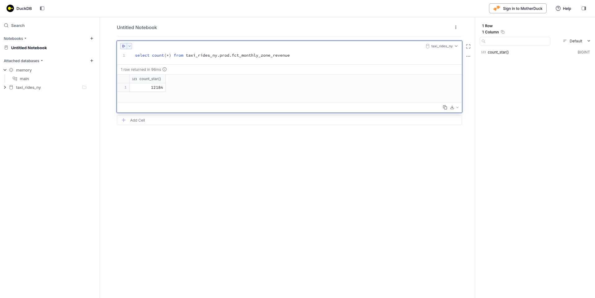
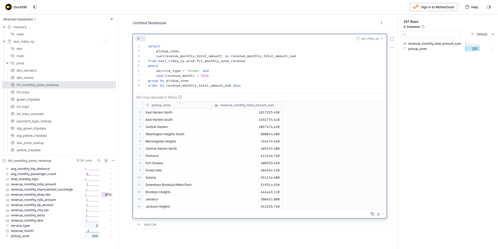
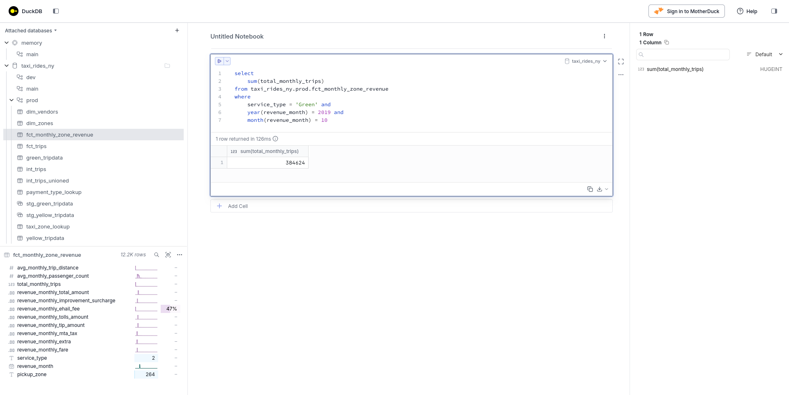
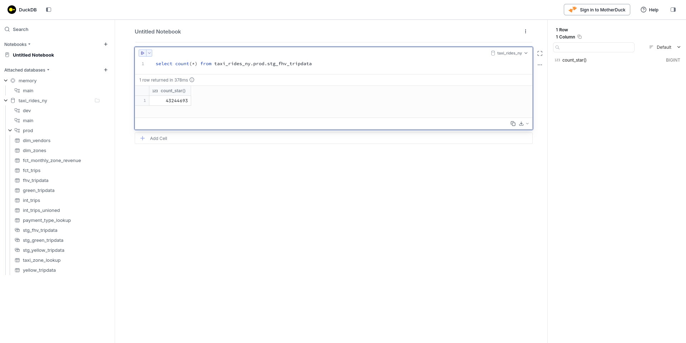

# Module 4 Homework: Analytics Engineering with dbt

### Question 1. dbt Lineage and Execution

> Given a dbt project with the following structure:

```
models/
├── staging/
│   ├── stg_green_tripdata.sql
│   └── stg_yellow_tripdata.sql
└── intermediate/
    └── int_trips_unioned.sql (depends on stg_green_tripdata & stg_yellow_tripdata)
```

> If you run `dbt run --select int_trips_unioned`, what models will be built?

If the command is executed as explained, only the `int_trips_unioned` model will be built.
Prefixing a `+` symbol would also build its dependencies.

```bash
uv run dbt run --select int_trips_unioned --target prod
```

```bash
15:45:36  Running with dbt=1.11.5
15:45:38  Registered adapter: duckdb=1.10.0
15:45:38  Unable to do partial parsing because config vars, config profile, or config target have changed
15:45:38  Unable to do partial parsing because profile has changed
15:45:48  Found 8 models, 2 seeds, 33 data tests, 2 sources, 618 macros
15:45:48  
15:45:48  Concurrency: 1 threads (target='prod')
15:45:48  
15:45:48  1 of 1 START sql table model prod.int_trips_unioned ............................ [RUN]
15:47:02  1 of 1 OK created sql table model prod.int_trips_unioned ....................... [OK in 74.32s]
15:47:03  
15:47:03  Finished running 1 table model in 0 hours 1 minutes and 14.89 seconds (74.89s).
15:47:03  
15:47:03  Completed successfully
15:47:03  
15:47:03  Done. PASS=1 WARN=0 ERROR=0 SKIP=0 NO-OP=0 TOTAL=1
```

- **`int_trips_unioned` only**

---

### Question 2. dbt Tests

You've configured a generic test like this in your `schema.yml`:

```yaml
columns:
  - name: payment_type
    data_tests:
      - accepted_values:
          arguments:
            values: [1, 2, 3, 4, 5]
            quote: false
```

> Your model `fct_trips` has been running successfully for months. A new value `6` now appears in the source data.

> What happens when you run `dbt test --select fct_trips`?

The whole point of writing the test is that it fails when its condition is not met.

```bash
uv run dbt test --select fct_trips --target prod
```

```bash
15:53:22  Running with dbt=1.11.5
15:53:23  Registered adapter: duckdb=1.10.0
15:53:25  Found 8 models, 2 seeds, 34 data tests, 2 sources, 618 macros
15:53:25  
15:53:25  Concurrency: 1 threads (target='prod')
15:53:25  
15:53:25  1 of 10 START test accepted_values_fct_trips_payment_type__False__1__2__3__4__5  [RUN]
15:53:26  1 of 10 FAIL 1 accepted_values_fct_trips_payment_type__False__1__2__3__4__5 .... [FAIL 1 in 0.95s]
15:53:26  2 of 10 START test accepted_values_fct_trips_service_type__Green__Yellow ....... [RUN]
15:53:27  2 of 10 PASS accepted_values_fct_trips_service_type__Green__Yellow ............. [PASS in 1.01s]
15:53:27  3 of 10 START test not_null_fct_trips_pickup_datetime .......................... [RUN]
15:53:27  3 of 10 PASS not_null_fct_trips_pickup_datetime ................................ [PASS in 0.07s]
15:53:27  4 of 10 START test not_null_fct_trips_service_type ............................. [RUN]
15:53:27  4 of 10 PASS not_null_fct_trips_service_type ................................... [PASS in 0.06s]
15:53:27  5 of 10 START test not_null_fct_trips_total_amount ............................. [RUN]
15:53:27  5 of 10 PASS not_null_fct_trips_total_amount ................................... [PASS in 0.06s]
15:53:27  6 of 10 START test not_null_fct_trips_trip_id .................................. [RUN]
15:53:28  6 of 10 PASS not_null_fct_trips_trip_id ........................................ [PASS in 0.06s]
15:53:28  7 of 10 START test not_null_fct_trips_vendor_id ................................ [RUN]
15:53:28  7 of 10 PASS not_null_fct_trips_vendor_id ...................................... [PASS in 0.06s]
15:53:28  8 of 10 START test relationships_fct_trips_dropoff_location_id__location_id__ref_dim_zones_  [RUN]
15:53:29  8 of 10 PASS relationships_fct_trips_dropoff_location_id__location_id__ref_dim_zones_  [PASS in 1.45s]
15:53:29  9 of 10 START test relationships_fct_trips_pickup_location_id__location_id__ref_dim_zones_  [RUN]
15:53:30  9 of 10 PASS relationships_fct_trips_pickup_location_id__location_id__ref_dim_zones_  [PASS in 1.28s]
15:53:30  10 of 10 START test unique_fct_trips_trip_id ................................... [RUN]
15:53:57  10 of 10 PASS unique_fct_trips_trip_id ......................................... [PASS in 26.79s]
15:53:57  
15:53:57  Finished running 10 data tests in 0 hours 0 minutes and 32.46 seconds (32.46s).
15:53:58  
15:53:58  Completed with 1 error, 0 partial successes, and 0 warnings:
15:53:58  
15:53:58  Failure in test accepted_values_fct_trips_payment_type__False__1__2__3__4__5 (models/marts/schema.yml)
15:53:58    Got 1 result, configured to fail if != 0
15:53:58  
15:53:58    compiled code at target/compiled/taxi_rides_ny/models/marts/schema.yml/accepted_values_fct_trips_payment_type__False__1__2__3__4__5.sql
15:53:58  
15:53:58  Done. PASS=9 WARN=0 ERROR=1 SKIP=0 NO-OP=0 TOTAL=10
```

- **dbt will fail the test, returning a non-zero exit code**

---

### Question 3. Counting Records in `fct_monthly_zone_revenue`

> After running your dbt project, query the `fct_monthly_zone_revenue` model.
> 
> What is the count of records in the `fct_monthly_zone_revenue` model?



- **12,184**

---

### Question 4. Best Performing Zone for Green Taxis (2020)

> Using the `fct_monthly_zone_revenue` table, find the pickup zone with the **highest total revenue** (`revenue_monthly_total_amount`) for **Green** taxi trips in 2020.
> 
> Which zone had the highest revenue?



- **East Harlem North**

---

### Question 5. Green Taxi Trip Counts (October 2019)

> Using the `fct_monthly_zone_revenue` table, what is the **total number of trips** (`total_monthly_trips`) for Green taxis in October 2019?



- **384,624**

---

### Question 6. Build a Staging Model for FHV Data

> Create a staging model for the **For-Hire Vehicle (FHV)** trip data for 2019.
> 
> 1. Load the [FHV trip data for 2019](https://github.com/DataTalksClub/nyc-tlc-data/releases/tag/fhv) into your data warehouse
> 2. Create a staging model `stg_fhv_tripdata` with these requirements:
>    - Filter out records where `dispatching_base_num IS NULL`
>    - Rename fields to match your project's naming conventions (e.g., `PUlocationID` → `pickup_location_id`)
> 
> What is the count of records in `stg_fhv_tripdata`?

For the ingestion, a [fhv_ingest.py](../pipeline/nytaxi/fhv_ingest.py) was created.

Then the `fhv_tripdata` source was added to the **sources.yml** file:

```yaml
      - name: fhv_tripdata
        description: Raw FHV taxi trip records
        columns:
          - name: dispatching_base_num
            description: The TLC Base License Number of the base that dispatched the trip
          - name: affiliated_base_number
            description: |
              Base number of the base with which the vehicle is affiliated.
              This must be provided even if the affiliated base is the same as the dispatching base.
          - name: pulocationid
            description: TLC Taxi Zone in which the trip began
          - name: dolocationid
            description: TLC Taxi Zone in which the trip ended
          - name: pickup_datetime
            description: The date and time of the trip pick-up
          - name: dropoff_datetime
            description: The date and time of the trip dropoff
          - name: sr_flag
            description: |
              Indicates if the trip was a part of a shared ride chain offered by a High Volume FHV company (e.g. Uber Pool, Lyft Line).
              For shared trips, the value is 1. For non-shared rides, this field is null.
```

The staging model was populated with this query:

```sql
with source as (
    select * from {{ source('raw', 'fhv_tripdata') }}
),

renamed as (
    select
        -- identifiers
        cast(dispatching_base_num as string) as dispatching_base_num,
        cast(affiliated_base_number as string) as affiliated_base_number,

        -- timestamps
        cast(pickup_datetime as timestamp) as pickup_datetime,
        cast(dropoff_datetime as timestamp) as dropoff_datetime,

        -- trip info
        cast(pulocationid as integer) as pickup_location_id,
        cast(dolocationid as integer) as dropoff_location_id,
        cast(sr_flag as string) as sr_flag
    from source
    -- Filter out records with null dispatching_base_num (data quality requirement)
    where dispatching_base_num is not null
)

select * from renamed
```

Finally, the model was executed:

```bash
uv run dbt run --select stg_fhv_tripdata --target prod
```

```bash
16:43:08  Running with dbt=1.11.5
16:43:09  Registered adapter: duckdb=1.10.0
16:43:13  The configured adapter does not support metadata-based freshness. A loaded_at_field must be specified for source 'raw.fhv_tripdata'.
16:43:13  Found 9 models, 2 seeds, 34 data tests, 3 sources, 618 macros
16:43:13  
16:43:13  Concurrency: 1 threads (target='prod')
16:43:13  
16:43:14  1 of 1 START sql view model prod.stg_fhv_tripdata .............................. [RUN]
16:43:14  1 of 1 OK created sql view model prod.stg_fhv_tripdata ......................... [OK in 0.27s]
16:43:14  
16:43:14  Finished running 1 view model in 0 hours 0 minutes and 0.81 seconds (0.81s).
16:43:14  
16:43:14  Completed successfully
16:43:14  
16:43:14  Done. PASS=1 WARN=0 ERROR=0 SKIP=0 NO-OP=0 TOTAL=1
```



- **43,244,693**

---

## Submitting the solutions

- Form for submitting: <https://courses.datatalks.club/de-zoomcamp-2026/homework/hw4>
