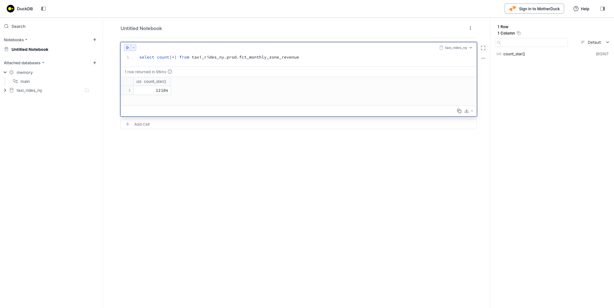
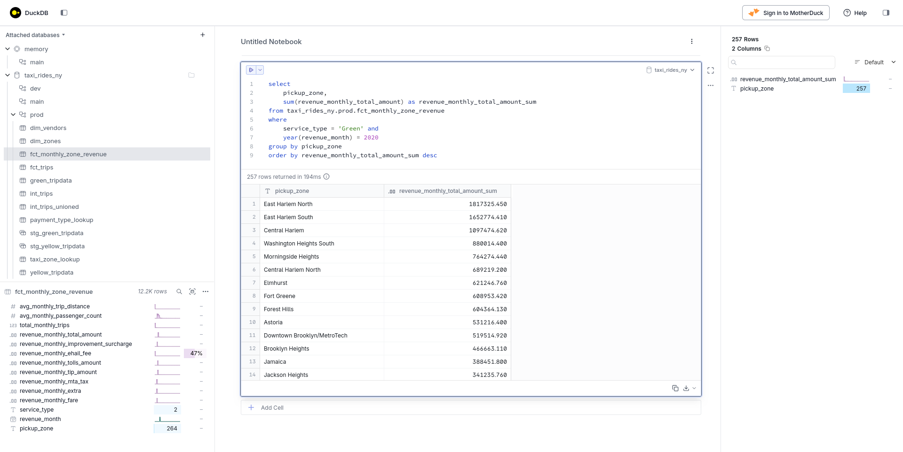
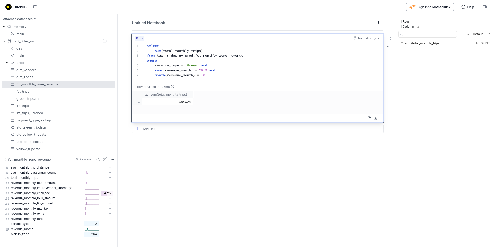
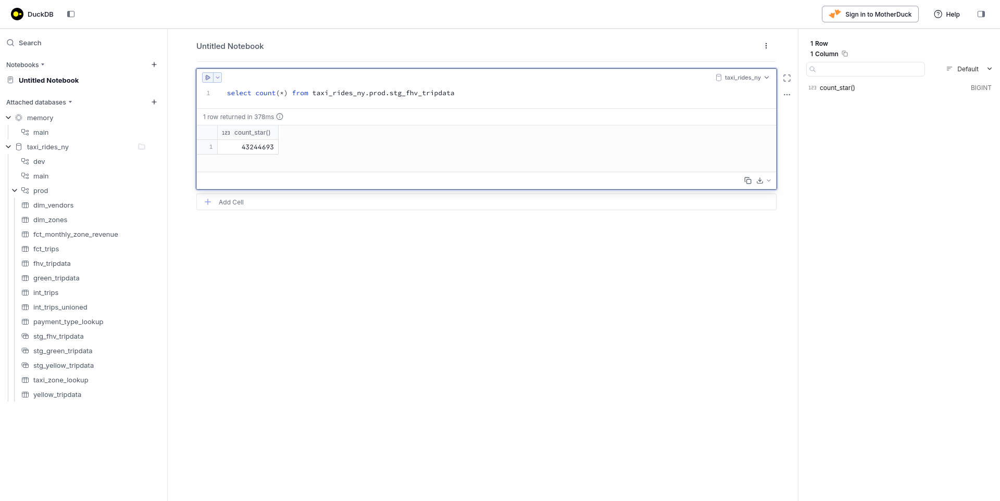

# Tarea del Módulo 4: Ingeniería Analítica con dbt

### Pregunta 1. Linaje y ejecución en dbt

> Dado un proyecto dbt con la siguiente estructura:

```
models/
├── staging/
│   ├── stg_green_tripdata.sql
│   └── stg_yellow_tripdata.sql
└── intermediate/
    └── int_trips_unioned.sql (depende de stg_green_tripdata y stg_yellow_tripdata)
```

> Si ejecutas `dbt run --select int_trips_unioned`, ¿qué modelos se construirán?

Si el comando se ejecuta tal como se indica, solo se construirá el modelo `int_trips_unioned`.
Añadir el prefijo `+` también construiría sus dependencias.

```bash
uv run dbt run --select int_trips_unioned --target prod
```

```bash
15:45:36  Running with dbt=1.11.5
15:45:38  Registered adapter: duckdb=1.10.0
15:45:38  Unable to do partial parsing because config vars, config profile, or config target have changed
15:45:38  Unable to do partial parsing because profile has changed
15:45:48  Found 8 models, 2 seeds, 33 data tests, 2 sources, 618 macros
15:45:48  
15:45:48  Concurrency: 1 threads (target='prod')
15:45:48  
15:45:48  1 of 1 START sql table model prod.int_trips_unioned ............................ [RUN]
15:47:02  1 of 1 OK created sql table model prod.int_trips_unioned ....................... [OK in 74.32s]
15:47:03  
15:47:03  Finished running 1 table model in 0 hours 1 minutes and 14.89 seconds (74.89s).
15:47:03  
15:47:03  Completed successfully
15:47:03  
15:47:03  Done. PASS=1 WARN=0 ERROR=0 SKIP=0 NO-OP=0 TOTAL=1
```

- **Solo `int_trips_unioned`**

---

### Pregunta 2. Tests en dbt

Has configurado un test genérico como este en tu `schema.yml`:

```yaml
columns:
  - name: payment_type
    data_tests:
      - accepted_values:
          arguments:
            values: [1, 2, 3, 4, 5]
            quote: false
```

> Tu modelo `fct_trips` lleva meses ejecutándose correctamente. Ahora aparece un nuevo valor `6` en los datos de origen.

> ¿Qué ocurre cuando ejecutas `dbt test --select fct_trips`?

El objetivo de escribir el test es precisamente que falle cuando no se cumple su condición.

```bash
uv run dbt test --select fct_trips --target prod
```

```bash
15:53:22  Running with dbt=1.11.5
15:53:23  Registered adapter: duckdb=1.10.0
15:53:25  Found 8 models, 2 seeds, 34 data tests, 2 sources, 618 macros
15:53:25  
15:53:25  Concurrency: 1 threads (target='prod')
15:53:25  
15:53:25  1 of 10 START test accepted_values_fct_trips_payment_type__False__1__2__3__4__5  [RUN]
15:53:26  1 of 10 FAIL 1 accepted_values_fct_trips_payment_type__False__1__2__3__4__5 .... [FAIL 1 in 0.95s]
15:53:26  2 of 10 START test accepted_values_fct_trips_service_type__Green__Yellow ....... [RUN]
15:53:27  2 of 10 PASS accepted_values_fct_trips_service_type__Green__Yellow ............. [PASS in 1.01s]
15:53:27  3 of 10 START test not_null_fct_trips_pickup_datetime .......................... [RUN]
15:53:27  3 of 10 PASS not_null_fct_trips_pickup_datetime ................................ [PASS in 0.07s]
15:53:27  4 of 10 START test not_null_fct_trips_service_type ............................. [RUN]
15:53:27  4 of 10 PASS not_null_fct_trips_service_type ................................... [PASS in 0.06s]
15:53:27  5 of 10 START test not_null_fct_trips_total_amount ............................. [RUN]
15:53:27  5 of 10 PASS not_null_fct_trips_total_amount ................................... [PASS in 0.06s]
15:53:27  6 of 10 START test not_null_fct_trips_trip_id .................................. [RUN]
15:53:28  6 of 10 PASS not_null_fct_trips_trip_id ........................................ [PASS in 0.06s]
15:53:28  7 of 10 START test not_null_fct_trips_vendor_id ................................ [RUN]
15:53:28  7 of 10 PASS not_null_fct_trips_vendor_id ...................................... [PASS in 0.06s]
15:53:28  8 of 10 START test relationships_fct_trips_dropoff_location_id__location_id__ref_dim_zones_  [RUN]
15:53:29  8 of 10 PASS relationships_fct_trips_dropoff_location_id__location_id__ref_dim_zones_  [PASS in 1.45s]
15:53:29  9 of 10 START test relationships_fct_trips_pickup_location_id__location_id__ref_dim_zones_  [RUN]
15:53:30  9 of 10 PASS relationships_fct_trips_pickup_location_id__location_id__ref_dim_zones_  [PASS in 1.28s]
15:53:30  10 of 10 START test unique_fct_trips_trip_id ................................... [RUN]
15:53:57  10 of 10 PASS unique_fct_trips_trip_id ......................................... [PASS in 26.79s]
15:53:57  
15:53:57  Finished running 10 data tests in 0 hours 0 minutes and 32.46 seconds (32.46s).
15:53:58  
15:53:58  Completed with 1 error, 0 partial successes, and 0 warnings:
15:53:58  
15:53:58  Failure in test accepted_values_fct_trips_payment_type__False__1__2__3__4__5 (models/marts/schema.yml)
15:53:58    Got 1 result, configured to fail if != 0
15:53:58  
15:53:58    compiled code at target/compiled/taxi_rides_ny/models/marts/schema.yml/accepted_values_fct_trips_payment_type__False__1__2__3__4__5.sql
15:53:58  
15:53:58  Done. PASS=9 WARN=0 ERROR=1 SKIP=0 NO-OP=0 TOTAL=10
```

- **dbt fallará el test y devolverá un código de salida distinto de cero**

---

### Pregunta 3. Conteo de registros en `fct_monthly_zone_revenue`

> Tras ejecutar tu proyecto dbt, consulta el modelo `fct_monthly_zone_revenue`.
>
> ¿Cuántos registros tiene el modelo `fct_monthly_zone_revenue`?



- **12.184**

---

### Pregunta 4. Zona con mayor rendimiento para taxis Green (2020)

> Usando la tabla `fct_monthly_zone_revenue`, encuentra la zona de recogida con los **ingresos totales más altos** (`revenue_monthly_total_amount`) para los viajes en taxi **Green** en 2020.
>
> ¿Qué zona tuvo los mayores ingresos?



- **East Harlem North**

---

### Pregunta 5. Conteo de viajes en taxis Green (octubre 2019)

> Usando la tabla `fct_monthly_zone_revenue`, ¿cuál es el **número total de viajes** (`total_monthly_trips`) de los taxis Green en octubre de 2019?



- **384.624**

---

### Pregunta 6. Construir un modelo de staging para datos FHV

> Crea un modelo de staging para los datos de viajes de **vehículos de alquiler (FHV)** de 2019.
>
> 1. Carga los [datos de viajes FHV de 2019](https://github.com/DataTalksClub/nyc-tlc-data/releases/tag/fhv) en tu almacén de datos.
> 2. Crea un modelo de staging `stg_fhv_tripdata` con los siguientes requisitos:
>    - Filtra los registros donde `dispatching_base_num IS NULL`
>    - Renombra los campos para que coincidan con las convenciones de nomenclatura del proyecto (p. ej., `PUlocationID` → `pickup_location_id`)
>
> ¿Cuántos registros tiene `stg_fhv_tripdata`?

Para la ingesta se creó el script [fhv_ingest.py](../pipeline/nytaxi/fhv_ingest.py).

Después se añadió la fuente `fhv_tripdata` al archivo **sources.yml**:

```yaml
      - name: fhv_tripdata
        description: Registros brutos de viajes en taxi FHV
        columns:
          - name: dispatching_base_num
            description: Número de licencia TLC de la base que despachó el viaje
          - name: affiliated_base_number
            description: |
              Número de base de la base con la que está afiliado el vehículo.
              Debe indicarse aunque la base afiliada sea la misma que la base despachadora.
          - name: pulocationid
            description: Zona TLC Taxi en la que comenzó el viaje
          - name: dolocationid
            description: Zona TLC Taxi en la que terminó el viaje
          - name: pickup_datetime
            description: Fecha y hora de recogida del viaje
          - name: dropoff_datetime
            description: Fecha y hora de bajada del viaje
          - name: sr_flag
            description: |
              Indica si el viaje formó parte de una cadena de viaje compartido ofrecida por una empresa FHV de alto volumen (p. ej., Uber Pool, Lyft Line).
              Para viajes compartidos, el valor es 1. Para viajes no compartidos, este campo es nulo.
```

El modelo de staging se construyó con esta consulta:

```sql
with source as (
    select * from {{ source('raw', 'fhv_tripdata') }}
),

renamed as (
    select
        -- identificadores
        cast(dispatching_base_num as string) as dispatching_base_num,
        cast(affiliated_base_number as string) as affiliated_base_number,

        -- marcas de tiempo
        cast(pickup_datetime as timestamp) as pickup_datetime,
        cast(dropoff_datetime as timestamp) as dropoff_datetime,

        -- información del viaje
        cast(pulocationid as integer) as pickup_location_id,
        cast(dolocationid as integer) as dropoff_location_id,
        cast(sr_flag as string) as sr_flag
    from source
    -- Filtra registros con dispatching_base_num nulo (requisito de calidad de datos)
    where dispatching_base_num is not null
)

select * from renamed
```

Finalmente, se ejecutó el modelo:

```bash
uv run dbt run --select stg_fhv_tripdata --target prod
```

```bash
16:43:08  Running with dbt=1.11.5
16:43:09  Registered adapter: duckdb=1.10.0
16:43:13  The configured adapter does not support metadata-based freshness. A loaded_at_field must be specified for source 'raw.fhv_tripdata'.
16:43:13  Found 9 models, 2 seeds, 34 data tests, 3 sources, 618 macros
16:43:13  
16:43:13  Concurrency: 1 threads (target='prod')
16:43:13  
16:43:14  1 of 1 START sql view model prod.stg_fhv_tripdata .............................. [RUN]
16:43:14  1 of 1 OK created sql view model prod.stg_fhv_tripdata ......................... [OK in 0.27s]
16:43:14  
16:43:14  Finished running 1 view model in 0 hours 0 minutes and 0.81 seconds (0.81s).
16:43:14  
16:43:14  Completed successfully
16:43:14  
16:43:14  Done. PASS=1 WARN=0 ERROR=0 SKIP=0 NO-OP=0 TOTAL=1
```



- **43.244.693**

---

## Envío de soluciones

- Formulario de envío: <https://courses.datatalks.club/de-zoomcamp-2026/homework/hw4>