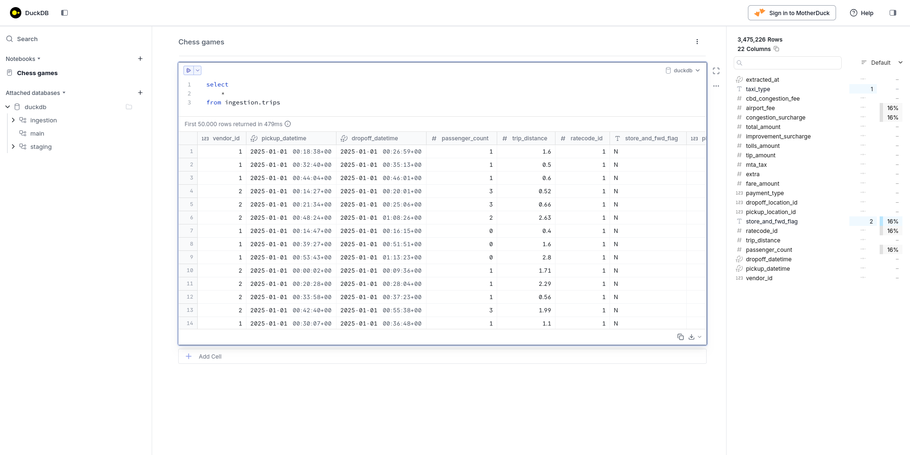
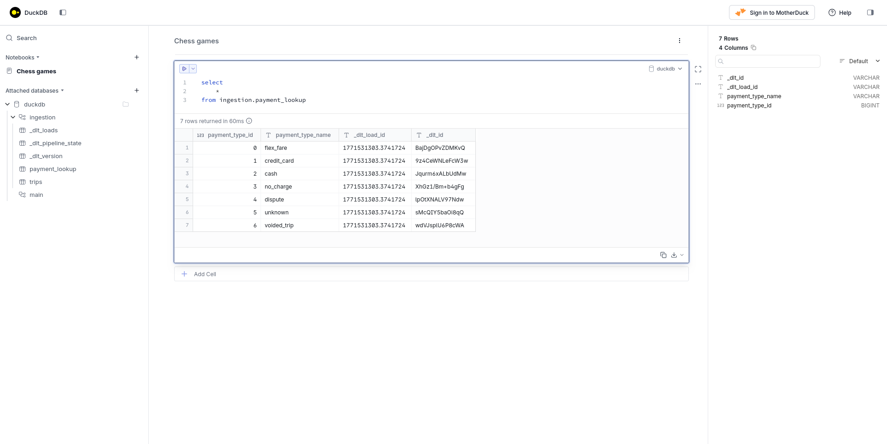
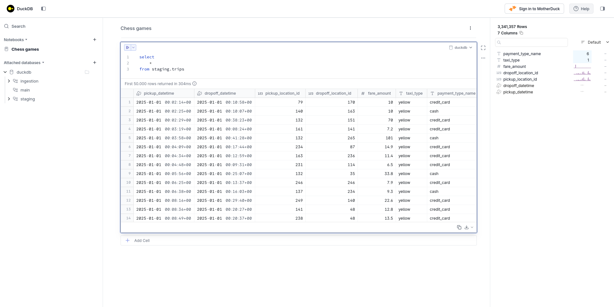
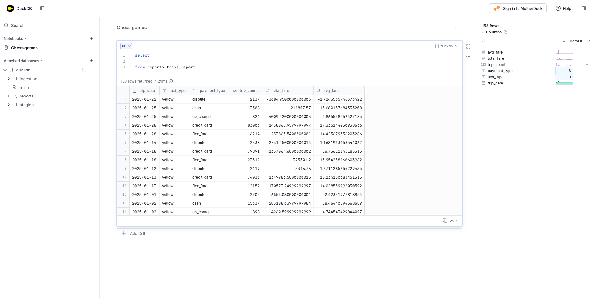

# Plataformas de datos

## Caso práctico: Flujo de datos completo con Bruin

* Vídeo original (en inglés): [Building an End-to-End Pipeline with NYC Taxi Data](https://www.youtube.com/watch?v=q0k_iz9kWsI&list=PL3MmuxUbc_hJed7dXYoJw8DoCuVHhGEQb&index=4)

En esta sesión vamos a continuar trabajando con Bruin, esta vez implementando un proceso ELT basado en el conjunto de datos de taxis de Nueva York organizado en tres capas:

1. Capa de **ingestión**: encargada de la descarga de los ficheros y de su almacenamiento sin procesar.
2. Capa de **preparación**: encargada de preprocesar, limpiar, transformar y unir los datos.
3. Capa de **informes**: encargada de agregar datos y realizar cálculos.

### Creación del proyecto

Siguiendo los pasos descritos en la sesión anterior de [introducción a Bruin](01-introduccion-a-bruin.md), vamos a empezar por crear el directorio para nuestro proyecto e inicializarlo como un proyecto Bruin:

```bash
cd pipelines

bruin init zoomcamp taxi-pipeline
```

En este caso, escogeremos la plantilla de proyecto **zoomcamp** creada por el equipo de Bruin específicamente para el curso.

### Configuración

Como almacén local de datos usaremos DuckDB, por lo que necesitamos crear un [`.bruin.yml`](pipelines/taxi-pipeline/.bruin.yml) para nuestro proyecto indicándolo.

```yaml
default_environment: default

environments:
  default:
    connections:
      duckdb:
        - name: duckdb-default
          path: duckdb.db
```

Tanto este fichero como el de la base de datos deberán estar fuera de nuestro repositorio Git, por lo que también añadiremos un [`.gitignore`](pipelines/taxi-pipeline/.gitignore).

```
.bruin.yml
duckdb.db
```

Finalmente, configuraremos el fichero de configuración principal de nuestro flujo de datos, [`pipeline/pipeline.yml`](pipelines/taxi-pipeline/pipeline/pipeline.yml).

```yaml
# Zoomcamp de ingeniería de datos
#
# Documentación clave:
# - Archivos de pipeline: https://getbruin.com/docs/bruin/getting-started/pipeline
# - Variables (JSON Schema): https://getbruin.com/docs/bruin/getting-started/pipeline-variables
# - Comando de ejecución: https://getbruin.com/docs/bruin/commands/run

# Define un nombre para el pipeline (string). Aparece en los logs + `BRUIN_PIPELINE` para los assets de Python.
name: nyc_taxi

# Elige una programación ("daily", "hourly", "weekly", "monthly") o una cadena cron.
schedule: daily

# Define la fecha más temprana que este pipeline debe considerar para backfills con refresh completo.
# Formato: YYYY-MM-DD
start_date: "2022-01-01"

# Configura las conexiones por defecto para que los assets puedan omitir `connection: ...`.
# Patrón común: `duckdb: duckdb-default` para desarrollo local.
# Documentación (conexiones): https://getbruin.com/docs/bruin/commands/connections
default_connections:
  duckdb: duckdb-default

# Define variables del pipeline usando JSON Schema y valores por defecto.
# - Las variables deben tener un `default` para que los assets se rendericen sin `--var`.
# - En assets SQL/YAML: referenciar como `{{ var.mi_variable }}`.
# - En assets de Python: leer el JSON desde la variable de entorno `BRUIN_VARS`.
variables:
  # Define `taxi_types` como un array de strings con un valor por defecto razonable.
  taxi_types:
    type: array
    items:
      type: string
    default: ["yellow"]
```

Cabe destacar que:

* la fecha de inicio `start_date` es la que se usará cuando se lancen refrescos completos del flujo de datos,
* las `variables` pueden ser sobreescritas en tiempo de ejecución usando el argumento `--var`,
* en particular, la variable `taxi_types` permite controlar con qué tipos de taxi se lanzará el flujo.

### Capa de **ingestión**

#### Carga de trayectos con `trips.py`

De la ingestión de datos de trayectos se ocupará el fichero Python [pipeline/assets/ingestion/trips.py](pipelines/taxi-pipeline/pipeline/assets/ingestion/trips.py), que:

1. leerá los ficheros Parquet desde la web oficial:
  * https://d37ci6vzurychx.cloudfront.net/trip-data/{taxi_type}_tripdata_{year}-{month}.parquet
2. devolverá los datos en formato _dataframe_ de Pandas.

Cabe destacar que, pese a ser un fichero Python, el fichero debe comenzar con una cabecera en la que indiquemos a Bruin de qué tipo de artefacto se trata:

```yaml
# Define el nombre del artefacto (patrón recomendado: schema.asset_name).
# - Convención en este módulo: usar un esquema `ingestion.` para las tablas de ingestión en bruto.
name: ingestion.trips

# Define el tipo de artefacto.
# Documentación: https://getbruin.com/docs/bruin/assets/python
type: python

# Elige una versión de la imagen de Python (Bruin ejecuta Python en entornos aislados).
# Ejemplo: python:3.11
image: python:3.11

# Conexión a utilizar
connection: duckdb-default

# Elige la materialización (opcional, pero recomendado).
# Funcionalidad de Bruin: la materialización en Python te permite devolver un DataFrame (o list[dict]) y Bruin lo carga en tu destino.
# Esta suele ser la forma más sencilla de construir artefactos de ingestión en Bruin.
# Documentación: https://getbruin.com/docs/bruin/assets/python#materialization
materialization:
  # elige `table` o `view` (la ingestión generalmente debería ser una tabla)
  type: table
  # elige una estrategia.
  # estrategia sugerida: append
  strategy: append

# Alternativa (avanzada): puedes omitir la materialización en Python de Bruin y escribir un artefacto de Python plano que escriba manualmente
# en DuckDB (u otro destino) usando tu propia librería cliente y SQL. En ese caso:
# - normalmente omites el bloque `materialization:`
# - NO necesitas una función `materialize()`; simplemente ejecutas código Python

# Define las columnas de salida (nombres + tipos) para metadatos, lineage y checks de calidad.
# Consejo: marca los identificadores estables como `primary_key: true` si planeas usar `merge` más adelante.
# Documentación: https://getbruin.com/docs/bruin/assets/columns
columns:
  - name: pickup_datetime
    type: timestamp
    description: "Fecha y hora en que se inició el taxímetro"
  - name: dropoff_datetime
    type: timestamp
    description: "Fecha y hora en que se detuvo el taxímetro"
```

Como en nuestro caso optaremos por usar la materialización estándar de Bruin, nuestro código Python ira a continuación y consistirá básicamente en una función `materialize`:

```py
# Añade los imports necesarios para tu ingesta (por ejemplo, pandas, requests).
# - Coloca las dependencias en el `requirements.txt` más cercano
# Documentación: https://getbruin.com/docs/bruin/assets/python
import io
import os
import json
from datetime import datetime, timezone
import pandas as pd
import requests

# Implementa `materialize()` solo si estás usando la materialización en Python de Bruin.
# Si eliges el enfoque de escritura manual (sin bloque `materialization:`), elimina esta función e implementa la ingesta
# como un script Python estándar.
def materialize():
    """
    Ingesta usando el contexto de ejecución de Bruin.

    Conceptos de Bruin usados:

    - Variables de ventana de fechas integradas:
      - BRUIN_START_DATE / BRUIN_END_DATE (YYYY-MM-DD)
      - BRUIN_START_DATETIME / BRUIN_END_DATETIME (datetime en formato ISO)
      Documentación: https://getbruin.com/docs/bruin/assets/python#environment-variables

    - Variables del pipeline:
      - Leer el JSON desde BRUIN_VARS, por ejemplo `taxi_types`
      Documentación: https://getbruin.com/docs/bruin/getting-started/pipeline-variables

    Objetivos de la implementación:
    - Usar las fechas de inicio/fin + `taxi_types` para generar una lista de endpoints de origen para la ventana de ejecución.
    - Obtener los datos de cada endpoint, parsearlos a DataFrames y concatenarlos.
    - Añadir una columna como `extracted_at` para lineage/debugging (timestamp de la extracción).
    - Preferir append-only en la ingesta; gestionar duplicados en staging.
    """

    start_date = os.environ["BRUIN_START_DATE"]
    end_date = os.environ["BRUIN_END_DATE"]
    taxi_types = json.loads(os.environ["BRUIN_VARS"]).get("taxi_types", ["yellow"])

    # Generar la lista de meses entre las fechas de inicio y fin
    start_month = pd.to_datetime(start_date).to_period("M").to_timestamp()
    end_month = pd.to_datetime(end_date).to_period("M").to_timestamp()
    months = pd.date_range(start=start_month, end=end_month, freq="MS")

    base_url = "https://d37ci6vzurychx.cloudfront.net/trip-data"
    extracted_at = datetime.now(timezone.utc)

    # Obtener los ficheros parquet desde:
    # https://d37ci6vzurychx.cloudfront.net/trip-data/{taxi_type}_tripdata_{year}-{month}.parquet
    dataframes = []
    for taxi_type in taxi_types:
        for month in months:
            url = f"{base_url}/{taxi_type}_tripdata_{month.year}-{month.month:02d}.parquet"
            response = requests.get(url)
            response.raise_for_status()
            df = pd.read_parquet(io.BytesIO(response.content))

            df["taxi_type"] = taxi_type
            df["extracted_at"] = extracted_at

            if "tpep_pickup_datetime" in df.columns:
              df = df.rename(columns={"tpep_pickup_datetime": "pickup_datetime"})

            if "tpep_dropoff_datetime" in df.columns:
              df = df.rename(columns={"tpep_dropoff_datetime": "dropoff_datetime"})

            df = df.rename(columns={
              "PULocationID": "pickup_location_id",
              "DOLocationID": "dropoff_location_id",
            })

            dataframes.append(df)

    return pd.concat(dataframes, ignore_index=True)
```

Para que el script de ingestión de datos funcione, debemos también de especificar un fichero [pipeline/assets/ingestion/requirements.txt](pipelines/taxi-pipeline/pipeline/assets/ingestion/requirements.txt) con sus dependencias.

```bash
# Dependencias de Python necesarias para el artefacto de ingestión
# - Manténgase tan reducido como sea posible
# - Ùsense versiones específicas para facilitar la reproducibilidad
# Docs: https://getbruin.com/docs/bruin/assets/python                                                                                                                                   

pandas==3.0.1
requests==2.32.5
pyarrow==23.0.1
```

Por fin, podemos ejecutar nuestro artefacto con `bruin run`:

```bash
bruin run \
    --config-file .bruin.yml \
    --start-date 2025-01-01 \
    --end-date 2025-01-31 \
    --environment default \
    ./pipeline/assets/ingestion/trips.py
```



#### Carga de métodos de pago con `payment_lookup.asset.yml`

La ingestión de datos de métodos de pago, sin embargo, será más sencilla. Como nuestra fuente de datos será un CSV estático, nos bastará con definir un [pipeline/assets/ingestion/payment_lookup.asset.yml](pipelines/taxi-pipeline/pipeline/assets/ingestion/payment_lookup.asset.yml).

```yaml
# Artefacto de ingestión: De fichero CSV local a tabla "lookup".
#
# Docs: https://getbruin.com/docs/bruin/assets/seed

# Nombre del artefacto.
name: ingestion.payment_lookup

# Tipo de plataforma.
# Docs: https://getbruin.com/docs/bruin/assets/seed
type: duckdb.seed

# Ruta al fichero CSV (relativa a este fichero .asset.yml).
# También puede ser una URL: https://example.com/data.csv
parameters:
  path: payment_lookup.csv

# Definición de columnas y checks de calidad de datos.
# - Las tablas de "lookups" deben tener una clave primaria estable.
columns:
  - name: payment_type_id
    type: integer
    description: Identificador único del tipo de pago
    primary_key: true
    checks:
      - name: not_null
      - name: unique
  - name: payment_type_name
    type: string
    description: Nombre legible del tipo de pago
    checks:
      - name: not_null
```

Igual que antes, podemos ejecutar nuestro artefacto con `bruin run`:

```bash
bruin run \
    --config-file .bruin.yml \
    --environment default \
    ./pipeline/assets/ingestion/payment_lookup.asset.yml
```



### Capa de **preparación**

Para preparar nuestros datos definiremos una consulta SQL, [pipeline/assets/staging/trips.sql](pipelines/taxi-pipeline/pipeline/assets/staging/trips.sql) que, como antes, comenzará con una cabecera en la que le decimos a Bruin qué tipo de artefacto estamos generando.

```yaml
# Docs:
# - Materialización: https://getbruin.com/docs/bruin/assets/materialization
# - Comprobaciones de calidad de datos predefinidas: https://getbruin.com/docs/bruin/quality/available_checks
# - Comprobaciones de calidad de datos personalizadas: https://getbruin.com/docs/bruin/quality/custom

# Establece el nombre del artefacto.
name: staging.trips

# Establece el tipo de plataforma.
# Docs: https://getbruin.com/docs/bruin/assets/sql
type: duckdb.sql

# Declara dependencias para facilitar el funcionamiento de `bruin run ... --downstream` y del lineaje.
depends:
  - ingestion.trips
  - ingestion.payment_lookup

# Escoge una estrategia incremental basada en procesamiento temporal si el conjunto de datos está
# naturalmente organizado por ventanas temporales.
materialization:
  # La materialización le dice a Bruin cómo transformar tu consulta en un conjunto de datos persistido.
  # Docs: https://getbruin.com/docs/bruin/assets/materialization
  #
  # Tipo de materialización:
  # - table: persisted table
  # - view: persisted view (if the platform supports it)
  type: table

  # Estrategia de materialización.
  # Docs: https://getbruin.com/docs/bruin/assets/materialization

  # Estrategias incrementales:
  # Las estrategias incrementales implican que solo actualizas una parte del destino en lugar de
  # reconstruirlo entero con cada ejecución.

  # En Bruin, esto se controla con las claves `strategy`, `incremental_key` y `time_granularity`.

  # Algunas estrategias comunes son:
  # - create+replace (reconstrucción completa)
  # - truncate+insert (reconstrucción completa sin eliminar y recrear las tablas)
  # - append (solo añadir nuevos registros)
  # - delete+insert (actualizar las particiones basándose en las claves primarias)
  # - merge (actualización de registros usando la clave primaria)
  # - time_interval (actualización de datos considerando solo una ventana de tiempo)
  strategy: time_interval

  # Establece la columna que define la ventana temporal.
  incremental_key: pickup_datetime

  # Tipo de la columna anterior: `date` ó `timestamp`
  time_granularity: timestamp

# Defina las columnas de salida, marca claves primarias y añade comprobaciones básicas por columna.
columns:
  - name: pickup_datetime
    type: timestamp
    primary_key: true
    checks:
      - name: not_null

# Comprobación personalizada a aplicar al conjunto de datos.
# Docs: https://getbruin.com/docs/bruin/quality/custom
custom_checks:
  - name: row_count_greater_than_zero
    query: |
      SELECT CASE WHEN COUNT(*) > 0 THEN 1 ELSE 0 END
      FROM staging.trips
    value: 1
```

Y a continuación especificamos la consulta que combinará datos de trayectos y tipos de pago.

```sql
SELECT
    t.pickup_datetime,
    t.dropoff_datetime,
    t.pickup_location_id,
    t.dropoff_location_id,
    t.fare_amount,
    t.taxi_type,
    p.payment_type_name
FROM ingestion.trips t
LEFT JOIN ingestion.payment_lookup p
    ON t.payment_type = p.payment_type_id
WHERE t.pickup_datetime >= '{{ start_datetime }}'
  AND t.pickup_datetime < '{{ end_datetime }}'
QUALIFY ROW_NUMBER() OVER (
    PARTITION BY t.pickup_datetime, t.dropoff_datetime,
                 t.pickup_location_id, t.dropoff_location_id, t.fare_amount
    ORDER BY t.pickup_datetime
) = 1
```

Por fin, podemos lanzar la preparación con `bruin run`.

```bash
bruin run \
    --config-file .bruin.yml \
    --full-refresh \
    --start-date 2025-01-01 \
    --end-date 2025-01-31 \
    --environment default \
    ./pipeline/assets/staging/trips.sql
```

> [!NOTE]
> El parámetro `--full-refresh` solo es necesario la primera vez que ejecutemos el comando.



### Capa de **informes**

Como artefacto para la generación de la tabla de informes también usaremos un artefacto SQL. Como antes, empezamos con la sección de metadatos en formato YAML.

```yaml
# Documentación:
# - Assets SQL: https://getbruin.com/docs/bruin/assets/sql
# - Materialización: https://getbruin.com/docs/bruin/assets/materialization
# - Checks de calidad: https://getbruin.com/docs/bruin/quality/available_checks

# Define el nombre del asset.
name: reports.trips_report

# Define el tipo de plataforma.
# Documentación: https://getbruin.com/docs/bruin/assets/sql
type: duckdb.sql

# Declara la dependencia del/los asset(s) de staging de los que lee este informe.
depends:
  - staging.trips

# Elige la estrategia de materialización.
# Para informes, `time_interval` es una buena opción para reconstruir solo la ventana temporal relevante.
# Importante: usa la misma `incremental_key` que en staging (por ejemplo, pickup_datetime) para mantener la consistencia.
materialization:
  type: table
  strategy: time_interval
  incremental_key: trip_date
  time_granularity: date

# Define las columnas del informe + la(s) clave(s) primaria(s) en el nivel de agregación elegido.
columns:
  - name: trip_date
    type: date
    primary_key: true
  - name: taxi_type
    type: string
    primary_key: true
  - name: payment_type
    type: string
    primary_key: true
  - name: trip_count
    type: bigint
    checks:
      - name: non_negative
```

Y seguimos con la consulta que calcula los agregados.

```sql
SELECT
    CAST(pickup_datetime AS DATE) AS trip_date,
    taxi_type,
    payment_type_name AS payment_type,
    COUNT(*) AS trip_count,
    SUM(fare_amount) AS total_fare,
    AVG(fare_amount) AS avg_fare
FROM staging.trips
WHERE pickup_datetime >= '{{ start_datetime }}'
  AND pickup_datetime < '{{ end_datetime }}'
GROUP BY 1, 2, 3
```

Finalizamos nuestro flujo de datos lanzando `bruin run`.

```bash
bruin run \
    --config-file .bruin.yml \
    --full-refresh \
    --start-date 2025-01-01 \
    --end-date 2025-01-31 \
    --environment default \
    ./pipeline/assets/reports/trips_report.sql
```

> [!NOTE]
> El parámetro `--full-refresh` solo es necesario la primera vez que ejecutemos el comando.


