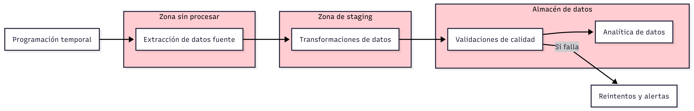
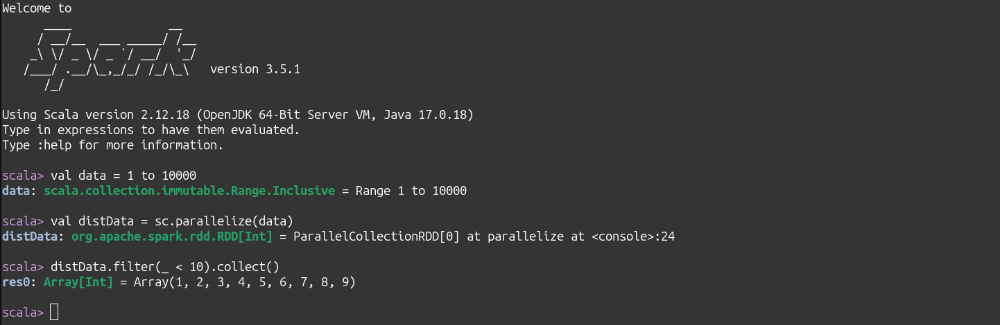

# Procesamiento por lotes

## Introducción a los procesos por lotes

* Vídeo original (en inglés): [Introduction to Batch processing](https://www.youtube.com/watch?v=dcHe5Fl3MF8&list=PL3MmuxUbc_hJed7dXYoJw8DoCuVHhGEQb&index=52)

Hay muchas maneras de procesar datos pero dos estrategias destacan: procesamiento por lotes y procesamiento en tiempo real. Este módulo lo dedicaremos al procesamiento por lotes y el próximo al procesamiento en tiempo real.

### ¿Qué es el procesamiento por lotes?

El procesamiento por lotes (en inglés, batch processing) en ingeniería de datos es un modelo en el que grandes volúmenes de datos se recopilan durante un período de tiempo y se procesan juntos en una sola ejecución programada, en lugar de procesarse de forma continua o en tiempo real. Este enfoque se utiliza para tareas como la limpieza de datos, transformaciones masivas, generación de reportes, cargas en almacenes de datos y cálculos históricos, donde la inmediatez no es crítica.

Los sistemas de procesamiento por lotes suelen ejecutarse en horarios definidos (por ejemplo, cada hora, cada noche) y están optimizados para manejar alta capacidad y eficiencia en el uso de recursos, aprovechando herramientas como Hadoop o Apache Spark. Aunque introduce latencia entre la generación del dato y su disponibilidad, permite procesar grandes cantidades de información de forma confiable, reproducible y a menor costo computacional.

### ¿Cómo se inician?

Aunque hay muchas maneras de iniciar los procesos por lotes, la más típica es programarlos para que su ejecución sea periódica. Por ejemplo:

* semanal
* diaria
* horaria
* _x_ veces por hora
* cada _x_ minutos

Esta programación suele gestionarse mediante orquestadores, que permiten definir dependencias entre tareas, controlar reintentos ante fallos, parametrizar ejecuciones y mantener trazabilidad de los procesos. En estos casos, el disparador del proceso no es la llegada de un evento concreto, sino el cumplimiento de una ventana temporal, lo que facilita trabajar con datos completos y consistentes (por ejemplo, *"procesar todas las ventas del día anterior"*).

También es común que los procesos se inicien al detectarse la disponibilidad de nuevos datos en un sistema de almacenamiento (como la llegada de archivos a un lago de datos) o al finalizar otros flujos de datos, formando así **cadenas de procesamiento desacopladas y reproducibles**.

### ¿Qué tecnologías se usan en estos procesos?

En el procesamiento por lotes intervienen diversas tecnologías que permiten extraer, transformar y cargar grandes volúmenes de datos de forma eficiente. **Python** es uno de los lenguajes más utilizados por su versatilidad y su ecosistema de librerías.

**SQL** sigue siendo fundamental para la manipulación y consulta de datos estructurados, especialmente en almacenes de datos y motores analíticos, donde permite expresar transformaciones de forma declarativa y optimizada.

Por su parte, **Apache Spark** se emplea cuando el volumen, la velocidad o la complejidad del procesamiento requieren ejecución distribuida, posibilitando trabajar con terabytes o petabytes de datos sobre clusters.

Estas herramientas suelen combinarse dentro de flujos de datos orquestados, donde cada una aporta sus fortalezas según la etapa del procesamiento y las necesidades de escalabilidad y rendimiento.

#### ¿Qué papel juegan los orquestadores de datos?

Los orquestadores de datos (como **Kestra**, ó **Apache Airflow**) cumplen un papel central en los procesos por lotes, ya que se encargan de coordinar y automatizar la ejecución de los distintos pasos de un proceso de datos.

En lugar de lanzar scripts de forma aislada, el orquestador define el flujo completo como un grafo de tareas con dependencias, gestiona la planificación temporal, controla reintentos ante fallos, maneja parámetros, almacena metadatos de ejecución y proporciona observabilidad (logs, métricas, estados).

Esto permite construir pipelines reproducibles, tolerantes a fallos y fáciles de mantener, además de facilitar prácticas clave en ingeniería de datos como el versionado, el relleno de datos históricos y la ejecución en distintos entornos (desarrollo, staging, producción).



## Introducción a Spark

* Vídeo original (en inglés): [Introduction to Spark](https://www.youtube.com/watch?v=FhaqbEOuQ8U&list=PL3MmuxUbc_hJed7dXYoJw8DoCuVHhGEQb&index=52)

[Apache Spark](https://spark.apache.org) es una herramienta muy utilizada en ingeniería de datos para procesar grandes cantidades de información de forma rápida y distribuida. En lugar de ejecutar un programa en un solo ordenador, Spark reparte el trabajo entre varias máquinas de un clúster, lo que permite transformar y analizar datos mucho más rápido que con enfoques tradicionales.

Se usa habitualmente en procesos por lotes para limpiar datos, unir diferentes fuentes, calcular métricas o preparar la información que luego se cargará en un data warehouse o se utilizará en analítica y aprendizaje automático. Una de sus grandes ventajas es que ofrece APIs sencillas en lenguajes conocidos como Python (PySpark) y SQL, por lo que resulta accesible para quienes están empezando, mientras que por debajo gestiona automáticamente aspectos complejos como la paralelización, la tolerancia a fallos y la optimización de las ejecuciones.

### ¿Cuándo se usa Spark?

En el contexto de procesos por lotes, Apache Spark se utiliza típicamente cuando el volumen de datos es lo suficientemente grande como para que una sola máquina no pueda procesarlo de forma eficiente, cuando las transformaciones requieren mucha computación (por ejemplo, _joins_ entre conjuntos de datos masivos, agregaciones complejas o enriquecimiento con múltiples fuentes) o cuando se necesita reducir significativamente los tiempos de ejecución.

También es habitual emplearlo al trabajar con data lakes en formatos como **Parquet** o **Delta Lake**, donde Spark puede leer y escribir datos de forma distribuida y optimizada, aplicar transformaciones y generar nuevas capas de datos listas para consumo analítico. En estos escenarios, Spark actúa como el motor que toma datos crudos desde el almacenamiento, los procesa en paralelo y escribe el resultado en una zona más refinada, manteniendo la escalabilidad y la eficiencia del proceso por lotes.


## Instalar Spark en Linux

Vídeo original (en inglés): [Installing Spark on Linux](https://www.youtube.com/watch?v=hqUbB9c8sKg&list=PL3MmuxUbc_hJed7dXYoJw8DoCuVHhGEQb&index=53)

Apache Spark está desarrollado principalmente en Scala, un lenguaje que se ejecuta sobre la Máquina Virtual de Java (JVM) y que permite combinar programación funcional y orientada a objetos, lo que encaja muy bien con su modelo de procesamiento distribuido y su API interna. Aunque como usuarios solemos interactuar con Spark a través de PySpark o Spark SQL, por debajo el motor sigue siendo Scala, lo que explica su dependencia de Java y la necesidad de tener una JVM correctamente configurada.

Para evitar problemas de compatibilidad entre versiones de Java, Python, librerías del sistema y el propio Spark (algo especialmente habitual en instalaciones locales) he optado por una instalación dockerizada. Esto nos permite trabajar con un entorno aislado, reproducible y fácil de levantar en cualquier máquina, garantizando que todos usemos exactamente las mismas versiones y reduciendo el tiempo dedicado a tareas de configuración que no aportan valor al aprendizaje del procesamiento de datos.

### Imagen base

Como imagen base hemos escogido una imagen basada en Python sobre la que hemos instalado Java, Spark y algunas otras herramientas que nos serán útiles para luego usarlas desde PySpark.

```Dockerfile
FROM python:3.11-bookworm

ARG SPARK_VERSION=3.5.1
ARG HADOOP_VERSION=3

ENV SPARK_HOME=/opt/spark
ENV PATH=$PATH:$SPARK_HOME/bin:$SPARK_HOME/sbin
ENV JAVA_HOME=/usr/lib/jvm/java-17-openjdk-amd64
ENV PYSPARK_PYTHON=python3
ENV PYSPARK_DRIVER_PYTHON=python3

# Instalar Java 17 + utilidades
RUN apt-get update && \
    apt-get install -y openjdk-17-jdk curl procps tini && \
    apt-get clean && \
    rm -rf /var/lib/apt/lists/*

# Descargar Spark
RUN set -eux; \
    curl -fL https://archive.apache.org/dist/spark/spark-${SPARK_VERSION}/spark-${SPARK_VERSION}-bin-hadoop${HADOOP_VERSION}.tgz -o spark.tgz; \
    tar -xzf spark.tgz -C /opt/; \
    mv /opt/spark-${SPARK_VERSION}-bin-hadoop${HADOOP_VERSION} $SPARK_HOME; \
    rm spark.tgz

# Librerías Python típicas en batch
RUN pip install --no-cache-dir \
    pandas \
    pyarrow \
    jupyter

WORKDIR /workspace

ENTRYPOINT ["/usr/bin/tini", "--"]
```

Puedes ver el fichero en contexto en [pipelines/pyspark-pipeline/Dockerfile](pipelines/pyspark-pipeline/Dockerfile).

### Servicios Dockerizados

Usando la misma imagen base, instanciamos tres servicios:

* un servidor principal de Spark,
* un trabajador de Spark y
* un servidor de cuadernos Jupyter.

#### Servidor principal de Spark

El servidor principal de Spark es el que levantará, entre otras cosas, la interfaz gráfica. Por defecto, la levantará en el puerto 8080 del equipo anfitrión aunque este puerto puede ser sobreescrito mediante la variable de entorno `SPARK_MASTER_UI_PORT`. Este servicio abrirá también el puerto 7077 para comunicarse con trabajadores Spark, siendo este puerto sobreescribirble mediante la variable de entorno `SPARK_MASTER_PORT`.

```yml
spark-master:
  build: .
  container_name: spark-master
  hostname: spark-master
  ports:
    - "${SPARK_MASTER_UI_PORT:-8080}:8080"
    - "${SPARK_MASTER_PORT:-7077}:7077"
  command: >
    bash -c "start-master.sh && tail -f /dev/null"
  volumes:
    - ./notebooks:/workspace
```

#### Trabajador de Spark

El trabajador de Socker no requiere ninguna configuración y está preconfigurado para que se comunique con el servicio principal de Spark.

```yml
spark-worker:
  build: .
  container_name: spark-worker
  depends_on:
    - spark-master
  environment:
    - SPARK_MASTER=spark://spark-master:7077
  command: >
    bash -c "start-worker.sh spark://spark-master:7077 && tail -f /dev/null"
  volumes:
    - ./notebooks:/workspace
```

#### Servidor de cuadernos de Jupyter

El servidor de cuadernos Jupyter está disponible por defecto en el puerto 8888 del equipo anfitrión, siendo el puerto modificable mediante la variable de entorno `JUPYTER_PORT`. Gracias a que usa nuestra imagen base, tiene disponibles `pyspark`, `pandas` y `pyarrow` entre otras utilidades.

```yml
jupyter:
  build: .
  container_name: spark-jupyter
  depends_on:
    - spark-master
  environment:
    - SPARK_MASTER=spark://spark-master:7077
  ports:
    - "${JUPYTER_PORT:-8888}:8888"
  command: >
    bash -c "jupyter notebook
    --ip=0.0.0.0
    --allow-root
    --no-browser
    --NotebookApp.token=''"
  volumes:
    - ./notebooks:/workspace
```

#### Inicio y prueba del servicio

Para iniciar los servicios, podemos ir a la carpeta en la que hemos preparado la instalación dockerizada, [pipelines/pyspark-pipeline/](pipelines/pyspark-pipeline/) e iniciar los servicios con Docker Compose:

```bash
# cd pipelines/pyspark-pipeline/
docker compose up -d
```

Una vez que los servicios estén funcionando, podemos iniciar una sesión BASH en el contenedor del servicio principal:

```bash
docker compose exec spark-master bash
```

Y una vez en el contenedor podemos abrir una sesión shell de Spark:

```bash
spark-shell
```

Por fin, podemos hacer una prueba escribiendo código Scala.

```java
val data = 1 to 10000
// data: scala.collection.immutable.Range.Inclusive = Range 1 to 10000

val distData = sc.parallelize(data)
// distData: org.apache.spark.rdd.RDD[Int] = ParallelCollectionRDD[0] at parallelize at <console>:24

distData.filter(_ < 10).collect()
// res0: Array[Int] = Array(1, 2, 3, 4, 5, 6, 7, 8, 9)
```



#### Prueba de Jupyter y PySpark

El servidor de Jupyter debería de estar funcionando en: http://localhost:8888, salvo que hayas configurado explícitamente un puerto diferente.
