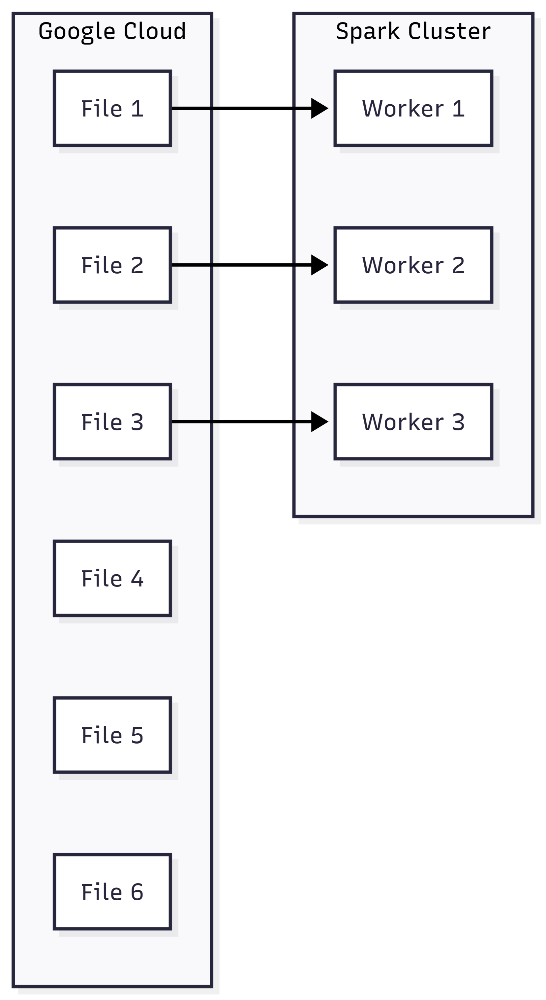
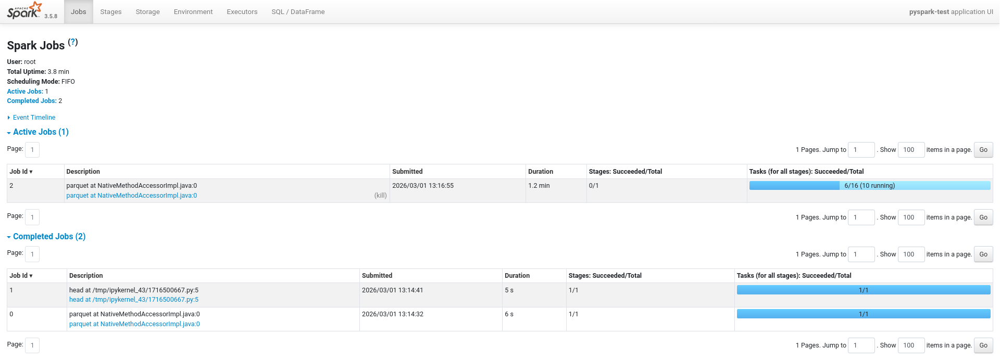

# Procesamiento por lotes

## Primer vistazo a PySpark

* Vídeo original (en inglés): [First Look at Spark/PySpark](https://www.youtube.com/watch?v=r_Sf6fCB40c&list=PL3MmuxUbc_hJed7dXYoJw8DoCuVHhGEQb&index=54)

En este capítulo echaremos un vistazo a PySpark usando como punto de partida el entorno que preparamos durante la sesión anterior. Para usarlo, empezaremos por asegurarnos de que los servicios están corriendo:

```bash
cd pipelines/pyspark-pipeline
docker compose up -d
```

Si estamos usando los puertos por defecto, deberíamos de tener corriendo los servicios:

| Servicio | URL y puerto |
| --- | --- |
| Interfaz gráfica de Spark | http://localhost:8080 |
| Servicio _master_ de Spark | http://localhost:7077 |
| Servidor de cuadernos Jupyter | http://localhost:8888 |
| Monitor de la sesión PySpark de Jupyter | http://localhost:4040 |
| Trabajador de Spark | |

Los resultados de la sesión están disponibles como cuaderno como [notebooks/introduccion-a-pyspark.ipynb](pipelines/pyspark-pipeline/notebooks/introduccion-a-pyspark.ipynb) en la carpeta [pipelines/pyspark-pipeline/](pipelines/pyspark-pipeline/).

### Inicio de una sesión PySpark

Para empezar, necesitaremos crear una sesión PySpark. No entraremos en mucho detalle aquí porque ya lo explicamos en la sesión anterior.

```python
import pyspark
import os
from pyspark.sql import SparkSession

# Creamos una sesión PySpark contra nuestro servicio "spark-master"
spark = SparkSession.builder \
    .master(os.environ.get('SPARK_MASTER')) \
    .appName("pyspark-test") \
    .getOrCreate()
```

### Descarga de datos

A continuación, descargamos el fichero de "gran volumen de datos" de taxis FHV (For-Hire Vehicles) desde la web de [TLC Trip Record Data](https://www.nyc.gov/site/tlc/about/tlc-trip-record-data.page).

```bash
!wget https://d37ci6vzurychx.cloudfront.net/trip-data/fhvhv_tripdata_2026-01.parquet
```

### Lectura de datos

Ahora, vamos a leer los datos descargados. Como en este caso los datos los estamos descargando en formato Parquet, el código va a ser ligeramente diferente a lo que hicimos en la sesión anterior.

```python
# Leemos el fichero Parquet
df = spark.read.parquet('fhvhv_tripdata_2026-01.parquet')

# Mostramos los primeros 3 registros
df.head(3)
```

El comando, devuelve una lista de objetos de tipo `Row` similares a este:

```Python
Row(
    hvfhs_license_num='HV0003',
    dispatching_base_num='B03404',
    originating_base_num='B03404',
    request_datetime=datetime.datetime(2026, 1, 1, 0, 50, 37),
    on_scene_datetime=datetime.datetime(2026, 1, 1, 0, 52, 31),
    pickup_datetime=datetime.datetime(2026, 1, 1, 0, 54, 30),
    dropoff_datetime=datetime.datetime(2026, 1, 1, 1, 13, 23),
    PULocationID=262,
    DOLocationID=79,
    trip_miles=4.3,
    trip_time=1133,
    base_passenger_fare=31.24,
    tolls=0.0,
    bcf=0.75,
    sales_tax=2.77,
    congestion_surcharge=2.75,
    airport_fee=0.0,
    tips=0.0,
    driver_pay=21.1,
    shared_request_flag='N',
    shared_match_flag='N',
    access_a_ride_flag='N',
    wav_request_flag='N',
    wav_match_flag='N',
    cbd_congestion_fee=1.5
)
```

#### Tipos de datos

Gracias a que los datos de los ficheros Parquet vienen tipados, las columnas con datos temporales tienen ya parseados como fechas. Para comprobarlo, podemos usar la propiedad `schema` de los _dataframes_ de PySpark.

```python
df.schema
```

En este caso, obtenemos un objeto de tipo `StructType` definido por una lista de objetos de tipo `StructField` que describen el tipo de datos de cada columna:

```python
[
    StructField('hvfhs_license_num', StringType(), True),
    StructField('dispatching_base_num', StringType(), True),
    StructField('originating_base_num', StringType(), True),
    StructField('request_datetime', TimestampNTZType(), True),
    StructField('on_scene_datetime', TimestampNTZType(), True),
    StructField('pickup_datetime', TimestampNTZType(), True),
    StructField('dropoff_datetime', TimestampNTZType(), True),
    StructField('PULocationID', IntegerType(), True),
    StructField('DOLocationID', IntegerType(), True),
    StructField('trip_miles', DoubleType(), True),
    StructField('trip_time', LongType(), True),
    StructField('base_passenger_fare', DoubleType(), True),
    StructField('tolls', DoubleType(), True),
    StructField('bcf', DoubleType(), True),
    StructField('sales_tax', DoubleType(), True),
    StructField('congestion_surcharge', DoubleType(), True),
    StructField('airport_fee', DoubleType(), True),
    StructField('tips', DoubleType(), True),
    StructField('driver_pay', DoubleType(), True),
    StructField('shared_request_flag', StringType(), True),
    StructField('shared_match_flag', StringType(), True),
    StructField('access_a_ride_flag', StringType(), True),
    StructField('wav_request_flag', StringType(), True),
    StructField('wav_match_flag', StringType(), True),
    StructField('cbd_congestion_fee', DoubleType(), True)
]
```

### Proceso de ficheros en paralelo

En un proceso típico de Spark, tendríamos una cola de trabajos, por ejemplo ficheros a procesar, y la distribuiríamos de forma lo más equitativamente posible a través de los nodos de nuestro clúster Spark.



Sin embargo, en nuestro proceso actual tenemos un único fichero, de forma que no tenemos trabajor que distribuir. Para resolver esto, dividiremos el fichero en partes pequeñas. A estas partes, en Spark, las llamamos **particiones**. Para dividir nuestro _dataframe_ en partes, podemos usar `repartition`.

```python
df.repartition(8)
```

Ahora, para probar la paralelización, podemos simplemente guardar el _dataframe_ en una carpeta.

```python
df.write.mode("overwrite").parquet('fhv/2026/01')
```

Si durante el guardado, navegásemos a nuestro monitor de PySpark, en http://localhost:4040, veríamos un resumen de las particiones completadas y de las que faltan para terminar el trabajo.



## _Dataframes_ de Spark

* Vídeo original (en inglés): [Spark Dataframes](https://www.youtube.com/watch?v=ti3aC1m3rE8&list=PL3MmuxUbc_hJed7dXYoJw8DoCuVHhGEQb&index=55)

### Examinar el esquema

Aunque ya vimos una manera de examinar el esquema de un _dataframe_, Spark ofrece más alternativas. Un ejemplo es la función `printSchema`.

```python
df.printSchema()
```

```
root
 |-- hvfhs_license_num: string (nullable = true)
 |-- dispatching_base_num: string (nullable = true)
 |-- originating_base_num: string (nullable = true)
 |-- request_datetime: timestamp_ntz (nullable = true)
 |-- on_scene_datetime: timestamp_ntz (nullable = true)
 |-- pickup_datetime: timestamp_ntz (nullable = true)
 |-- dropoff_datetime: timestamp_ntz (nullable = true)
 |-- PULocationID: integer (nullable = true)
 |-- DOLocationID: integer (nullable = true)
 |-- trip_miles: double (nullable = true)
 |-- trip_time: long (nullable = true)
 |-- base_passenger_fare: double (nullable = true)
 |-- tolls: double (nullable = true)
 |-- bcf: double (nullable = true)
 |-- sales_tax: double (nullable = true)
 |-- congestion_surcharge: double (nullable = true)
 |-- airport_fee: double (nullable = true)
 |-- tips: double (nullable = true)
 |-- driver_pay: double (nullable = true)
 |-- shared_request_flag: string (nullable = true)
 |-- shared_match_flag: string (nullable = true)
 |-- access_a_ride_flag: string (nullable = true)
 |-- wav_request_flag: string (nullable = true)
 |-- wav_match_flag: string (nullable = true)
 |-- cbd_congestion_fee: double (nullable = true)
```

#### Seleccionar columnas y filtrar registros

Las dos principales utilidades que permiten reducir un _dataframe_ para ver solo algunas de sus columnas y filas son:

* `select`: que recibe los nombres de las columnas a mantener y devuelve un nuevo _dataframe_ con únicamente esas columnas,
* `filter`: que recibe una condición que se aplicará a todas las filas, devolviendo únicamente las que la satisfagan.

#### Transformaciones vs. acciones

La selección de columnas y el filtrado de filas, en Spark, son conocidas como **transformaciones** y su característica principal es que no son ejecutadas inmediatamente cuando son invocadas. En su lugar, ocurren más tarde, de forma "vaga".

```python
# Aquí hemos definido un filtro, pero nada ha ocurrido aún con el _dataframe_
df_filtered = df \
    .select('pickup_datetime', 'dropoff_datetime', 'PULocationID', 'DOLocationID') \
    .filter(df.hvfhs_license_num == 'HV0005')
```

Las **acciones**, a diferencia de las transformaciones, implican una carga inmediata de trabajo del lado de Spark. Un ejemplo son las funciones `head` y `show` que ya usamos antes. Usarlas implica la ejecución inmediata de una tarea, así como de las transformaciones que sean necesarias para completarla.

```python
# Al lanzar show, la consulta de nuestro _dataframe_ disparará inmediatamente un trabajo en Spark
df_filtered.show()
```

### Funciones

Hasta ahora hemos visto únicamente la parte más superficial de PySpark. De hecho, lo que hemos visto podría ser reemplazado por una consulta SQL bastante sencilla:

```sql
SELECT
    pickup_datetime,
    dropoff_datetime,
    PULocationID,
    DOLocationID
FROM [fhvhv_tripdata_2026-01]
WHERE
    hvfhs_license_num = 'HV0005'
```

Sin embargo, el punto fuerte de Spark está en la posibilidad de usar código para nuestras transformaciones, sea en forma de funciones predefinidas, o funciones definidas por el usuario.

#### Funciones predefinidas

Las funciones predefinidas de PySpark están disponibles a través del objeto `functions` que de `pyspark.sql`:

```python
from pyspark.sql import functions as F
```

Por convenio, suele importarse como `F` y la manera de usarlo es llamando a la función en el contexto de un `withColumn`. En este ejemplo, usamos `to_date` para ignorar la fecha y hora y quedarnos únicamente con el día de inicio y día de fin de cada trayecto.

```python
df \
    .withColumn('pickup_date', F.to_date(df.pickup_datetime)) \
    .withColumn('dropoff_date', F.to_date(df.dropoff_datetime)) \
    .select('pickup_datetime', 'dropoff_datetime', 'PULocationID', 'DOLocationID') \
    .show()
```

#### Funciones de usuario

Gracias a PySpark, podemos usar Python para definir nuestras propias funciones y usarlas para transformar grandes conjuntos de datos.

```python
def duration(inicio: datetime, fin: datetime) -> str:
    # Diferencia en minutos (valor absoluto por si vienen invertidos)
    minutos = abs((fin - inicio).total_seconds()) / 60

    if minutos < 5:
        return "duracion < 5 minutos"
    elif minutos < 10:
        return "5 minutos <= duracion < 10 minutos"
    elif minutos < 15:
        return "10 minutos <= duracion < 15 minutos"
    else:
        return ">= 15 minutos"
```

Una vez definida la función estándar de Python que queremos usar en PySpark, la "convertimos" en una función de usuario de PySpark usando `F.udf`:

```python
from pyspark.sql import types

duration_udf = F.udf(duration, returnType=types.StringType())
```

Por fin, podemos usar nuestra función para realizar las transformaciones correspondientes.

```python
df \
    .withColumn('pickup_date', F.to_date(df.pickup_datetime)) \
    .withColumn('dropoff_date', F.to_date(df.dropoff_datetime)) \
    .withColumn('duration_class', duration_udf(df.pickup_datetime, df.dropoff_datetime)) \
    .select('pickup_datetime', 'dropoff_datetime', 'PULocationID', 'DOLocationID', 'duration_class') \
    .show()
```
