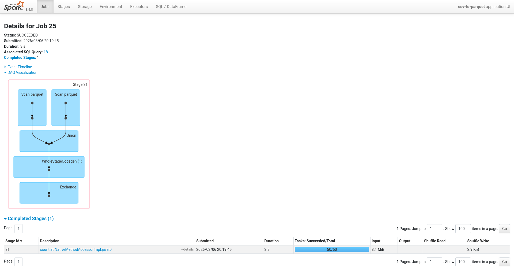

# Procesos por lotes

## SQL con Spark

* Vídeo original (en inglés): [SQL with Spark](https://www.youtube.com/watch?v=uAlp2VuZZPY&list=PL3MmuxUbc_hJed7dXYoJw8DoCuVHhGEQb&index=57)

Una de las grandes ventajas de Spark es que no necesitamos aprender una API nueva para hacer consultas complejas. Spark nos permite ejecutar **SQL** estándar directamente sobre nuestros _DataFrames_, lo que facilita mucho la vida a quienes ya están familiarizados con bases de datos relacionales.

En este artículo vamos a ver cómo combinar los datos de los taxis verdes y amarillos de Nueva York, registrarlos como una vista temporal y consultarlos con SQL para calcular métricas de ingresos mensuales por zona. Puedes consultar una versión interactiva de este artículo en formato cuaderno Jupyter en [sql-con.spark.ipynb](./pipelines/pyspark-pipeline/notebooks/sql-con.spark.ipynb).

### Crear la sesión de Spark

```python
import pyspark
import os
from pyspark.sql import SparkSession

spark = SparkSession.builder \
    .master(os.environ.get('SPARK_MASTER')) \
    .appName('sql-en-spark') \
    .getOrCreate()
```

Lo primero es siempre crear la sesión de Spark. Aquí usamos la variable de entorno `SPARK_MASTER` para apuntar al nodo maestro del clúster. El nombre de la aplicación (`appName`) es el que veremos en la interfaz gráfica de Spark.

### Leer los datos en formato Parquet

```python
df_green = spark.read.parquet('/data/parquet/green/*/*')
df_yellow = spark.read.parquet('/data/parquet/yellow/*/*')
```

Leemos todos los archivos Parquet de los taxis verdes y amarillos. El patrón `/*/*` nos permite recorrer los subdirectorios de año y mes sin tener que especificar cada ruta manualmente.

### Inspeccionar los esquemas

```python
df_green.printSchema()
df_yellow.printSchema()
```

Antes de combinar dos _DataFrames_, conviene revisar sus esquemas. Aquí notamos que las columnas de fecha y hora tienen nombres distintos: los taxis verdes usan `lpep_pickup_datetime` y `lpep_dropoff_datetime`, mientras que los amarillos usan `tpep_pickup_datetime` y `tpep_dropoff_datetime`. Para poder combinar ambos conjuntos de datos, necesitaremos unificar esos nombres.

### Encontrar las columnas comunes

```python
set(df_green.columns) & set(df_yellow.columns)
```

Usamos la intersección de conjuntos de Python para encontrar las columnas que comparten ambos _DataFrames_. Esto nos da la lista de campos que podemos seleccionar de los dos sin preocuparnos por diferencias de esquema.

En este punto, las columnas de fecha y hora todavía no aparecen en la intersección porque tienen nombres distintos en cada _DaraFrame_.

### Renombrar las columnas de fecha y hora

```python
df_green = df_green.withColumnRenamed('lpep_pickup_datetime', 'pickup_datetime')
df_green = df_green.withColumnRenamed('lpep_dropoff_datetime', 'dropoff_datetime')

df_yellow = df_yellow.withColumnRenamed('tpep_pickup_datetime', 'pickup_datetime')
df_yellow = df_yellow.withColumnRenamed('tpep_dropoff_datetime', 'dropoff_datetime')
```

Con `withColumnRenamed` le damos a las columnas de fecha un nombre común en ambos _DataFrames_. Si volvemos a calcular la intersección de columnas tras este cambio, veremos que `pickup_datetime` y `dropoff_datetime` ya aparecen.

### Definir las columnas a seleccionar

```python
sorted_columns = [
    'VendorID',
    'pickup_datetime',
    'dropoff_datetime',
    'store_and_fwd_flag',
    'RatecodeID',
    'PULocationID',
    'DOLocationID',
    'passenger_count',
    'trip_distance',
    'fare_amount',
    'extra',
    'mta_tax',
    'tip_amount',
    'tolls_amount',
    'improvement_surcharge',
    'total_amount',
    'payment_type',
    'congestion_surcharge',
]
```

Definimos la lista de columnas que nos interesa. Esta lista solo incluye las columnas comunes, descartando las que son exclusivas de cada tipo de taxi (como `trip_type` o `ehail_fee`, que solo existen en los taxis verdes).

### Combinar los dos DataFrames en uno

```python
from pyspark.sql import functions as F

df_green_select = df_green \
    .select(sorted_columns) \
    .withColumn('service_type', F.lit('green'))

df_yellow_select = df_yellow \
    .select(sorted_columns) \
    .withColumn('service_type', F.lit('yellow'))

df_trips = df_green_select.unionAll(df_yellow_select)

df_trips.groupBy('service_type').count().show()
```

Aquí hacemos varias cosas a la vez:

1. Seleccionamos solo las columnas que nos interesan con `select(sorted_columns)`.
2. Añadimos una columna `service_type` con `F.lit(...)` para identificar el origen de cada registro. `lit` crea una columna con un valor constante (una cadena de texto literal).
3. Combinamos los dos _DataFrames_ con `unionAll`, que apila las filas de ambos en uno solo.
4. Verificamos el resultado con un `groupBy` y `count` para confirmar cuántos registros hay de cada tipo.

La salida nos confirma los datos combinados:

```
+------------+------------+
|service_type|       count|
+------------+------------+
|       green|   8.348.567|
|      yellow| 124.048.218|
+------------+------------+
```



### Registrar el DataFrame como vista temporal

```python
df_trips.createOrReplaceTempView('trips')
```

Esta es la clave para poder usar SQL en Spark. `createOrReplaceTempView` registra el _DataFrame_ como una vista temporal con el nombre que le indiquemos. A partir de aquí podemos referirnos a él como si fuera una tabla en cualquier consulta SQL.

> [!NOTE]
> La vista es temporal. Solo existe mientras dure la sesión de Spark.

### Consultar la vista con SQL

```python
spark.sql('SELECT PULocationID, DOLocationID, pickup_datetime, service_type FROM trips').head(5)
```

Con `spark.sql(...)` ejecutamos cualquier consulta SQL estándar sobre las vistas registradas. El resultado es un _DataFrame_ normal de Spark, así que podemos encadenarle cualquier operación adicional.

### Definir una consulta de agregación

```python
grouped_trips = """
SELECT
    -- Criterios de agrupación
    PULocationID AS revenue_zone,
    DATE_TRUNC('month', pickup_datetime) AS revenue_month,
    service_type,

    -- Ingresos
    SUM(fare_amount) AS revenue_monthly_fare,
    SUM(extra) AS revenue_monthly_extra,
    SUM(mta_tax) AS revenue_monthly_mta_tax,
    SUM(tip_amount) AS revenue_monthly_tip_amount,
    SUM(tolls_amount) AS revenue_monthly_tolls_amount,
    SUM(improvement_surcharge) AS revenue_monthly_improvement_surcharge,
    SUM(total_amount) AS revenue_monthly_total_amount,
    SUM(congestion_surcharge) AS revenue_monthly_congestion_surcharge,

    -- Otras métricas
    AVG(passenger_count) AS avg_monthly_passenger_count,
    AVG(trip_distance) AS avg_monthly_trip_distance
FROM
    trips
GROUP BY
    revenue_zone, revenue_month, service_type
"""
```

Aquí vemos una de las grandes ventajas de usar SQL en Spark: podemos escribir consultas complejas con una sintaxis familiar. Esta consulta agrupa los viajes por zona de recogida, mes y tipo de servicio, y calcula la suma de cada componente del importe total más algunas medias.

`DATE_TRUNC('month', pickup_datetime)` trunca la fecha al primer día del mes, lo que nos permite agrupar todos los viajes de un mismo mes independientemente del día exacto.

### Ejecutar la consulta

```python
df_grouped = spark.sql(grouped_trips)
```

Pasamos la cadena SQL a `spark.sql(...)` y obtenemos un _DataFrame_ con los resultados de la agregación. Al igual que cualquier transformación en Spark, esto se evalúa de forma perezosa: el trabajo real no ocurre hasta que ejecutemos una acción sobre `df_grouped`.

### Escribir el resultado en Parquet

```python
df_grouped.coalesce(1).write.parquet('/data/report/revenue', mode='overwrite')
```

Guardamos el resultado final en un único archivo Parquet. `coalesce(1)` reduce el número de particiones a una sola antes de escribir, lo que es útil cuando el resultado es lo suficientemente pequeño para caber en un archivo y queremos evitar que Spark lo divida en múltiples ficheros. El parámetro `mode='overwrite'` permite sobreescribir la carpeta de destino si ya existe.
