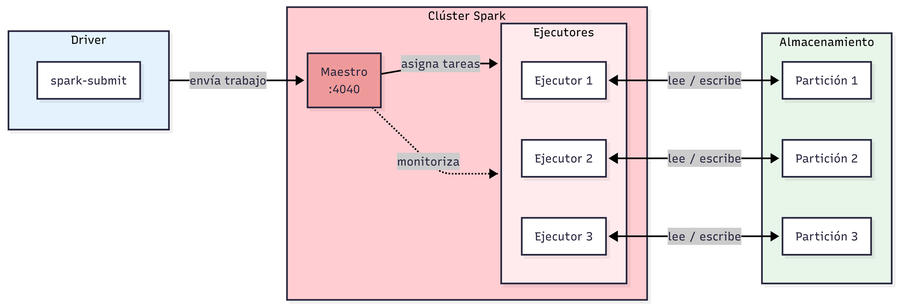

# Procesos por lotes

## Spark por dentro

### Anatomía de un clúster Spark

* Vídeo original (en inglés): [Anatomy of a Spark Cluster](https://www.youtube.com/watch?v=68CipcZt7ZA&list=PL3MmuxUbc_hJed7dXYoJw8DoCuVHhGEQb&index=58&feature=youtu.be)

Hasta ahora hemos ejecutado Spark en modo local, donde todo ocurre en un único ordenador. Al crear la sesión especificamos `master("local[*]")`, lo que le indica a Spark que cree un clúster simulado en la misma máquina. Pero en entornos reales, Spark se despliega sobre un **clúster** formado por varias máquinas que trabajan en paralelo.

### El driver

Cuando queremos ejecutar un trabajo en un clúster real, necesitamos algo que lo inicie. Ese algo es el **driver**: el proceso que envía el trabajo al clúster. El driver puede ser:

* Nuestra propia máquina, si lanzamos el trabajo desde la terminal.
* Un operador de Airflow, si el trabajo está programado dentro de un DAG.
* Cualquier otro proceso que ejecute `spark-submit`.

```bash
spark-submit \
    --master spark://<host>:7077 \
    --py-files dependencies.zip \
    script.py
```

El comando `spark-submit` empaqueta el código y lo envía al clúster. En él especificamos la dirección del maestro y los recursos que necesita el trabajo.

### El maestro

El **maestro** (_Spark Master_) es el nodo coordinador del clúster. Su función es:

* Recibir los trabajos que envía el driver.
* Distribuir las tareas entre los ejecutores disponibles.
* Hacer un seguimiento del estado de cada ejecutor y reasignar tareas si alguno falla.

El maestro expone una interfaz web, normalmente en el puerto `4040`, donde podemos ver en tiempo real qué trabajos están en ejecución y cómo están distribuidas las tareas.

El maestro debe estar siempre activo. Si un ejecutor cae, el maestro lo detecta y redistribuye su trabajo entre los demás; si el maestro cae, el clúster deja de funcionar.

### Los ejecutores

Los **ejecutores** son las máquinas que realizan el trabajo real. Cuando el maestro recibe un trabajo, lo divide en tareas y las asigna a los ejecutores disponibles.

Recordemos que un _DataFrame_ en Spark se compone de **particiones**, y cada partición no es más que un archivo Parquet. Cuando se ejecuta un trabajo:

1. El maestro asigna una partición a cada ejecutor.
2. Cada ejecutor descarga su partición desde el almacenamiento.
3. El ejecutor procesa la partición y marca la tarea como completada.
4. El ejecutor recibe la siguiente partición disponible y repite el proceso.

Así, todas las particiones de un _DataFrame_ se procesan en paralelo, repartidas entre los ejecutores del clúster.

### Almacenamiento: HDFS frente a la nube

Históricamente, los datos en un clúster Hadoop se almacenaban en **HDFS** (_Hadoop Distributed File System_), un sistema de ficheros distribuido donde los propios ejecutores guardaban los datos localmente, con redundancia entre nodos. La idea principal era la **localidad del dato**: en lugar de mover datos grandes hacia el código, se movía el código hacia los datos.

Esto tenía sentido cuando las redes eran lentas y los datos eran enormes en comparación con el código. Si cada partición pesa 100 MB y el código pesa 10 MB, es más eficiente enviar el código al nodo que ya tiene el dato.

Sin embargo, hoy en día la situación ha cambiado:

* Los clústeres Spark y los servicios de almacenamiento en la nube (S3, Google Cloud Storage) suelen estar en el mismo centro de datos.
* Las redes internas son muy rápidas, por lo que descargar una partición de 100 MB es casi tan rápido como leerla del disco local.
* El almacenamiento en la nube elimina la necesidad de mantener HDFS y reduce la complejidad operativa del clúster.

Por eso, el enfoque moderno es mantener los datos en el almacenamiento en la nube y dejar que los ejecutores los descarguen cuando los necesiten.

### Resumen



La arquitectura de un clúster Spark tiene tres actores principales:

* **Driver**: lanza el trabajo y lo envía al maestro. Puede ser nuestra máquina, Airflow u otro orquestador.
* **Maestro**: coordina la ejecución, distribuye tareas entre ejecutores y gestiona los fallos.
* **Ejecutores**: procesan los datos. Cada uno trabaja sobre una partición del _DataFrame_ a la vez.

Los datos se leen desde el almacenamiento en la nube al inicio del trabajo y los resultados se escriben de vuelta al terminar.

### `GroupBy` en Spark

* Vídeo original (en inglés): [GroupBy in Spark](https://youtu.be/9qrDsY_2COo&list=PL3MmuxUbc_hJed7dXYoJw8DoCuVHhGEQb&index=59)

Ahora vamos a calcular los ingresos por hora y zona de recogida para los taxis de Nueva York. Aprovecharemos para entender cómo ejecuta Spark un `GroupBy` internamente, porque el mecanismo que usa tiene consecuencias directas sobre el rendimiento de nuestros trabajos. Puedes consultar una versión interactiva en formato cuaderno Jupyter en [groupby_en_spark.ipynb](./pipelines/pyspark-pipeline/notebooks/groupby_en_spark.ipynb).

#### Calcular los ingresos de los taxis verdes

```python
import pyspark
from pyspark.sql import SparkSession

spark = SparkSession.builder \
    .master("local[*]") \
    .appName('test') \
    .getOrCreate()

df_green = spark.read.parquet('data/pq/green/*/*')
df_green.createOrReplaceTempView('green')
```

Leemos los datos de los taxis verdes y los registramos como vista temporal con `createOrReplaceTempView`. A partir de aquí podemos referirnos a ellos por nombre en cualquier consulta SQL.

```python
df_green_revenue = spark.sql("""
SELECT
    date_trunc('hour', lpep_pickup_datetime) AS hour,
    PULocationID AS zone,

    SUM(total_amount) AS amount,
    COUNT(1) AS number_records
FROM
    green
WHERE
    lpep_pickup_datetime >= '2020-01-01 00:00:00'
GROUP BY
    1, 2
""")
```

La consulta agrupa los viajes por hora y zona de recogida y calcula dos métricas: la suma de los importes totales y el número de viajes. `date_trunc('hour', ...)` trunca la marca de tiempo al inicio de la hora, de modo que todos los viajes de una misma hora queden en el mismo grupo. El `GROUP BY 1, 2` hace referencia a las dos primeras columnas del `SELECT` por posición. El filtro descarta registros erróneos de fechas anteriores a 2020.

```python
df_green_revenue \
    .repartition(20) \
    .write.parquet('data/report/revenue/green', mode='overwrite')
```

Antes de escribir el resultado llamamos a `repartition(20)`. Tras un `GroupBy`, Spark produce por defecto 200 particiones de salida, lo que en conjuntos de datos pequeños genera 200 ficheros minúsculos. Reducirlos a 20 es más manejable. En la interfaz de Spark este paso de reparticionado aparece como una tercera etapa adicional, ya que también requiere redistribuir los datos.

#### Calcular los ingresos de los taxis amarillos

El proceso es idéntico para los taxis amarillos. La única diferencia es el nombre de la columna de fecha y hora: `tpep_pickup_datetime` en lugar de `lpep_pickup_datetime`.

```python
df_yellow = spark.read.parquet('data/pq/yellow/*/*')
df_yellow.createOrReplaceTempView('yellow')

df_yellow_revenue = spark.sql("""
SELECT
    DATE_TRUNC('hour', tpep_pickup_datetime) AS hour,
    PULocationID AS zone,

    SUM(total_amount) AS amount,
    COUNT(1) AS number_records
FROM
    yellow
WHERE
    tpep_pickup_datetime >= '2020-01-01 00:00:00'
GROUP BY
    1, 2
""")

df_yellow_revenue \
    .repartition(20) \
    .write.parquet('data/report/revenue/yellow', mode='overwrite')
```

#### Cómo funciona `GroupBy` por dentro

Cuando ejecutamos un `GroupBy` en Spark, la interfaz nos muestra que el trabajo se divide en **dos etapas**. Entender por qué ayuda a tomar mejores decisiones de rendimiento.

Imaginemos que nuestro _DataFrame_ tiene tres particiones distribuidas entre varios ejecutores.

**Etapa 1: pre-agregación por partición**

Cada ejecutor trabaja de forma independiente sobre sus propias particiones. Primero aplica el filtro para descartar registros no deseados y después realiza un `GroupBy` inicial **dentro de su partición**. El resultado son subresultados parciales: una fila por cada combinación de clave `(hora, zona)` que aparece en esa partición, con las métricas ya sumadas parcialmente.

| Partición | Clave | Métricas |
| --- | --- | --- |
| 1.1 | hora 1, zona 1 | 100, 5 viajes |
| 1.1 | hora 1, zona 2 | 200, 10 viajes |
| 1.2 | hora 1, zona 1 | 50, 2 viajes |
| 1.2 | hora 1, zona 2 | 250, 11 viajes |
| 1.3 | hora 1, zona 1 | 200, 10 viajes |

Cada ejecutor ha reducido considerablemente el volumen de datos, pero todavía hay filas duplicadas con la misma clave repartidas entre distintas particiones.

**_Shuffle_: redistribución por clave**

A continuación Spark realiza el **_shuffle_**: redistribuye todas las filas de modo que los registros con la misma clave acaben en la misma partición. Este paso implica transferir datos por la red entre ejecutores y es la operación más costosa del proceso. Internamente se implementa mediante un _external merge sort_, un algoritmo de ordenación distribuida que garantiza que dentro de cada partición resultante los registros están ordenados por clave.

| Partición | Clave | Métricas |
| --- | --- | --- |
| 2.1 | hora 1, zona 1 | 100, 5 viajes |
| 2.1 | hora 1, zona 1 | 50, 2 viajes |
| 2.1 | hora 1, zona 1 | 200, 10 viajes |
| 2.2 | hora 1, zona 2 | 200, 10 viajes |
| 2.2 | hora 1, zona 2 | 250, 11 viajes |

**Etapa 2: agregación final**

Con todos los subresultados de una misma clave reunidos en la misma partición, Spark realiza la **agregación final**: combina las filas con igual clave en una sola y suma los valores parciales.

| Partición | Clave | Métricas |
| --- | --- | --- |
| 3.1 | hora 1, zona 1 | 350, 17 viajes |
| 3.2 | hora 1, zona 2 | 450, 21 viajes |

En resumen: la etapa 1 reduce el volumen de datos dentro de cada partición; el _shuffle_ reúne las claves iguales; la etapa 2 produce el resultado definitivo. Cuanto más agresiva sea la reducción en la etapa 1, menos datos hay que mover en el _shuffle_ y más rápido es el trabajo en conjunto.

> [!NOTE]
> Si añadimos un `ORDER BY` a la consulta, aparece una tercera etapa en la interfaz. Spark implementa la ordenación con el mismo mecanismo de _shuffle_ para garantizar que los resultados globales están ordenados, no solo dentro de cada partición.

### `Join` en Spark

* Vídeo original (en inglés): [Joins in Spark](https://youtu.be/lu7TrqAWuH4&list=PL3MmuxUbc_hJed7dXYoJw8DoCuVHhGEQb&index=60)

Ahora queremos combinar los dos _DataFrames_ en una única tabla y enriquecerla con el nombre de cada zona. Puedes consultar una versión interactiva en formato cuaderno Jupyter en [join_en_spark.ipynb](./pipelines/pyspark-pipeline/notebooks/join_en_spark.ipynb).

#### Unir los ingresos de taxis verdes y amarillos

Antes de unir los dos _DataFrames_, renombramos sus columnas para distinguir el origen de cada métrica:

```python
df_green_revenue = spark.read.parquet('/data/report/revenue/green')
df_yellow_revenue = spark.read.parquet('/data/report/revenue/yellow')

df_green_revenue_tmp = df_green_revenue \
    .withColumnRenamed('amount', 'green_amount') \
    .withColumnRenamed('number_records', 'green_number_records')

df_yellow_revenue_tmp = df_yellow_revenue \
    .withColumnRenamed('amount', 'yellow_amount') \
    .withColumnRenamed('number_records', 'yellow_number_records')
```

Leemos los resultados que materializamos en el artículo anterior y renombramos las columnas `amount` y `number_records` de cada _DataFrame_. Sin este paso, al unirlos tendríamos dos columnas llamadas `amount` y no sabríamos cuál es de cada tipo de taxi.

```python
df_join = df_green_revenue_tmp.join(
    df_yellow_revenue_tmp,
    on=['hour', 'zone'],
    how='outer'
)

df_join.write.parquet('/data/report/revenue/total', mode='overwrite')
```

Usamos `how='outer'` porque queremos conservar todas las combinaciones de hora y zona, independientemente de si aparecen en los datos de taxis verdes, en los de amarillos o en ambos. Si una combinación solo existe en un lado, el otro tendrá `null`. Con `how='inner'` perderíamos todas las filas que no tienen pareja en el otro _DataFrame_.

#### Cómo funciona `Join` por dentro

Cuando los dos _DataFrames_ son grandes, Spark utiliza el algoritmo _sort merge join_. El mecanismo es muy similar al del `GroupBy` que vimos antes.

**Etapa 1: asignar clave a cada registro**

Cada ejecutor recorre sus particiones y añade a cada registro la clave compuesta sobre la que se va a hacer el `Join`. En nuestro caso, `(hour, zone)`. El resultado es una lista de pares `(clave, registro)` para cada _DataFrame_.

**_Shuffle_: reunir claves iguales**

A continuación se produce el **_shuffle_**: Spark redistribuye los registros de ambos _DataFrames_ de modo que todos los que comparten la misma clave acaben en la misma partición. El algoritmo subyacente es el mismo _external merge sort_ que vimos en el `GroupBy`, lo que garantiza que los registros dentro de cada partición quedan ordenados por clave.

**Etapa 2: combinar los pares**

Con todos los registros de la misma clave reunidos en la misma partición, Spark los combina en uno solo. Si la clave existe en ambos _DataFrames_, se produce una fila completa. Si solo existe en uno de los dos, el comportamiento depende del tipo de _join_: en un `outer` se rellena con `null`; en un `inner` se descarta.

En la interfaz de Spark este tipo de _join_ aparece etiquetado explícitamente como _SortMergeJoin_. El coste principal está en el _shuffle_: cuantos más datos haya que redistribuir, más lento es el trabajo.

#### Enriquecer con datos de zonas

El segundo tipo de _join_ se produce cuando uno de los dos _DataFrames_ es muy pequeño. Queremos añadir el nombre de cada zona a nuestra tabla de ingresos:

```python
df_join = spark.read.parquet('/data/report/revenue/total')
df_zones = spark.read.csv('/data/homework/raw/taxi_zone_lookup.csv', header=True)

df_result = df_join.join(df_zones, df_join.zone == df_zones.LocationID)
df_result.drop('LocationID', 'zone').write.parquet('/data/revenue-zones')
```

Al ejecutar este trabajo, la interfaz de Spark muestra algo llamativo: **solo hay una etapa**, no dos. Esto se debe a que Spark detecta automáticamente que `df_zones` es una tabla muy pequeña y aplica una estrategia diferente: el _broadcast join_.

En lugar de redistribuir los datos de ambos _DataFrames_ mediante un _shuffle_, Spark envía una copia completa de la tabla pequeña a cada ejecutor. Así, cada ejecutor tiene localmente toda la información de zonas y puede resolver el `Join` para cada registro de `df_join` con una simple búsqueda en memoria, sin necesidad de mover datos por la red.

Al no haber _shuffle_, el _broadcast join_ es considerablemente más rápido que el _sort merge join_. La operación que aparece en la interfaz es _BroadcastHashJoin_.

> [!NOTE]
> Spark decide automáticamente cuándo usar _broadcast join_ basándose en el tamaño estimado de los _DataFrames_. Si queremos forzarlo manualmente, podemos usar `broadcast()` de `pyspark.sql.functions`:
> ```python
> from pyspark.sql.functions import broadcast
> df_result = df_join.join(broadcast(df_zones), df_join.zone == df_zones.LocationID)
> ```
