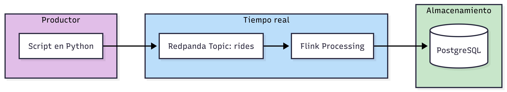

# Procesos en tiempo real

## Introducción a Kafka y Flink

* Vídeo original (en inglés): [Stream Processing with PyFlink](https://www.youtube.com/live/YDUgFeHQzJU)

Mientras que el procesamiento por lotes agrupa datos durante un período de tiempo y los procesa juntos, el **procesamiento en tiempo real** (o _streaming_) opera sobre cada evento en el momento en que se produce. No hay espera, no hay ventanas temporales fijas: los datos fluyen de forma continua y el sistema reacciona a medida que llegan.

Este módulo está dedicado a construir un flujo de datos en tiempo real completo usando dos herramientas clave: [**Kafka**](https://kafka.apache.org) (a través de [**Redpanda**](https://www.redpanda.com), un reemplazo compatible) y [**Apache Flink**](https://flink.apache.org), con su API de Python, PyFlink.

### ¿Qué es el procesamiento en tiempo real?

En el procesamiento en tiempo real, los datos no se acumulan para procesarse después: **cada evento desencadena una acción inmediata**. Por ejemplo, cuando un pasajero llama a un taxi a través de una aplicación, su teléfono genera un evento que describe el viaje: ubicación de recogida, destino, distancia estimada, importe. Ese evento puede enviarse a un sistema centralizado para que múltiples consumidores lo procesen en paralelo: uno lo guarda en el lago de datos, otro actualiza un panel de datos en tiempo real, otro detecta posibles fraudes.

La diferencia con el procesamiento por lotes no es solo de velocidad: es de **arquitectura**. En el modelo por lotes, los datos se procesan cuando hay suficientes o cuando llega la hora programada. En tiempo real, el procesamiento ocurre de forma continua, sin esperar a que se acumule nada.

### ¿Cuándo se usan realmente los procesos en tiempo real?

Antes de adoptar Flink y Kafka en producción, conviene ser honesto sobre las necesidades reales. La verdad es que **la mayoría de los casos de uso de datos no requieren tiempo real**. Los paneles de gestión que se actualizan cada hora, los informes diarios o los pipelines hacia un data warehouse funcionan perfectamente con procesamiento por lotes.

El streaming tiene sentido cuando se necesita reaccionar a los datos en segundos o minutos, no en horas. Algunos ejemplos legítimos son la detección de fraude en pagos, la monitorización de sistemas en tiempo real, los sistemas de recomendación que se actualizan con el comportamiento inmediato del usuario, o la agregación de métricas operativas de alta frecuencia.

### ¿Qué es Kafka?

[Apache Kafka](https://kafka.apache.org) es una plataforma de mensajería distribuida orientada a eventos. Su modelo es simple pero potente: existe un **broker** (el servidor de Kafka) que gestiona una serie de **tópicos**. Un tópico es como una cola persistente con nombre, un canal por el que fluyen eventos de un tipo determinado.

Los **productores** son los procesos que escriben eventos en un tópico. Los **consumidores** son los procesos que leen esos eventos. Lo que hace a Kafka especialmente útil es que múltiples consumidores pueden leer del mismo tópico de forma independiente, cada uno con su propio puntero (llamado *offset*) que indica por dónde va leyendo. Esto permite que varios sistemas procesen el mismo flujo de datos sin interferirse.

Kafka fue diseñado para volumen y durabilidad: los eventos se persisten en disco durante un período configurable, lo que permite reprocesar datos históricos o recuperarse de fallos simplemente ajustando el offset del consumidor.

### Redpanda: Kafka sin la complejidad

Kafka está implementado en Java y, aunque es muy robusto, puede ser complicado de poner en marcha localmente. Para aprender o hacer pruebas, existe **Redpanda**: una implementación del protocolo Kafka escrita en C++ que es mucho más ligera y fácil de configurar.

La clave es que Redpanda es **completamente compatible con el protocolo de Kafka**: cualquier productor, consumidor o herramienta que funcione con Kafka funcionará igual con Redpanda sin cambiar una sola línea de código. Para nuestros propósitos prácticos, la diferencia entre ambos es irrelevante.

### Conceptos clave de Kafka

Antes de entrar en código, conviene fijar el vocabulario:

* **Broker**: el servidor de Kafka (o Redpanda) que almacena los tópicos y sirve a productores y consumidores.
* **Tópico** (*topic*): un canal con nombre por el que fluyen eventos de un tipo. En nuestro caso usaremos un tópico llamado `rides` para los viajes de taxi.
* **Productor** (*producer*): proceso que escribe eventos en un tópico. Serializa los datos (típicamente a JSON o Avro) y los envía al broker.
* **Consumidor** (*consumer*): proceso que lee eventos de un tópico. Lleva la cuenta de qué eventos ya ha procesado mediante un *offset*.
* **Grupo de consumidores** (*consumer group*): permite que varios consumidores colaboren leyendo distintas particiones del mismo tópico, o que consumidores independientes lean el mismo tópico con sus propios offsets.
* **Partición** (*partition*): cada tópico se divide en particiones, que son la unidad de paralelismo de Kafka. Dentro de una partición, el orden de los mensajes está garantizado.
* **Offset**: número de secuencia que identifica la posición de un mensaje dentro de una partición. Los consumidores leen desde un offset y avanzan su puntero a medida que procesan mensajes.

### El pipeline que construiremos

A lo largo de este módulo construiremos un pipeline de streaming con datos de taxis de Nueva York. La arquitectura es la siguiente:

Empezaremos con algo sencillo: un productor y un consumidor escritos directamente en Python, sin más intermediarios. Después veremos las limitaciones de este enfoque y las resolveremos con Flink, que nos dará tolerancia a fallos, agregaciones temporales y gestión de eventos tardíos.
