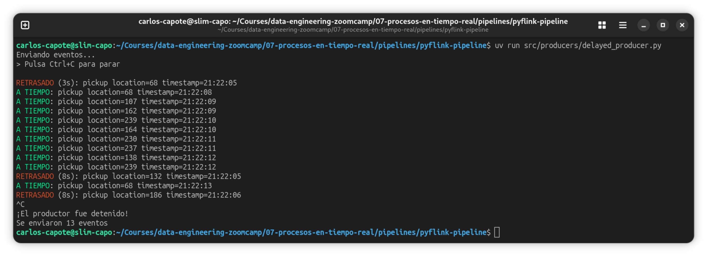

# Procesos en tiempo real

## Procesamiento con PyFlink

* Vídeo original (en inglés): [Stream Processing with PyFlink](https://www.youtube.com/live/YDUgFeHQzJU?si=dHTe1WrEPBRQ5Wkq&t=3170)

[Apache Flink](https://flink.apache.org) es una plataforma de procesamiento de flujos diseñada para entornos de producción exigentes. A diferencia de un consumidor Kafka escrito directamente en Python, Flink gestiona de forma automática la tolerancia a fallos, el escalado, las reintentos ante errores y el procesamiento correcto de eventos desordenados. Se estructura como un **clúster** de procesos que ejecutan trabajos de forma continua, similar en espíritu a como Spark gestiona el procesamiento por lotes.

### Arquitectura de Flink

Un clúster Flink tiene dos tipos de componentes:

* **JobManager**: el coordinador. Recibe los trabajos enviados, los divide en tareas y decide en qué nodo ejecutarlas. También gestiona los checkpoints y la recuperación ante fallos.
* **TaskManager**: el ejecutor. Es la máquina (o contenedor) que realiza el trabajo real. Puede tener varios *slots*, que son unidades de ejecución paralela. Un TaskManager con 15 slots puede ejecutar hasta 15 tareas simultáneamente.

Esta separación es análoga a la de Spark (con su driver y sus executors), y refleja el modelo maestro-trabajador común en sistemas distribuidos.

### Añadir Flink al entorno

Flink lo añadimos mediante el fichero [`docker-compose.flink.yml`](./pipelines/pyflink-pipeline/docker-compose.flink.yml) con dos servicios adicionales. Ambos usan la misma imagen Docker personalizada que construiremos a continuación:

```yaml
services:
  jobmanager:
    build:
      context: .
      dockerfile: flink.Dockerfile
    command: jobmanager
    ports:
      - ${FLINK_JOBMANAGER_PORT:-8081}:8081
    volumes:
      - ./:/opt/flink/usrlib
      - ./src/:/opt/src
    environment:
      - |
        FLINK_PROPERTIES=
        jobmanager.rpc.address: jobmanager

  taskmanager:
    build:
      context: .
      dockerfile: flink.Dockerfile
    command: taskmanager
    volumes:
      - ./src/:/opt/src
    depends_on:
      - jobmanager
    environment:
      - |
        FLINK_PROPERTIES=
        jobmanager.rpc.address: jobmanager
        taskmanager.numberOfTaskSlots: 15
        parallelism.default: 3
```

El JobManager expone su interfaz web en el puerto `8081`. Los volúmenes montan la carpeta `src/` en `/opt/src` dentro del contenedor, de modo que los trabajos Python que escribamos localmente sean accesibles desde el clúster.

### La imagen Docker personalizada

Flink está desarrollado en Scala sobre la JVM, pero expone una API de Python (PyFlink) que permite escribir trabajos sin conocer Java ni Scala. Sin embargo, PyFlink requiere que la imagen del contenedor tenga Python instalado y, además, ciertos conectores JAR descargados para poder comunicarse con Kafka y PostgreSQL.

El [`flink.Dockerfile`](./pipelines/pyflink-pipeline/flink.Dockerfile) hace exactamente esto:

```dockerfile
FROM flink:2.2.0-scala_2.12-java17

USER root

RUN mkdir -p /opt/flink && \
    mkdir -p /opt/pyflink && \
    chown flink:flink /opt/flink && \
    chown flink:flink /opt/pyflink

USER flink

COPY --from=ghcr.io/astral-sh/uv:latest /uv /bin/

WORKDIR /opt/pyflink
COPY pyproject.flink.toml pyproject.toml
RUN uv python install 3.12 && uv sync
ENV PATH="/opt/pyflink/.venv/bin:$PATH"

WORKDIR /opt/flink/lib
RUN wget https://repo.maven.apache.org/maven2/org/apache/flink/flink-json/2.2.0/flink-json-2.2.0.jar; \
    wget https://repo1.maven.org/maven2/org/apache/flink/flink-sql-connector-kafka/4.0.1-2.0/flink-sql-connector-kafka-4.0.1-2.0.jar; \
    wget https://repo.maven.apache.org/maven2/org/apache/flink/flink-connector-jdbc-core/4.0.0-2.0/flink-connector-jdbc-core-4.0.0-2.0.jar; \
    wget https://repo.maven.apache.org/maven2/org/apache/flink/flink-connector-jdbc-postgres/4.0.0-2.0/flink-connector-jdbc-postgres-4.0.0-2.0.jar; \
    wget https://repo1.maven.org/maven2/org/postgresql/postgresql/42.7.10/postgresql-42.7.10.jar

WORKDIR /opt/flink
COPY flink-config.yaml conf/config.yaml
```

Los **conectores JAR** son librerías Java que Flink necesita para hablar con sistemas externos. Sin ellos, Flink no sabría cómo leer de Kafka ni cómo escribir en PostgreSQL. Cada sistema destino (S3, BigQuery, MySQL…) requeriría sus propios conectores.

El fichero [`pyproject.flink.toml`](./pipelines/pyflink-pipeline/pyproject.flink.toml) solo declara una dependencia Python:

```toml
[project]
name = "pyflink-workshop"
requires-python = ">=3.12"
dependencies = ["apache-flink==2.2.0"]
```

Finalmente, el fichero [`flink-config.yaml`](./pipelines/pyflink-pipeline/flink-config.yaml) establece la configuración de Flink.

Para construir la imagen y levantar todos los servicios hemos añadido un comando **make**:

```bash
make build
```

La interfaz web de Flink queda accesible en http://localhost:8081, donde podemos ver los slots disponibles y los trabajos en ejecución.

### La Table API de PyFlink

PyFlink ofrece varias APIs. La que usaremos es la **Table API**, que permite describir las fuentes y destinos de datos mediante DDL (lenguaje de definición de datos, similar a SQL) y expresar las transformaciones con SQL estándar. Esta API es especialmente conveniente para conectar sistemas de mensajería con bases de datos porque la mayor parte de la configuración es declarativa.

En PyFlink, tanto la fuente (Kafka) como el destino (PostgreSQL) se definen como tablas virtuales. Flink las mapea internamente a los sistemas reales usando los conectores JAR que instalamos.

### Trabajo de paso directo de Kafka a PostgreSQL

El primer trabajo que crearemos, [`pass_through_job.py`](./pipelines/pyflink-pipeline/src/jobs/pass_through_job.py), es un **paso directo** (_pass-through_): lee eventos del tópico Kafka y los inserta en PostgreSQL sin modificarlos. Es el equivalente exacto del consumidor Python con escritura a base de datos que vimos anteriormente, pero ahora con la robustez de Flink.

```python
from pyflink.datastream import StreamExecutionEnvironment
from pyflink.table import EnvironmentSettings, StreamTableEnvironment

def create_events_source_kafka(t_env):
    t_env.execute_sql("""
        CREATE TABLE events (
            PULocationID INTEGER,
            DOLocationID INTEGER,
            trip_distance DOUBLE,
            total_amount DOUBLE,
            tpep_pickup_datetime BIGINT
        ) WITH (
            'connector' = 'kafka',
            'properties.bootstrap.servers' = 'redpanda:29092',
            'topic' = 'rides',
            'scan.startup.mode' = 'latest-offset',
            'format' = 'json'
        )
    """)
    return 'events'

def create_processed_events_sink_postgres(t_env):
    t_env.execute_sql("""
        CREATE TABLE processed_events (
            PULocationID INTEGER,
            DOLocationID INTEGER,
            trip_distance DOUBLE,
            total_amount DOUBLE,
            pickup_datetime TIMESTAMP
        ) WITH (
            'connector' = 'jdbc',
            'url' = 'jdbc:postgresql://postgres:5432/postgres',
            'table-name' = 'processed_events',
            'username' = 'postgres',
            'password' = 'postgres',
            'driver' = 'org.postgresql.Driver'
        )
    """)
    return 'processed_events'

def log_processing():
    env = StreamExecutionEnvironment.get_execution_environment()
    env.enable_checkpointing(10 * 1000)

    t_env = StreamTableEnvironment.create(
        env, EnvironmentSettings.new_instance().in_streaming_mode().build()
    )

    source = create_events_source_kafka(t_env)
    sink = create_processed_events_sink_postgres(t_env)

    t_env.execute_sql(f"""
        INSERT INTO {sink}
        SELECT
            PULocationID,
            DOLocationID,
            trip_distance,
            total_amount,
            TO_TIMESTAMP_LTZ(tpep_pickup_datetime, 3) AS pickup_datetime
        FROM {source}
    """).wait()

if __name__ == '__main__':
    log_processing()
```

Hay un detalle importante sobre las direcciones del broker: en la definición de la tabla Kafka usamos `redpanda:29092` (el puerto interno del contenedor), no `localhost:9092`. Esto es porque el trabajo se ejecuta **dentro del contenedor de Flink**, que se comunica con Redpanda a través de la red interna de Docker. El `localhost:9092` solo funciona desde el host.

La conversión `TO_TIMESTAMP_LTZ(tpep_pickup_datetime, 3)` transforma el timestamp en milisegundos que almacenamos en el evento (un `BIGINT`) en un timestamp de PostgreSQL con zona horaria.

### Enviar un trabajo al clúster

Los trabajos PyFlink se envían al clúster mediante el comando `flink run`, ejecutado dentro del contenedor del JobManager:

```bash
docker compose \
    -f docker-compose.yml \
    -f docker-compose.flink.yml \
    exec jobmanager \
    ./bin/flink run \
    -py /opt/src/jobs/pass_through_job.py \
    --pyFiles /opt/src \
    -d
```

* `-py`: ruta al fichero Python del trabajo.
* `--pyFiles`: directorio adicional que se pone en el `PYTHONPATH` del trabajo, necesario para que pueda importar `models.py` y otras dependencias locales.
* `-d`: modo desacoplado (*detached*), el comando retorna inmediatamente sin esperar a que el trabajo termine.

Para simplificar la ejecución, también hemos definido un atajo con **make**:

```bash
make run-pass
```

Tras enviar el trabajo, la interfaz web mostrará el job en estado *RUNNING*. En ese momento podemos arrancar el productor Python desde el host y veremos los datos aparecer en PostgreSQL casi en tiempo real.

### Agregación por ventanas temporales

Hasta ahora hemos replicado lo que podríamos hacer con Python puro. La diferencia real de Flink se aprecia cuando necesitamos **agregaciones con semántica de tiempo de evento**: cuántos viajes hubo por zona de recogida en cada hora, actualizado continuamente a medida que llegan nuevos eventos.

Flink llama a esto **ventanas temporales** (*windows*). Una **ventana de tumbling** (*tumbling window*) divide el tiempo en intervalos fijos y no solapados: todos los eventos que lleguen entre las 12:00 y las 13:00 pertenecen a la ventana de las 12:00, los de las 13:00 a las 14:00 a la siguiente, y así sucesivamente.

Para poder agrupar eventos por ventanas temporales necesitamos dos cosas: una **columna de tiempo de evento** (el momento en que el evento ocurrió, no cuando llegó al sistema) y un **watermark** que le diga a Flink cuánta tolerancia tiene para eventos tardíos. El trabajo [`aggregate_job.py`](./pipelines/pyflink-pipeline/src/jobs/aggregate_job.py) es un ejemplo de esto.

```python
from pyflink.datastream import StreamExecutionEnvironment
from pyflink.table import EnvironmentSettings, StreamTableEnvironment

def create_events_source_kafka(t_env):
    table_name = "events"
    source_ddl = f"""
        CREATE TABLE {table_name} (
            PULocationID INTEGER,
            DOLocationID INTEGER,
            trip_distance DOUBLE,
            total_amount DOUBLE,
            tpep_pickup_datetime BIGINT,
            event_timestamp AS TO_TIMESTAMP_LTZ(tpep_pickup_datetime, 3),
            WATERMARK for event_timestamp as event_timestamp - INTERVAL '5' SECOND
        ) WITH (
            'connector' = 'kafka',
            'properties.bootstrap.servers' = 'redpanda:29092',
            'topic' = 'rides',
            'scan.startup.mode' = 'earliest-offset',
            'properties.auto.offset.reset' = 'earliest',
            'format' = 'json'
        );
        """
    t_env.execute_sql(source_ddl)
    return table_name

def create_events_aggregated_sink(t_env):
    table_name = 'processed_events_aggregated'
    sink_ddl = f"""
        CREATE TABLE {table_name} (
            window_start TIMESTAMP(3),
            PULocationID INT,
            num_trips BIGINT,
            total_revenue DOUBLE,
            PRIMARY KEY (window_start, PULocationID) NOT ENFORCED
        ) WITH (
            'connector' = 'jdbc',
            'url' = 'jdbc:postgresql://postgres:5432/postgres',
            'table-name' = '{table_name}',
            'username' = 'postgres',
            'password' = 'postgres',
            'driver' = 'org.postgresql.Driver'
        );
        """
    t_env.execute_sql(sink_ddl)
    return table_name

def log_aggregation():
    # Configurar el entorno
    env = StreamExecutionEnvironment.get_execution_environment()
    env.enable_checkpointing(10 * 1000)
    env.set_parallelism(3)

    # Crear la tabla de entorno
    settings = EnvironmentSettings.new_instance().in_streaming_mode().build()
    t_env = StreamTableEnvironment.create(env, environment_settings=settings)

    # Crear las tablas de Kafka
    source_table = create_events_source_kafka(t_env)
    aggregated_table = create_events_aggregated_sink(t_env)

    t_env.execute_sql(f"""
    INSERT INTO {aggregated_table}
    SELECT
        window_start,
        PULocationID,
        COUNT(*) AS num_trips,
        SUM(total_amount) AS total_revenue
    FROM TABLE(
        TUMBLE(TABLE {source_table}, DESCRIPTOR(event_timestamp), INTERVAL '5' MINUTE)
    )
    GROUP BY window_start, PULocationID;
    """).wait()

if __name__ == '__main__':
    log_aggregation()
```

* La columna `event_timestamp` es una **columna calculada** que se obtiene convirtiendo el timestamp en milisegundos. La cláusula `WATERMARK FOR event_timestamp AS event_timestamp - INTERVAL '5' SECOND` declara que Flink tolerará eventos con hasta 5 segundos de retraso.

* `TUMBLE(TABLE events, DESCRIPTOR(event_timestamp), INTERVAL '5' MINUTE)` le dice a Flink que agrupe los eventos en ventanas de una hora basadas en `event_timestamp`. Flink emitirá el resultado de cada ventana cuando esté seguro de que ya no llegarán más eventos para esa ventana, es decir, cuando el watermark supere el final de la ventana.

Para registrar el trabajo en Flink podemos, o bien lanzar:

```bash
docker compose \
    -f docker-compose.yml \
    -f docker-compose.flink.yml \
    exec jobmanager \
    ./bin/flink run \
    -py /opt/src/jobs/aggregate_job.py \
    --pyFiles /opt/src \
    -d
```

O usar el atajo **make**:

```bash
make run-aggregate
```

### Watermarks y eventos tardíos

El concepto de **watermark** es uno de los más importantes (y al principio más confusos) del procesos en tiempo real. En un sistema de proceso en tiempo real ideal, los eventos llegarían en el mismo orden en que ocurrieron. En la realidad, esto no ocurre: problemas de red, colas saturadas o simplemente retrasos hacen que los eventos lleguen desordenados. Un evento que ocurrió a las 12:00 puede llegar al sistema a las 12:05.

El **tiempo de procesamiento** es el momento en que el evento llega al sistema. El **tiempo de evento** es el momento en que el evento ocurrió en el mundo real. Flink puede trabajar con ambos, pero el tiempo de evento es el que tiene semántica correcta para análisis.

Un **watermark** es una marca que avanza progresivamente por el flujo de datos y que significa: "estoy bastante seguro de que todos los eventos con tiempo anterior a este watermark ya han llegado". Cuando el watermark supera el final de una ventana temporal, Flink considera esa ventana cerrada y emite su resultado.

La declaración `WATERMARK FOR event_timestamp AS event_timestamp - INTERVAL '5' SECOND` significa que el watermark viaja 5 segundos por detrás del evento más reciente visto. Esto da un margen de tolerancia: un evento que llegue hasta 5 segundos tarde todavía será incluido en la ventana correcta.

¿Qué pasa con los eventos que llegan más tarde del margen de tolerancia? Flink los clasifica como **eventos tardíos** (*late data*). Por defecto los descarta, aunque es posible configurarlo para procesarlos de forma especial:

* actualizar el resultado de la ventana ya cerrada,
* enviarlos a un lado (*side output*),
* o ignorarlos.

### Productor en tiempo real con eventos tardíos

Para observar el comportamiento del watermark en acción, creamos un productor alternativo, [`delayed_producer.py`](./pipelines/pyflink-pipeline/src/producers/delayed_producer.py), que genera datos aleatoriamente y simula deliberadamente eventos tardíos:

```python
import dataclasses
import json
import random
import sys
import time
from datetime import datetime, timezone
from pathlib import Path
from kafka import KafkaProducer

sys.path.insert(0, str(Path(__file__).parent.parent))
from models import Ride, random_ride, ride_serializer

RED = "\033[91m"
GREEN = "\033[92m"
RESET = "\033[0m"

def generate_random_ride(delay_probability=0.2):
    if random.random() < delay_probability:
        delay = random.randint(3, 10)
        ride = random_ride(delay)
        timestamp = datetime.fromtimestamp(ride.tpep_pickup_datetime / 1000, tz=timezone.utc)
        print(f"{RED}RETRASADO{RESET} ({delay}s): pickup location={ride.PULocationID} timestamp={timestamp:%H:%M:%S}")
    else:
        ride = random_ride()
        timestamp = datetime.fromtimestamp(ride.tpep_pickup_datetime / 1000, tz=timezone.utc)
        print(f"{GREEN}A TIEMPO{RESET}: pickup location={ride.PULocationID} timestamp={timestamp:%H:%M:%S}")

    return ride

if __name__ == "__main__":
    producer = KafkaProducer(
        bootstrap_servers=['localhost:9092'],
        value_serializer=ride_serializer,
    )

    count = 0

    print("Enviando eventos...")
    print("> Pulsa Ctrl+C para parar\n")

    try:
        while True:
            ride = generate_random_ride()
            producer.send('rides', value=ride)
            count += 1
            time.sleep(0.5)
    except KeyboardInterrupt:
        print("\n¡El productor fue detenido!")
        print(f"Se enviaron {count} eventos")

    producer.flush()
```

Con este productor activo y el trabajo de agregación corriendo, podemos observar en la base de datos cómo Flink actualiza las ventanas al recibir eventos tardíos que todavía caen dentro del margen de tolerancia (≤5 segundos), y cómo descarta los que llegan demasiado tarde.



Para lanzar el productor de eventos retrasados hemos creado un atajo **make**:

```bash
make delayed-events
```

### Checkpointing y tolerancia a fallos

La llamada `env.enable_checkpointing(10 * 1000)` en todos nuestros trabajos activa el mecanismo de **checkpointing** de Flink. Cada 10 segundos, Flink toma una instantánea consistente del estado de todos los operadores del trabajo (offsets de Kafka, acumuladores de ventanas, etc.) y la guarda en almacenamiento persistente.

Si un trabajo falla, Flink puede recuperarse desde el último checkpoint en lugar de empezar desde cero. Esto es lo que le da semántica de **procesamiento exactamente una vez** (*exactly-once*): cada evento se procesa exactamente una vez, incluso ante fallos del sistema.

Esta garantía es la diferencia fundamental entre un consumidor Python y un trabajo Flink en producción: el consumidor Python perdería eventos o los procesaría dos veces ante un reinicio; el trabajo Flink se recupera automáticamente sin pérdida de datos ni duplicados.
