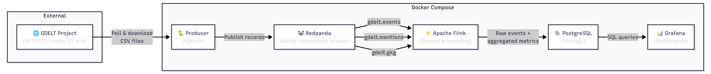

# Real-Time GDELT Event Stream Analysis

A fully local and reproducible pipeline for ingesting, processing, and visualizing global events from the [GDELT Project](https://www.gdeltproject.org/) in near real-time. Everything runs in Docker, so no cloud accounts required.

## What is GDELT?

The **Global Database of Events, Language and Tone** (GDELT) monitors news media worldwide and extracts structured data about global events, people, organizations, themes, and sentiment. GDELT 2.0 publishes three datasets as CSV files every **15 minutes**:

| Dataset     | Description |
|-------------|-------------|
| **Events**  | Who did what to whom, where, and when. Includes actor codes, event types ([CAMEO taxonomy](http://data.gdeltproject.org/documentation/CAMEO.Manual.1.1b3.pdf)), geographic coordinates, and a Goldstein conflict/cooperation scale. |
| **Mentions** | Every news article that references an event, with publication timestamps. Tracks how stories spread through global media over time. |
| **GKG** (Global Knowledge Graph) | Entities, themes, emotions, and counts extracted from articles. Connects people, organizations, locations, and topics. |

The data source is updated every 15 minutes, lists the latest CSV files for all three tables:

- http://data.gdeltproject.org/gdeltv2/lastupdate.txt

The file looks like this:

```csv
48976 ebf5fad8ed2e59f211b27e9e785be8ff http://data.gdeltproject.org/gdeltv2/20260403100000.export.CSV.zip
66555 c349f402d4aea4827c6e51e228286385 http://data.gdeltproject.org/gdeltv2/20260403100000.mentions.CSV.zip
3311301 561211ce6b0abb5fac76988fff540acb http://data.gdeltproject.org/gdeltv2/20260403100000.gkg.csv.zip
```

## Architecture



### Components

| Component | Technology | Role |
|-----------|-----------|------|
| **Orchestrator** | Kestra | Triggers the producer every 15 minutes via a scheduled flow. Provides observability, retry logic, and execution history through its web UI. |
| **Producer** | Python | Downloads the latest GDELT CSV files, parses them, and publishes records to Redpanda topics. Executed as a Kestra task. |
| **Broker** | Redpanda | Kafka-compatible message broker. Receives raw events and serves them to Flink. Lightweight, single-binary, no JVM. |
| **Stream processor** | Apache Flink | Consumes events from Redpanda, applies windowed aggregations (event counts by country, conflict trends, actor analysis), and writes results to PostgreSQL. |
| **Storage** | PostgreSQL | Stores both raw events and pre-aggregated metrics for Grafana to query. |
| **Dashboard** | Grafana | Visualizes global event trends, conflict hotspots, top actors, and media attention in near real-time. |

### Redpanda Topics

| Topic | Content |
|-------|---------|
| `gdelt.events` | Parsed event records (actor codes, event type, location, tone). |
| `gdelt.mentions` | Article mentions with timestamps and source metadata. |
| `gdelt.gkg` | GKG records: themes, persons, organizations, tone, locations. |

## Dashboard Panels

- **Global Event Map**: Geolocated events plotted on a world map, colored by Goldstein scale (conflict ↔ cooperation).
- **Event Volume**: Time-series of events per 15-minute window, broken down by event root code.
- **Conflict Trend**: Rolling average of the Goldstein scale by country or region.
- **Top Actors**: Bar chart of most active actors in the current time window.
- **Media Attention**: Number of mentions over time for selected events, showing how stories propagate.
- **Tone Analysis**: Average tone by country or theme from the GKG data.

## Project Structure

- **docker-compose.yml**: Definition of all the services with default values
- **kestra/**: Orchestration
    - **flows/**: YAML flow definitions
        - **gdelt_ingest.yml**: Scheduled flow that triggers the producer every 15 minutes
- **producer/**: Data ingest and publication
    - **Dockerfile**
    - **pyproject.toml**: Python dependencies (requests, kafka-python-ng)
    - **main.py**: Orchestration of the download and publication
    - **gdelt.py**: Download and parsing logic
- **flink/**: Data processing
    - **Dockerfile**
    - **jobs/**: Aggregation tasks
        - **event_aggregations.py**: Counding and trends
        - **gkg_aggregations.py**: Theme and tone analysis
- **sql/**: Database
    - **init.sql**: PostgreSQL scheme (raw and aggregated tables)
- **grafana/**: Visualization
    - **provisioning/**: Datasource and dashboards
    - **Dockerfile**
- **README.md**: Project

## Tech Stack

| Tool | Version | Why |
|------|---------|-----|
| **Kestra** | 1.3 | Workflow orchestrator with scheduling, retries, and a built-in UI. Triggers the producer on a 15-minute cron. |
| **Python** | 3.12 | Producer scripts and Flink jobs. |
| **Redpanda** | 25.3 | Kafka API-compatible broker, zero-JVM, trivial Docker setup. |
| **Apache Flink** | 1.20 | Windowed stream processing with exactly-once semantics. |
| **PostgreSQL** | 18.3 | Reliable, widely available relational storage. |
| **Grafana** | 12.4 | Dashboards with native PostgreSQL support and geo-map panels. |
| **Docker / Compose** |  | Single `docker compose up` to run everything. |

### Python Dependencies (kept minimal)

| Package | Purpose |
|---------|---------|
| `requests` | Download GDELT CSV files over HTTP. |
| `kafka-python-ng` | Produce messages to Redpanda (Kafka protocol). |
| `apache-flink` | Write Flink stream processing jobs in Python (PyFlink). |

## Getting Started

### Prerequisites

- Docker and Docker Compose

### Configuration

All ports, credentials, and tuning knobs are configurable via environment variables with sensible defaults. See [`env.example`](env.example) for the full list. To override any value, copy the file and uncomment what you need:

```bash
cp env.example .env
# edit .env as needed
```

### Run

```bash
git clone https://github.com/elcapo/data-engineering-zoomcamp/
cd data-engineering-zoomcamp/proyecto-analisis-de-gdelt
docker compose up -d
```

This starts all services:

| Service | Port (by default) |
|---------|------|
| Kestra UI | `localhost:8082` |
| Redpanda Console | `localhost:8080` |
| Redpanda Broker (Kafka API) | `localhost:9092` |
| Flink Web UI | `localhost:8081` |
| PostgreSQL | `localhost:5432` |
| Grafana | `localhost:3000` (admin/admin) |

Kestra triggers the producer every 15 minutes. After the first execution, data flows through:

1. Kestra (orchestration)
2. Redpanda
3. Flink
4. PostgreSQL
5. Grafana

### Verify

```bash
# Check that topics have data
docker compose exec redpanda rpk topic consume gdelt.events --num 1

# Check PostgreSQL
docker compose exec postgres psql -U gdelt -c "SELECT count(*) FROM events;"

# Open Grafana
open http://localhost:3000
```

## GDELT Data Reference

- **GDELT 2.0 Event Codebook**: http://data.gdeltproject.org/documentation/GDELT-Event_Codebook-V2.0.pdf
- **GKG Codebook**: http://data.gdeltproject.org/documentation/GDELT-Global_Knowledge_Graph_Codebook-V2.1.pdf
- **CAMEO Event Codes**: http://data.gdeltproject.org/documentation/CAMEO.Manual.1.1b3.pdf
- **Last update file (entry point)**: http://data.gdeltproject.org/gdeltv2/lastupdate.txt
- **Master file list**: http://data.gdeltproject.org/gdeltv2/masterfilelist.txt