# Real-Time GDELT Event Stream Analysis

A fully local and reproducible pipeline for ingesting, processing, and visualizing global events from the [GDELT Project](https://www.gdeltproject.org/) in near real-time. Everything runs in Docker, so no cloud accounts required.

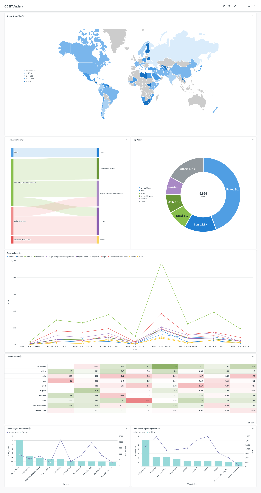

## What is GDELT?

The **Global Database of Events, Language and Tone** (GDELT) monitors news media worldwide and extracts structured data about global events, people, organizations, themes, and sentiment. GDELT 2.0 publishes three datasets as CSV files every **15 minutes**:

| Dataset     | Description |
|-------------|-------------|
| **Events**  | Who did what to whom, where, and when. Includes actor codes, event types ([CAMEO taxonomy](http://data.gdeltproject.org/documentation/CAMEO.Manual.1.1b3.pdf)), geographic coordinates, and a Goldstein conflict/cooperation scale. |
| **Mentions** | Every news article that references an event, with publication timestamps. Tracks how stories spread through global media over time. |
| **GKG** | Global Knowledge Graph of entities, themes, emotions, and counts extracted from articles. Connects people, organizations, locations, and topics. |

The data source is updated every 15 minutes, lists the latest CSV files for all three tables:

- http://data.gdeltproject.org/gdeltv2/lastupdate.txt

The file looks like this:

```csv
48976 ebf5fad8ed2e59f211b27e9e785be8ff http://data.gdeltproject.org/gdeltv2/20260403100000.export.CSV.zip
66555 c349f402d4aea4827c6e51e228286385 http://data.gdeltproject.org/gdeltv2/20260403100000.mentions.CSV.zip
3311301 561211ce6b0abb5fac76988fff540acb http://data.gdeltproject.org/gdeltv2/20260403100000.gkg.csv.zip
```

## Architecture

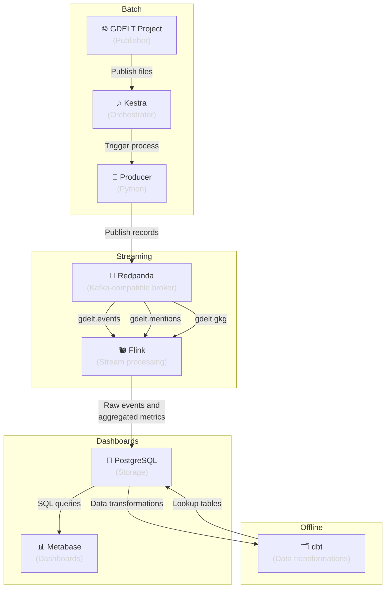

> If you have problems visualizing this diagram, check its pre-rendered version:
> [Pre-rendered version of the architecture diagram](./docs/resources/charts/architecture.png)

### Components

| Component | Technology | Version | Role |
|-----------|-----------|---------|------|
| **Orchestrator** | Kestra | 1.3.10 | Triggers the producer every 15 minutes via a scheduled flow. Provides observability, retry logic, and execution history through its web UI. |
| **Producer** | Python | 3.12 | Downloads the latest GDELT CSV files, parses them, and publishes records to Redpanda topics. Executed as a Kestra task. |
| **Broker** | Redpanda | 26.1.4 | Kafka-compatible message broker. Receives raw events and serves them to Flink. Lightweight, single-binary, no JVM. |
| **Stream processor** | Apache Flink | 1.20.3 | Consumes events from Redpanda, applies windowed aggregations, and writes results to PostgreSQL. |
| **Data transformations** | dbt | 1.11 | Owns the Postgres schema: loads CAMEO lookups as seeds and ensures Flink-target tables exist before stream jobs start. |
| **Storage** | PostgreSQL | 18.3 | Stores both raw events and pre-aggregated metrics for Metabase to query. |
| **DB admin UI** | pgAdmin | — | Web UI to inspect the PostgreSQL database, run ad-hoc queries, and browse tables during development. |
| **Dashboard** | Metabase | 0.59.6.5 | Visualizes global event trends, conflict hotspots, top actors, and media attention in near real-time. |

Build-time tooling: **Docker Compose** orchestrates all services, and **uv** installs Python dependencies for the producer and dbt images.

## Orchestrator: Kestra

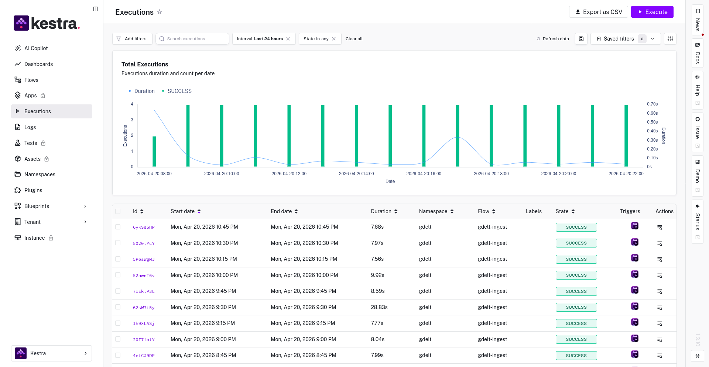

Kestra runs a scheduled flow that triggers the producer every 15 minutes. The flow definition lives under [`kestra/`](./kestra/) and is mounted into the Kestra container on startup. The web UI exposes execution history, logs, and manual replay for debugging individual runs.

## Producer: Python

The producer runs as two independent steps so Kafka never receives partial data:

- [**Download**](`producer/download.py`): fetches the three GDELT CSVs listed in `lastupdate.txt`, with aggressive retry against CDN 404s.
- [**Publish**](`producer/publish.py`): only starts once all three files are on disk, then parses and publishes records to Redpanda.

Source code, dependencies, and unit tests live under [`producer/`](./producer/).

## Broker: Redpanda

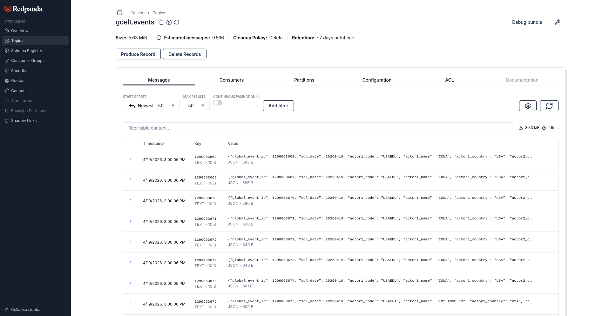

Kafka API-compatible, single-binary, no JVM. The producer publishes to three topics that Flink consumes:

| Topic | Content |
|-------|---------|
| `gdelt.events` | Parsed event records (actor codes, event type, location, tone). |
| `gdelt.mentions` | Article mentions with timestamps and source metadata. |
| `gdelt.gkg` | GKG records: themes, persons, organizations, tone, locations. |

## Stream Processor: Apache Flink

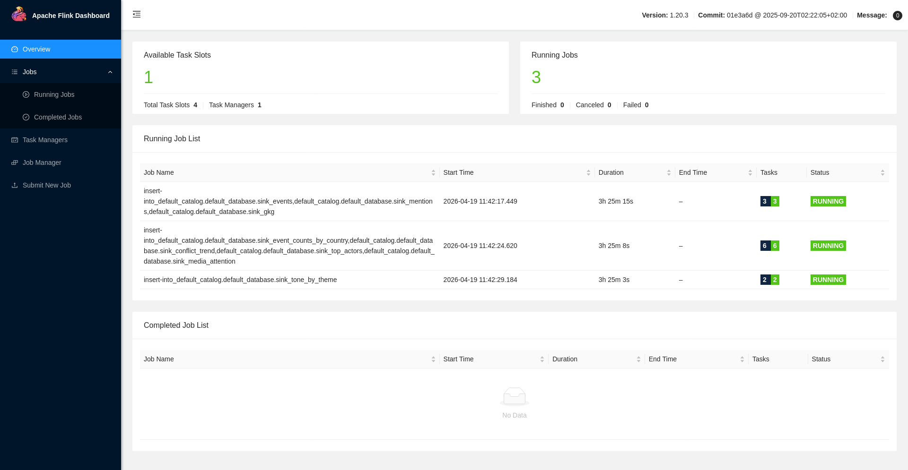

Three PyFlink jobs consume from Redpanda and write to PostgreSQL via JDBC. Source code lives under [`flink/jobs/`](./flink/jobs/).

| Job | Populates |
|-----|-----------|
| `raw_ingest` | `events`, `mentions`, `gkg` (raw mirror of the Kafka topics). |
| `event_aggregations` | `event_counts_by_country`, `conflict_trend`, `top_actors`, `media_attention`. |
| `gkg_aggregations` | `tone_by_theme`. |

Aggregations use tumbling windows with exactly-once semantics.

## Data Transformations: dbt

dbt owns the Postgres schema. It runs once at startup via the `dbt-init` service and:

- Loads CAMEO/GDELT reference codebooks as seeds into the `public_lookup` schema.
- Ensures the Flink-target tables exist before stream jobs start.

Models and seeds live under [`dbt/`](./dbt/).

## Storage: PostgreSQL

All downstream state lives in a single Postgres instance. Tables are grouped by how they are populated.

### Raw tables

The raw tables are populated by the `raw_ingest` Flink job, one row per record consumed from Kafka without transformations:

| Table | Content |
|-------|---------|
| `events` | Raw GDELT event records mirrored from `gdelt.events`. |
| `mentions` | Raw article mentions mirrored from `gdelt.mentions`. |
| `gkg` | Raw GKG records mirrored from `gdelt.gkg`. |

#### Table Partitions

> [!NOTE]
> Each raw table is **partitioned by month** on a TIMESTAMP column derived by Flink from the GDELT 14-digit timestamp.
>
> This keeps indexes small, enables partition pruning in dashboard queries, and lets old data be removed with `DROP PARTITION`.

Partitions are created automatically by the [`create_raw_tables`](./dbt/macros/create_raw_tables.sql) dbt macro on every `dbt run`. The window is configurable via dbt vars:

| Var | Default | Meaning |
|-----|---------|---------|
| `raw_partitions_months_back` | `1` | Months before the current month to pre-create. |
| `raw_partitions_months_forward` | `2` | Months after the current month to pre-create. |

A `DEFAULT` partition catches any row outside the window (e.g. replays of historical data).

### Aggregated tables

The aggregated tables are populated by the `event_aggregations` and `gkg_aggregations` Flink jobs via tumbling windows:

| Table | Content |
|-------|---------|
| `event_counts_by_country` | Event counts and average Goldstein scale per country and event root code, per window. |
| `conflict_trend` | Rolling average Goldstein scale by country, per window. |
| `top_actors` | Most active actors by event count, per window. |
| `media_attention` | Mention counts per event, per window. |
| `tone_by_theme` | Average tone per GKG theme, per window. |

### Lookup tables

The lookup tables are populated by dbt seeds (schema `public_lookup`), CAMEO/GDELT reference codebooks:

| Table | Rows | Content |
|-------|------|---------|
| `event_root_code` | 20 | Top-level CAMEO event categories (01–20). |
| `event_base_code` | 149 | 3-digit CAMEO subcategories with `event_root_code` parent. |
| `quad_class` | 4 | QuadClass cooperation/conflict buckets. |
| `action_geo_type` | 6 | Geocoding resolution types for event locations. |

## DB Admin UI: pgAdmin

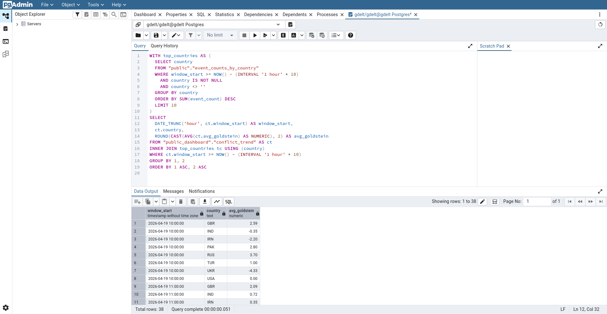

Web UI to inspect the database, run ad-hoc queries, and browse tables during development. Provisioning lives under [`pgadmin/`](./pgadmin/) and it takes care of the pre-configuration of pgAdmin so that as soon as your Docker containers are running, you can log in and run queries.

## Dashboard: Metabase

Metabase serves the end-user dashboards backed by the aggregated and lookup tables in Postgres.

### Initial Setup

The stack ships with a `metabase-init` service that provisions Metabase when the project is initialized via its REST API, so there is no onboarding to click through. On first start it:

1. Creates the admin user from `METABASE_USER` / `METABASE_PASSWORD`.
2. Registers the Postgres instance under the name **`GDELT Postgres`**.
3. Removes Metabase's default "Sample Database".
4. Triggers a schema sync so every Flink-populated table shows up in Metabase.

The provisioning is idempotent (it checks Metabase's `has-user-setup` property), so re-running `make up` is safe.

Once `make up` finishes, open `http://localhost:8084` and sign in; the Postgres connection is ready to query.

### Exporting and Importing Dashboards

This repo ships a pair of Python scripts that export/import a single dashboard (plus the cards it references) through the REST API, saving each as a JSON file under `metabase/export/`. What means that models, questions, and dashboards can be authored using the UI and then exported and imported in other environments.

```bash
make metabase-export DASHBOARD=1-gdelt-analysis
make metabase-import DIR=metabase/export/1-gdelt-analysis
```

- `metabase-export` exports a dashboard to the [metabase/export](./metabase/export/) folder, as the one pre-bundled with this repository.
- `metabase-import` creates new cards and dashboard (never updates existing). Optionally, it accepts a `SUFFIX` to be appended to names to avoid overwriting existing dashboards.

Database, table, and field ids differ between Metabase instances, so the export also snapshots the schema (names) of every referenced database and the import remaps ids by name match. The target instance must therefore have a database registered with the same name (e.g. `GDELT Postgres`) and the same table/column names as the source.

### Dashboard Panels

#### Global Event Map

Geolocated events plotted on a world map, colored by Goldstein scale (from conflict to cooperation).

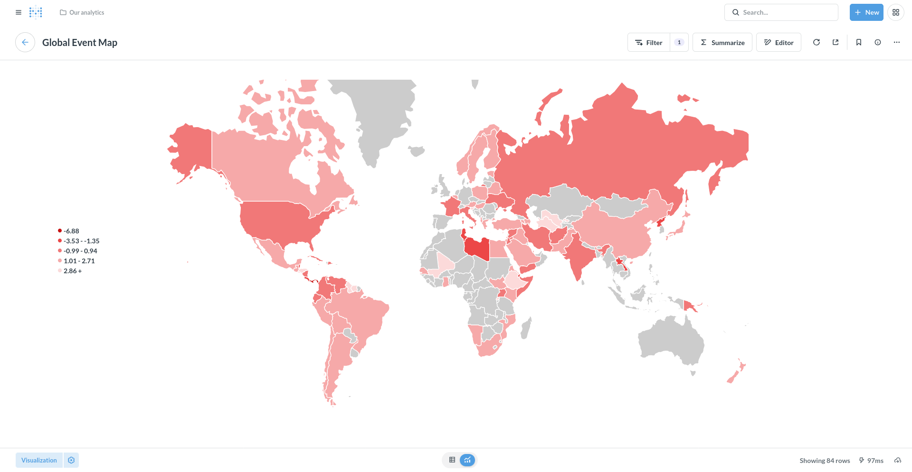

#### Event Volume

Time-series of events per hour window, broken down by event root code.

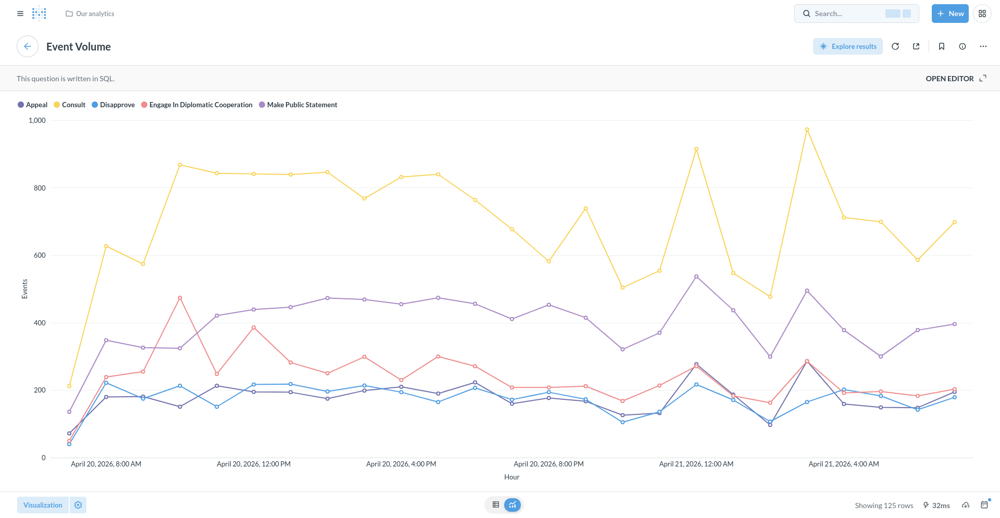

#### Conflict Trend

Rolling average of the Goldstein scale by country or region.

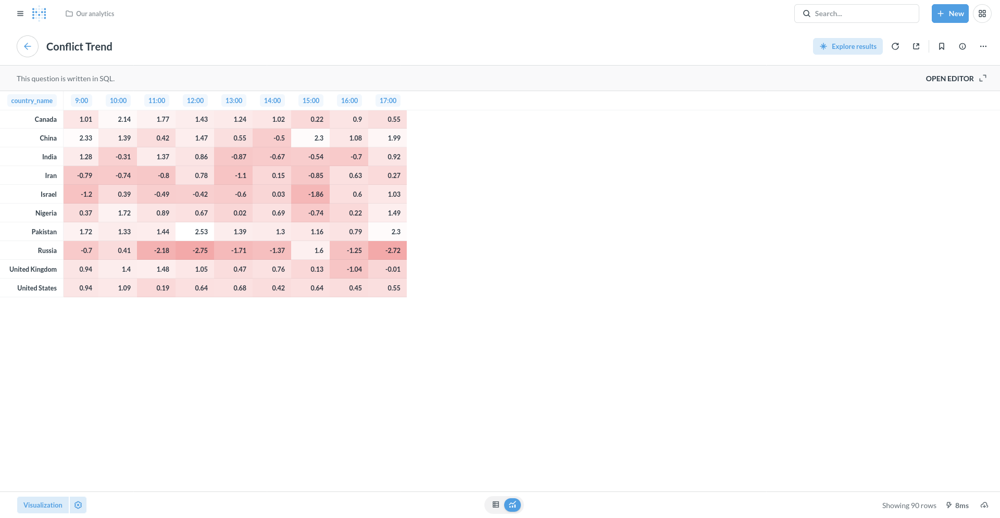

#### Top Actors

Most active actors in the recent news.

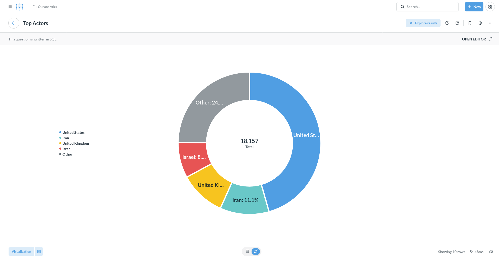

#### Media Attention

Regions and Topics where the Recent Media Attention is Focused.

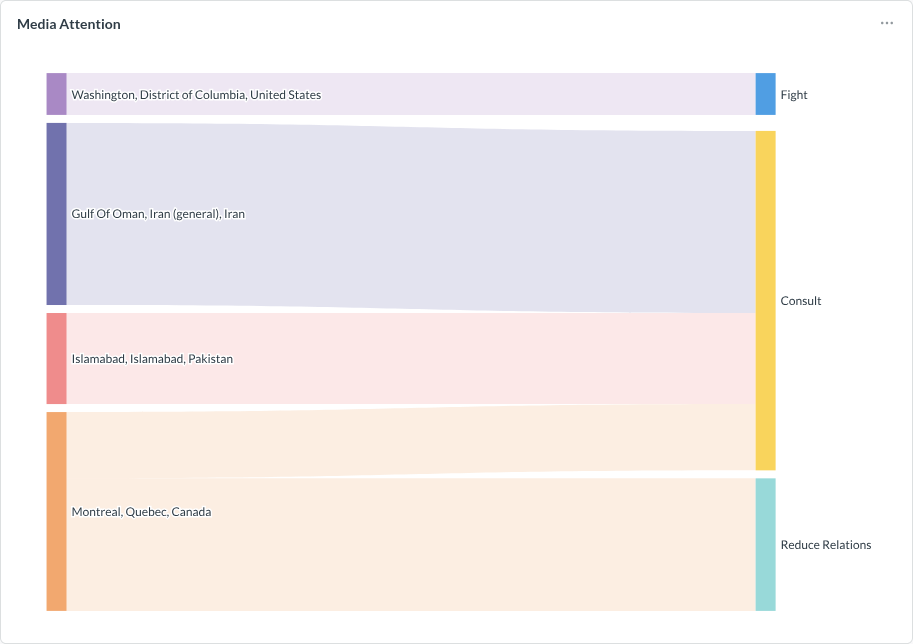

#### Tone Analysis per Person

Average tone by person from the GKG data.

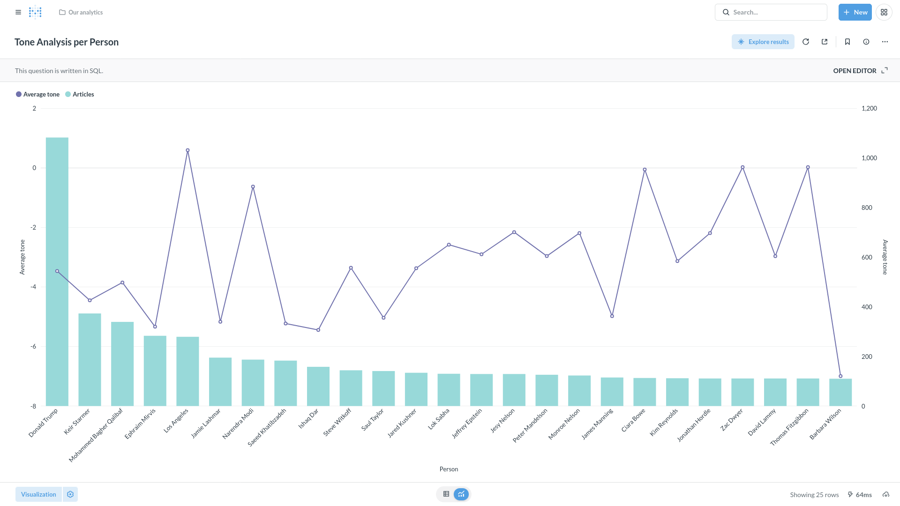

#### Tone Analysis per Organization

Average tone by organization from the GKG data.

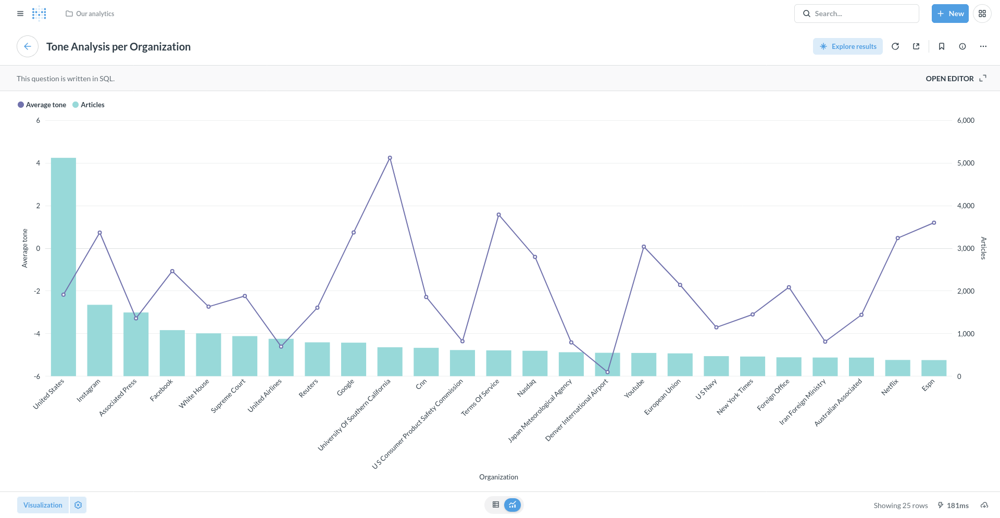

## Project Structure

- **docker-compose.yml**: All service definitions with default values.
- **kestra/**: Orchestration flows.
- **producer/**: Data ingest and publication scripts.
- **flink/**: Stream processing jobs.
- **dbt/**: Database schema and CAMEO lookup seeds.
- **metabase/**: Dashboard export/import scripts.
- **pgadmin/**: pgAdmin provisioning.
- **terraform/**: Cloud deployment skeletons.
- **docs/**: Resources and reference material.

## Getting Started

### Prerequisites

- Docker and Docker Compose.

### Configuration

All ports, credentials, and tuning knobs are configurable via environment variables with sensible defaults. See [`env.template`](env.template) for the full list.

### Make Targets

| Command | Effect |
|---------|--------|
| `make init` | Generate `.env` from `env.template` with random passwords.<br/>Runs automatically before `make up` if `.env` is missing. |
| `make up` | Build images and start the stack. |
| `make down` | Stop the stack. Volumes and `.env` are preserved. |
| `make reset` | Stop the stack and remove volumes and `.env`. |

Plain `docker compose up -d --build` also works, using the default passwords from `docker-compose.yml`.

### Run

```bash
git clone https://github.com/elcapo/data-engineering-zoomcamp/
cd data-engineering-zoomcamp/proyecto-analisis-de-gdelt
make up
```

Services and default ports:

| Service | URL | Credentials |
|---------|-----|-------------|
| Kestra UI | `localhost:8080` | `admin@kestra.io` / see `KESTRA_PASSWORD` in `.env` |
| Redpanda Console | `localhost:8081` | — |
| Redpanda Broker (Kafka API) | `localhost:9092` | — |
| Flink Web UI | `localhost:8082` | — |
| PostgreSQL | `localhost:5432` | `gdelt` / see `POSTGRES_PASSWORD` in `.env` |
| pgAdmin | `localhost:8083` | `admin@admin.com` / see `PGADMIN_PASSWORD` in `.env` |
| Metabase | `localhost:8084` | `admin@admin.com` / see `METABASE_PASSWORD` in `.env` |

Kestra triggers the producer every 15 minutes. To run the first ingestion immediately without waiting for the schedule:

```bash
mkdir -p /tmp/gdelt
docker compose run --rm -e OUTPUT_DIR=/data -v /tmp/gdelt:/data producer python /app/download.py
docker compose run --rm -e INPUT_DIR=/data -v /tmp/gdelt:/data producer python /app/publish.py
```

### Verify

```bash
# Check that topics have data
docker compose exec redpanda rpk topic consume gdelt.events --num 1

# Check PostgreSQL
docker compose exec postgres psql -U gdelt -c "SELECT count(*) FROM events;"

# Open Metabase
open http://localhost:8084
```

## Cloud Deployment

The project ships with a Terraform skeleton for a single virtual machine lift-and-shift on Google Cloud Platform (GCP). It provisions a Compute Engine VM with a persistent data disk, installs Docker on first boot and runs `make up` to bring the stack online.

```bash
cd terraform/gcp
cp terraform.tfvars.example terraform.tfvars
# edit terraform.tfvars: project_id, ssh_user, ssh_public_key, optionally allowed_app_cidrs

terraform init
terraform apply
```

The complete documentation is available at [`terraform/gcp/`](terraform/gcp/README.md).

## GDELT Data Reference

- **GDELT 2.0 Event Codebook**: http://data.gdeltproject.org/documentation/GDELT-Event_Codebook-V2.0.pdf
- **GKG Codebook**: http://data.gdeltproject.org/documentation/GDELT-Global_Knowledge_Graph_Codebook-V2.1.pdf
- **CAMEO Event Codes**: http://data.gdeltproject.org/documentation/CAMEO.Manual.1.1b3.pdf
- **Last update file (entry point)**: http://data.gdeltproject.org/gdeltv2/lastupdate.txt
- **Master file list**: http://data.gdeltproject.org/gdeltv2/masterfilelist.txt
