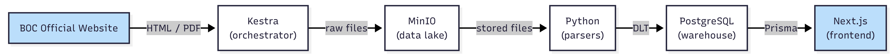
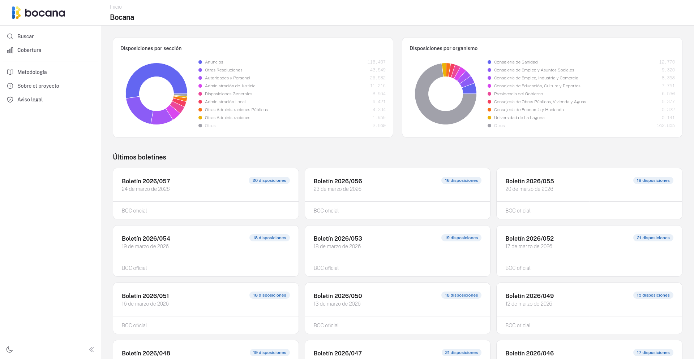
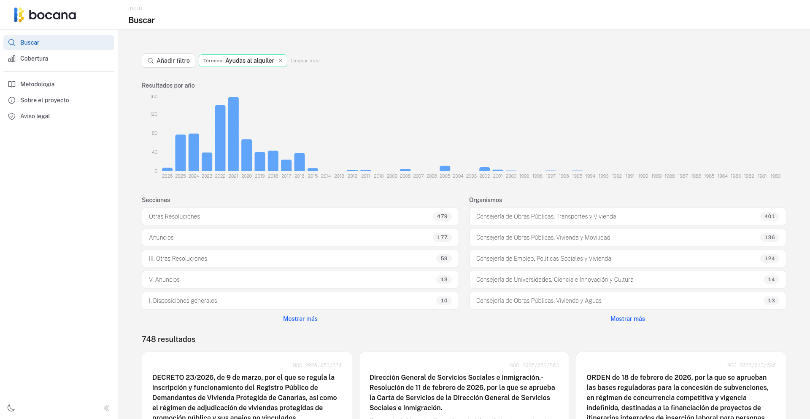
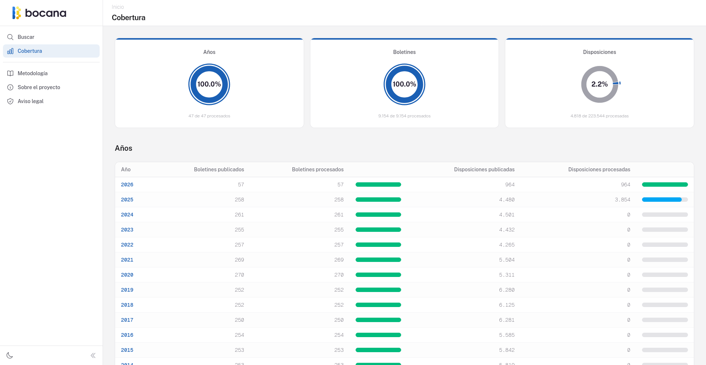

# Full-Text Search and Real-Time Analysis Project

The [Boletín Oficial de Canarias](https://www.gobiernodecanarias.org/boc/) (BOC) is the official gazette of the Canary Islands (Spain). It publishes thousands of dispositions every year: regulations, grants, public calls, resolutions, and announcements that directly affect citizens, businesses, lawyers, and journalists across the archipelago.

The problem is that the official website offers neither a complete index nor full-text search over the content of these dispositions. Finding a specific document among the more than 200,000 published since 1980 is slow and limited. Any systematic analysis of the data is unfeasible.

**Bocana** builds a platform that downloads, indexes, and makes the entire historical archive of the BOC accessible. Anyone can search the full text of any disposition published over the last four decades, with filters by date, section, issuing body, and boolean operators.

The live site is available at **[bocana.org](https://bocana.org)**.

<!-- TODO: screenshot of the home page -->

## Table of Contents

- [Architecture Overview](#architecture-overview)
- [Technologies Used](#technologies-used)
- [Data Pipeline](#data-pipeline)
- [Data Warehouse](#data-warehouse)
- [Dashboard and Visualizations](#dashboard-and-visualizations)
- [Reproducibility](#reproducibility)
- [Testing](#testing)
- [Project Structure](#project-structure)
- [Learning in Public](#learning-in-public)

## Architecture Overview

The project has two major blocks deployed on two virtual machines (VM) connected by an internal network:

1. **Data pipeline** (VM 1): Kestra orchestrates the hierarchical download of the BOC archive. Raw HTML documents are stored compressed in MinIO as a data lake. Python parsers extract text and metadata, and DLT loads the structured data into PostgreSQL.

2. **Web frontend** (VM 2): A Next.js application with Prisma connects directly to PostgreSQL. It offers full-text search, browsing by year and bulletin, and data quality dashboards.



## Technologies Used

| Component | Technology | Purpose |
|-----------|-----------|---------|
| Orchestration | [Kestra](https://kestra.io/) | Workflow orchestration for all download, extraction, backfill, and tracking flows |
| Data lake | [MinIO](https://min.io/) | S3-compatible object storage for raw HTML and converted Markdown |
| Data loading | [DLT](https://dlthub.com/) | Schema management and idempotent merge into PostgreSQL |
| Parsing | [BeautifulSoup](https://pypi.org/project/beautifulsoup4/)<br/>[pdfplumber](https://pypi.org/project/pdfplumber/) | HTML and PDF parsing, structured data extraction |
| Data warehouse | [PostgreSQL](https://www.postgresql.org/) | Structured storage, full-text search (tsvector/tsquery), metric views |
| Frontend | [Next.js](https://nextjs.org/) | Server-rendered React application |
| ORM | [Prisma](https://www.prisma.io/) | Type-safe database access |
| Styling | [Tailwind CSS](https://tailwindcss.com/) | Utility-first CSS framework |
| Charts | [Recharts](https://recharts.org/) | Pie charts and bar charts for data visualization |
| Containerization | [Docker](https://www.docker.com/) | All services defined as code, identical local and production environments |
| Reverse proxy | [Traefik](https://traefik.io/) | TLS termination with Let's Encrypt in production |
| Testing | [pytest](https://pytest.org/) + [Vitest](https://vitest.dev/) | Pipeline and frontend testing |

> [!NOTE]
> Although the repository documentation is in Spanish, all flow names, variable names, file names, and code are written in English. This document was written so that no other document was needed.

## Data Pipeline

The BOC archive has a four-level hierarchy: **years → bulletins → dispositions → full text**. Each level must be scanned to discover what exists in the next one, making a simple "download everything at once" approach impossible.

### Flow Organization (Batches with Trackers)

The 19 Kestra flows (defined in [`pipeline/flows/`](../../pipeline/flows/)) are organized into four categories:

- **Downloads** — Atomic flows that download a single resource and store it compressed in MinIO. They check for existing files before downloading, making them safe to re-run. Each download automatically triggers its corresponding extraction.
- **Extractions** — Parse raw HTML (or PDF) from MinIO using Python modules, then load structured data into PostgreSQL via DLT with idempotent merge.
- **Backfills** — Explicit loops over configurable ranges (e.g., "download bulletins 1 through 250 of year 2024") that reuse the atomic download flows. Designed this way because BOC bulletins don't follow a fixed calendar.
- **Trackers** — Query PostgreSQL views that detect years with pending downloads or extractions and trigger the necessary backfills automatically.

A single scheduled flow runs at midnight to import each day's new publications.

### Python Parsers

All extraction logic lives in independent, tested Python packages (in [`pipeline/python/`](../../pipeline/python/)):

| Package | Purpose |
|---------|---------|
| `archive-parser` | Extracts available years from the general index |
| `year-parser` | Extracts bulletins for a given year |
| `issue-parser` | Extracts dispositions from a bulletin's HTML index |
| `document-parser` | Converts a disposition's HTML to Markdown with structured metadata |
| `issue-reader` | Extracts dispositions from PDF-only bulletins (older issues without HTML) |

Each parser implements a **format detection system**: since the BOC website has used different HTML structures over four decades, each parser registers its known variants and the system automatically selects the appropriate one.

### Raw Data Preservation

Every downloaded file is stored as-is in MinIO, organized in an immutable bucket (`boc-raw`). Parsed Markdown documents go to a second bucket (`boc-markdown`). If the parsing logic changes, all data can be reprocessed without re-downloading.

```
boc-raw/
 ├── archive/archive.html
 ├── years/2024.html
 ├── issues/2024-001.html
 └── documents/2024/001/001.html
```

## Data Warehouse

PostgreSQL serves as both the data warehouse and the search engine. The schema is organized in two schemas:

- **`boc_dataset`** — The structured data: years, bulletins, dispositions (with full text), sections, and organizations.
- **`boc_log`** — Download and extraction logs used to track pipeline progress.

### Full-Text Search

Each disposition has a generated column that combines title and body, tokenized using PostgreSQL's **Spanish language configuration**. GIN indexes over these columns enable millisecond searches across 200,000+ documents. The frontend translates user queries into `tsquery` expressions with support for:

- Prefix matching (e.g., "subvención" matches "subvenciones")
- Boolean operators (AND, NOT)
- Filters by section, issuing body, date range, and exact bulletin reference
- Contextual excerpts with highlighted terms via `ts_headline()`

### SQL as Independent Files

All SQL definitions (schemas, tables, views, metrics) live in [`pipeline/sql/`](../../pipeline/sql/) as standalone `.sql` files, copied into the Docker image alongside the Python modules. This keeps YAML for orchestration, Python for processing, and SQL for queries — each language in its place.

## Dashboard and Visualizations

The frontend at [bocana.org](https://bocana.org) serves as both a search interface and a dashboard. Rather than using a separate BI tool, all visualizations are built directly into the Next.js application using Recharts.

### Categorical Distribution Charts (Home Page)



The home page displays two **pie charts** showing the distribution of dispositions by categorical variables:

- **Dispositions by section** — Shows how dispositions are distributed across the BOC's official sections (e.g., "Autoridades y Personal", "Anuncios", etc.).
- **Dispositions by issuing body** — Shows the top organizations by number of published dispositions.

Both charts are interactive: clicking on a slice navigates to the search page pre-filtered by that section or organization.

### Dynamic Temporal Chart (Search Page)



The search page includes a **bar chart showing the distribution of results by year** (from 1980 to the present). This chart updates dynamically with each search query — it reflects the temporal distribution of the current search results, not of the entire dataset. Clicking on a year bar adds a date filter to narrow the results.

The search page also displays **facet cards** for sections and organizations, which similarly update with each query and act as clickable filters.

### ELT Coverage Metrics (Metrics Page)



The [metrics page](https://bocana.org/metricas) provides full transparency into the state of the data pipeline. It cross-references what should exist (according to each level's parent) with what has actually been downloaded and extracted:

- **Three KPI cards** at the top: percentage of years downloaded, bulletins downloaded, and full texts extracted.
- **Expandable tables** below: clicking a year shows its bulletins with color-coded progress bars (green > 95%, blue 50–95%, orange < 50%). Clicking a bulletin shows individual dispositions with their download and extraction timestamps.

These metrics are powered by six SQL views (defined in [`pipeline/sql/prepare/`](../../pipeline/sql/prepare/)) — two per level (download and extraction) for years, bulletins, and dispositions. The same views also feed the pipeline's automatic tracker flows in Kestra.

## Reproducibility

### Infrastructure as Code

All infrastructure is defined in Docker Compose files. The [pipeline stack](../../pipeline/docker-compose.yml) runs Kestra, MinIO, and PostgreSQL. The frontend stack runs [PostgreSQL]((../../frontend/postgres/docker-compose.yml)) and [Next.js]((../../frontend/web/docker-compose.yml)).

The same files work for both local development and production. Environment-specific differences (port exposure, Traefik reverse proxy) are handled through complementary compose files.

### Getting Started

**1. Build the custom Python image** (used by Kestra to run parser tasks):

```bash
cd pipeline
docker build -t boc-python:latest -f boc-python.Dockerfile .
```

**2. Configure environment variables:**

```bash
cp pipeline/env.template pipeline/.env
# Edit pipeline/.env with your values
```

**3. Start the pipeline:**

```bash
cd pipeline
docker compose up -d
```

**4. Start the frontend:**

```bash
cd frontend/postgres
docker compose up -d

cd ../web
docker compose up -d
```

**5. Initialize the database** by running the `prepare_database` flow in Kestra (http://localhost:8080).

**6. Launch a backfill** to start downloading BOC data.

For detailed configuration options, see the pipeline's [`README.md`](../../pipeline/README.md).

### Backup and Restore

Two shell scripts ([`backup.sh`](../../backup.sh) and [`restore.sh`](../../restore.sh)) handle state portability between environments. Each accepts flags to selectively process:

- The BOC PostgreSQL database (`pg_dump` + gzip)
- The Kestra metadata database
- MinIO buckets (`mc mirror`)
- Kestra's internal storage

This allowed developing and testing locally, then transferring the accumulated state to production in a single operation.

## Testing

The project has ~30 test files split between the pipeline (Python/pytest) and the frontend (TypeScript/Vitest).

**Pipeline tests** use real BOC HTML pages and PDFs as fixtures — the same documents the system processes in production. Each parser variant is tested against actual historical documents to verify correct extraction of sections, organizations, and links.

**Frontend tests** include:

- **Unit tests** with mocked repositories: pagination logic, search query building, URL serialization.
- **Integration tests** against a real PostgreSQL instance: pagination consistency, coverage percentage bounds, section count integrity.

## Project Structure

```
proyecto-analisis-del-boc/
├── pipeline/                          # Data pipeline
│   ├── flows/                         # 19 Kestra flow definitions (YAML)
│   ├── python/                        # 5 independent Python parser packages
│   │   ├── archive-parser/
│   │   ├── year-parser/
│   │   ├── issue-parser/
│   │   ├── document-parser/
│   │   └── issue-reader/
│   ├── sql/                           # SQL files (schemas, views, metrics)
│   │   ├── prepare/                   # Database initialization
│   │   ├── metrics/                   # Coverage metric queries
│   │   └── followups/                 # Tracker queries
│   ├── docker-compose.yml             # Pipeline services
│   └── boc-python.Dockerfile          # Custom Python image for Kestra
├── frontend/
│   ├── web/                           # Next.js application
│   │   ├── app/                       # Routes (home, search, metrics, ...)
│   │   ├── src/components/            # UI components
│   │   ├── src/lib/db/repositories/   # Data access layer
│   │   ├── src/lib/search/            # Query builder and URL params
│   │   ├── prisma/schema.prisma       # ORM schema
│   │   └── docker-compose.yml         # Frontend service
│   └── postgres/                      # PostgreSQL for BOC data
│       └── docker-compose.yml
├── backup.sh                          # Cross-environment backup
├── restore.sh                         # Cross-environment restore
└── docs/
    ├── english/                       # English documentation
    └── spanish/                       # Spanish documentation
```

## Learning in Public

This project was built as part of the [Data Engineering Zoomcamp](https://datatalks.club/blog/data-engineering-zoomcamp.html) by DataTalksClub. Throughout its development, this series of articles were written documenting the decisions, challenges, and lessons learned:

1. [Project Introduction](learning-in-public/01-project-introduction.md) — What the project is and why it exists
2. [Data Sources](learning-in-public/02-data-sources.md) — Understanding the BOC's four-level hierarchy
3. [Organizing Flows in Kestra](learning-in-public/03-organizing-flows-in-kestra.md) — Downloads, extractions, backfills, and trackers
4. [Extractions with Python](learning-in-public/04-extractions-with-python.md) — Independent parser packages with format detection
5. [Storage and Loading with DLT](learning-in-public/05-storage-and-loading-with-dlt.md) — MinIO as data lake, DLT for idempotent loading
6. [Searching in PostgreSQL](learning-in-public/06-searching-in-postgresql.md) — Full-text search with tsvector/tsquery
7. [Infrastructure with Docker](learning-in-public/07-infrastructure-with-docker.md) — Docker Compose for identical local and production environments
8. [Coverage Page](learning-in-public/08-coverage-page.md) — Monitoring data completeness with transparency
9. [SQL Inside the Docker Image](learning-in-public/09-sql-inside-the-docker-image.md) — Keeping each language in its place
10. [From HTML to Search](learning-in-public/10-from-html-to-search.md) — The full journey of a piece of data
11. [When PDF Is the Only Source](learning-in-public/11-when-pdf-is-the-only-source.md) — Extracting structure from character-level PDF data
12. [Tests in a Data Project](learning-in-public/12-tests-in-a-data-project.md) — Real fixtures, not invented examples
13. [Claude Code as an Accelerator](learning-in-public/13-claude-code-as-an-accelerator.md) — Building a solo project with AI assistance
14. [Environment Reproducibility](learning-in-public/14-environment-reproducibility.md) — Backup and restore for state portability
