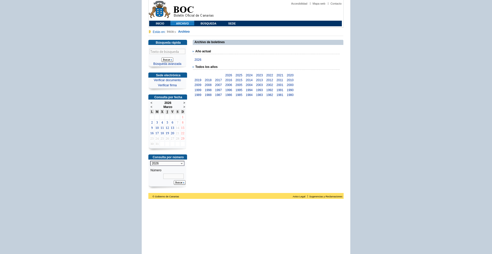

# Archivo (índice de años)

## URL

```
https://www.gobiernodecanarias.org/boc/archivo/
```

## Descripción

Es la página de entrada del archivo histórico del BOC. Lista todos los años para los que hay boletines publicados, con un enlace a cada uno de ellos.

Es el punto de partida de todo el pipeline de descarga.

## Captura de pantalla



## Almacenamiento

El HTML se guarda comprimido y sin modificar en el bucket `boc-raw`:

```
boc-raw/
└── archive/
    └── archive.html.gz
```

## Flujos implicados

| Flujo | Descripción |
|-------|-------------|
| `main_boc.download_archive` | Descarga el HTML y lo guarda en MinIO |
| `main_boc.extract_archive` | Parsea el HTML y extrae los enlaces a los índices de cada año |

## Salida

### Tabla PostgreSQL `boc_dataset.archive`

Un registro por año. Clave primaria: `year`.

| Columna | Tipo | Descripción |
|---------|------|-------------|
| `year` | text | Año (p. ej. `"2026"`) |
| `absolute_link` | text | URL completa al índice de boletines de ese año |
