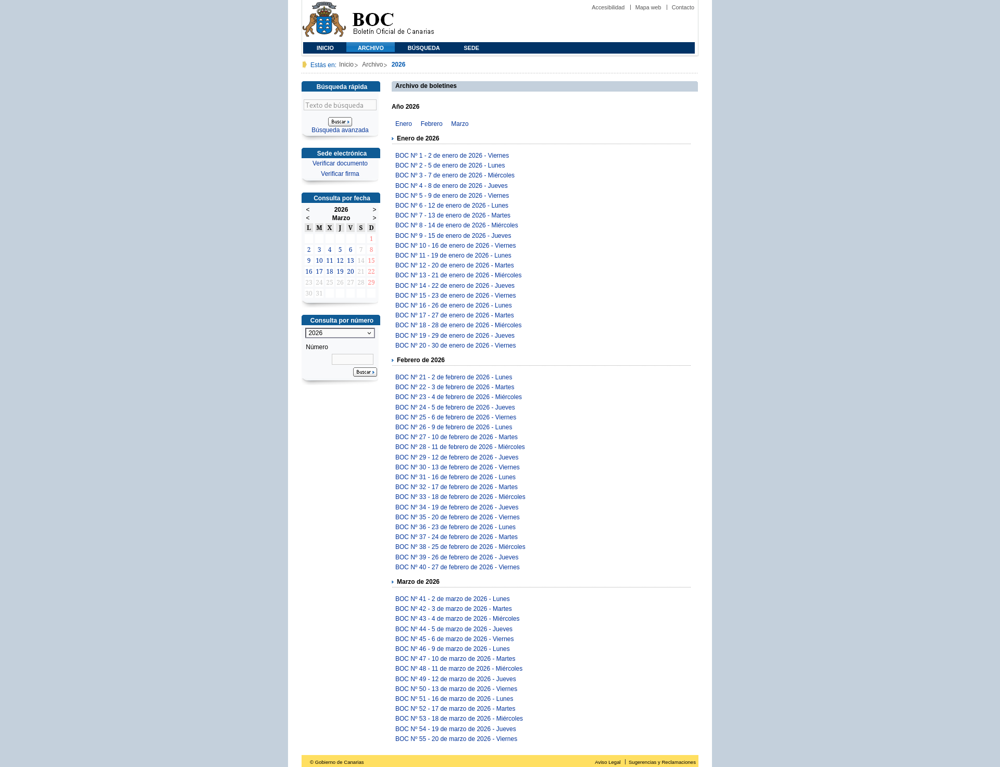

# Índice de boletines de un año

## URL

```
https://www.gobiernodecanarias.org/boc/archivo/{año}/
```

Ejemplo: `https://www.gobiernodecanarias.org/boc/archivo/2026/`

## Descripción

Una página por cada año disponible en el archivo. Lista todos los boletines publicados durante ese año, con la fecha de publicación y un enlace a cada uno.

## Captura de pantalla



## Almacenamiento

El HTML se guarda comprimido y sin modificar en el bucket `boc-raw`:

```
boc-raw/
└── years/
    ├── 2026.html.gz
    ├── 2025.html.gz
    └── ...
```

## Flujos implicados

| Flujo | Descripción |
|-------|-------------|
| `main_boc.download_years` | Descarga el HTML de cada año y lo guarda en MinIO |
| `main_boc.extract_years` | Parsea el HTML y extrae los enlaces a los índices de cada boletín |

## Salida

Lista de URLs con el formato `/boc/{año}/{número}/index.html`, una por cada boletín publicado en el año.
