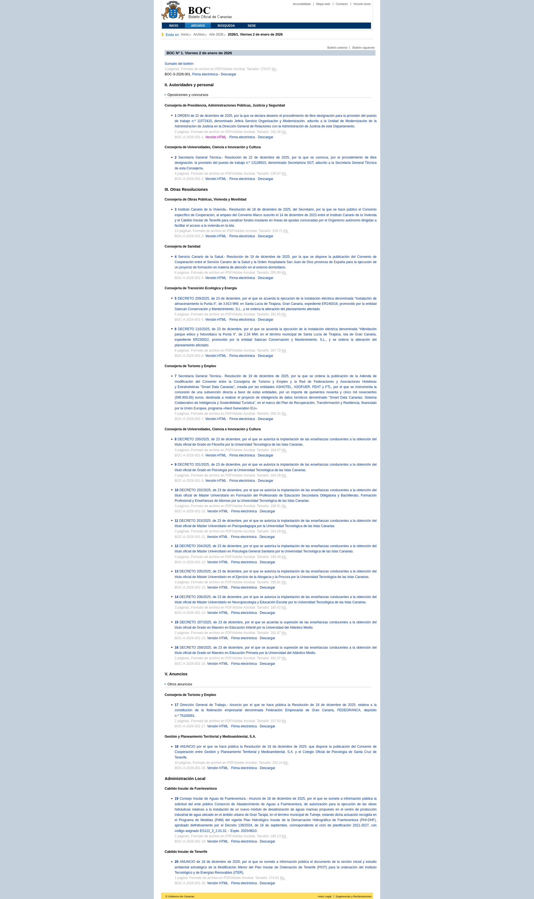

# Índice de disposiciones de un boletín

## URL

```
https://www.gobiernodecanarias.org/boc/{año}/{número}/index.html
```

Ejemplo: `https://www.gobiernodecanarias.org/boc/2026/001/index.html`

## Descripción

Una página por cada boletín publicado. Lista todas las disposiciones (leyes, decretos, resoluciones, etc.) incluidas en ese número, organizadas por sección. Cada entrada incluye el título de la disposición y un enlace a su texto completo.

## Captura de pantalla



## Almacenamiento

El HTML se guarda comprimido y sin modificar en el bucket `boc-raw`:

```
boc-raw/
└── issues/
    ├── 2026-001.html.gz
    ├── 2026-002.html.gz
    └── ...
```

## Flujos implicados

| Flujo | Descripción |
|-------|-------------|
| `main_boc.download_issues` | Descarga el HTML de cada boletín y lo guarda en MinIO |
| `main_boc.extract_issues` | Parsea el HTML y extrae los enlaces a cada disposición |

## Salida

dlt carga el boletín en dos tablas relacionadas.

### Tabla principal `boc_dataset.issue`

Un registro por boletín. Clave primaria: `(year, issue)`.

| Columna | Tipo | Descripción |
|---------|------|-------------|
| `year` | integer | Año del boletín |
| `issue` | integer | Número del boletín |
| `title` | text | Título del boletín (p. ej. `"BOC Nº 1 - Lunes 2 de enero de 2026"`) |
| `url` | text | URL al índice del boletín |
| `summary__url` | text | URL al PDF del sumario completo |
| `summary__signature` | text | URL a la firma electrónica del sumario |

### Tabla hija `boc_dataset.issue__dispositions`

Una fila por cada disposición listada en el boletín, relacionada con `issue` a través de la clave interna de dlt.

| Columna | Tipo | Descripción |
|---------|------|-------------|
| `section` | text | Sección del boletín (p. ej. `"I. Disposiciones Generales"`) |
| `subsection` | text | Subsección (si existe) |
| `organization` | text | Organismo emisor |
| `summary` | text | Número y título abreviado de la disposición |
| `metadata` | text | Metadatos adicionales del bloque `document_info` (formato moderno) |
| `identifier` | text | Código CVE de verificación |
| `html` | text | URL a la página HTML de la disposición |
| `pdf` | text | URL al PDF de la disposición |
| `signature` | text | URL a la firma electrónica |
