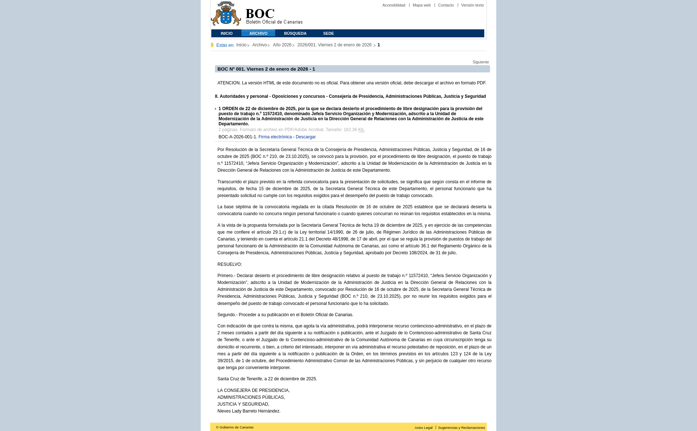

# Texto completo de una disposición

## URL

```
https://www.gobiernodecanarias.org/boc/{año}/{número}/{disposición}.html
```

Ejemplo: `https://www.gobiernodecanarias.org/boc/2026/001/001.html`

## Descripción

Una página por cada disposición publicada en el BOC. Contiene el texto íntegro de la disposición (ley, decreto, resolución, anuncio, etc.) en formato HTML. Es el nivel más granular del archivo y el dato de mayor valor para el análisis.

## Captura de pantalla



## Almacenamiento

El HTML se guarda comprimido y sin modificar en el bucket `boc-raw`, organizado en subdirectorios por año y número de boletín:

```
boc-raw/
└── documents/
    └── 2026/
        └── 001/
            ├── 001.html.gz
            ├── 002.html.gz
            └── ...
```

## Flujos implicados

| Flujo | Descripción |
|-------|-------------|
| `main_boc.download_documents` | Descarga el HTML de cada disposición y lo guarda en MinIO |

## Salida

El texto de cada disposición se convierte a Markdown y se guarda en el bucket `boc-markdown`, comprimido y con la misma estructura que en `boc-raw`:

```
boc-markdown/
└── documents/
    └── 2026/
        └── 001/
            ├── 001.md.gz
            ├── 002.md.gz
            └── ...
```
