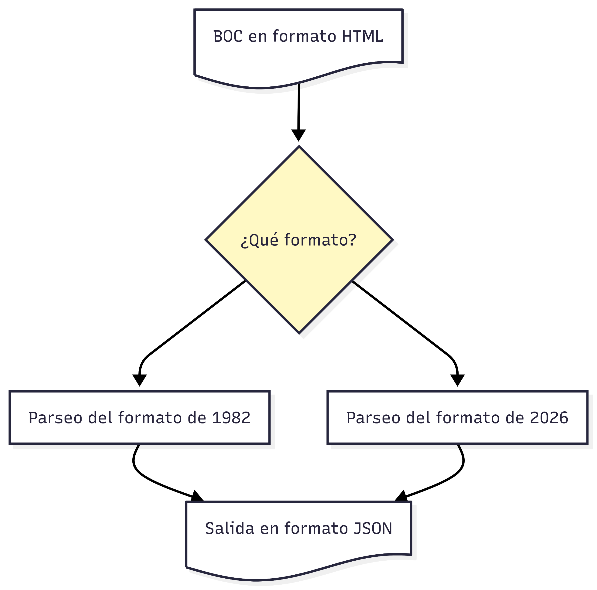

# Extracción de disposiciones

Parser para extraer información estructurada de los archivos HTML con las disposiciones de cada boletín del **Boletín Oficial de Canarias (BOC)**.

> [!NOTE]
> El BOC es la publicación oficial de la Comunidad Autónoma de Canarias donde se publican disposiciones legales, resoluciones, anuncios y otros actos administrativos. Está disponible en formato HTML en el archivo histórico de [gobiernodecanarias.org/boc](https://www.gobiernodecanarias.org/boc/).

## Qué hace

Dado un archivo HTML del BOC (por ejemplo [`boc-2026_47.html`](./examples/boc-2026_47.html)), extrae toda la información estructurada y la devuelve como JSON:

- Metadatos del boletín: año, número, título, URL, enlace al sumario y firma electrónica.
- Lista de disposiciones, cada una con: sección, subsección, organización, texto del sumario, metadatos del documento, identificador CVE, y enlaces a PDF, HTML y firma.

```bash
uv run issue-parser boc-2026_47.html
```

```json
{
    "year": 2026,
    "issue": 47,
    "title": "BOC Nº 47. Martes 10 de marzo de 2026",
    "url": "https://www.gobiernodecanarias.org/boc/2026/047/",
    "summary": { ... },
    "dispositions": [
        {
            "section": "I. Disposiciones generales",
            "subsection": null,
            "organization": "Presidencia del Gobierno",
            "summary": "762 DECRETO ley 2/2026, ...",
            ...
        }
    ]
}
```

## Enfoque de solución

El BOC ha cambiado su estructura HTML a lo largo de los años. En lugar de un parser único frágil, el proyecto usa un sistema de parsers intercambiables con detección automática de formato:



Cada formato implementa dos métodos:

- `detect(soup)`: devuelve `True` si el HTML corresponde a ese formato.
- `parse(soup)`: extrae y devuelve los datos estructurados.

Los parsers se registran en una lista ordenada y se prueba cada uno hasta encontrar el que reconoce el archivo. Añadir soporte para un nuevo formato se reduce a crear un archivo en `issue_parser/formats/` y registrarlo.

### Formatos soportados

| Formato | Detección | Ejemplo |
|---------|-----------|---------|
| `Format1982Parser` | Presencia de `<ul class="summary">` | `boc-1982_011.html` |
| `Format2026Parser` | Presencia de `<li class="justificado_boc">` | `boc-2026_47.html` |

> [!NOTA]
> Los nombres de los formatos los tomamos en función del primer ejemplo que encontramos para cada formato y no tienen relación con ninguna relación oficial de formatos. Que a un formato lo llamemos el formato de 1982 o de 2026 no significa que el formato se empezase a usar en ese momento.

### Estructura del HTML por formato

**Formato 1982** (formato histórico inicial):

```html
<h4>I. DISPOSICIONES GENERALES</h4>
  <h5>Junta de Canarias</h5>
  <ul class="summary">
    <li class="justificado">
      <a title="Ir a la disposición..."><b>162</b></a>
      <a class="abstract">REAL DECRETO...</a>
      [<a title="Descarga la disposición...">PDF</a>]
    </li>
  </ul>
```

**Formato 2026** (formato actual):

```html
<h4>I. Disposiciones generales</h4>
  <h3 class="titboc">Oposiciones...</h3>
  <h5>Presidencia del Gobierno</h5>
  <ul>
    <li class="justificado_boc">
      <a><b>762</b></a>
      <a>DECRETO ley 2/2026...</a>
      <div class="document_info">
        6 páginas. Formato PDF. Tamaño: 206 Kb.
        <div class="cve justificado">
          BOC-A-2026-047-762.
          <a title="Vista previa...">HTML</a>
          <a title="Descargar la firma...">Firma</a>
          <a title="Descargar en formato PDF">PDF</a>
        </div>
      </div>
    </li>
  </ul>
```

## Añadir un nuevo formato

1. Crear `issue_parser/formats/format_XXXX.py` implementando `FormatParser`:

```python
from bs4 import BeautifulSoup
from .base import FormatParser

class FormatXXXXParser(FormatParser):
    @classmethod
    def detect(cls, soup: BeautifulSoup) -> bool:
        # Criterio de detección específico de este formato
        return soup.find("...") is not None

    def parse(self, soup: BeautifulSoup) -> dict:
        # Lógica de extracción
        ...
```

2. Registrarlo en `issue_parser/formats/__init__.py`:

```python
from .format_xxxx import FormatXXXXParser

PARSERS = [
    Format2026Parser,
    FormatXXXXParser,  # añadir aquí
    Format1982Parser,
]
```

## Estructura del proyecto

```
issue-parser/
├── issue_parser/
│   ├── __init__.py          # Exporta parse() y parse_to_json()
│   ├── cli.py               # Punto de entrada CLI
│   ├── parser.py            # Orquestador: detecta formato y delega
│   └── formats/
│       ├── __init__.py      # Registro de parsers
│       ├── base.py          # Clase abstracta FormatParser
│       ├── format_1982.py   # Parser para el formato histórico
│       └── format_2026.py   # Parser para el formato actual
└── tests/
    ├── conftest.py
    ├── test_parser.py
    ├── test_format_1982.py
    └── test_format_2026.py
```

## Instalación

Para la instalación de independencias se requiere [uv](https://docs.astral.sh/uv/).

```bash
uv sync
```

## Uso

Puedes usar `issue-parser` para parsear un archivo y mostrar el JSON resultante por la salida estándar.

```bash
uv run issue-parser boc-2026_47.html
```

También puedes guardar el resultado en un archivo.

```bash
uv run issue-parser boc-2026_47.html -o boc-2026_47.json
```

O incluso usar el parser como una librería en Python.

```python
from issue_parser import parse

data = parse('boc-2026_47.html')
print(data['title'])
```

## Tests

Puedes ejecutar la suite completa de tests unitarios con `pytest`.

```bash
uv run pytest
```

Y, si quieres más detalle, pedirlo con el argumento `-v`.

```bash
uv run pytest -v
```

## Dependencias

- **[BeautifulSoup4](https://www.crummy.com/software/BeautifulSoup/)**: para parsear y recorrer HTML.
- **pytest** (desarrollo): para implementar y ejecutar test unitarios.
