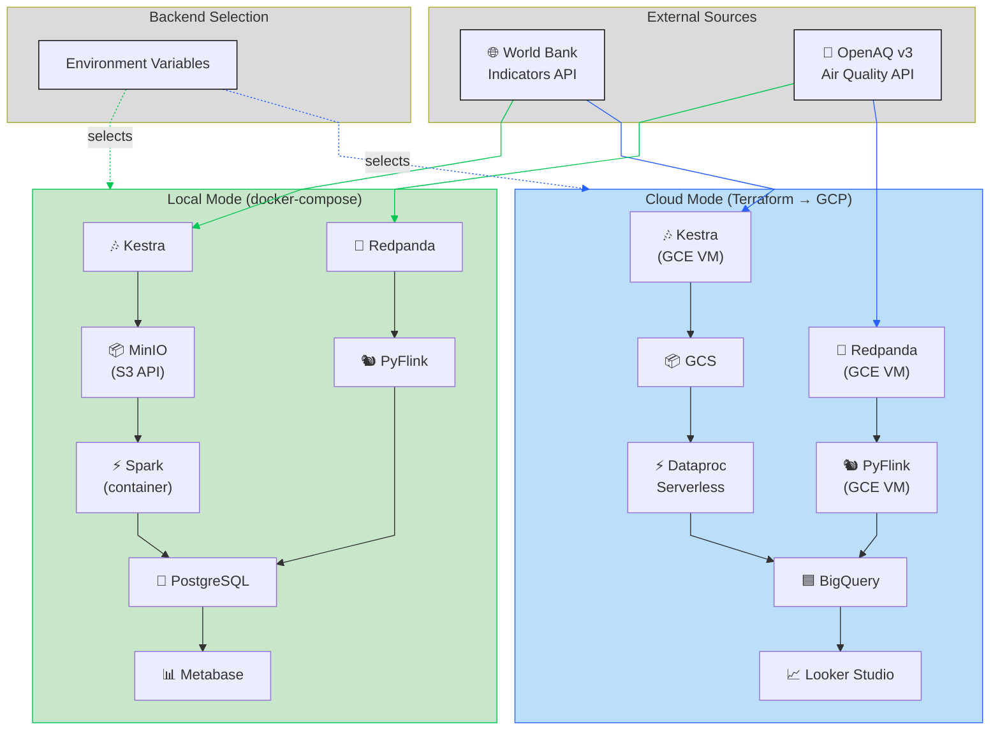
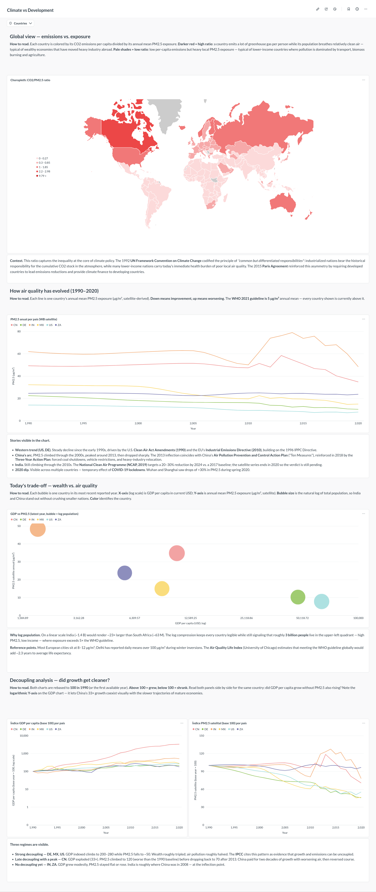

# Climate vs Development: A Dual-Mode Data Pipeline

A reproducible pipeline that joins **macroeconomic indicators** (periodicly published data, processed in batch) with **air quality measurements** (real-time data, processed in streaming) to test a single question across countries:

> *Are countries with stronger economic growth showing worse environmental outcomes — and does the air people actually breathe today match what the macro indicators say?*

The same codebase runs end-to-end in two modes: **fully local** with Docker Compose, or **on the cloud** with Terraform on Google Cloud Platform. Backends swap via environment variables, not code branches.

## Table of Contents

- [The Problem](#the-problem)
- [Data Sources](#data-sources)
- [Architecture: Local and Cloud, Same Code](#architecture-local-and-cloud-same-code)
- [Components](#components)
- [Data Flows](#data-flows)
- [Data Warehouse Design](#data-warehouse-design)
- [Transformations](#transformations)
- [Dashboard](#dashboard)
- [Getting Started](#getting-started)
- [Reproducibility](#reproducibility)
- [Project Structure](#project-structure)
- [Learning-in-public Articles](#learning-in-public-articles)
- [External References](#external-references)

## The Problem

Macroeconomic indicators describe development at a slow cadence: GDP per capita, energy intensity, urban share, CO2 emissions per capita. They are released yearly (sometimes with multi-year lag), aggregated at country level, and disconnected from what citizens actually experience day to day.

Air quality measurements describe the same countries at a completely different cadence: a station in Madrid or Delhi pushes new PM2.5 readings every hour. They are local, immediate, and noisy.

Both halves are public, but they live in separate worlds. There is no off-the-shelf place to ask:

- Which countries have decoupled GDP growth from worsening air quality, and which have not?
- Within the same year, do the macro indicators (CO2 per capita, energy use) line up with the lived environmental reality (PM2.5, NO2)?
- When a country reports an improvement in environmental indicators, do the ground-level sensors confirm it?

This project builds a small data warehouse that brings both sources together at the country level so those questions can be answered with SQL.

## Data Sources

### World Bank Indicators API (batch)

Documentation: [https://datahelpdesk.worldbank.org/knowledgebase/articles/889392-about-the-indicators-api-documentation](https://datahelpdesk.worldbank.org/knowledgebase/articles/889392-about-the-indicators-api-documentation)

Yearly country-level indicators. Free, no API key, JSON or XML. Covers 200+ countries from 1960 to the most recent year released. The base URL `https://api.worldbank.org/v2/` requires a resource path; a working example for GDP per capita across all countries is:

```
https://api.worldbank.org/v2/country/all/indicator/NY.GDP.PCAP.CD?format=json&per_page=20000
```

| Indicator code | Indicator | Unit |
|---|---|---|
| `NY.GDP.PCAP.CD` | GDP per capita | Current USD |
| `NY.GDP.MKTP.KD.ZG` | GDP growth | Annual % |
| `EN.GHG.CO2.PC.CE.AR5` | CO2 emissions per capita (AR5, excl. LULUCF) | t CO2e/capita |
| `EG.USE.PCAP.KG.OE` | Energy use per capita | kg of oil equivalent |
| `EG.FEC.RNEW.ZS` | Renewable energy consumption | % of total final energy |
| `SP.URB.TOTL.IN.ZS` | Urban population | % of total |
| `NV.IND.TOTL.ZS` | Industry value added | % of GDP |
| `EN.POP.DNST` | Population density | People per km² |

License: [CC BY 4.0](https://datacatalog.worldbank.org/public-licenses#cc-by). Update cadence: yearly, with revisions to past years on each release.

### OpenAQ v3 API (stream)

[https://docs.openaq.org/](https://docs.openaq.org/)

Worldwide air quality measurements aggregated from government stations and reference-grade sensors. Free, requires an API key. Each measurement is a tuple of `(location, parameter, value, datetime, unit)` — typically updated **every 1 to 60 minutes** depending on the station.

| Parameter | Unit | Health relevance |
|---|---|---|
| `pm25` | µg/m³ | Fine particulate matter; strongest correlation with mortality |
| `pm10` | µg/m³ | Coarse particulate matter |
| `no2` | ppm / µg/m³ | Traffic and combustion proxy |
| `o3` | ppm / µg/m³ | Photochemical pollution |
| `so2` | ppm / µg/m³ | Industrial and shipping proxy |

License: per-source, mostly open. Update cadence: continuous; the API exposes a `/measurements` endpoint that lists records in a polling-friendly window. We treat this as a stream by polling at a high frequency from the producer and pushing every new record to Redpanda.

> [!NOTE]
> OpenAQ is not a true push stream — there is no websocket or webhook. A Kestra-scheduled producer polls the API on a short interval and publishes records to Redpanda keyed by `(location_id, parameter, datetime_utc)`. The topic uses log compaction, so re-publishing the same key is a no-op and no external dedupe state is required. From the broker downstream, the pipeline is fully streaming.

## Architecture: Local and Cloud, Same Code

The pipeline is designed around three swappable backends. A single `.env` file selects between local and cloud implementations; every component reads its target from environment variables and adapts its connection string. No `if cloud else local` branches in the source code.



> If you have problems visualizing this diagram, check its pre-rendered version:
> [Pre-rendered version of the architecture diagram](./docs/resources/charts/architecture.png) (regenerate with `make render-architecture-diagram`).

The abstraction layer is intentionally thin:

- **Object storage**: both MinIO and GCS expose an S3-compatible API. The code uses `boto3` against an endpoint URL that comes from `STORAGE_ENDPOINT`.
- **Data warehouse**: dbt has both a `postgres` and a `bigquery` adapter. A single `profiles.yml` defines two targets, and the `WAREHOUSE_BACKEND` env var selects one. Adapter-aware macros translate `partition_by` and `cluster_by` to the right dialect (no-op on Postgres, where partitioning is set up via DDL macros instead).
- **Stream broker**: Redpanda speaks the Kafka protocol identically whether it runs in a container or on a GCE VM. The producer/consumer code never changes.
- **Stream processor**: PyFlink runs the same job in both modes; only the JDBC URL of the sink changes.
- **Spark**: a single PySpark job script runs against either a local container or `gcloud dataproc batches submit`.

## Components

| Component | Local | Cloud | Role |
|---|---|---|---|
| Orchestrator | Kestra (Docker) | Kestra (GCE VM) | Schedules World Bank yearly refresh; manages backfills; coordinates dbt and Spark runs |
| Object storage | MinIO | GCS | Raw JSON dumps from World Bank, raw OpenAQ payloads, intermediate Parquet |
| Stream broker | Redpanda (Docker) | Redpanda (GCE VM) | Kafka-compatible buffer between OpenAQ producer and Flink |
| Stream processor | PyFlink | PyFlink | Tumbling-window aggregations on OpenAQ measurements; writes to DWH |
| Batch transformations (heavy) | Spark (container) | Dataproc Serverless | Initial cleansing, country-code reconciliation, historical reprocessing |
| Batch transformations (modeling) | dbt + PostgreSQL | dbt + BigQuery | `staging` → `intermediate` → `marts` SQL models |
| Data warehouse | PostgreSQL | BigQuery | Source of truth for the dashboard; partitioned and clustered |
| Dashboard | Metabase | Looker Studio | Two tiles backed by `marts.country_year_environment` |
| IaC | Docker Compose | Terraform (GCP) | Reproducible environment definition |

Build-time tooling: **uv** installs Python dependencies; **Docker Compose** orchestrates the local stack; **Terraform** provisions the cloud stack.

## Data Flows

### Batch flow (yearly, World Bank)

1. **Kestra** runs a yearly schedule (and exposes an ad-hoc backfill flow).
2. A **Python ingestor** calls the World Bank API for each indicator code listed above, paginates the response, and writes the raw JSON payload to object storage at `worldbank/raw/{indicator_code}/{year}.json`.
3. A **PySpark job** reads the raw JSON, normalizes country ISO3 codes, casts numeric values, and writes Parquet to `worldbank/cleansed/{indicator_code}/`.
4. **dbt staging** models load the cleansed Parquet into the warehouse `staging.worldbank_*` tables (one per indicator).
5. **dbt marts** consolidate all indicators into a long-format `marts.worldbank_indicators` (one row per `country × year × indicator`).

### Stream flow (continuous, OpenAQ)

1. A **Python producer** runs as a Kestra-scheduled task every few minutes: it polls OpenAQ `/measurements` for the configured country list and publishes records to the Redpanda topic `openaq.measurements`. Each message is keyed by `(location_id, parameter, datetime_utc)` and the topic uses log compaction, so re-publishing the same measurement is a no-op — no external dedupe state required.
2. **PyFlink** consumes `openaq.measurements`, joins to a small `country` lookup, applies tumbling windows (1 hour, 1 day) per `country × parameter`, and writes:
   - `raw.openaq_measurements` (mirror of the topic)
   - `agg.openaq_hourly` and `agg.openaq_daily`
3. The PyFlink job uses event time and watermarks to handle the inevitable late arrivals from slow stations.

### Backfill flow (one-shot, OpenAQ S3 dump)

OpenAQ publishes the full historical archive in a public S3 bucket: `s3://openaq-data-archive/records/csv.gz/locationid={N}/year={Y}/` (region `us-east-1`, accessible anonymously). For the historical bootstrap we read directly from the dump rather than paginating the live API — same data, no rate limits, no API key, and the partition layout maps cleanly to Spark's input pruning.

1. A **PySpark job** (`spark/jobs/openaq_backfill.py`) reads the requested `(location, year)` partitions from the dump, normalizes columns to match the Flink streaming schema, looks up the ISO3 code from the `country_iso_codes` seed, and writes Parquet to `openaq/cleansed/year=YYYY/country_iso3=XXX/` in MinIO/GCS.
2. The same job stages results in a temporary Postgres table and merges into `raw.openaq_measurements` with `INSERT … ON CONFLICT DO NOTHING`, so the backfill and the Flink stream coexist on the same target without duplicates.
3. The live API stays the source of truth for fresh data (continuous polling); the dump is only used for the one-time historical load and any future re-runs over older windows.

### Join layer (where the project's question lives)

A dbt model `marts.country_year_environment` joins:

- World Bank indicators pivoted wide (`int_worldbank__indicators_pivoted`): one column per indicator (`gdp_per_capita_usd`, `co2_per_capita_t`, `gdp_growth_pct`, `urban_population_pct`, …).
- OpenAQ aggregations (`int_openaq__country_year`): per-pollutant medians of the *daily* mean (so each day weights equally regardless of station polling cadence) plus `pm25_days_exceeding_who_daily` against the WHO 2021 threshold of 15 µg/m³.

at the `country_iso3 × year` grain via FULL OUTER JOIN — the choropleth needs WB-only countries even when no OpenAQ stations exist there, and vice versa. ISO2→ISO3 reconciliation flows through the `country_iso_codes` dbt seed (~190 codes; both Spark and dbt use it as the single source of truth). On Postgres a `(country_iso3, year)` btree index is created via the model's `post_hook`; on BigQuery the equivalent partitioning is added by the cloud slice.

## Data Warehouse Design

### Partitioning

| Table | BigQuery | PostgreSQL | Reason |
|---|---|---|---|
| `raw.openaq_measurements` | `PARTITION BY DATE(datetime_utc)` | `PARTITION BY RANGE (datetime_utc)`, monthly partitions ensured via DDL macro | High-volume, time-range queries dominate; pruning by month keeps scans cheap |
| `staging.worldbank_*` | `PARTITION BY year` (integer range) | btree index on `(country_iso3, year)` | Tables are small but partitioning by year mirrors the natural query pattern |
| `marts.country_year_environment` | `PARTITION BY year` | btree index on `(country_iso3, year)` | Dashboard filters by year range and country; partition pruning + clustering removes >95% of scan cost |
| `agg.openaq_daily` | `PARTITION BY day` | `PARTITION BY RANGE (day)`, monthly partitions ensured via DDL macro | Hourly job appends; dashboard reads recent windows |

> [!NOTE]
> Postgres native `PARTITION BY RANGE` is closer to BigQuery's model than the DuckDB alternative would have been. Per-partition DDL is issued by an `ensure_monthly_partitions` macro invoked from dbt's `on-run-start`, so the same logical layout works in both engines without query-side changes.

### Clustering

| Table | BigQuery clustering | Reason |
|---|---|---|
| `raw.openaq_measurements` | `(country_iso3, parameter)` | Almost every query filters by country and pollutant |
| `marts.country_year_environment` | `(country_iso3)` | Country-level filtering is the dominant access pattern |
| `agg.openaq_daily` | `(country_iso3, parameter)` | Same as raw; keeps aggregation queries cheap |

## Transformations

Two layers, by design:

- **PySpark** for the heavy and one-off lifting: initial historical backfill of OpenAQ (millions of rows), country-code reconciliation across ISO2 / ISO3 / World Bank codes, format normalization. Runs in a container locally and on Dataproc Serverless in cloud mode.
- **dbt** for the day-to-day modeling: `staging/` (one model per source indicator and one for OpenAQ raw mirror), `intermediate/` (joins, country normalization), `marts/` (the analytical surface). Adapter-aware macros translate partition and cluster syntax between PostgreSQL and BigQuery.

## Dashboard

Five panels organized in four narrative sections, all backed by `marts.country_year_environment` and the `country_iso_codes` seed:

1. **Global view — emissions vs. exposure** (choropleth). World map where each country is colored by the ratio of CO2 per capita to annual mean PM2.5. Dark red = high emissions per capita against relatively clean air (typical of wealthy economies that have offshored heavy industry); pale = the inverse. Tells the climate-justice story in a single tile.
2. **How air quality has evolved (1990–2020)** (line chart). One line per country tracking annual mean PM2.5 (µg/m³). Reads inflections against policy events — the U.S. Clean Air Act Amendments, the EU Industrial Emissions Directive, China's 2013 Action Plan, India's NCAP — and against the WHO 2021 guideline of 5 µg/m³ (every country shown sits above it).
3. **Today's trade-off — wealth vs. air quality** (bubble scatter). One bubble per country in its most recent reported year: GDP per capita on a log X-axis, annual mean PM2.5 on Y, bubble size = log of population so India and China stand out without crushing smaller nations. Surfaces the ~3 billion people in the upper-left quadrant: low income, exposure many times the WHO guideline.
4. **Decoupling analysis — did growth get cleaner?** (paired index lines, side by side). Both panels are rebased to 100 in 1990: GDP per capita per country (log Y axis to keep China's 33× growth visually next to the West's 2–3×) and PM2.5 per country. Reading them together separates strong decouplers (DE/MX/US: wealth roughly tripled, PM2.5 roughly halved) from late decouplers (CN: PM2.5 peaked around 2013 then dropped) from countries where both still rise (IN).



> [!NOTE]
> The PM2.5 series in all four sections comes from the **World Bank satellite-derived** `EN.ATM.PM25.MC.M3` indicator (annual, country-level, 1990–2020), not from the OpenAQ stream. The long historical span and clean country coverage of the satellite series made it the right fit.

### Looker Studio: provisioned but not implemented

The cloud slice provisions everything a Looker Studio report would need — BigQuery dataset, IAM bindings, the `DASHBOARD_BACKEND=looker-studio` toggle — but the report itself has not been authored. To reach parity the fastest path is to port the five Metabase cards directly: each card's SQL lives under `metabase/serialized/2-climate-vs-development/cards/<id>.json` at `dataset_query.stages[0].native`, and runs essentially unchanged against BigQuery once the schema-qualified references (`marts.country_year_environment`, `seeds.country_iso_codes`) are pointed at the cloud dataset. The dbt marts produce the same column shape on both backends, so no semantic-layer translation is required — only a Looker Studio data source and a copy of each query into a chart.

### Metabase authoring and reproducibility

Metabase 60+ ships an [official MCP server](https://www.metabase.com/docs/latest/ai/mcp), so dashboard authoring can be driven from an LLM agent (Claude Code in our case). Reproducibility uses a small pair of API-driven Python scripts (`metabase/scripts/export-dashboard.py` and `import-dashboard.py`) — Metabase's built-in `export`/`import` is Enterprise-only, and the scripts work on the Community edition that ships in Docker. Exported state lives in `metabase/serialized/<id>-<slug>/` (`dashboard.json`, per-card JSON under `cards/`, and a `metadata/db-*.json` map of database/table/field ids that the importer remaps by name).

## Getting Started

This project combines **batch** data (yearly World Bank indicators) with **near real-time** data (OpenAQ measurements polled every 15 minutes), so a complete first run is more involved than a single `make up`. The two halves bootstrap on different cadences, and the dashboard only becomes meaningful once both have populated `marts.country_year_environment` with overlapping country/year keys. Plan on a one-off setup pass with manual triggers for the historical loads, then steady-state automation takes over.

### 1. Pick a country list

OpenAQ polling does nothing without `COUNTRIES`. Choose a set that spans development levels **and** has real OpenAQ station coverage — picking countries with no stations leaves half of the join empty. The default suggestion in `env.template` is:

```
COUNTRIES=US,DE,CN,MX,IN,ZA
```

| ISO2 | Why it earns the slot |
|---|---|
| `US` | Highly developed; thousands of EPA stations; large internal contrast |
| `DE` | Highly developed; UBA real-time network; clean EU baseline |
| `CN` | Middle-income, fast-growing; textbook GDP-vs-PM2.5 case |
| `MX` | Middle-income; ZMVM has a dense reference-grade network |
| `IN` | Lower-income; world-leading PM2.5; CPCB publishes hundreds of stations |
| `ZA` | Lower-income; SAAQIS publishes; best sub-Saharan coverage |

Bangladesh, Pakistan and Nigeria pollute more than South Africa but their OpenAQ coverage is sparse — the dashboard would render an empty half. If `ZA` underperforms in your run, swap in `BR` as a second middle-income with broad coverage.

### 2. Configure `.env`

```bash
cp env.template .env   # or: make init   (generates random passwords)
```

Then, at minimum:

- Set `OPENAQ_API_KEY` (free, register at <https://explore.openaq.org/register>).
- Uncomment and set `COUNTRIES` (see step 1).

### 3. Bring up the stack

```bash
make up
```

This boots Kestra, MinIO, Redpanda, PyFlink, Spark, Postgres + dbt, and Metabase, and runs `metabase-init` to create the admin user and register the warehouse data source. The OpenAQ Kestra trigger starts polling every 15 minutes from this moment forward.

### 4. Verify each slice with the smoke tests

Each pipeline slice has a self-contained end-to-end check that asserts on real side effects:

```bash
make smoke-test-worldbank    # batch: API → MinIO → Postgres → dbt staging
make smoke-test-openaq       # stream: producer → Redpanda
make smoke-test-flink        # stream: Redpanda → Flink → Postgres
make smoke-test-spark        # backfill: S3 dump → MinIO → Postgres
make smoke-test-marts        # join: dbt build → marts.country_year_environment
make smoke-test-metabase     # BI: Metabase health + data source registered
```

Run them once before loading real volume — they catch broker, JDBC, dbt and Metabase wiring issues with minimal scope.

### 5. Load real volume

The smoke tests use minimal scopes (one indicator, one station). For the dashboard you need actual breadth:

- **World Bank historical**: the production trigger only fires on July 1st (yearly cron). Open Kestra at `http://localhost:8080`, manually execute `climate.worldbank-ingest` with `start_year=2010`, `end_year=2024`, and the `indicators` field empty (uses the full default list).
- **OpenAQ historical**: the live poller only captures data going forward. Run the Spark backfill once per country in your `COUNTRIES` list against the public OpenAQ S3 dump, with a multi-year window (e.g. `SPARK_BACKFILL_YEARS=2018,2019,2020,2021,2022,2023`). This is what gives the time-series tile its trend.

If you want to run an initial backfill and you already configured your environment, just run:

```bash
make openaq-backfill-all
```

- **OpenAQ live stream**: already running every 15 min from step 3. No action needed.
- **dbt build**: once raw tables have data, run `docker compose run --rm dbt-init build` to refresh staging → intermediate → marts (the `dbt-init` service is the same dbt image used at boot for `create_raw_schema`; `run --rm` overrides the command).

### 6. Steady state

After the one-off pass, the stack runs on its own:

- Kestra keeps polling OpenAQ every 15 minutes.
- World Bank refreshes yearly (or trigger manually mid-year if needed).
- A nightly `dbt build` keeps marts in sync (run it on cron or from Kestra — not wired up by default).

## Reproducibility

### Local

```bash
git clone https://github.com/elcapo/data-engineering-zoomcamp/
cd data-engineering-zoomcamp/proyecto-clima-y-desarrollo
make up
```

This brings up Kestra, MinIO, Redpanda, PyFlink, Spark, Postgres-backed dbt, and Metabase. Once the stack is healthy, Kestra triggers the first batch ingestion immediately.

### Smoke tests

Per-slice end-to-end checks are exposed as Make targets. Each one calls `make up` first, exercises a single slice with a minimal scope, and asserts on the side effects.

| Target | Slice | What it does |
|---|---|---|
| `make smoke-test-worldbank` | World Bank batch | Runs `worldbank-ingest` + `worldbank-load` for `NY.GDP.PCAP.CD/2022`, then `dbt build --select stg_worldbank__indicators`. Asserts the JSON object lands in MinIO, ≥200 rows in `raw.worldbank_indicators_raw`, and the staging view is populated with the dbt tests green. |
| `make smoke-test-openaq` | OpenAQ stream | Requires `OPENAQ_API_KEY` in `.env`. Runs `openaq-poll --countries ES --max-locations 20`, then asserts the `openaq.measurements` topic has `cleanup.policy=compact` and that ≥1 message lands with the expected key (`<location>:<param>:<iso8601>`) and JSON shape. |
| `make smoke-test-flink` | Flink streaming | Requires `OPENAQ_API_KEY` in `.env`. Waits for `flink-job-submitter` to finish, asserts ≥1 RUNNING job via the Flink REST API, then polls OpenAQ once and verifies that `raw.openaq_measurements` ends up with ≥1 row written by the Flink JDBC sink. The hourly/daily aggregation tables are not asserted on (event-time tumbling windows only close once the watermark advances past their end). |
| `make smoke-test-spark` | OpenAQ backfill | No API key required (reads the public S3 dump anonymously). Runs `spark-backfill --locations 2178 --years 2023 --country-iso US` against a verified station ("Del Norte" in Albuquerque, NM), asserts the Spark log reports ≥1 normalized row, that ≥1 Parquet file landed under `openaq/cleansed/` in MinIO, and that `raw.openaq_measurements` has ≥1 row in the requested year window for the requested locations. Re-runs once more to verify the `ON CONFLICT DO NOTHING` upsert is idempotent. **Non-destructive**: never deletes existing rows — relies on the year window not overlapping with what Flink writes (current time). Override the scope with `SPARK_BACKFILL_LOCATIONS` / `SPARK_BACKFILL_YEARS` / `SPARK_BACKFILL_COUNTRY_ISO`. |
| `make smoke-test-marts` | Join layer (dbt marts) | Loads matching slices on both sides — `worldbank-ingest` + `worldbank-load` for `NY.GDP.PCAP.CD/2022` and `spark-backfill` for `locations=2178 / year=2022 / US` — then runs `dbt seed country_iso_codes` and `dbt build --select +country_year_environment`. Asserts `marts.country_year_environment` has a row for `(USA, 2022)` with **both** `gdp_per_capita_usd` and `median_pm25_ugm3` populated (proves the FULL OUTER JOIN actually intersected), and that the Postgres `(country_iso3, year)` btree index was created via the model's `post_hook`. |
| `make smoke-test-metabase` | BI / dashboard | Waits for `metabase-init` to bootstrap the admin user + `climate-warehouse` data source. Hits `/api/health`, logs in with `METABASE_ADMIN_PASSWORD` from `.env`, and asserts the warehouse data source is registered with `engine=postgres` pointing at the right database. Does not require `metabase/serialized/` to have content — the JSON import workflow (`make metabase-import DIR=...`) is exercised separately when authoring tiles. |
| `make smoke-test-terraform` | Cloud infrastructure | Runs `terraform init -backend=false` + `validate` + `fmt -check -recursive` against `terraform/gcp/` inside the official `hashicorp/terraform` Docker image. **No GCP credentials required** — verifies the HCL is syntactically valid, references resolve, and the formatting is canonical. Real `terraform plan` against a project is left for the operator's apply flow. |

The scripts live under `scripts/smoke-test-*.sh` and are safe to re-run; they upsert / consume from the start of the topic.

### Cloud

```bash
cd terraform/gcp
cp terraform.tfvars.example terraform.tfvars
# edit project_id, region, ssh keys, optionally allowed CIDRs

terraform init
terraform apply
```

Terraform provisions a GCS bucket, a BigQuery dataset, a Dataproc Serverless batch template, and a small GCE VM that runs Kestra, Redpanda, and PyFlink.

### Switching backends

| Variable | Local | Cloud |
|---|---|---|
| `STORAGE_BACKEND` | `minio` | `gcs` |
| `STORAGE_ENDPOINT` | `http://minio:9000` | `https://storage.googleapis.com` |
| `WAREHOUSE_BACKEND` | `postgres` | `bigquery` |
| `STREAM_BACKEND` | `redpanda-local` | `redpanda-gce` |
| `SPARK_BACKEND` | `local` | `dataproc` |
| `DASHBOARD_BACKEND` | `metabase` | `looker-studio` |

A single `.env.local` and `.env.cloud` are checked in as templates; secrets are not.

## Project Structure

```
proyecto-clima-y-desarrollo/
├── README.md                  ← this file
├── Makefile                   ← make up / down / reset / smoke-test-*
├── docker-compose.yml         ← local stack
├── env.template               ← all env vars, both modes
├── kestra/
│   └── flows/                 ← orchestration flows (YAML)
├── producer/
│   ├── worldbank/             ← Python ingestor + loader (World Bank API → MinIO → Postgres)
│   └── openaq/                ← Python producer (OpenAQ /latest → Redpanda)
├── flink/
│   ├── jobs/                  ← PyFlink streaming jobs (consume Redpanda, write Postgres)
│   ├── sql/                   ← Flink SQL templates (sources, sinks, inserts)
│   └── tests/                 ← pytest unit tests
├── spark/
│   ├── jobs/                  ← PySpark backfill (OpenAQ S3 dump → MinIO Parquet → Postgres)
│   └── tests/                 ← pytest unit tests
├── dbt/
│   ├── macros/                ← adapter-aware helpers (partition_by, cluster_by, median, …)
│   ├── models/
│   │   ├── staging/           ← thin views over raw schemas
│   │   ├── intermediate/      ← per-source aggregations (OpenAQ yearly, World Bank pivoted)
│   │   └── marts/             ← published surface (country_year_environment, worldbank_indicators)
│   └── seeds/                 ← country_iso_codes (ISO2 ↔ ISO3 ↔ World Bank code)
├── metabase/
│   ├── init.py                ← idempotent bootstrap (admin user + warehouse data source)
│   ├── Dockerfile             ← image used by the metabase-init service
│   ├── scripts/               ← export-dashboard.py / import-dashboard.py (CE-compatible API serializer)
│   └── serialized/            ← committed JSON exports (dashboard.json + cards/ + metadata/)
├── terraform/gcp/             ← cloud infrastructure (GCS bucket, BigQuery dataset, IAM, VPC, GCE VM)
├── scripts/                   ← end-to-end smoke tests, one per slice
└── docs/                      ← learning-in-public articles + diagrams (start at docs/README.md)
    ├── spanish/               ← Spanish versions of the articles
    ├── english/               ← English versions of the articles
    └── resources/charts/      ← architecture PNG (rendered from this README's Mermaid block)
```

## External References

- [World Bank Indicators API documentation](https://datahelpdesk.worldbank.org/knowledgebase/articles/889392-about-the-indicators-api-documentation)
- [OpenAQ API v3 documentation](https://docs.openaq.org/)
- [OpenAQ S3 archive (Open Data on AWS)](https://docs.openaq.org/aws/about) — public dump used by the Spark backfill
- [WHO Global Air Quality Guidelines (2021)](https://www.who.int/publications/i/item/9789240034228) — reference thresholds for PM2.5, PM10, NO2, O3, SO2
