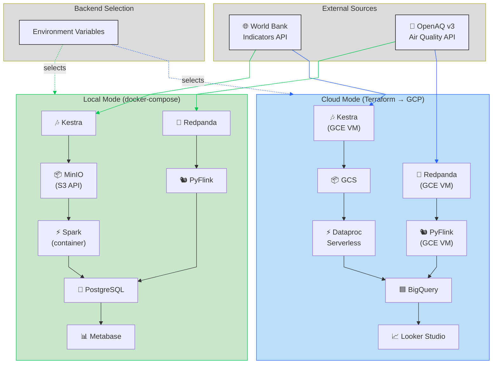

# Climate vs Development: A Dual-Mode Data Pipeline

A reproducible pipeline that joins **macroeconomic indicators** (periodicly published data, processed in batch) with **air quality measurements** (real-time data, processed in streaming) to test a single question across countries:

> *Are countries with stronger economic growth showing worse environmental outcomes — and does the air people actually breathe today match what the macro indicators say?*

The same codebase runs end-to-end in two modes: **fully local** with Docker Compose, or **on the cloud** with Terraform on Google Cloud Platform. Backends swap via environment variables, not code branches.

## Table of Contents

- [The Problem](#the-problem)
- [Data Sources](#data-sources)
- [Architecture: Local and Cloud, Same Code](#architecture-local-and-cloud-same-code)
- [Components](#components)
- [Data Flows](#data-flows)
- [Data Warehouse Design](#data-warehouse-design)
- [Transformations](#transformations)
- [Dashboard](#dashboard)
- [Reproducibility](#reproducibility)
- [Project Structure (Planned)](#project-structure-planned)
- [Status and Roadmap](#status-and-roadmap)

## The Problem

Macroeconomic indicators describe development at a slow cadence: GDP per capita, energy intensity, urban share, CO2 emissions per capita. They are released yearly (sometimes with multi-year lag), aggregated at country level, and disconnected from what citizens actually experience day to day.

Air quality measurements describe the same countries at a completely different cadence: a station in Madrid or Delhi pushes new PM2.5 readings every hour. They are local, immediate, and noisy.

Both halves are public, but they live in separate worlds. There is no off-the-shelf place to ask:

- Which countries have decoupled GDP growth from worsening air quality, and which have not?
- Within the same year, do the macro indicators (CO2 per capita, energy use) line up with the lived environmental reality (PM2.5, NO2)?
- When a country reports an improvement in environmental indicators, do the ground-level sensors confirm it?

This project builds a small data warehouse that brings both sources together at the country level so those questions can be answered with SQL.

## Data Sources

### World Bank Indicators API (batch)

Documentation: [https://datahelpdesk.worldbank.org/knowledgebase/articles/889392-about-the-indicators-api-documentation](https://datahelpdesk.worldbank.org/knowledgebase/articles/889392-about-the-indicators-api-documentation)

Yearly country-level indicators. Free, no API key, JSON or XML. Covers 200+ countries from 1960 to the most recent year released. The base URL `https://api.worldbank.org/v2/` requires a resource path; a working example for GDP per capita across all countries is:

```
https://api.worldbank.org/v2/country/all/indicator/NY.GDP.PCAP.CD?format=json&per_page=20000
```

| Indicator code | Indicator | Unit |
|---|---|---|
| `NY.GDP.PCAP.CD` | GDP per capita | Current USD |
| `NY.GDP.MKTP.KD.ZG` | GDP growth | Annual % |
| `EN.ATM.CO2E.PC` | CO2 emissions per capita | Metric tons |
| `EG.USE.PCAP.KG.OE` | Energy use per capita | kg of oil equivalent |
| `EG.FEC.RNEW.ZS` | Renewable energy consumption | % of total final energy |
| `SP.URB.TOTL.IN.ZS` | Urban population | % of total |
| `NV.IND.TOTL.ZS` | Industry value added | % of GDP |
| `EN.POP.DNST` | Population density | People per km² |

License: [CC BY 4.0](https://datacatalog.worldbank.org/public-licenses#cc-by). Update cadence: yearly, with revisions to past years on each release.

### OpenAQ v3 API (stream)

[https://docs.openaq.org/](https://docs.openaq.org/)

Worldwide air quality measurements aggregated from government stations and reference-grade sensors. Free, requires an API key. Each measurement is a tuple of `(location, parameter, value, datetime, unit)` — typically updated **every 1 to 60 minutes** depending on the station.

| Parameter | Unit | Health relevance |
|---|---|---|
| `pm25` | µg/m³ | Fine particulate matter; strongest correlation with mortality |
| `pm10` | µg/m³ | Coarse particulate matter |
| `no2` | ppm / µg/m³ | Traffic and combustion proxy |
| `o3` | ppm / µg/m³ | Photochemical pollution |
| `so2` | ppm / µg/m³ | Industrial and shipping proxy |

License: per-source, mostly open. Update cadence: continuous; the API exposes a `/measurements` endpoint that lists records in a polling-friendly window. We treat this as a stream by polling at a high frequency from the producer and pushing every new record to Redpanda.

> [!NOTE]
> OpenAQ is not a true push stream — there is no websocket or webhook. A Kestra-scheduled producer polls the API on a short interval and publishes records to Redpanda keyed by `(location_id, parameter, datetime_utc)`. The topic uses log compaction, so re-publishing the same key is a no-op and no external dedupe state is required. From the broker downstream, the pipeline is fully streaming.

## Architecture: Local and Cloud, Same Code

The pipeline is designed around three swappable backends. A single `.env` file selects between local and cloud implementations; every component reads its target from environment variables and adapts its connection string. No `if cloud else local` branches in the source code.



> If you have problems visualizing this diagram, check its pre-rendered version:
> [Pre-rendered version of the architecture diagram](./docs/resources/charts/architecture.png) *(generated in a follow-up task)*

The abstraction layer is intentionally thin:

- **Object storage**: both MinIO and GCS expose an S3-compatible API. The code uses `boto3` against an endpoint URL that comes from `STORAGE_ENDPOINT`.
- **Data warehouse**: dbt has both a `postgres` and a `bigquery` adapter. A single `profiles.yml` defines two targets, and the `WAREHOUSE_BACKEND` env var selects one. Adapter-aware macros translate `partition_by` and `cluster_by` to the right dialect (no-op on Postgres, where partitioning is set up via DDL macros instead).
- **Stream broker**: Redpanda speaks the Kafka protocol identically whether it runs in a container or on a GCE VM. The producer/consumer code never changes.
- **Stream processor**: PyFlink runs the same job in both modes; only the JDBC URL of the sink changes.
- **Spark**: a single PySpark job script runs against either a local container or `gcloud dataproc batches submit`.

## Components

| Component | Local | Cloud | Role |
|---|---|---|---|
| Orchestrator | Kestra (Docker) | Kestra (GCE VM) | Schedules World Bank yearly refresh; manages backfills; coordinates dbt and Spark runs |
| Object storage | MinIO | GCS | Raw JSON dumps from World Bank, raw OpenAQ payloads, intermediate Parquet |
| Stream broker | Redpanda (Docker) | Redpanda (GCE VM) | Kafka-compatible buffer between OpenAQ producer and Flink |
| Stream processor | PyFlink | PyFlink | Tumbling-window aggregations on OpenAQ measurements; writes to DWH |
| Batch transformations (heavy) | Spark (container) | Dataproc Serverless | Initial cleansing, country-code reconciliation, historical reprocessing |
| Batch transformations (modeling) | dbt + PostgreSQL | dbt + BigQuery | `staging` → `intermediate` → `marts` SQL models |
| Data warehouse | PostgreSQL | BigQuery | Source of truth for the dashboard; partitioned and clustered |
| Dashboard | Metabase | Looker Studio | Two tiles backed by `marts.country_year_environment` |
| IaC | Docker Compose | Terraform (GCP) | Reproducible environment definition |

Build-time tooling: **uv** installs Python dependencies; **Docker Compose** orchestrates the local stack; **Terraform** provisions the cloud stack.

## Data Flows

### Batch flow (yearly, World Bank)

1. **Kestra** runs a yearly schedule (and exposes an ad-hoc backfill flow).
2. A **Python ingestor** calls the World Bank API for each indicator code listed above, paginates the response, and writes the raw JSON payload to object storage at `worldbank/raw/{indicator_code}/{year}.json`.
3. A **PySpark job** reads the raw JSON, normalizes country ISO3 codes, casts numeric values, and writes Parquet to `worldbank/cleansed/{indicator_code}/`.
4. **dbt staging** models load the cleansed Parquet into the warehouse `staging.worldbank_*` tables (one per indicator).
5. **dbt marts** consolidate all indicators into a long-format `marts.worldbank_indicators` (one row per `country × year × indicator`).

### Stream flow (continuous, OpenAQ)

1. A **Python producer** runs as a Kestra-scheduled task every few minutes: it polls OpenAQ `/measurements` for the configured country list and publishes records to the Redpanda topic `openaq.measurements`. Each message is keyed by `(location_id, parameter, datetime_utc)` and the topic uses log compaction, so re-publishing the same measurement is a no-op — no external dedupe state required.
2. **PyFlink** consumes `openaq.measurements`, joins to a small `country` lookup, applies tumbling windows (1 hour, 1 day) per `country × parameter`, and writes:
   - `raw.openaq_measurements` (mirror of the topic)
   - `agg.openaq_hourly` and `agg.openaq_daily`
3. The PyFlink job uses event time and watermarks to handle the inevitable late arrivals from slow stations.

### Join layer (where the project's question lives)

A dbt model `marts.country_year_environment` joins:

- yearly World Bank indicators (`marts.worldbank_indicators`)
- yearly aggregations of OpenAQ daily data (median PM2.5, days exceeding WHO thresholds, etc.)

at the `country_iso3 × year` grain. This is the single table the dashboard queries.

## Data Warehouse Design

### Partitioning

| Table | BigQuery | PostgreSQL | Reason |
|---|---|---|---|
| `raw.openaq_measurements` | `PARTITION BY DATE(datetime_utc)` | `PARTITION BY RANGE (datetime_utc)`, monthly partitions ensured via DDL macro | High-volume, time-range queries dominate; pruning by month keeps scans cheap |
| `staging.worldbank_*` | `PARTITION BY year` (integer range) | btree index on `(country_iso3, year)` | Tables are small but partitioning by year mirrors the natural query pattern |
| `marts.country_year_environment` | `PARTITION BY year` | btree index on `(country_iso3, year)` | Dashboard filters by year range and country; partition pruning + clustering removes >95% of scan cost |
| `agg.openaq_daily` | `PARTITION BY day` | `PARTITION BY RANGE (day)`, monthly partitions ensured via DDL macro | Hourly job appends; dashboard reads recent windows |

> [!NOTE]
> Postgres native `PARTITION BY RANGE` is closer to BigQuery's model than the DuckDB alternative would have been. Per-partition DDL is issued by an `ensure_monthly_partitions` macro invoked from dbt's `on-run-start`, so the same logical layout works in both engines without query-side changes.

### Clustering

| Table | BigQuery clustering | Reason |
|---|---|---|
| `raw.openaq_measurements` | `(country_iso3, parameter)` | Almost every query filters by country and pollutant |
| `marts.country_year_environment` | `(country_iso3)` | Country-level filtering is the dominant access pattern |
| `agg.openaq_daily` | `(country_iso3, parameter)` | Same as raw; keeps aggregation queries cheap |

## Transformations

Two layers, by design:

- **PySpark** for the heavy and one-off lifting: initial historical backfill of OpenAQ (millions of rows), country-code reconciliation across ISO2 / ISO3 / World Bank codes, format normalization. Runs in a container locally and on Dataproc Serverless in cloud mode.
- **dbt** for the day-to-day modeling: `staging/` (one model per source indicator and one for OpenAQ raw mirror), `intermediate/` (joins, country normalization), `marts/` (the analytical surface). Adapter-aware macros translate partition and cluster syntax between PostgreSQL and BigQuery.

## Dashboard

Two tiles, backed by `marts.country_year_environment`:

1. **Choropleth: development vs lived environment.** A world map where each country is colored by the ratio of CO2 per capita (World Bank) to median PM2.5 (OpenAQ) for the latest available year. Outliers in either direction tell the project's story.
2. **Time series: GDP growth vs air-quality trend.** For a user-selected country, two overlaid lines: GDP growth (annual %) and the rolling 12-month median PM2.5. Reveals whether economic accelerations coincide with air quality changes.

The same SQL backs both tools:

- **Metabase** in local mode (questions and dashboard exported as JSON, following the GDELT project's import/export pattern).
- **Looker Studio** in cloud mode (connected directly to BigQuery; report shared via link).

## Reproducibility

### Local

```bash
git clone https://github.com/elcapo/data-engineering-zoomcamp/
cd data-engineering-zoomcamp/proyecto-clima-y-desarrollo
make up
```

This brings up Kestra, MinIO, Redpanda, PyFlink, Spark, Postgres-backed dbt, and Metabase. Once the stack is healthy, Kestra triggers the first batch ingestion immediately.

### Cloud

```bash
cd terraform/gcp
cp terraform.tfvars.example terraform.tfvars
# edit project_id, region, ssh keys, optionally allowed CIDRs

terraform init
terraform apply
```

Terraform provisions a GCS bucket, a BigQuery dataset, a Dataproc Serverless batch template, and a small GCE VM that runs Kestra, Redpanda, and PyFlink.

### Switching backends

| Variable | Local | Cloud |
|---|---|---|
| `STORAGE_BACKEND` | `minio` | `gcs` |
| `STORAGE_ENDPOINT` | `http://minio:9000` | `https://storage.googleapis.com` |
| `WAREHOUSE_BACKEND` | `postgres` | `bigquery` |
| `STREAM_BACKEND` | `redpanda-local` | `redpanda-gce` |
| `SPARK_BACKEND` | `local` | `dataproc` |
| `DASHBOARD_BACKEND` | `metabase` | `looker-studio` |

A single `.env.local` and `.env.cloud` are checked in as templates; secrets are not.

## Project Structure (Planned)

The folders below will be created in follow-up tasks. Layout mirrors the GDELT project so reviewers familiar with it can navigate quickly.

```
proyecto-clima-y-desarrollo/
├── README.md                  ← this file
├── Makefile                   ← make up / down / reset
├── docker-compose.yml         ← local stack
├── env.template               ← all env vars, both modes
├── kestra/                    ← orchestration flows (YAML)
├── producer/                  ← Python ingestors (World Bank batch + OpenAQ stream)
├── flink/                     ← PyFlink jobs
├── spark/                     ← PySpark jobs
├── dbt/                       ← models, seeds, macros (dual adapter)
├── metabase/                  ← exported dashboard JSON
├── terraform/gcp/             ← cloud infrastructure
└── docs/
    ├── english/               ← primary documentation
    ├── spanish/               ← translated learning-in-public articles
    └── resources/             ← architecture PNG, screenshots
```

## Status and Roadmap

This README is the starting point. The folders above and the code they contain are scheduled to be added in the following order:

1. `env.template` and `docker-compose.yml` skeleton.
2. `producer/` — World Bank batch ingestor (smallest end-to-end slice).
3. `dbt/` — staging models on Postgres.
4. `producer/` — OpenAQ stream producer + Redpanda topic creation.
5. `flink/` — PyFlink job consuming OpenAQ.
6. `spark/` — historical backfill.
7. `metabase/` — local dashboard with the two planned tiles.
8. `terraform/gcp/` — cloud parity.
9. `docs/` — learning-in-public articles, mirroring the GDELT and BOC pattern.

External references:

- [World Bank Indicators API documentation](https://datahelpdesk.worldbank.org/knowledgebase/articles/889392-about-the-indicators-api-documentation)
- [OpenAQ API v3 documentation](https://docs.openaq.org/)
- [WHO Global Air Quality Guidelines (2021)](https://www.who.int/publications/i/item/9789240034228) — reference thresholds for PM2.5, PM10, NO2, O3, SO2
