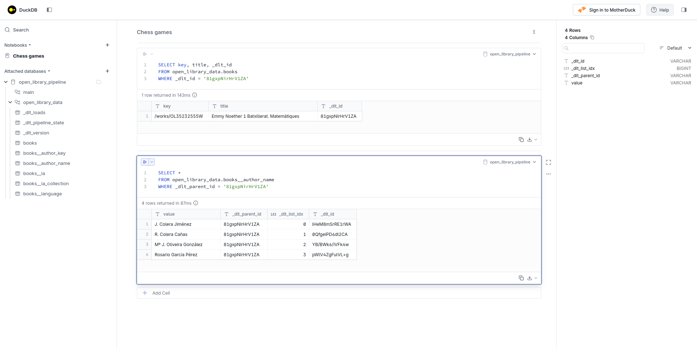
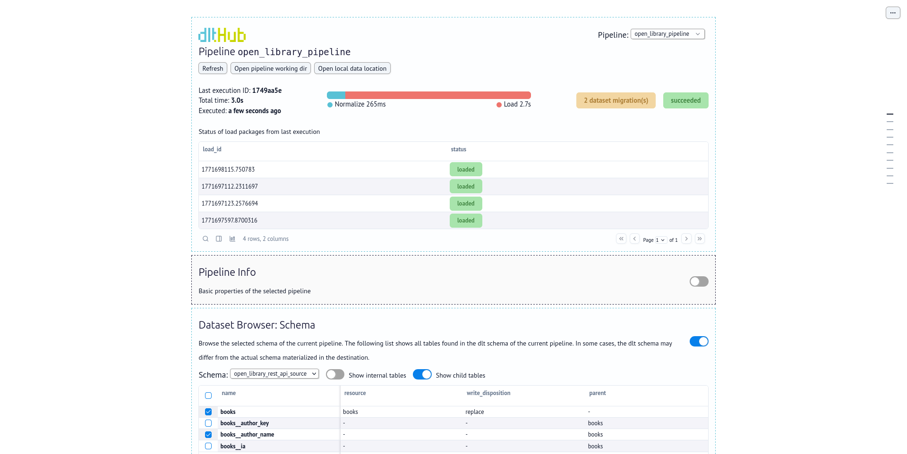
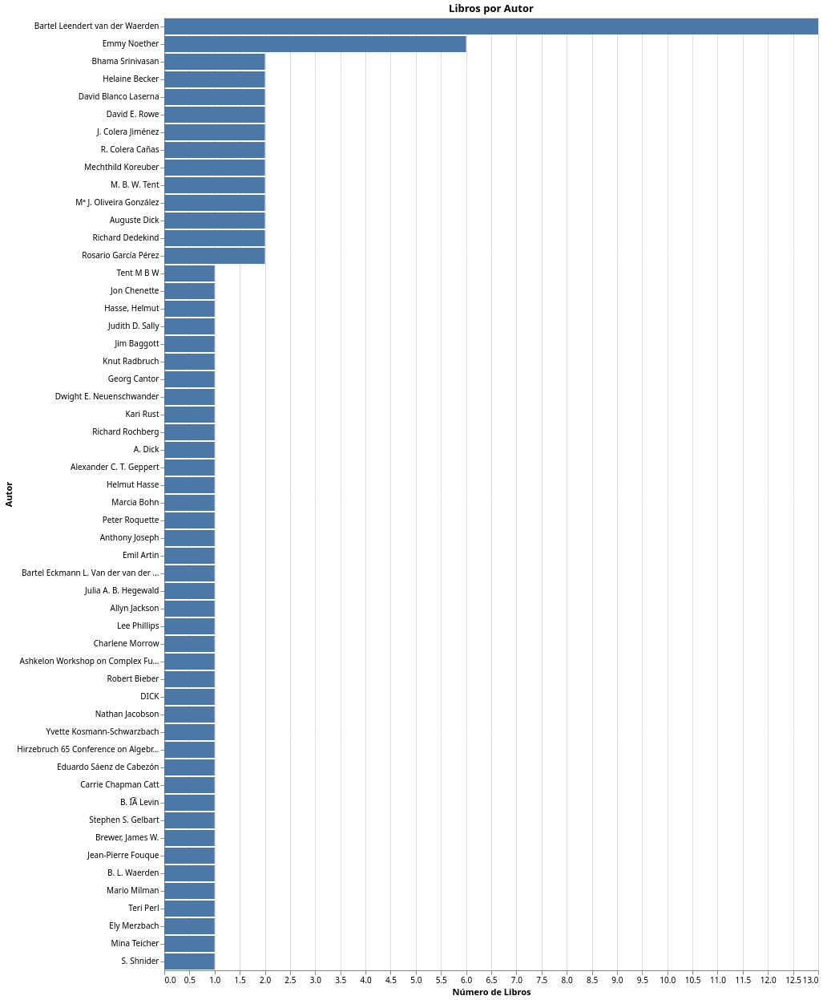
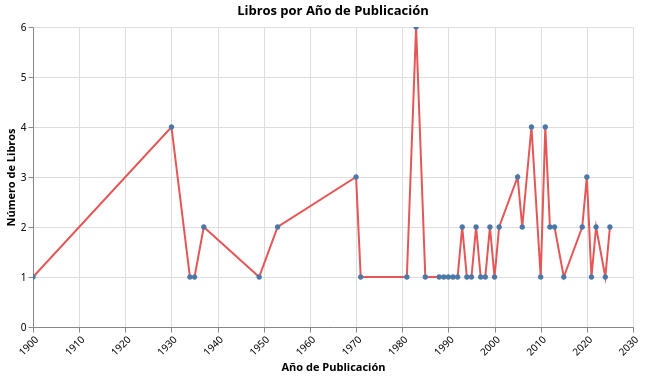

# Taller: **Ingestión de datos de una API con DLT**

* Vídeo original (en inglés): [AI Assisted Data Ingestion with dlt](https://www.youtube.com/watch?v=5eMytPBgmVs)
* Presentación del taller (en inglés): [From APIs to Warehouses](https://github.com/DataTalksClub/data-engineering-zoomcamp/blob/main/cohorts/2026/workshops/dlt.md)

## Objetivos de la sesión

Durante esta sesión veremos cómo importar datos partiendo de una API que sirve datos no estructurados como la de la [OpenLibrary](https://openlibrary.org/developers/api), en un almacén estructurado usando dlt.

## ¿Qué es **dlt**?

> "dlt (data load tool) es una biblioteca de Python de código abierto que carga datos desde fuentes de datos a menudo desordenadas en conjuntos de datos bien estructurados y actualizados en tiempo real. Automatiza todas tus tareas tediosas de ingeniería de datos, con funciones como la inferencia de esquemas, la normalización de datos y la carga incremental."
>
> Fuente: [Página web de dltHub](https://dlthub.com/product/dlt)

### ¿Qué ofrece la API de la **OpenLibrary**?

De la API de la OpenLibrary vamos a usar el [servicio de búsqueda de libros](https://openlibrary.org/dev/docs/api/search). Esta API permite buscar libros, autores y otros recursos dentro del catálogo de Open Library y obtener los resultados en formato JSON.

Es una de las formas más completas y cómodas de recuperar datos bibliográficos, ya que:

* Devuelve múltiples resultados en una sola petición.
* Incluye información sobre:
  * el trabajo: información del autor, fecha de la primera publicación, etc.
  * y la edición: título, identificadores, portadas, etc.
* Proporciona identificadores de autor reutilizables.
* Puede incluir información de disponibilidad de los libros.

### URL's básicas del proyecto

* Base URL: https://openlibrary.org
* Endpoint principal: https://openlibrary.org/search.json

### Formato de las peticiones

Las peticiones se realizan mediante HTTP GET. Basta con añadir `.json` a la URL de búsqueda.

#### Parámetros de consulta

| Parámetro | Descripción |
|-----------|-------------|
| `q` | Búsqueda de texto libre. |
| `title` | Filtrar por título. |
| `author` | Filtrar por autor. |
| `subject` | Filtrar por materia o temática. |
| `isbn` | Filtrar por ISBN. |
| `publisher` | Filtrar por editorial. |
| `language` | Filtrar por idioma. |
| `page` | Número de página de resultados. |
| `limit` | Número de resultados por página. |
| `sort` | Ordenación de resultados. |

Algunos de los valores habituales para el parámetro de ordenación `sort` son:

- `new`
- `old`
- `rating`
- `editions`

La paginación se controla con:

- `page` → número de página
- `limit` → resultados por página

#### Ejemplos

* Buscar por texto libre:
  * https://openlibrary.org/search.json?q=the+lord+of+the+rings
* Buscar por título:
  * https://openlibrary.org/search.json?title=the+lord+of+the+rings
* Buscar por autor:
  * https://openlibrary.org/search.json?author=tolkien
* Buscar con paginación:
  * https://openlibrary.org/search.json?q=the+lord+of+the+rings&page=2

### Formato de las respuestas

La respuesta es un objeto JSON con metadatos de la búsqueda y una lista de documentos.

#### Campos principales

| Campo | Descripción |
|-------|-------------|
| `numFound` | Número total de resultados. |
| `start` | Índice del primer resultado devuelto. |
| `docs` | Lista de resultados. |

##### Campos habituales dentro de `docs`

| Campo | Descripción |
|-------|-------------|
| `key` | Identificador de la obra. |
| `title` | Título. |
| `author_name` | Lista de autores. |
| `author_key` | Identificadores de autor. |
| `first_publish_year` | Año de primera publicación. |
| `edition_count` | Número de ediciones. |
| `isbn` | Lista de ISBN asociados. |
| `cover_i` | Identificador de portada. |
| `subject` | Materias o temas. |
| `language` | Idiomas disponibles. |

Los identificadores de autor `author_key` pueden usarse para recuperar información detallada del autor mediante la API de autores.

## Instalación de **dlt**

Para iniciar nuestro proyecto con **dlt** vamos primero a asegurarnos de que tenemos todo lo que necesitamos.

### Instalación de **uv**

Como con todo proyecto Python, hay varias formas de instalar y gestionar las dependencias. En este artículo, vamos a usar **uv** por lo que es necesario que, si no lo tenemos ya, lo instalemos:

```bash
curl -LsSf https://astral.sh/uv/install.sh | sh
```

### Creación de un entorno con **Python** 3.11

Creamos un directorio [openlibrary-pipeline](pipelines/openlibrary-pipeline/) para nuestro proyecto.

```bash
mkdir -p pipelines/openlibrary-pipeline
cd pipelines/openlibrary-pipeline
```

Y nos aseguramos de configurarlo con Python 3.11.

```bash
uv init --python 3.11 --directory .
```

### Inicialización del proyecto **dlt**

Ahora instalamos **dlt** con el conjunto de dependencias que se recomienda para desarrollo local (que incluye `duckdb`, `marimo`, `pyarrow` y `fastmcp`).

```bash
uv add "dlt[workspace]"
```

E inicializamos nuestro espacio de trabajo especificando nuestro:

* origen de datos: para lo que podemos elegir entre los [más de 10 mil orígenes predefinidos](https://dlthub.com/context),
* destino de datos: para lo que podemos elegir entre los [destinos soportados](https://dlthub.com/docs/dlt-ecosystem/destinations).

En nuestro caso, como origen trabajaremos con [open-library](https://dlthub.com/context/source/open-library) y como destino con [DuckDB](https://dlthub.com/docs/dlt-ecosystem/destinations/duckdb).

```bash
uv run dlt init dlthub:open_library duckdb
```

Durante el proceso, se nos preguntará qué asistente IA usamos con nuestro IDE, siendo la lista de opciones: amp, codex, claude, cody, cline, cursor, continue, windsurf, copilot. En nuestro caso, hemos seleccionado claude.

## Creación de flujo de datos con **Claude**

A estas alturas, además de la inicialización de nuestro proyecto **dlt**, también disponemos de un archivo [CLAUDE.md](pipelines/openlibrary-pipeline/CLAUDE.md) que le dice a Claude cómo trabajar en el proyecto. Así que, para iniciarnos rápido, podemos abrir **claude** (Claude Code) y pasaré el

> Por favor, genera una fuente de API REST para la API de Open Library, tal como se especifica en @open_library-docs.yaml.
> Comienza con el/los endpoint(s) **books** y omite por ahora la carga incremental.
> Coloca el código en **open_library_pipeline.py** y nombra la pipeline **open_library_pipeline**.
> Si el archivo ya existe, úsalo como punto de partida.
> No añadas ni modifiques ningún otro archivo.
> Usa **@dlt rest api** como tutorial.
> Después de añadir los endpoints, permite que el usuario ejecute la pipeline con `uv run python open_library_pipeline.py` y queda a la espera de más instrucciones.

Con esto, Claude generó para nosotros un [open_library_pipeline.py](pipelines/openlibrary-pipeline/open_library_pipeline.py) casi funcional la que solo tendremos que hacer los ajustes mínimos que consideremos convenientes.

> [!NOTE]
> En una primera instancia, siguiendo los pasos descritos hasta aquí, conseguimos que Claude Code generase un flujo de datos funcional.
> Sin embargo, podemos darle una pequeña ayuda adicional instalando el servidor MCP de **dlt**.

```bash
claude mcp add dlt -- uv run --with "dlt[duckdb]" --with "dlt-mcp[search]" python -m dlt_mcp
```

## Ejecución del flujo de datos

Una vez hemos creado nuestro flujo de datos, podemos ejecutarlo como un script Python estándar.

```bash
uv run python open_library_pipeline.py
```


### Normalización

Al ejecutar un flujo de datos, **dlt** crea algunas tablas internas adicionales. Este es uno de los motivos por los que resulta útil para importar datos a partir de estructuras de datos como las respuestas de una API, que pueden contener objetos y arrays anidados. En nuestro caso, este es un ejemplo de elemento devuelto por la API de la OpenLibrary:

```json
{
    "author_key":[
        "OL12755009A",
        "OL12755011A",
        "OL12755010A",
        "OL10652074A"
    ],
    "author_name":[
        "J. Colera Jiménez",
        "R. Colera Cañas",
        "Mª J. Oliveira González",
        "Rosario García Pérez"
    ],
    "cover_edition_key":"OL47633096M",
    "cover_i":14260053,
    "ebook_access":"no_ebook",
    "edition_count":2,
    "first_publish_year":2022,
    "has_fulltext":false,
    "key":"/works/OL35232554W",
    "public_scan_b":false,
    "title":"Emmy Noether 1 Batxillerat. Matemàtiques"
}
```

Estructuras de datos anidadas como esta permiten, por ejemplo, tener cuatro autores para un único libro. Para hacer estas estructuras compatibles con bases de datos relacionales como DuckDB, **dlt** hace por nosotros una normalización que implica la creación de múltiples tablas sin intervención por nuestra parte.

> [!NOTE]
> Para más información, consulta la documentación sobre [tablas destino](https://dlthub.com/docs/general-usage/destination-tables) de **dlt** (en inglés).

### Campos adicionales

Por un lado, en la tabla `books` vemos que hay dos campos que han sido añadidos por **dlt**:

* `_dlt_load_id`: identifica la carga con la que se encontró el registro, relacionándo los registros de `books` con los de `_dlt_loads`,
* `_dlt_id`: identifica de forma única cada registro, para poder relacionarlo con otras tablas.

```sql
SELECT key, title, _dlt_id
FROM open_library_data.books
WHERE _dlt_id = '81gxpNirHrV1ZA'
```

| key |	title |	_dlt_id |
| --- | --- | --- |
| /works/OL35232555W |	Emmy Noether 1 Batxillerat. Matemàtiques |	81gxpNirHrV1ZA |

### Tablas relacionadas

Por otro lado, **dlt** crea tablas relacionadas a partir de los campos categóricos. Por ejemplo, los autores que encuentra en el campo `author_name` los inserta en una tabla específica `books__author_name`, relacionándolos a partir de una columna `_dlt_parent_id` que contiene el `_dlt_id` del libro correspondiente.

```sql
SELECT *
FROM open_library_data.books__author_name
WHERE _dlt_parent_id = '81gxpNirHrV1ZA'
```

| value	| _dlt_parent_id	| _dlt_list_idx	| _dlt_id |
| --- | --- | --- | --- |
| J. Colera Jiménez	| 81gxpNirHrV1ZA	| 0	| lHeM8mSrRE1rWA |
| R. Colera Cañas	| 81gxpNirHrV1ZA	| 1	| 0QfgeiPD6dl2CA |
| Mª J. Oliveira González	| 81gxpNirHrV1ZA	| 2	| YB/BWk6/iVFk4w |
| Rosario García Pérez	| 81gxpNirHrV1ZA	| 3	| pWlV4ZgFulVL+g |



### Resumen del proceso

En resumen, cuando ejecutamos un flujo de datos en **dlt**, lo hacemos ejecutando:

```python
pipeline.run(source)
```

Y, lo que ocurre cuando hacemos esto, es equivalente a:

1. `pipeline.extract(source)`: extracción de datos consultando la API correspondiente,
2. `pipeline.normalize()`: normalización de los datos para adaptarlos a un formato estructurado,
3. `pipeline.load()`: carga de los datos en la base de datos.

## Inspección de un flujo de datos

### Inspección de la **extracción**

Además de ejecutar un flujo de datos, también podemos inspeccionarlo de diferentes maneras. Por ejemplo, podemos obtener métricas sobre los datos extraídos inspeccionando lo que devuelve el método `pipeline.extract`.

Para eso, iniciamos una sesión del intérprete Python:

```bash
cd pipelines/openlibrary-pipeline
uv run python
```

Y lanzamos:

```python
from open_library_pipeline import pipeline, open_library_rest_api_source

extracted = pipeline.extract(open_library_rest_api_source())

# Identificamos el identificador de la carga
load_id = extracted.loads_ids[-1]

# Obtenemos sus métricas
load_metrics = extracted.metrics[load_id][0]

# Obtenemos las métricas para cada recurso
resource_metrics = load_metrics['resource_metrics']

for resource, metrics in resource_metrics.items():
    print(f"Recurso: {resource}\n - Registros: {metrics.items_count}")
```

Con esto, obtendríamos:

```bash
Recurso: books
 - Registros: 73
```

### Inspección de las estructuras de datos

También podemos inspeccionar el modelo de datos de nuestro flujo de datos consultando `pipeline.dataset`.

Para eso, ejecutamos, también desde una sesión de Python interactiva:

```python
from open_library_pipeline import pipeline, open_library_rest_api_source

dataset = pipeline.dataset()
dataset.tables
```

Y obtenemos:

```json
[
  "books",
  "books__author_key",
  "books__author_name",
  "books__ia",
  "books__ia_collection",
  "books__language",
  "_dlt_version",
  "_dlt_loads",
  "_dlt_pipeline_state"
]
```

## Espacio de trabajo de **dltHub**

### Paso 1: Carga de datos con andamios LLM

En el artículo [Guía práctica para la construcción de tuberías de datos nativas de LLM con el Espacio de trabajo de dltHub](https://dlthub.com/blog/practitioners-guide-dlthub-workspace) se presenta una metodología de trabajo en la que se parte de "andamios" prefabricados que facilitan el trabajo de los LLMs al darles cierta parte de los flujos de datos ya construida. A esta estrategia la llaman el "momento IKEA de la ingeniería de datos".

### Paso 2: Asegurar la calidad

El espacio de trabajo de **dltHub** ofrece herramientas de inspección que facilitan la realización de comprobaciones sobre todos los aspectos de nuestros flujos de datos: desde nuestros esquemas, hasta nuestros datos y sus destinos finales. Entre esas herramientas están:

* **dlt Dashboard**
* **dlt MCP Server**
* **dlt CLI**

#### **dlt Dashboard**

El [panel de control](https://dlthub.com/docs/general-usage/dashboard) de **dlt** es la herramienta que nos permite, entre otras cosas, comprobar el estado de nuestro flujo de datos, inspeccionar nuestros esquemas así como los estados de las cargas incrementales, o realizar consulta.

##### Instalación

Antes de instalar el panel de control, tendremos que asegurarnos de que tenemos **marimo** funcionando.

```bash
uv add marimo
```

Luego, podremos abrir el panel de control ejecutando:

```bash
uv run dlt dashboard
```



Al abrirse el panel de control, lo primero que tendremos que hacer es seleccionar el flujo de datos que queremos analizar.

Alternativamente, podemos abrir el panel de control cargando directamente nuestro flujo de datos:

```bash
dlt pipeline open_library_pipeline show
```

### Paso 3: Generar transformaciones e informes

Para la generación de informes, **dlt** propone la combinación entre cuadernos **marimo** y la librería **ibis**.

Un buen resumen de en qué consisten los cuadernos **marimo** lo tenemos en su propia página web:

> "Transforma datos, entrena modelos y ejecuta consultas SQL con marimo: funciona como un notebook reactivo nativo de IA, almacenado como Python reproducible y compatible con Git. Ejecútalo sin problemas como scripts y aplicaciones. Todo de código abierto."
>
> Fuente: [marimo.io](https://marimo.io)

Igualmente, sobre la librería **ibis** no hay mejor introducción que la de sus propios creadores:

> "Una biblioteca de dataframes de código abierto compatible con cualquier sistema de datos.
>
> - Utiliza la misma API para más de 20 backends.
> - Dataframes locales rápidos con DuckDB (predeterminado), Polars o DataFusion integrados.
> - Itera localmente e implementa remotamente modificando una sola línea de código.
> - Compón código de dataframes en SQL y Python, conectando la ingeniería de datos con la ciencia de datos."
>
> Fuente: [ibis-project.org](https://ibis-project.org)

La propuesta sobre cómo combinar estas dos utilidades está explicada en el artículo (en inglés) [explore your data with Marimo](https://dlthub.com/docs/general-usage/dataset-access/marimo) y comienza con la instalación de dependencias:

```bash
uv add marimo "ibis-framework[duckdb]" altair
```

Con esto, pudimos componer una petición para Claude Code:

> Usando la documentación disponible en:
> - https://dlthub.com/docs/general-usage/dataset-access/marimo
> Crea un panel de control con:
> 1. una gráfica de barras que muestre el número de autores por autor
> 2. una gráfica linear mostrando libros por año de publicación

Que respondió creando un panel básico pero funcional.

```
● El archivo dashboard.py fue creado. Para ejecutarlo:

  marimo edit dashboard.py

  O en modo solo lectura (app desplegada):

  marimo run dashboard.py

  ---
  Estructura del dashboard:

  Celda 1 — Imports: marimo, ibis, altair

  Celda 2 — Conexión a DuckDB:
  con = ibis.connect("duckdb://open_library_pipeline.duckdb")

  Celda 3 — Gráfica de barras (libros por autor):
  - SQL que une books con books__author_name via _dlt_parent_id = _dlt_id
  - Cuenta libros únicos (key) por autor
  - Barras horizontales ordenadas de mayor a menor

  Celda 4 — Gráfica lineal (libros por año):
  - SQL sobre books.first_publish_year
  - Cuenta libros por año, filtrando nulos
  - Línea con puntos, eje X formateado como entero (sin decimales)

  Ambas gráficas son interactivas gracias a mo.ui.altair_chart — puedes hacer hover para ver tooltips y seleccionar puntos/barras.

✻ Worked for 3m 52s
```

Únicamente añadiendo el prefijo `uv run` a los comandos que nos sugirió Claude Code, pudimos abrir y consultar el panel.

#### Revisión del código del panel

El cuaderno generado por Claude Code empieza con la importación de dependencias, seguida de la instanciación de la conexión a la base de datos:

```python
import marimo as mo
import ibis
import altair as alt

con = ibis.connect("duckdb://open_library_pipeline.duckdb")
```

Y a continuación dedica dos celdas, una a cada informe.

En primer lugar, para generar la gráfica de "libros por autor" preparó una consulta SQL contra las tablas de libros y autores, y presentó los resultados usando `altair_chart`:

```python
df_authors = con.sql("""
    SELECT
        an.value AS author_name,
        COUNT(DISTINCT b.key) AS book_count
    FROM open_library_data.books b
    JOIN open_library_data.books__author_name an
        ON an._dlt_parent_id = b._dlt_id
    GROUP BY an.value
    ORDER BY book_count DESC
""").to_pandas()

mo.ui.altair_chart(
    alt.Chart(df_authors)
    .mark_bar(color="#4C78A8")
    .encode(
        y=alt.Y("author_name:N", sort="-x", title="Autor"),
        x=alt.X("book_count:Q", title="Número de Libros"),
        tooltip=[
            alt.Tooltip("author_name:N", title="Autor"),
            alt.Tooltip("book_count:Q", title="Libros"),
        ],
    )
    .properties(
        title="Libros por Autor",
        height=alt.Step(22),
    )
)
```



En segundo lugar, para generar la gráfica de "libros por año de publicación" siguió la misma estrategia, esta vez consultando únicamente la tabla de libros:

```python
df_years = con.sql("""
    SELECT
        first_publish_year,
        COUNT(DISTINCT key) AS book_count
    FROM open_library_data.books
    WHERE first_publish_year IS NOT NULL
    GROUP BY first_publish_year
    ORDER BY first_publish_year
""").to_pandas()

mo.ui.altair_chart(
    alt.Chart(df_years)
    .mark_line(point=True, color="#E45756")
    .encode(
        x=alt.X(
            "first_publish_year:Q",
            title="Año de Publicación",
            axis=alt.Axis(format="d", labelAngle=-45),
        ),
        y=alt.Y("book_count:Q", title="Número de Libros"),
        tooltip=[
            alt.Tooltip("first_publish_year:Q", title="Año", format="d"),
            alt.Tooltip("book_count:Q", title="Libros"),
        ],
    )
    .properties(
        title="Libros por Año de Publicación",
        width=600,
        height=300,
    )
)
```


