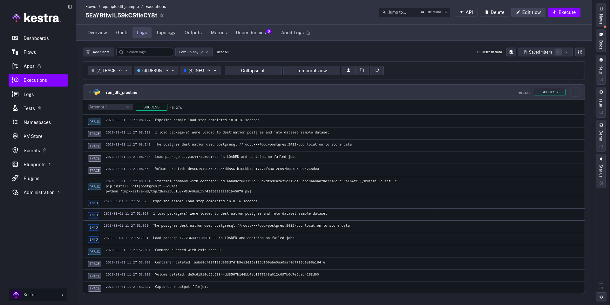
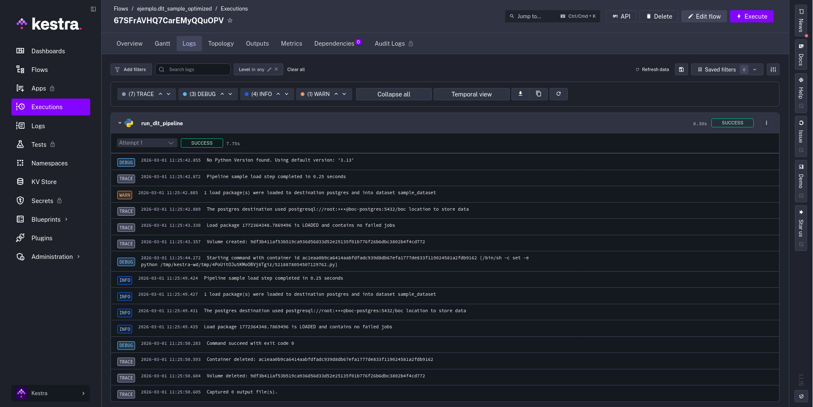

# Taller: **Ingestión de datos de una API con DLT**

## ¿Cómo optimizar flujos con DLT en Kestra?

Cuando se ejecuta un flujo de datos en Kestra usando una imagen estándar de Python (como `python:3.11-slim`), el contenedor parte de un estado limpio en cada ejecución. Esto significa que si nuestro script necesita dependencias externas —como `dlt` o `beautifulsoup4`— tenemos que instalarlas **en cada arranque** mediante el bloque `beforeCommands`.

Por ejemplo, mira este flujo que usa **dlt** para cargar datos en PostgreSQL ([flows/dlt_sample.yaml](flows/dlt_sample.yaml)):

```yaml
id: dlt_sample
namespace: ejemplo

tasks:
  - id: run_dlt_pipeline
    type: io.kestra.plugin.scripts.python.Script
    containerImage: python:3.11-slim
    taskRunner:
      type: io.kestra.plugin.scripts.runner.docker.Docker
      networkMode: boc-postgres-network
    env:
      POSTGRES_HOST: "{{ envs.postgres_data_host }}"
      POSTGRES_DB: "{{ envs.postgres_data_db }}"
      POSTGRES_USER: "{{ envs.postgres_data_user }}"
      POSTGRES_PASSWORD: "{{ envs.postgres_data_password }}"
    beforeCommands:
      - pip install "dlt[postgres]" --quiet
    script: |
      import os
      import dlt

      host = os.environ["POSTGRES_HOST"]
      db   = os.environ["POSTGRES_DB"]
      user = os.environ["POSTGRES_USER"]
      pwd  = os.environ["POSTGRES_PASSWORD"]

      @dlt.resource(name="sample_records")
      def sample_data():
          yield from [
              {"id": 1, "name": "Alice", "city": "Las Palmas"},
              {"id": 2, "name": "Bob",   "city": "Santa Cruz"},
              {"id": 3, "name": "Carlos","city": "Arrecife"},
          ]

      pipeline = dlt.pipeline(
          pipeline_name="sample",
          destination=dlt.destinations.postgres(
              f"postgresql://{user}:{pwd}@{host}:5432/{db}"
          ),
          dataset_name="sample_dataset",
      )

      load_info = pipeline.run(sample_data())
      print(load_info)
```

El bloque `beforeCommands` se ejecuta antes del script principal y contiene la instrucción `pip install "dlt[postgres]"`. Esto funciona, pero tiene un coste: cada vez que se lanza el flujo, Kestra arranca el contenedor, instala las dependencias desde cero y solo entonces ejecuta el script. Dependiendo del número de paquetes y del tamaño de sus dependencias transitivas, esto puede añadir un tiempo de espera notable a cada ejecución.

### Resultado con la imagen estándar

> [!NOTE]
> Captura de la ejecución del flujo `dlt_sample` en Kestra usando `python:3.11-slim`,
> mostrando el log completo con la salida del `pip install` y el tiempo total de ejecución.



## Imagen Docker personalizada

La solución es construir una imagen Docker que ya tenga las dependencias instaladas de
antemano. Así, cuando Kestra arranque el contenedor, las dependencias estarán
disponibles de forma inmediata y el flujo podrá ejecutarse sin ninguna demora adicional.

### El Dockerfile

Para ello, definimos un Dockerfile muy sencillo que parte de la imagen oficial de Python
e instala las dependencias que necesitamos ([docker/python-dlt.Dockerfile](docker/python-dlt.Dockerfile)):

```dockerfile
FROM python:3.11-slim

RUN pip install --no-cache-dir \
    beautifulsoup4 \
    "dlt[postgres]"
```

La clave está en el flag `--no-cache-dir`, que evita que pip guarde ficheros de caché
innecesarios en la imagen, manteniendo su tamaño lo más reducido posible.

### Construcción de la imagen

Una vez definido el Dockerfile, construimos la imagen con el nombre `python-dlt`:

```bash
docker build -t python-dlt:latest -f docker/python-dlt.Dockerfile .
```

> [!TIP]
> Este comando solo hay que ejecutarlo una vez (o cuando se quieran actualizar las
> dependencias). A partir de ahí, la imagen queda disponible localmente para que Kestra
> la use en cualquier ejecución.

### El flujo optimizado

Con la imagen ya disponible, actualizamos el flujo para que use `python-dlt:latest` en
lugar de `python:3.11-slim`, y eliminamos el bloque `beforeCommands` por completo
([flows/dlt_sample_optimized.yaml](flows/dlt_sample_optimized.yaml)):

```yaml
id: dlt_sample_optimized
namespace: ejemplo

tasks:
  - id: run_dlt_pipeline
    type: io.kestra.plugin.scripts.python.Script
    containerImage: python-dlt:latest
    taskRunner:
      type: io.kestra.plugin.scripts.runner.docker.Docker
      networkMode: boc-postgres-network
    env:
      POSTGRES_HOST: "{{ envs.postgres_data_host }}"
      POSTGRES_DB: "{{ envs.postgres_data_db }}"
      POSTGRES_USER: "{{ envs.postgres_data_user }}"
      POSTGRES_PASSWORD: "{{ envs.postgres_data_password }}"
    script: |
      import os
      import dlt

      host = os.environ["POSTGRES_HOST"]
      db   = os.environ["POSTGRES_DB"]
      user = os.environ["POSTGRES_USER"]
      pwd  = os.environ["POSTGRES_PASSWORD"]

      @dlt.resource(name="sample_records")
      def sample_data():
          yield from [
              {"id": 1, "name": "Alice", "city": "Las Palmas"},
              {"id": 2, "name": "Bob",   "city": "Santa Cruz"},
              {"id": 3, "name": "Carlos","city": "Arrecife"},
          ]

      pipeline = dlt.pipeline(
          pipeline_name="sample",
          destination=dlt.destinations.postgres(
              f"postgresql://{user}:{pwd}@{host}:5432/{db}"
          ),
          dataset_name="sample_dataset",
      )

      load_info = pipeline.run(sample_data())
      print(load_info)
```

Los cambios respecto al flujo original son mínimos:

| Campo | Imagen estándar | Imagen personalizada |
|-------|-----------------|----------------------|
| `containerImage` | `python:3.11-slim` | `python-dlt:latest` |
| `beforeCommands` | `pip install "dlt[postgres]"` | *(eliminado)* |

### Resultado con la imagen personalizada

> [!NOTE]
> Captura de la ejecución del flujo `dlt_sample_optimized` en Kestra usando
> `python-dlt:latest`, mostrando el log compacto sin salida de `pip install` y el
> tiempo total de ejecución.



## Conclusión

El uso de una imagen Docker personalizada con las dependencias preinstaladas elimina el tiempo de instalación de paquetes en cada ejecución del flujo. En nuestras pruebas, el flujo de ejemplo pasó de tardar **45.27s** con la imagen estándar a **8.88s** con la imagen personalizada, lo que supone una mejora sustancial, especialmente en escenarios donde el flujo se ejecuta con frecuencia o encadenado con otras tareas.

Definir una imagen base específica para el proyecto con todas sus dependencias es un patrón fácilmente extensible: basta con añadir al Dockerfile cualquier paquete adicional que el proyecto necesite y reconstruir la imagen.
