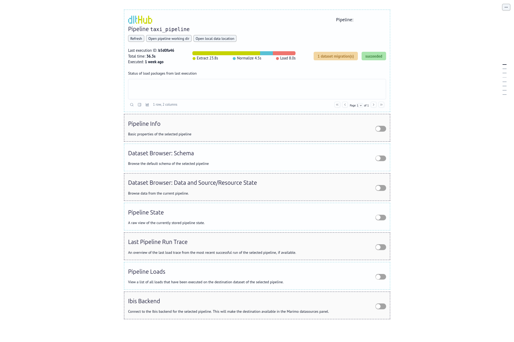

# Taller: **Ingestión de datos de una API con DLT**

## ¿Cómo implementar **pipelines** en DLT?

En los artículos anteriores hemos explorado las fuentes y los recursos de **dlt**, que son los componentes que saben de dónde vienen los datos y cómo producirlos. En este artículo analizamos el componente que lo orquesta todo: el **pipeline**.

## ¿Qué es un **pipeline** en DLT?

Un **pipeline** en **dlt** es el componente que mueve datos desde tu código Python hasta un destino. Acepta fuentes, recursos, generadores y cualquier iterable, y cuando se ejecuta, se encarga de extraer los datos, normalizarlos y cargarlos en el destino.

> [!NOTE]
> En general, cuando hemos hablado de **pipelines** en otros capítulos del módulo, las hemos traducido como "flujos de datos".
> En este capítulo hemos decidido preservar la palabra original porque aparece literalmente en multitud de ocasiones en el código fuente.
> En la práctica, puedes intercambiar ambos conceptos sin problema.

En el [taxi-pipeline](pipelines/taxi-pipeline/taxi_pipeline.py), el pipeline se crea así:

```python
pipeline = dlt.pipeline(
    pipeline_name="taxi_pipeline",
    destination="duckdb",
    dataset_name="taxi_data",
    dev_mode=True,
    progress="log",
)
load_info = pipeline.run(source)
```

Esta única llamada a `pipeline.run()` realiza tres pasos de forma encadenada: **extracción**, **normalización** y **carga**. En las siguientes secciones profundizamos en cada uno de estos pasos y en todos los parámetros que controlan su comportamiento.

## Creación del pipeline: `dlt.pipeline()`

### Parámetros

| Parámetro | Descripción |
|-----------|-------------|
| `pipeline_name` | Nombre único del pipeline. Se usa para identificar el directorio de trabajo y en los registros. Por defecto, se infiere del nombre del módulo Python. |
| `destination` | Destino donde se cargan los datos. Puede ser un string (`"duckdb"`, `"bigquery"`, etc.) o un objeto de destino configurado. |
| `dataset_name` | Nombre del esquema o conjunto de datos en el destino. Por defecto, `{pipeline_name}_dataset`. |
| `dev_mode` | Si es `True`, añade un sufijo de fecha y hora al `dataset_name` en cada ejecución, creando un conjunto de datos nuevo cada vez. Ideal para desarrollo. |
| `progress` | Monitor de progreso: `"log"`, `"tqdm"`, `"enlighten"`, `"alive_progress"`. |
| `pipelines_dir` | Directorio alternativo para almacenar el estado y los artefactos del pipeline. Útil para separar entornos. |
| `import_schema_path` | Ruta a un esquema YAML que se importa y aplica al pipeline. |
| `export_schema_path` | Ruta donde **dlt** exporta el esquema inferido tras cada ejecución. |

### `dev_mode`: la salvaguarda para el desarrollo

El parámetro `dev_mode=True` es especialmente importante durante el desarrollo porque garantiza que cada ejecución escribe en un conjunto de datos completamente nuevo, sin contaminar datos de ejecuciones anteriores. Al activarlo, **dlt** añade automáticamente un sufijo con la fecha y la hora al nombre del conjunto de datos. Por ejemplo:

* En producción (dev_mode=False): taxi_data
* En desarrollo (dev_mode=True): taxi_data_20250301120542

Esto permite iterar libremente con distintas configuraciones sin preocuparse por limpiar manualmente la base de datos entre ejecuciones.

> [!NOTE]
> El taxi-pipeline usa `dev_mode=True` deliberadamente, ya que es el pipeline de referencia para aprender.
> En un pipeline de producción, `dev_mode` debe omitirse o establecerse a `False`.

### `progress`: monitorización del avance

El parámetro `progress` controla cómo **dlt** informa del progreso durante la extracción y la carga. Las opciones disponibles son:

- `"log"`: escribe el progreso en el logger de Python. **Recomendado para producción** y entornos sin terminal interactiva (Kestra, Airflow, etc.).
- `"tqdm"`: barra de progreso en la terminal.
- `"enlighten"`: barra de progreso avanzada (requiere el paquete `enlighten`).
- `"alive_progress"`: barra de progreso animada (requiere el paquete `alive-progress`).

El taxi-pipeline usa `progress="log"` porque es el modo más compatible con cualquier entorno de ejecución:

```python
pipeline = dlt.pipeline(
    pipeline_name="taxi_pipeline",
    destination="duckdb",
    dataset_name="taxi_data",
    progress="log",
)
```

## Los tres pasos del pipeline

Cuando ejecutamos `pipeline.run(source)`, **dlt** realiza tres operaciones encadenadas que también pueden ejecutarse por separado.

### Paso 1: Extracción (`pipeline.extract`)

Durante la extracción, **dlt** consulta las fuentes y los recursos y vuelca los datos al disco en un **paquete de carga** . Cada paquete recibe un identificador único y contiene los datos en bruto tal y como se reciben de la fuente.

En el primer artículo de esta serie vimos cómo ejecutar este paso por separado para obtener métricas:

```python
from taxi_pipeline import pipeline, source

extracted = pipeline.extract(source)

load_id = extracted.loads_ids[-1]
load_metrics = extracted.metrics[load_id][0]

for resource, metrics in load_metrics["resource_metrics"].items():
    print(f"Recurso: {resource}\n - Registros: {metrics.items_count}")
```

Separar la extracción es útil cuando queremos verificar cuántos registros se han descargado antes de continuar con la normalización y la carga.

### Paso 2: Normalización (`pipeline.normalize`)

Durante la normalización, **dlt** inspecciona los datos extraídos, infiere su esquema e **itera en los paquetes de carga** para transformar los datos crudos en un formato compatible con el destino. En este paso es donde ocurre la magia de la normalización automática:

- Las estructuras anidadas se aplanan y generan tablas hijas.
- Las columnas se tipan según los valores observados.
- El esquema se compara con el esquema almacenado de ejecuciones anteriores y se calcula la migración necesaria.

```python
normalize_info = pipeline.normalize()
print(normalize_info)
```

### Paso 3: Carga (`pipeline.load`)

Durante la carga, **dlt** aplica las migraciones de esquema en el destino (añade columnas o tablas nuevas si las hay) y escribe los datos. La carga se realiza en fragmentos más pequeños llamados **load jobs**, lo que permite paralelizar operaciones grandes y reanudar cargas interrumpidas de forma segura.

```python
load_info = pipeline.load()
print(load_info)
```

### Ejecución conjunta con `pipeline.run`

En la práctica, casi siempre ejecutamos los tres pasos de una sola vez con `pipeline.run`:

```python
load_info = pipeline.run(source)
print(load_info)
```

El objeto `load_info` que devuelve contiene un resumen de la ejecución: identificadores de carga, tablas creadas o modificadas, número de filas escritas y errores si los hubo.

```python
# Comprobar si la carga fue exitosa
print(load_info.has_failed_jobs)

# Ver el identificador de la carga
print(load_info.loads_ids)
```

## El directorio de trabajo del pipeline

Cada pipeline almacena sus artefactos en un directorio local bajo `~/.dlt/pipelines/<pipeline_name>`. Ahí encontramos:

- **Estado del pipeline**: qué datos se han cargado ya y cuál es el cursor de las cargas incrementales.
- **Esquemas inferidos**: los esquemas deducidos de los datos en ejecuciones anteriores.
- **Paquetes de carga**: los datos extraídos pendientes de normalización o carga.
- **Trazas de ejecución**: registros de las últimas ejecuciones con sus métricas.

Podemos inspeccionar el directorio de trabajo desde la línea de comandos:

```bash
uv run dlt pipeline taxi_pipeline info
```

O explorar el estado del pipeline directamente desde el terminal de Python:

```bash
uv run dlt pipeline taxi_pipeline show
```



### Separar entornos con `pipelines_dir`

Si necesitamos gestionar varios entornos (desarrollo, staging, producción) desde la misma máquina, podemos indicar un directorio de trabajo alternativo para cada pipeline:

```python
import os
import dlt
from dlt.common.pipeline import get_dlt_pipelines_dir

dev_dir = os.path.join(get_dlt_pipelines_dir(), "dev")

pipeline = dlt.pipeline(
    pipeline_name="taxi_pipeline",
    destination="duckdb",
    dataset_name="taxi_data",
    pipelines_dir=dev_dir,
)
```

## Inspección de los datos cargados: `pipeline.dataset()`

Tras ejecutar el pipeline, podemos consultar los datos directamente desde Python usando `pipeline.dataset()`, que devuelve un objeto `ReadableDataset` conectado al destino:

```python
dataset = pipeline.dataset()

# Ver las tablas disponibles
print(dataset.tables)
# ['rides', '_dlt_loads', '_dlt_version', '_dlt_pipeline_state']
```

El objeto `dataset` permite hacer consultas de distintas formas:

### Consultar una tabla

```python
# Obtener los primeros registros como DataFrame de pandas
df = dataset.rides.df()

# Obtener los primeros 5 registros (head)
df = dataset.rides.head().df()

# Limitar a 100 registros
df = dataset.rides.limit(100).df()
```

### Seleccionar columnas

```python
df = dataset.rides.select("vendor_name", "trip_distance", "total_amount").df()
```

### Filtrar registros

```python
# Viajes largos (más de 10 millas)
df = dataset.rides.where("trip_distance > 10").df()
```

### Ejecutar SQL arbitrario

```python
df = dataset("""
    SELECT
        vendor_name,
        COUNT(*) AS num_rides,
        AVG(total_amount) AS avg_fare
    FROM taxi_data.rides
    GROUP BY vendor_name
    ORDER BY num_rides DESC
""").df()
```

### Formatos alternativos de lectura

Además de Pandas, podemos leer los datos en otros formatos:

```python
# Como tabla de PyArrow (eficiente para grandes volúmenes)
arrow_table = dataset.rides.arrow()

# Como lista de tuplas Python
rows = dataset.rides.fetchall()

# En chunks para datasets grandes
for chunk in dataset.rides.iter_df(chunk_size=1000):
    process(chunk)
```

## Modos de refresco: el parámetro `refresh`

Con el tiempo, puede ser necesario reiniciar parcial o totalmente los datos de un pipeline, por ejemplo, para corregir datos erróneos o para cambiar el esquema de forma incompatible. El parámetro `refresh` de `pipeline.run()` ofrece tres modos:

### `"drop_sources"`: borrado completo

Elimina todas las tablas del dataset y reinicia el estado completo de la fuente, incluyendo el estado de todos sus recursos:

```python
pipeline.run(source, refresh="drop_sources")
```

Equivale a empezar desde cero: los datos en el destino se eliminan y el pipeline se ejecuta como si fuera la primera vez.

### `"drop_resources"`: borrado selectivo de recursos

Elimina únicamente las tablas y el estado de los recursos especificados, sin afectar al resto de la fuente. Es útil cuando solo queremos recargar un subconjunto de datos:

```python
pipeline.run(
    source.with_resources("rides"),
    refresh="drop_resources",
)
```

### `"drop_data"`: truncado con esquema intacto

Trunca los datos de las tablas especificadas pero mantiene el esquema intacto. A diferencia de `"drop_resources"`, las tablas no se eliminan y recrean; solo se vacían:

```python
pipeline.run(
    source.with_resources("rides"),
    refresh="drop_data",
)
```

Es el modo más seguro para recargar datos desde el principio en recursos incrementales, ya que el esquema no cambia y no hay riesgo de incompatibilidades.

> [!NOTE]
> **dlt** solo aplica los cambios al destino (borrar tablas, truncar datos) si los pasos de extracción y normalización del refresco tienen éxito. Si algo falla antes de llegar a la carga, los datos existentes en el destino permanecen intactos.

## El estado del pipeline

El **estado** del pipeline es un diccionario que **dlt** mantiene de forma persistente entre ejecuciones. Es el mecanismo que permite saber desde dónde retomar una carga incremental o qué datos ya se han procesado.

Podemos inspeccionarlo así:

```python
print(pipeline.state)
```

Y obtenemos algo como:

```json
{
  "sources": {
    "taxi_api": {
      "resources": {
        "rides": {
          "incremental": {
            "last_value": "2019-03-31T23:59:59"
          }
        }
      }
    }
  }
}
```

Cuando usamos `refresh="drop_resources"` o `refresh="drop_sources"`, **dlt** resetea este estado para los recursos o fuentes indicados, forzando una recarga completa la próxima vez que se ejecute el pipeline.

## El taxi-pipeline en contexto

Con todo lo anterior, podemos leer el [taxi_pipeline.py](pipelines/taxi-pipeline/taxi_pipeline.py) con una comprensión mucho más precisa de lo que hace cada línea:

```python
import dlt
from dlt.sources.rest_api import rest_api_source

source = rest_api_source({
    "client": {
        "base_url": "https://us-central1-dlthub-analytics.cloudfunctions.net/data_engineering_zoomcamp_api",
    },
    "resources": [
        {
            "name": "rides",                    # tabla "rides" en el destino
            "endpoint": {
                "path": "",
                "paginator": {
                    "type": "page_number",      # paginación por número de página
                    "page_param": "page",
                    "base_page": 1,
                    "total_path": None,
                    "stop_after_empty_page": True,
                },
            },
        }
    ],
})

if __name__ == "__main__":
    pipeline = dlt.pipeline(
        pipeline_name="taxi_pipeline",  # identificador y nombre del directorio de trabajo
        destination="duckdb",           # destino: base de datos DuckDB local
        dataset_name="taxi_data",       # esquema dentro de DuckDB
        dev_mode=True,                  # dataset con sufijo de fecha en cada ejecución
        progress="log",                 # progreso por el logger, compatible con cualquier entorno
    )
    load_info = pipeline.run(source)    # extract, normalize y load
    print(load_info)
```

## El flujo de trabajo habitual

Para finalizar, esta es la secuencia de trabajo típica con un pipeline de **dlt**:

1. **Desarrollo**: `dev_mode=True` para experimentar sin riesgo. `add_limit()` para no esperar a descargar todos los datos.
2. **Verificación**: inspeccionar `pipeline.dataset()` para comprobar el esquema y los datos cargados.
3. **Primera carga en producción**: `dev_mode=False`. La primera ejecución crea las tablas y carga todos los datos históricos.
4. **Cargas incrementales**: las ejecuciones siguientes solo cargan los datos nuevos gracias al estado del pipeline.
5. **Corrección de datos**: usar `refresh="drop_data"` para recargar desde el principio sin alterar el esquema, o `refresh="drop_sources"` para un reinicio completo.

## Resumen

El pipeline es el corazón de **dlt**: el componente que orquesta la extracción, normalización y carga de datos. Sus capacidades más importantes son:

| Capacidad | Mecanismo |
|-----------|-----------|
| Aislar ejecuciones de desarrollo | `dev_mode=True` |
| Monitorizar el progreso | `progress="log"` (producción), `"tqdm"` (local) |
| Ejecutar los tres pasos juntos | `pipeline.run(source)` |
| Ejecutar los pasos por separado | `pipeline.extract()`, `pipeline.normalize()`, `pipeline.load()` |
| Inspeccionar los datos cargados | `pipeline.dataset()` con SQL o API fluida |
| Reiniciar datos sin tocar el esquema | `refresh="drop_data"` |
| Reiniciar recursos específicos | `refresh="drop_resources"` |
| Reiniciar completamente | `refresh="drop_sources"` |
| Consultar el estado incremental | `pipeline.state` |
| Separar entornos | `pipelines_dir` |

Para más información, consulta la documentación oficial de **dlt** sobre [pipelines](https://dlthub.com/docs/general-usage/pipeline) (en inglés).
