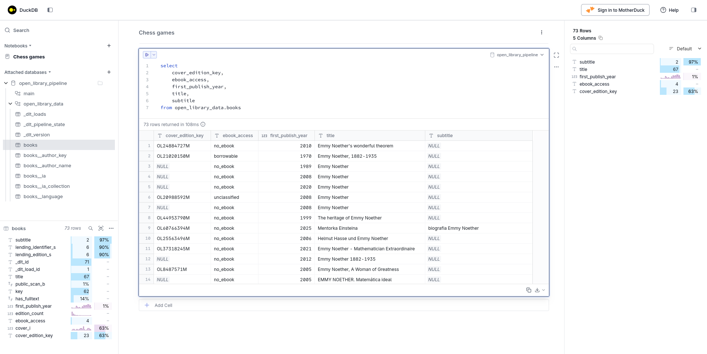

# Taller: **Ingestión de datos de una API con DLT**

* Vídeo original (en inglés): [AI Assisted Data Ingestion with dlt](https://www.youtube.com/watch?v=5eMytPBgmVs)
* Presentación del taller (en inglés): [From APIs to Warehouses](https://github.com/DataTalksClub/data-engineering-zoomcamp/blob/main/cohorts/2026/workshops/dlt.md)

## Objetivos de la sesión

Durante esta sesión veremos cómo importar datos partiendo de una API que sirve datos no estructurados como la de la [OpenLibrary](https://openlibrary.org/developers/api), en un almacén estructurado usando dlt.

### ¿Qué es **dlt**?

> "dlt (data load tool) es una biblioteca de Python de código abierto que carga datos desde fuentes de datos a menudo desordenadas en conjuntos de datos bien estructurados y actualizados en tiempo real. Automatiza todas tus tareas tediosas de ingeniería de datos, con funciones como la inferencia de esquemas, la normalización de datos y la carga incremental."
>
> Fuente: [Página web de dltHub](https://dlthub.com/product/dlt)

### ¿Qué ofrece la API de la **OpenLibrary**?

De la API de la OpenLibrary vamos a usar el [servicio de búsqueda de libros](https://openlibrary.org/dev/docs/api/search). Esta API permite buscar libros, autores y otros recursos dentro del catálogo de Open Library y obtener los resultados en formato JSON.

Es una de las formas más completas y cómodas de recuperar datos bibliográficos, ya que:

* Devuelve múltiples resultados en una sola petición.
* Incluye información sobre:
  * el trabajo: información del autor, fecha de la primera publicación, etc.
  * y la edición: título, identificadores, portadas, etc.
* Proporciona identificadores de autor reutilizables.
* Puede incluir información de disponibilidad de los libros.

#### URL's básicas del proyecto

Base URL: https://openlibrary.org
Endpoint principal: https://openlibrary.org/search.json

#### Formato de las peticiones

Las peticiones se realizan mediante HTTP GET. Basta con añadir `.json` a la URL de búsqueda.

##### Parámetros de consulta

| Parámetro | Descripción |
|-----------|-------------|
| `q` | Búsqueda de texto libre. |
| `title` | Filtrar por título. |
| `author` | Filtrar por autor. |
| `subject` | Filtrar por materia o temática. |
| `isbn` | Filtrar por ISBN. |
| `publisher` | Filtrar por editorial. |
| `language` | Filtrar por idioma. |
| `page` | Número de página de resultados. |
| `limit` | Número de resultados por página. |
| `sort` | Ordenación de resultados. |

Algunos de los valores habituales para el parámetro de ordenación `sort` son:

- `new`
- `old`
- `rating`
- `editions`

La paginación se controla con:

- `page` → número de página
- `limit` → resultados por página

##### Ejemplos

* Buscar por texto libre:
  * https://openlibrary.org/search.json?q=the+lord+of+the+rings
* Buscar por título:
  * https://openlibrary.org/search.json?title=the+lord+of+the+rings
* Buscar por autor:
  * https://openlibrary.org/search.json?author=tolkien
* Buscar con paginación:
  * https://openlibrary.org/search.json?q=the+lord+of+the+rings&page=2

#### Formato de las respuestas

La respuesta es un objeto JSON con metadatos de la búsqueda y una lista de documentos.

#### Campos principales

| Campo | Descripción |
|-------|-------------|
| `numFound` | Número total de resultados. |
| `start` | Índice del primer resultado devuelto. |
| `docs` | Lista de resultados. |

##### Campos habituales dentro de `docs`

| Campo | Descripción |
|-------|-------------|
| `key` | Identificador de la obra. |
| `title` | Título. |
| `author_name` | Lista de autores. |
| `author_key` | Identificadores de autor. |
| `first_publish_year` | Año de primera publicación. |
| `edition_count` | Número de ediciones. |
| `isbn` | Lista de ISBN asociados. |
| `cover_i` | Identificador de portada. |
| `subject` | Materias o temas. |
| `language` | Idiomas disponibles. |

Los identificadores de autor `author_key` pueden usarse para recuperar información detallada del autor mediante la API de autores.

### Instalación de **dlt**

Para iniciar nuestro proyecto con **dlt** vamos primero a asegurarnos de que tenemos todo lo que necesitamos.

#### Instalación de **uv**

Como con todo proyecto Python, hay varias formas de instalar y gestionar las dependencias. En este artículo, vamos a usar **uv** por lo que es necesario que, si no lo tenemos ya, lo instalemos:

```bash
curl -LsSf https://astral.sh/uv/install.sh | sh
```

#### Creación de un entorno con **Python** 3.11

Creamos un directorio [openlibrary-pipeline](pipelines/openlibrary-pipeline/) para nuestro proyecto.

```bash
mkdir -p pipelines/openlibrary-pipeline
cd pipelines/openlibrary-pipeline
```

Y nos aseguramos de configurarlo con Python 3.11.

```bash
uv init --python 3.11 --directory .
```

#### Inicialización del proyecto **dlt**

Ahora instalamos **dlt** con el conjunto de dependencias que se recomienda para desarrollo local (que incluye `duckdb`, `marimo`, `pyarrow` y `fastmcp`).

```bash
uv pip install "dlt[workspace]"
```

E inicializamos nuestro espacio de trabajo especificando nuestro:

* origen de datos: para lo que podemos elegir entre los [más de 10 mil orígenes predefinidos](https://dlthub.com/context),
* destino de datos: para lo que podemos elegir entre los [destinos soportados](https://dlthub.com/docs/dlt-ecosystem/destinations).

En nuestro caso, como origen trabajaremos con [open-library](https://dlthub.com/context/source/open-library) y como destino con [DuckDB](https://dlthub.com/docs/dlt-ecosystem/destinations/duckdb).

```bash
uv run dlt init dlthub:open_library duckdb
```

Durante el proceso, se nos preguntará qué asistente IA usamos con nuestro IDE, siendo la lista de opciones: amp, codex, claude, cody, cline, cursor, continue, windsurf, copilot. En nuestro caso, hemos seleccionado claude.

### Creación de flujo de datos con **Claude**

A estas alturas, además de la inicialización de nuestro proyecto **dlt**, también disponemos de un archivo [CLAUDE.md](pipelines/openlibrary-pipeline/CLAUDE.md) que le dice a Claude cómo trabajar en el proyecto. Así que, para iniciarnos rápido, podemos abrir **claude** (Claude Code) y pasaré el

> Por favor, genera una fuente de API REST para la API de Open Library, tal como se especifica en @open_library-docs.yaml.
> Comienza con el/los endpoint(s) **books** y omite por ahora la carga incremental.
> Coloca el código en **open_library_pipeline.py** y nombra la pipeline **open_library_pipeline**.
> Si el archivo ya existe, úsalo como punto de partida.
> No añadas ni modifiques ningún otro archivo.
> Usa **@dlt rest api** como tutorial.
> Después de añadir los endpoints, permite que el usuario ejecute la pipeline con `uv run python open_library_pipeline.py` y queda a la espera de más instrucciones.

Con esto, Claude generó para nosotros un [open_library_pipeline.py](pipelines/openlibrary-pipeline/open_library_pipeline.py) casi funcional la que solo tendremos que hacer los ajustes mínimos que consideremos convenientes.

### Ejecución del flujo de datos

```bash
uv run python open_library_pipeline.py
```



## Continúa...

> [!WARNING]
>
> No completado aún. Continúa aquí: https://www.youtube.com/live/5eMytPBgmVs?si=_L1CN9HeN6N7Bas4&t=850
